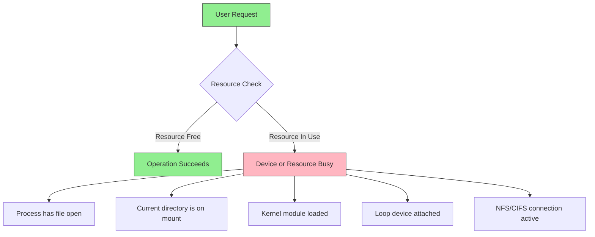
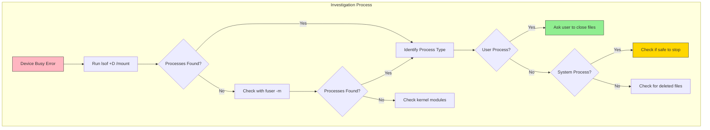

# How to Fix 'Device or Resource Busy' Errors

Author: [nawazdhandala](https://www.github.com/nawazdhandala)

Tags: Linux, System Administration, Troubleshooting, File Systems, Process Management, Error Handling

Description: Learn how to diagnose and fix 'Device or Resource Busy' errors in Linux, including identifying blocking processes, safely unmounting filesystems, and handling locked files.

---

The "Device or Resource Busy" error is one of the most common frustrations for Linux users and administrators. This error occurs when you try to unmount a filesystem, delete a file, or perform an operation on a resource that is currently in use. This guide will help you understand why this error occurs and provide practical solutions to resolve it safely.

## Understanding the Error

When you see "Device or Resource Busy," it means the kernel cannot complete your requested operation because something is actively using the resource:



## Common Causes

1. **Open files** - A process has files open on the filesystem
2. **Working directory** - A user or process has their current directory on the mount point
3. **Running executables** - Programs are running from the filesystem
4. **Kernel modules** - Loaded modules prevent unmounting
5. **Loop devices** - ISO or disk images mounted via loop
6. **Network mounts** - Active NFS or CIFS connections

## Diagnostic Tools

### Using lsof to Find Open Files

The `lsof` (list open files) command is your primary tool for finding what is using a resource:

```bash
# Find all processes using a specific mount point
lsof +D /mnt/usb

# Example output:
# COMMAND   PID   USER   FD   TYPE DEVICE SIZE/OFF NODE NAME
# bash     1234   john  cwd    DIR   8,17     4096    2 /mnt/usb
# vim      1235   john    4r   REG   8,17    28672  125 /mnt/usb/document.txt

# Find processes using a specific file
lsof /mnt/usb/document.txt

# Find processes using a device
lsof /dev/sdb1
```

### Understanding lsof Output

```bash
# Key columns in lsof output:
# COMMAND - Name of the process
# PID     - Process ID
# USER    - User running the process
# FD      - File descriptor type:
#           cwd = current working directory
#           rtd = root directory
#           txt = program text (executable)
#           mem = memory-mapped file
#           DEL = deleted file still held open
#           0r, 1w, 2u = stdin, stdout, stderr
#           3r, 4w, etc = other file descriptors

# List deleted but still open files (common cause of disk space issues)
lsof +L1
```

### Using fuser to Identify Processes

The `fuser` command provides a quick way to find processes using files:

```bash
# Show PIDs using a mount point
fuser -m /mnt/usb

# Output: /mnt/usb: 1234c 1235

# Show verbose output with process names
fuser -mv /mnt/usb

# Output:
#                      USER        PID ACCESS COMMAND
# /mnt/usb:            john       1234 ..c.. bash
#                      john       1235 F.... vim

# Understanding ACCESS codes:
# c - current directory
# e - executable being run
# f - open file (omitted in default output)
# F - open file for writing (omitted in default output)
# r - root directory
# m - mmap'ed file or shared library
```

### Process Tree Analysis



## Solutions by Scenario

### Scenario 1: Unmounting a USB Drive

```bash
# Attempt to unmount
sudo umount /mnt/usb
# Output: umount: /mnt/usb: target is busy

# Find what is using it
lsof +D /mnt/usb 2>/dev/null

# If a user has their shell in that directory
# Ask them to change directory or close the terminal
cd ~

# Try unmounting again
sudo umount /mnt/usb
```

### Scenario 2: Lazy Unmount (Use with Caution)

When you cannot immediately stop processes, a lazy unmount can help:

```bash
# Lazy unmount - detaches filesystem immediately
# but cleanup happens when no longer busy
sudo umount -l /mnt/usb

# Warning: This can cause data loss if writes are pending
# Only use when you are certain no important writes are occurring
```

### Scenario 3: Force Kill Processes

When you need to immediately free a resource:

```bash
# Kill all processes using the mount point
# WARNING: This terminates processes without graceful shutdown
sudo fuser -km /mnt/usb

# Options explained:
# -k = kill processes
# -m = specify mount point

# More controlled approach - send SIGTERM first, then SIGKILL
sudo fuser -k -TERM -m /mnt/usb
sleep 5
sudo fuser -k -KILL -m /mnt/usb

# Verify mount point is free
fuser -m /mnt/usb
```

### Scenario 4: Unmounting NFS/Network Shares

Network filesystems can be particularly stubborn:

```bash
# Check for stuck NFS processes
lsof -N

# Force unmount NFS (use with caution)
sudo umount -f /mnt/nfs_share

# If still stuck, try lazy unmount
sudo umount -l /mnt/nfs_share

# For completely stuck NFS mounts
# You may need to restart related services
sudo systemctl restart nfs-common
sudo systemctl restart rpc-statd
```

### Scenario 5: Loop Device Busy

When dealing with mounted ISO or disk images:

```bash
# List loop devices
losetup -a

# Output: /dev/loop0: [64769]:1234567 (/path/to/image.iso)

# Check what is using the loop device
lsof /dev/loop0

# Detach the loop device
sudo losetup -d /dev/loop0

# If busy, unmount first
sudo umount /mnt/iso
sudo losetup -d /dev/loop0
```

### Scenario 6: Deleted Files Holding Disk Space

```bash
# Find deleted files that are still open
lsof +L1

# Example output shows deleted file still held by process:
# COMMAND  PID USER  FD   TYPE DEVICE    SIZE/OFF NLINK  NODE NAME
# nginx   1234 www   12u   REG  253,1 50000000000     0 12345 /var/log/nginx/access.log (deleted)

# Solution 1: Restart the process
sudo systemctl restart nginx

# Solution 2: Truncate the file descriptor (keeps process running)
# This empties the file without closing it
echo "" | sudo tee /proc/1234/fd/12
```

## Advanced Troubleshooting

### Checking Kernel Module Dependencies

```bash
# If you cannot unload a kernel module
sudo rmmod some_module
# Output: rmmod: ERROR: Module some_module is in use

# Find what is using the module
lsmod | grep some_module

# Check module dependencies
modinfo some_module | grep depends

# List all modules using a specific module
lsmod | awk '{print $4}' | grep -v "^$" | tr ',' '\n' | sort | uniq
```

### Block Device Investigation

```bash
# Check if device is mounted
mount | grep /dev/sdb

# Check for open file handles on block device
lsof /dev/sdb

# Check for device mapper usage
dmsetup ls
dmsetup info

# Check LVM usage
pvdisplay /dev/sdb
lvdisplay
```

### Debugging Mount Points

```mermaid
flowchart TD
    A[Cannot Unmount] --> B[Run: mount | grep mountpoint]
    B --> C{Listed as mounted?}

    C -->|Yes| D[Run: lsof +D mountpoint]
    C -->|No| E[Already unmounted or stale entry]

    D --> F{Processes found?}
    F -->|Yes| G[Terminate processes]
    F -->|No| H[Run: fuser -m mountpoint]

    H --> I{Processes found?}
    I -->|Yes| G
    I -->|No| J[Check /proc/mounts]

    J --> K{Entry exists?}
    K -->|Yes| L[Try: umount -l]
    K -->|No| M[Mount already cleaned up]

    G --> N[Run: umount mountpoint]
    L --> N

    style A fill:#FFB6C1,stroke:#333
    style N fill:#90EE90,stroke:#333
```

### Checking /proc for Mount Information

```bash
# View current mounts from kernel perspective
cat /proc/mounts | grep /mnt/usb

# View mount namespace information
cat /proc/self/mountinfo | grep /mnt/usb

# Check for bind mounts
findmnt --list | grep /mnt/usb

# List all mount points in tree format
findmnt
```

## Safe Unmounting Script

Here is a comprehensive script for safely unmounting filesystems:

```bash
#!/bin/bash
# Safe unmount script with process handling

MOUNT_POINT="$1"
FORCE="${2:-no}"

if [ -z "$MOUNT_POINT" ]; then
    echo "Usage: $0 <mount_point> [force]"
    exit 1
fi

# Check if mounted
if ! mountpoint -q "$MOUNT_POINT" 2>/dev/null; then
    echo "$MOUNT_POINT is not a mount point"
    exit 1
fi

echo "Attempting to unmount: $MOUNT_POINT"

# First attempt - normal unmount
if sudo umount "$MOUNT_POINT" 2>/dev/null; then
    echo "Successfully unmounted"
    exit 0
fi

echo "Mount point is busy. Finding processes..."

# Find and display processes
PROCS=$(lsof +D "$MOUNT_POINT" 2>/dev/null)
if [ -n "$PROCS" ]; then
    echo "Processes using mount point:"
    echo "$PROCS"
    echo ""
fi

FUSER_OUT=$(fuser -m "$MOUNT_POINT" 2>/dev/null)
if [ -n "$FUSER_OUT" ]; then
    echo "PIDs using mount point: $FUSER_OUT"
fi

if [ "$FORCE" = "force" ]; then
    echo ""
    echo "Force flag set. Terminating processes..."

    # Send SIGTERM first
    sudo fuser -k -TERM -m "$MOUNT_POINT" 2>/dev/null
    sleep 3

    # Try unmount
    if sudo umount "$MOUNT_POINT" 2>/dev/null; then
        echo "Successfully unmounted after SIGTERM"
        exit 0
    fi

    # Send SIGKILL
    sudo fuser -k -KILL -m "$MOUNT_POINT" 2>/dev/null
    sleep 2

    # Final attempt
    if sudo umount "$MOUNT_POINT" 2>/dev/null; then
        echo "Successfully unmounted after SIGKILL"
        exit 0
    fi

    # Lazy unmount as last resort
    echo "Using lazy unmount..."
    sudo umount -l "$MOUNT_POINT"
    echo "Lazy unmount complete - filesystem will be fully released when all handles close"
else
    echo ""
    echo "To force unmount, run: $0 $MOUNT_POINT force"
    echo "Or manually terminate the processes shown above"
    exit 1
fi
```

## Prevention Strategies

### 1. Use Proper Mount Options

```bash
# Mount with sync option for removable media
sudo mount -o sync /dev/sdb1 /mnt/usb

# Use noexec to prevent running executables
sudo mount -o noexec /dev/sdb1 /mnt/usb
```

### 2. Create Safe Ejection Scripts

```bash
#!/bin/bash
# Safe USB ejection script

DEVICE="$1"
MOUNT_POINT=$(findmnt -n -o TARGET "$DEVICE")

if [ -z "$MOUNT_POINT" ]; then
    echo "Device not mounted"
    exit 1
fi

# Sync filesystems
sync

# Try to unmount
if sudo umount "$MOUNT_POINT"; then
    # Spin down and eject
    sudo hdparm -Y "$DEVICE" 2>/dev/null
    sudo eject "$DEVICE" 2>/dev/null
    echo "Safe to remove device"
else
    echo "Cannot unmount - device busy"
    lsof +D "$MOUNT_POINT" 2>/dev/null
fi
```

### 3. Monitor for Open Files

```bash
# Create a monitoring alias
alias whatuses='lsof +D'

# Or a function for detailed output
whatuses() {
    echo "=== lsof output ==="
    lsof +D "$1" 2>/dev/null
    echo ""
    echo "=== fuser output ==="
    fuser -mv "$1" 2>&1
}
```

## Quick Reference

| Command | Description |
|---------|-------------|
| `lsof +D /path` | List open files in directory |
| `lsof +L1` | Find deleted files still open |
| `fuser -m /path` | Show PIDs using mount point |
| `fuser -km /path` | Kill processes using mount |
| `umount -l /path` | Lazy unmount |
| `umount -f /path` | Force unmount (NFS) |
| `losetup -a` | List loop devices |
| `findmnt` | Show mount tree |

## Conclusion

The "Device or Resource Busy" error is a protective mechanism that prevents data corruption by ensuring resources are not released while in use. Understanding how to properly diagnose and resolve these errors is essential for safe system administration.

Key takeaways:
- Always use `lsof` and `fuser` to identify blocking processes before forcing unmounts
- Try graceful solutions (asking users to close files, using SIGTERM) before force killing
- Use lazy unmount (`umount -l`) as a last resort, understanding its implications
- Sync filesystems before unmounting to prevent data loss
- Create scripts and procedures for safe device ejection in your environment
