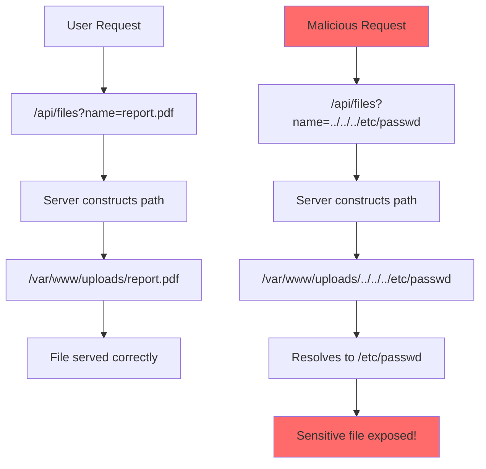
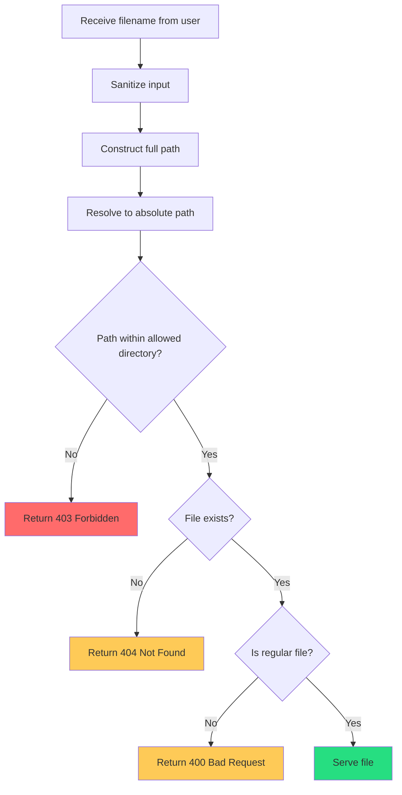

# How to Fix "Directory Traversal" Vulnerabilities

Author: [nawazdhandala](https://www.github.com/nawazdhandala)

Tags: Security, Vulnerability, Path Traversal, Web Security, OWASP, File Access

Description: Learn how to identify and fix directory traversal vulnerabilities that allow attackers to access files outside intended directories.

---

Directory traversal (also known as path traversal) is a web security vulnerability that allows attackers to read arbitrary files on your server. By manipulating file paths with sequences like `../`, attackers can escape the intended directory and access sensitive files like configuration files, source code, or system files.

---

## How Directory Traversal Works



---

## Vulnerable Code Examples

### Python Flask - Vulnerable

```python
from flask import Flask, request, send_file
import os

app = Flask(__name__)
UPLOAD_DIR = "/var/www/uploads"

# VULNERABLE: Direct path concatenation
@app.route('/download')
def download_file():
    filename = request.args.get('filename')
    # Attacker can use: ?filename=../../../etc/passwd
    filepath = os.path.join(UPLOAD_DIR, filename)
    return send_file(filepath)
```

### Node.js Express - Vulnerable

```javascript
const express = require('express');
const path = require('path');
const fs = require('fs');

const app = express();
const UPLOAD_DIR = '/var/www/uploads';

// VULNERABLE: No path validation
app.get('/download', (req, res) => {
    const filename = req.query.filename;
    // Attacker can use: ?filename=../../../etc/passwd
    const filepath = path.join(UPLOAD_DIR, filename);
    res.sendFile(filepath);
});
```

### PHP - Vulnerable

```php
<?php
// VULNERABLE: Direct inclusion of user input
$file = $_GET['file'];
$base_dir = '/var/www/uploads/';

// Attacker can use: ?file=../../../etc/passwd
$filepath = $base_dir . $file;
readfile($filepath);
?>
```

---

## Attack Patterns to Understand

Attackers use various techniques to bypass simple filters:

```
Basic traversal:
../../../etc/passwd

URL encoded:
..%2F..%2F..%2Fetc%2Fpasswd

Double URL encoded:
..%252F..%252F..%252Fetc%252Fpasswd

Using backslashes (Windows):
..\..\..\windows\system32\config\sam

Null byte injection (older systems):
../../../etc/passwd%00.jpg

Mixed encoding:
..%c0%af..%c0%af..%c0%afetc/passwd
```

---

## Secure Implementation Patterns

### Python - Secure Version

```python
from flask import Flask, request, send_file, abort
import os
from pathlib import Path

app = Flask(__name__)
UPLOAD_DIR = Path("/var/www/uploads").resolve()

@app.route('/download')
def download_file():
    filename = request.args.get('filename')

    if not filename:
        abort(400, "Filename is required")

    # Method 1: Use pathlib to resolve the real path
    try:
        # Construct the full path
        requested_path = (UPLOAD_DIR / filename).resolve()

        # Verify the resolved path is within the allowed directory
        if not str(requested_path).startswith(str(UPLOAD_DIR)):
            abort(403, "Access denied")

        # Verify file exists
        if not requested_path.is_file():
            abort(404, "File not found")

        return send_file(requested_path)

    except (ValueError, OSError):
        abort(400, "Invalid filename")


# Method 2: Whitelist approach for known files
ALLOWED_FILES = {
    'report': '/var/www/uploads/report.pdf',
    'manual': '/var/www/uploads/user-manual.pdf',
    'terms': '/var/www/uploads/terms-of-service.pdf'
}

@app.route('/download/v2')
def download_file_whitelist():
    file_key = request.args.get('file')

    if file_key not in ALLOWED_FILES:
        abort(404, "File not found")

    return send_file(ALLOWED_FILES[file_key])
```

### Node.js - Secure Version

```javascript
const express = require('express');
const path = require('path');
const fs = require('fs').promises;

const app = express();
const UPLOAD_DIR = path.resolve('/var/www/uploads');

app.get('/download', async (req, res) => {
    const filename = req.query.filename;

    if (!filename) {
        return res.status(400).json({ error: 'Filename is required' });
    }

    try {
        // Resolve the absolute path
        const requestedPath = path.resolve(UPLOAD_DIR, filename);

        // Verify path is within allowed directory
        if (!requestedPath.startsWith(UPLOAD_DIR + path.sep)) {
            return res.status(403).json({ error: 'Access denied' });
        }

        // Check if file exists and is a file (not directory)
        const stats = await fs.stat(requestedPath);
        if (!stats.isFile()) {
            return res.status(404).json({ error: 'File not found' });
        }

        res.sendFile(requestedPath);

    } catch (error) {
        if (error.code === 'ENOENT') {
            return res.status(404).json({ error: 'File not found' });
        }
        console.error('Download error:', error);
        return res.status(500).json({ error: 'Internal server error' });
    }
});

// Using express-validator for input validation
const { query, validationResult } = require('express-validator');

app.get('/download/v2',
    // Validate filename contains only safe characters
    query('filename')
        .trim()
        .notEmpty()
        .matches(/^[a-zA-Z0-9_\-]+\.[a-zA-Z0-9]+$/)
        .withMessage('Invalid filename format'),

    async (req, res) => {
        const errors = validationResult(req);
        if (!errors.isEmpty()) {
            return res.status(400).json({ errors: errors.array() });
        }

        const requestedPath = path.join(UPLOAD_DIR, req.query.filename);
        res.sendFile(requestedPath);
    }
);
```

---

## Validation Flow



---

## Go - Secure Implementation

```go
package main

import (
    "net/http"
    "os"
    "path/filepath"
    "strings"
)

const uploadDir = "/var/www/uploads"

func downloadHandler(w http.ResponseWriter, r *http.Request) {
    filename := r.URL.Query().Get("filename")

    if filename == "" {
        http.Error(w, "Filename is required", http.StatusBadRequest)
        return
    }

    // Clean the path and resolve any .. components
    cleanPath := filepath.Clean(filename)

    // Construct the full path
    fullPath := filepath.Join(uploadDir, cleanPath)

    // Resolve to absolute path
    absPath, err := filepath.Abs(fullPath)
    if err != nil {
        http.Error(w, "Invalid path", http.StatusBadRequest)
        return
    }

    // Ensure the resolved path is within the upload directory
    absUploadDir, _ := filepath.Abs(uploadDir)
    if !strings.HasPrefix(absPath, absUploadDir+string(os.PathSeparator)) {
        http.Error(w, "Access denied", http.StatusForbidden)
        return
    }

    // Check if file exists and is not a directory
    info, err := os.Stat(absPath)
    if os.IsNotExist(err) {
        http.Error(w, "File not found", http.StatusNotFound)
        return
    }
    if info.IsDir() {
        http.Error(w, "Cannot download directories", http.StatusBadRequest)
        return
    }

    http.ServeFile(w, r, absPath)
}

func main() {
    http.HandleFunc("/download", downloadHandler)
    http.ListenAndServe(":8080", nil)
}
```

---

## Defense in Depth Strategies

### 1. Input Validation

```python
import re

def validate_filename(filename):
    """Validate filename contains only safe characters"""
    # Allow only alphanumeric, underscore, hyphen, and single dot for extension
    pattern = r'^[a-zA-Z0-9_\-]+\.[a-zA-Z0-9]+$'
    return bool(re.match(pattern, filename))

# Usage
filename = request.args.get('filename')
if not validate_filename(filename):
    abort(400, "Invalid filename")
```

### 2. Chroot or Container Isolation

```dockerfile
# Dockerfile - Run file server in isolated container
FROM python:3.11-slim

# Create non-root user
RUN useradd -r -s /bin/false appuser

# Create upload directory
RUN mkdir -p /app/uploads && chown appuser:appuser /app/uploads

WORKDIR /app
COPY --chown=appuser:appuser . .

USER appuser

# Even if traversal occurs, container limits access
CMD ["python", "server.py"]
```

### 3. File Access via Database IDs

```python
from flask import Flask, request, send_file, abort
from models import FileRecord

@app.route('/download/<file_id>')
def download_by_id(file_id):
    # Look up file by ID in database
    file_record = FileRecord.query.get(file_id)

    if not file_record:
        abort(404)

    # Check user has permission
    if not current_user.can_access(file_record):
        abort(403)

    # Path is stored in database, not provided by user
    return send_file(file_record.storage_path)
```

---

## Testing for Directory Traversal

```python
# test_path_traversal.py
import pytest
from app import app

@pytest.fixture
def client():
    app.config['TESTING'] = True
    with app.test_client() as client:
        yield client

class TestPathTraversal:

    def test_basic_traversal_blocked(self, client):
        response = client.get('/download?filename=../../../etc/passwd')
        assert response.status_code in [400, 403]

    def test_encoded_traversal_blocked(self, client):
        response = client.get('/download?filename=..%2F..%2F..%2Fetc%2Fpasswd')
        assert response.status_code in [400, 403]

    def test_null_byte_blocked(self, client):
        response = client.get('/download?filename=../etc/passwd%00.jpg')
        assert response.status_code in [400, 403]

    def test_valid_file_allowed(self, client):
        response = client.get('/download?filename=report.pdf')
        assert response.status_code == 200

    def test_nested_traversal_blocked(self, client):
        response = client.get('/download?filename=....//....//etc/passwd')
        assert response.status_code in [400, 403]
```

---

## Common Mistakes to Avoid

```python
# MISTAKE 1: Blacklist approach (easily bypassed)
def bad_validation(filename):
    if '../' in filename:
        return False
    return True
# Can be bypassed with: ....// or ..%2F or ..\

# MISTAKE 2: Only checking for leading ../
def bad_validation_2(filename):
    if filename.startswith('../'):
        return False
    return True
# Can be bypassed with: foo/../../../etc/passwd

# MISTAKE 3: Using realpath before validation
def bad_validation_3(filename, base_dir):
    # This resolves the path but attacker controls result
    full_path = os.path.realpath(os.path.join(base_dir, filename))
    return full_path  # Still vulnerable!
```

---

## Summary

To protect against directory traversal attacks:

1. **Always validate** that resolved paths stay within allowed directories
2. **Use allowlists** when possible instead of blocklists
3. **Resolve paths to absolute** before comparing with base directory
4. **Validate input format** with strict patterns
5. **Use database IDs** instead of filenames when possible
6. **Apply defense in depth** with containers and file permissions
7. **Test thoroughly** with encoded and edge case inputs

Never trust user input for file paths. Always assume attackers will try every possible encoding and bypass technique.

---

*Need to monitor your application for security vulnerabilities? [OneUptime](https://oneuptime.com) provides security monitoring, alerting, and incident management to help you detect and respond to attacks in real-time.*
