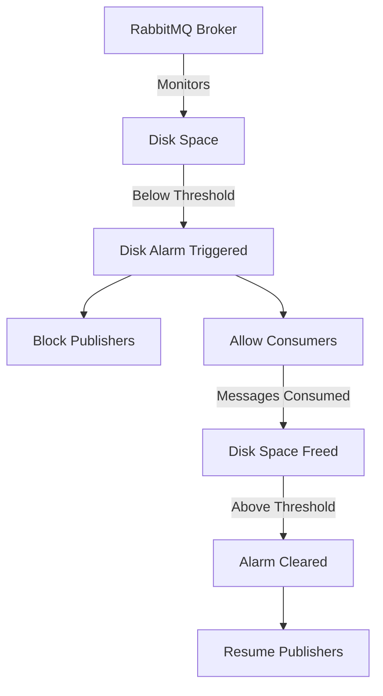
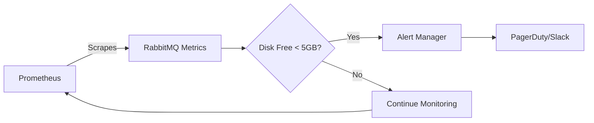

# How to Fix 'Disk Alarm' Errors in RabbitMQ

Author: [nawazdhandala](https://www.github.com/nawazdhandala)

Tags: RabbitMQ, Message Queue, DevOps, Troubleshooting, Disk Management, Infrastructure

Description: Learn how to diagnose, resolve, and prevent RabbitMQ disk alarm errors that block publishers and cause message delivery failures.

---

RabbitMQ monitors available disk space and triggers a disk alarm when free space falls below a configurable threshold. When this alarm activates, RabbitMQ blocks all publishers to prevent the broker from running out of disk space and potentially losing messages. This guide walks you through understanding, diagnosing, and fixing disk alarm errors.

## Understanding the Disk Alarm Mechanism

RabbitMQ uses disk alarms as a protective mechanism. When free disk space drops below the threshold, publishers are blocked, but consumers continue working. This allows the system to drain existing messages and recover disk space.



The default threshold is 50MB, which may be too low for production systems with high message throughput.

## Diagnosing Disk Alarm Issues

First, check the current status of your RabbitMQ node to see if a disk alarm is active.

```bash
# Check the status of alarms on your RabbitMQ node
# The rabbitmqctl command provides administrative access to the broker
# Look for "disk" in the alarms section of the output
rabbitmqctl status | grep -A 5 "Alarms"
```

You can also check the management UI or use the API to get detailed alarm information.

```bash
# Query the health check endpoint to see alarm details
# This API endpoint returns alarm status in JSON format
# Replace localhost with your RabbitMQ host if needed
curl -u guest:guest http://localhost:15672/api/health/checks/alarms
```

To see the current disk space threshold and usage, run the following command.

```bash
# Display detailed node information including disk limits
# This shows the configured threshold and current free disk space
# The disk_free_limit field shows your configured threshold
rabbitmqctl status | grep -E "(disk_free|disk_free_limit)"
```

## Immediate Solutions

### Solution 1: Free Up Disk Space

The quickest fix is to free up disk space on the node. Common space consumers in RabbitMQ deployments include log files, old backups, and accumulated data.

```bash
# Check current disk usage to identify large directories
# The -h flag shows human-readable sizes
# Sort by size to find the biggest space consumers
du -h /var/lib/rabbitmq --max-depth=2 | sort -hr | head -20

# Clean up old RabbitMQ log files if they are consuming space
# Logs can grow large in high-throughput environments
# The find command removes log files older than 7 days
find /var/log/rabbitmq -name "*.log.*" -mtime +7 -delete

# Rotate current logs to compress and archive them
# This triggers logrotate for the RabbitMQ log configuration
logrotate -f /etc/logrotate.d/rabbitmq-server
```

### Solution 2: Purge Unnecessary Queues

If queues have accumulated messages that are no longer needed, purging them can free significant disk space.

```bash
# List queues with their message counts to identify candidates for purging
# This shows queue names and the number of messages in each
# Focus on queues with high message counts that may not be needed
rabbitmqctl list_queues name messages

# Purge a specific queue that contains stale messages
# Warning: This permanently deletes all messages in the queue
# Only use this if you are certain the messages are not needed
rabbitmqctl purge_queue <queue_name>
```

### Solution 3: Adjust the Disk Free Limit

If your current threshold is too conservative, you can lower it temporarily while you address the underlying issue.

```bash
# Set a new disk free limit at runtime
# This takes effect immediately without restarting the broker
# Use absolute values like "1GB" or relative values like "mem_relative,1.0"
rabbitmqctl set_disk_free_limit "1GB"

# Alternatively, set it relative to available memory
# This sets the limit to 1.0 times the available RAM
# Useful for systems where memory and disk should scale together
rabbitmqctl set_disk_free_limit mem_relative 1.0
```

## Permanent Configuration Changes

For a lasting solution, update your RabbitMQ configuration file to set appropriate disk limits.

```erlang
%% rabbitmq.conf - Modern format configuration
%% Set disk free limit to 2GB (absolute value)
%% This ensures publishers are blocked before disk space becomes critical
%% Adjust this value based on your message throughput and disk capacity
disk_free_limit.absolute = 2GB

%% Alternative: Set limit relative to total memory
%% This example sets the limit to 1.5 times the total system memory
%% Useful when running on systems with varying memory configurations
%% disk_free_limit.relative = 1.5
```

Or using the advanced config format for more complex scenarios.

```erlang
%% advanced.config - For complex configurations
%% This format is useful when you need to set multiple related options
%% The disk_free_limit is specified in bytes (5GB = 5368709120)
[
  {rabbit, [
    {disk_free_limit, {mem_relative, 1.5}},
    {log, [{file, [{level, warning}]}]}
  ]}
].
```

## Monitoring and Alerting Strategy

Implement proactive monitoring to catch disk space issues before they trigger alarms.



### Prometheus Alerting Rules

Create alerting rules that fire before RabbitMQ's disk alarm triggers.

```yaml
# prometheus-alerts.yml
# These rules should fire before RabbitMQ's internal disk alarm
# This gives your team time to respond proactively
groups:
  - name: rabbitmq-disk-alerts
    rules:
      # Warning alert at 10GB free - early warning
      # This provides time to investigate and plan remediation
      - alert: RabbitMQDiskSpaceLow
        expr: rabbitmq_disk_space_available_bytes < 10737418240
        for: 5m
        labels:
          severity: warning
        annotations:
          summary: "RabbitMQ disk space low on {{ $labels.instance }}"
          description: "Less than 10GB disk space available"

      # Critical alert at 3GB free - immediate action needed
      # This fires before the default RabbitMQ alarm threshold
      - alert: RabbitMQDiskSpaceCritical
        expr: rabbitmq_disk_space_available_bytes < 3221225472
        for: 1m
        labels:
          severity: critical
        annotations:
          summary: "RabbitMQ disk space critical on {{ $labels.instance }}"
          description: "Less than 3GB disk space available, alarm imminent"
```

## Architectural Considerations

For production systems, consider these design patterns to prevent disk alarm issues.


### Best Practices for Disk Management

Configure message TTL to prevent unbounded queue growth.

```bash
# Create a queue with a message TTL of 1 hour (3600000 milliseconds)
# Messages older than this are automatically removed
# This prevents queues from growing indefinitely if consumers fall behind
rabbitmqctl set_policy TTL ".*" '{"message-ttl":3600000}' --apply-to queues
```

Set queue length limits to cap the number of messages stored.

```bash
# Apply a maximum queue length policy
# Queues matching the pattern will drop or reject messages beyond this limit
# The overflow behavior can be "drop-head" or "reject-publish"
rabbitmqctl set_policy MaxLength ".*" \
  '{"max-length":1000000,"overflow":"drop-head"}' \
  --apply-to queues
```

## Recovery Verification

After implementing fixes, verify that the alarm has cleared and the system is healthy.

```bash
# Verify no alarms are active
# The output should show an empty alarms list
rabbitmqctl status | grep -A 3 "Alarms"

# Check that publishers are no longer blocked
# The blocking status should be empty for healthy nodes
rabbitmqctl list_connections name state | grep blocking

# Monitor disk space to ensure the fix is stable
# Run this periodically to track disk usage trends
watch -n 30 "df -h /var/lib/rabbitmq && rabbitmqctl status | grep disk_free"
```

## Summary

Disk alarm errors in RabbitMQ are a protective mechanism that prevents data loss when disk space runs low. To handle them effectively, free up immediate disk space by cleaning logs and purging stale queues, adjust the disk free limit to match your environment, implement monitoring to catch issues before they become alarms, and design your message architecture with TTL and length limits. By combining reactive fixes with proactive monitoring and thoughtful architecture, you can prevent disk alarms from impacting your message delivery.
