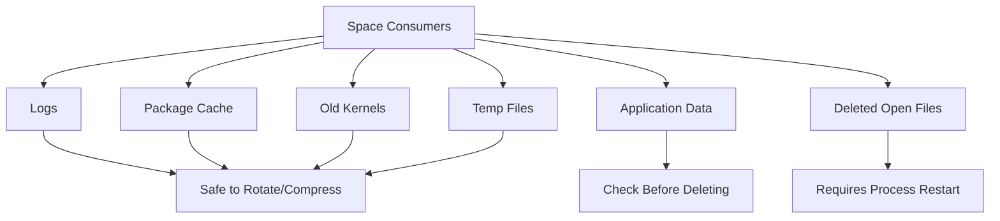
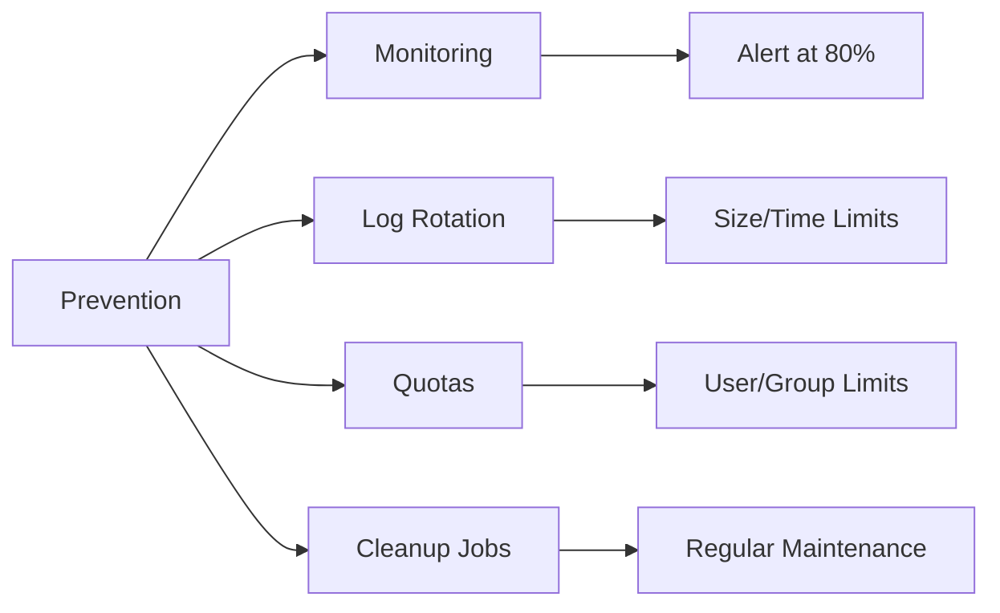

# How to Fix "Disk Full" Errors in Linux

Author: [nawazdhandala](https://www.github.com/nawazdhandala)

Tags: Linux, System Administration, Disk Management, Troubleshooting, Storage, df, du, Monitoring

Description: A practical guide to diagnosing and resolving disk full errors in Linux, including finding large files, cleaning up safely, and preventing future issues.

---

A full disk can cause application crashes, failed writes, and system instability. This guide shows you how to quickly identify what is consuming space and safely reclaim it.

## Understanding Disk Usage

```mermaid
flowchart TD
    A[Disk Full Error] --> B{Check Disk Usage}
    B --> C[df -h]
    C --> D{Which Filesystem?}
    D --> E[/ Root]
    D --> F[/var]
    D --> G[/home]
    D --> H[/tmp]
    E --> I[Find Large Files/Dirs]
    F --> I
    G --> I
    H --> I
    I --> J[du -sh /*]
    J --> K[Clean Up Safely]
```

### Disk vs Inode Usage

Linux tracks two types of storage resources:

| Resource | Description | Symptom When Full |
|----------|-------------|-------------------|
| Blocks | Actual data storage | "No space left on device" |
| Inodes | File metadata entries | "No space left on device" (even with free blocks) |

## Quick Diagnosis Commands

```bash
# Check disk space usage
df -h

# Check inode usage
df -i

# Find filesystem for a specific path
df -h /path/to/check

# Show disk usage including file system type
df -hT
```

**Sample output**:

```
Filesystem      Size  Used Avail Use% Mounted on
/dev/sda1        50G   48G  2.0G  96% /
/dev/sda2       200G  180G   20G  90% /home
/dev/sdb1       500G  400G  100G  80% /data
```

## Step-by-Step Resolution

### Step 1: Identify the Full Filesystem

```bash
# Find filesystems over 80% full
df -h | awk '$5 ~ /[0-9]/ && int($5) > 80 {print $0}'
```

### Step 2: Find What is Using Space

```bash
# Check top-level directories
sudo du -sh /* 2>/dev/null | sort -hr | head -20

# Drill down into the largest directory
sudo du -sh /var/* 2>/dev/null | sort -hr | head -20

# Find the largest files system-wide
sudo find / -type f -size +100M -exec ls -lh {} \; 2>/dev/null | sort -k5 -hr | head -20

# Interactive disk usage analyzer (if available)
ncdu /
```

### Step 3: Identify Safe Cleanup Targets



## Common Cleanup Operations

### Clean Log Files

```bash
# Check log directory size
sudo du -sh /var/log

# Find large log files
sudo find /var/log -type f -size +100M -exec ls -lh {} \;

# Truncate a large log file (keeps file open for writing)
sudo truncate -s 0 /var/log/large_log_file.log

# Or safely rotate logs
sudo logrotate -f /etc/logrotate.conf

# Remove old rotated logs
sudo find /var/log -name "*.gz" -mtime +30 -delete
sudo find /var/log -name "*.log.[0-9]*" -mtime +30 -delete
```

### Clean Package Manager Cache

**Debian/Ubuntu (apt)**:

```bash
# Show cache size
du -sh /var/cache/apt/archives

# Clean downloaded packages
sudo apt clean

# Remove packages no longer needed
sudo apt autoremove

# Remove old package lists
sudo rm -rf /var/lib/apt/lists/*
sudo apt update
```

**RHEL/CentOS/Fedora (dnf/yum)**:

```bash
# Show cache size
du -sh /var/cache/dnf

# Clean all cache
sudo dnf clean all

# Remove orphaned packages
sudo dnf autoremove
```

### Remove Old Kernels

**Ubuntu/Debian**:

```bash
# List installed kernels
dpkg --list | grep linux-image

# Check current kernel (DO NOT DELETE)
uname -r

# Remove old kernels automatically
sudo apt autoremove --purge

# Or manually remove specific old kernel
sudo apt remove linux-image-5.4.0-old-version
```

**RHEL/CentOS**:

```bash
# List installed kernels
rpm -q kernel

# Keep only 2 most recent kernels
sudo dnf install yum-utils
sudo package-cleanup --oldkernels --count=2
```

### Clean Temporary Files

```bash
# Check tmp directories
du -sh /tmp /var/tmp

# Clean files older than 7 days
sudo find /tmp -type f -atime +7 -delete
sudo find /var/tmp -type f -atime +7 -delete

# Clean systemd journal
sudo journalctl --disk-usage
sudo journalctl --vacuum-time=7d     # Keep only 7 days
sudo journalctl --vacuum-size=500M   # Keep only 500MB
```

### Find and Handle Deleted but Open Files

Files that are deleted but still held open by a process continue to consume disk space until the process releases them.

```bash
# Find deleted files still consuming space
sudo lsof +L1

# Sample output:
# COMMAND   PID   USER   FD   TYPE DEVICE    SIZE/OFF NLINK  NODE NAME
# nginx   12345   root   5w   REG  253,1  5000000000     0 12345 /var/log/nginx/access.log (deleted)

# Solution 1: Restart the process
sudo systemctl restart nginx

# Solution 2: Truncate the file descriptor (keeps process running)
# Find the fd number from lsof output (e.g., 5w means fd 5)
sudo truncate -s 0 /proc/12345/fd/5
```

### Docker Cleanup

```bash
# Check Docker disk usage
docker system df

# Remove unused data
docker system prune

# Remove all unused images, containers, networks, and volumes
docker system prune -a --volumes

# Remove old images
docker image prune -a --filter "until=168h"   # Remove images older than 7 days
```

### Container/Pod Log Cleanup (Kubernetes)

```bash
# Check container log sizes
sudo find /var/log/containers -type f -exec ls -lh {} \;

# Check kubelet garbage collection settings
cat /var/lib/kubelet/config.yaml | grep -A5 containerLogMaxSize
```

## Handling Inode Exhaustion

When you see "No space left on device" but `df -h` shows available space:

```bash
# Check inode usage
df -i

# Find directories with many small files
sudo find / -xdev -type d -exec sh -c 'echo "$(find "$1" -maxdepth 1 | wc -l) $1"' _ {} \; 2>/dev/null | sort -rn | head -20

# Common culprits: mail queues, session files, cache directories
ls -la /var/spool/mail
ls -la /var/lib/php/sessions
```

**Solutions**:

```bash
# Clean old session files
sudo find /var/lib/php/sessions -type f -mtime +1 -delete

# Clean mail queue
sudo find /var/spool/mail -type f -empty -delete

# Clean small cache files
sudo find /var/cache -type f -size -1k -mtime +7 -delete
```

## Expanding Disk Space

### Extending LVM Volumes

```bash
# Check current LVM setup
sudo lvs
sudo vgs
sudo pvs

# If there's free space in the volume group:
# 1. Extend the logical volume
sudo lvextend -l +100%FREE /dev/mapper/vg-lv_root

# 2. Resize the filesystem
# For ext4:
sudo resize2fs /dev/mapper/vg-lv_root

# For XFS:
sudo xfs_growfs /dev/mapper/vg-lv_root
```

### Adding a New Disk

```bash
# List available disks
lsblk

# Create partition (new disk /dev/sdc)
sudo fdisk /dev/sdc
# n (new), p (primary), 1, Enter, Enter, w (write)

# Create filesystem
sudo mkfs.ext4 /dev/sdc1

# Mount temporarily
sudo mount /dev/sdc1 /mnt/newdisk

# Add to fstab for persistent mount
# First get UUID
sudo blkid /dev/sdc1

# Add to /etc/fstab
# UUID=xxxx-xxxx-xxxx /mnt/newdisk ext4 defaults 0 2
```

## Setting Up Monitoring and Alerts

### Disk Usage Alert Script

```bash
#!/bin/bash
# disk_alert.sh - Alert when disk usage exceeds threshold

THRESHOLD=85
EMAIL="admin@example.com"

# Check each mounted filesystem
df -h | grep '^/dev' | while read line; do
    USAGE=$(echo "$line" | awk '{print $5}' | tr -d '%')
    MOUNT=$(echo "$line" | awk '{print $6}')

    if [ "$USAGE" -gt "$THRESHOLD" ]; then
        # Get top space consumers
        TOP_DIRS=$(du -sh "$MOUNT"/* 2>/dev/null | sort -hr | head -10)

        echo -e "Disk usage on ${MOUNT}: ${USAGE}%\n\nTop directories:\n${TOP_DIRS}" | \
            mail -s "Disk Alert: ${HOSTNAME} - ${MOUNT} at ${USAGE}%" "$EMAIL"
    fi
done
```

Add to cron:

```bash
# Run hourly
0 * * * * /usr/local/bin/disk_alert.sh
```

### Setting Up Log Rotation

Create `/etc/logrotate.d/custom-logs`:

```bash
/var/log/myapp/*.log {
    daily                 # Rotate daily
    rotate 7              # Keep 7 rotated files
    compress              # Compress rotated files
    delaycompress         # Delay compression by one rotation
    missingok             # Don't error if log is missing
    notifempty            # Don't rotate empty files
    create 0644 root root # Permissions for new log file
    postrotate
        # Reload app to use new log file
        systemctl reload myapp > /dev/null 2>&1 || true
    endscript
}
```

Test the configuration:

```bash
sudo logrotate -d /etc/logrotate.d/custom-logs
```

## Automated Cleanup with systemd

Create a timer for automatic cleanup:

**`/etc/systemd/system/cleanup.service`**:

```ini
[Unit]
Description=System cleanup service

[Service]
Type=oneshot
ExecStart=/usr/local/bin/system_cleanup.sh
```

**`/etc/systemd/system/cleanup.timer`**:

```ini
[Unit]
Description=Run system cleanup weekly

[Timer]
OnCalendar=weekly
Persistent=true

[Install]
WantedBy=timers.target
```

**`/usr/local/bin/system_cleanup.sh`**:

```bash
#!/bin/bash
# Automated system cleanup script

# Clean package cache
apt clean 2>/dev/null || dnf clean all 2>/dev/null

# Remove old temp files
find /tmp -type f -atime +7 -delete 2>/dev/null
find /var/tmp -type f -atime +7 -delete 2>/dev/null

# Vacuum journal logs
journalctl --vacuum-time=14d

# Remove old rotated logs
find /var/log -name "*.gz" -mtime +30 -delete

# Log the cleanup
echo "$(date): Cleanup completed" >> /var/log/cleanup.log
```

Enable the timer:

```bash
sudo chmod +x /usr/local/bin/system_cleanup.sh
sudo systemctl daemon-reload
sudo systemctl enable cleanup.timer
sudo systemctl start cleanup.timer
```

## Prevention Best Practices



### Disk Quotas

```bash
# Enable quotas in /etc/fstab
# /dev/sda1 /home ext4 defaults,usrquota,grpquota 0 2

# Remount and initialize
sudo mount -o remount /home
sudo quotacheck -cum /home
sudo quotaon /home

# Set quota for user (soft: 4GB, hard: 5GB)
sudo setquota -u username 4000000 5000000 0 0 /home

# Check user quota
quota -u username

# Generate quota report
sudo repquota /home
```

## Quick Reference: Cleanup Commands

```bash
# Package cache (Debian/Ubuntu)
sudo apt clean && sudo apt autoremove

# Package cache (RHEL/CentOS)
sudo dnf clean all && sudo dnf autoremove

# Journal logs
sudo journalctl --vacuum-time=7d

# Old kernels (Ubuntu)
sudo apt autoremove --purge

# Temp files
sudo find /tmp /var/tmp -type f -atime +7 -delete

# Docker cleanup
docker system prune -a

# Find large files
sudo find / -type f -size +500M -exec ls -lh {} \;

# Deleted open files
sudo lsof +L1
```

---

Disk full issues are usually caused by logs, package caches, old kernels, or application data. Start with `df -h` to identify the full filesystem, use `du -sh` to drill down to the largest directories, and clean up safely using the appropriate method. Set up monitoring alerts and automated cleanup to prevent future issues.
