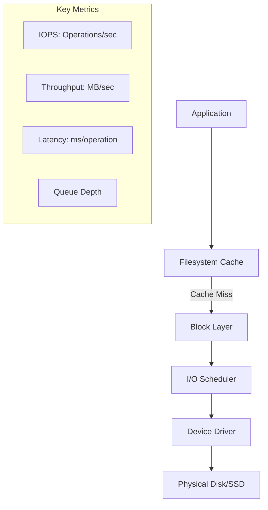
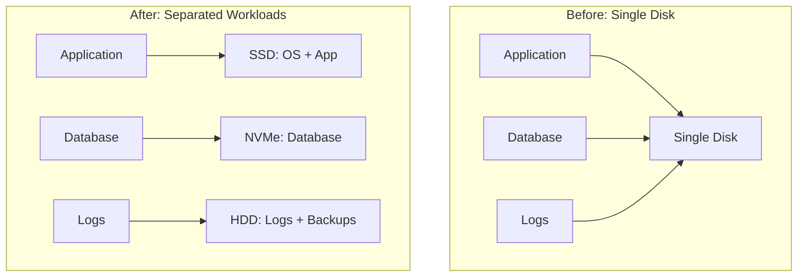

# How to Fix 'Disk I/O Bottleneck' Issues

Author: [nawazdhandala](https://www.github.com/nawazdhandala)

Tags: Performance, Storage, I/O, Linux, Database, Optimization, DevOps, Troubleshooting

Description: A practical guide to diagnosing and fixing disk I/O bottlenecks in production systems, covering analysis tools, filesystem tuning, caching strategies, and storage architecture improvements.

---

When disk I/O becomes the bottleneck, everything slows down. Database queries take forever, file uploads time out, and your application crawls. Let's walk through how to identify and fix these issues systematically.

## Understanding Disk I/O Metrics

Before fixing anything, you need to understand what you're measuring.



Key metrics to monitor:
- **IOPS**: Input/output operations per second
- **Throughput**: MB/s of data transferred
- **Latency**: Time per operation (target: < 10ms for SSD, < 20ms for HDD)
- **Queue Depth**: Pending I/O requests (high values indicate saturation)
- **Utilization**: Percentage of time disk is busy

## Diagnosing the Bottleneck

### Using iostat

```bash
# Basic I/O statistics (run every 2 seconds, 5 times)
iostat -xz 2 5

# Example output interpretation
# Device   r/s     w/s   rkB/s   wkB/s  rrqm/s  wrqm/s  %util  await
# sda      150.0   500.0 2400.0  16000.0  0.0    45.0   95.0   15.2

# Key indicators of bottleneck:
# - %util > 80% = disk is saturated
# - await > 20ms = high latency
# - avgqu-sz > 1 = requests queuing up
```

### Using iotop for Process-Level Analysis

```bash
# See which processes are using disk I/O
sudo iotop -o -P

# Example output
# Total DISK READ: 45.00 M/s | Total DISK WRITE: 120.00 M/s
#   PID  PRIO  USER     DISK READ  DISK WRITE  COMMAND
# 15234  be/4  postgres   40.00 M/s  100.00 M/s  postgres: writer
# 15240  be/4  postgres    5.00 M/s   15.00 M/s  postgres: wal writer
```

### Using blktrace for Deep Analysis

```bash
# Capture block-level I/O trace
sudo blktrace -d /dev/sda -o trace &
sleep 30
kill %1

# Analyze the trace
blkparse trace.blktrace.* | head -100

# Visualize I/O patterns
btt -i trace.blktrace.* -o analysis
```

### Comprehensive Diagnostic Script

```bash
#!/bin/bash
# disk-diagnostics.sh

echo "=== Disk I/O Diagnostics ==="
echo ""

echo "1. Disk Utilization (iostat)"
iostat -xz 1 3

echo ""
echo "2. Top I/O Processes"
sudo iotop -b -o -n 3

echo ""
echo "3. Filesystem Usage"
df -h

echo ""
echo "4. Inode Usage (can cause issues even with free space)"
df -i

echo ""
echo "5. Mount Options"
mount | grep -E '^/dev'

echo ""
echo "6. Pending I/O (should be low)"
cat /proc/diskstats

echo ""
echo "7. Read-ahead Settings"
for disk in /sys/block/sd*/queue/read_ahead_kb; do
    echo "$disk: $(cat $disk)"
done

echo ""
echo "8. I/O Scheduler"
for disk in /sys/block/sd*/queue/scheduler; do
    echo "$disk: $(cat $disk)"
done
```

## Fixing Application-Level Issues

### Optimize Database I/O

```sql
-- PostgreSQL: Find queries causing most I/O
SELECT
    query,
    calls,
    total_time,
    rows,
    shared_blks_read,  -- Blocks read from disk
    shared_blks_hit,   -- Blocks read from cache
    round(100.0 * shared_blks_hit /
        nullif(shared_blks_hit + shared_blks_read, 0), 2) as cache_hit_ratio
FROM pg_stat_statements
ORDER BY shared_blks_read DESC
LIMIT 20;

-- Add indexes to reduce disk reads
CREATE INDEX CONCURRENTLY idx_orders_user_date
ON orders(user_id, created_at DESC);

-- Check if index is being used
EXPLAIN (ANALYZE, BUFFERS)
SELECT * FROM orders WHERE user_id = 123 ORDER BY created_at DESC LIMIT 10;
```

```python
# Python: Batch database writes to reduce I/O
from sqlalchemy import create_engine
from sqlalchemy.orm import sessionmaker

engine = create_engine('postgresql://localhost/mydb')
Session = sessionmaker(bind=engine)

# Bad: Individual inserts (one I/O per row)
def insert_items_slow(items):
    session = Session()
    for item in items:
        session.add(Item(**item))
        session.commit()  # Commits after every item!

# Good: Batch inserts (one I/O for all rows)
def insert_items_fast(items):
    session = Session()
    session.bulk_insert_mappings(Item, items)
    session.commit()  # Single commit for all

# Even better: Use COPY for bulk loads
def bulk_load_from_csv(filepath):
    with engine.raw_connection() as conn:
        with conn.cursor() as cur:
            with open(filepath, 'r') as f:
                cur.copy_expert(
                    "COPY items FROM STDIN WITH CSV HEADER",
                    f
                )
        conn.commit()
```

### Implement Caching to Reduce Disk Reads

```python
# Python: Multi-level caching strategy
import redis
from functools import lru_cache
import pickle

redis_client = redis.Redis(host='localhost', port=6379)

class CacheManager:
    def __init__(self):
        self.local_cache = {}
        self.redis = redis_client

    def get(self, key):
        # Level 1: In-memory cache (fastest)
        if key in self.local_cache:
            return self.local_cache[key]

        # Level 2: Redis cache (fast, shared)
        data = self.redis.get(key)
        if data:
            value = pickle.loads(data)
            self.local_cache[key] = value  # Promote to L1
            return value

        # Level 3: Database (slow, disk I/O)
        return None

    def set(self, key, value, ttl=3600):
        # Write to all levels
        self.local_cache[key] = value
        self.redis.setex(key, ttl, pickle.dumps(value))

# Usage
cache = CacheManager()

def get_user_data(user_id):
    cache_key = f"user:{user_id}"

    # Try cache first
    data = cache.get(cache_key)
    if data:
        return data

    # Cache miss - fetch from database (disk I/O)
    data = database.query_user(user_id)
    cache.set(cache_key, data)

    return data
```

## Filesystem and Kernel Tuning

### Optimize Mount Options

```bash
# /etc/fstab optimizations

# For SSD with database workloads
/dev/sda1 /var/lib/postgresql ext4 defaults,noatime,nodiratime,discard 0 2

# For high-throughput data storage
/dev/sdb1 /data xfs defaults,noatime,logbufs=8,logbsize=256k 0 2

# Explanation of options:
# noatime     - Don't update access time (reduces writes)
# nodiratime  - Don't update directory access time
# discard     - Enable TRIM for SSDs
# logbufs     - XFS log buffers (more = faster writes)
```

### Tune I/O Scheduler

```bash
# Check current scheduler
cat /sys/block/sda/queue/scheduler
# Output: [mq-deadline] kyber bfq none

# For SSDs: Use 'none' or 'mq-deadline'
echo "none" | sudo tee /sys/block/sda/queue/scheduler

# For HDDs: Use 'bfq' or 'mq-deadline'
echo "bfq" | sudo tee /sys/block/sdb/queue/scheduler

# Make persistent via udev rules
# /etc/udev/rules.d/60-io-scheduler.rules
ACTION=="add|change", KERNEL=="sd[a-z]", ATTR{queue/rotational}=="0", ATTR{queue/scheduler}="none"
ACTION=="add|change", KERNEL=="sd[a-z]", ATTR{queue/rotational}=="1", ATTR{queue/scheduler}="bfq"
```

### Increase Read-Ahead for Sequential Workloads

```bash
# Check current read-ahead (in 512-byte sectors)
cat /sys/block/sda/queue/read_ahead_kb
# Default is usually 128KB

# Increase for sequential workloads (e.g., video streaming)
echo 2048 | sudo tee /sys/block/sda/queue/read_ahead_kb

# Decrease for random I/O workloads (e.g., databases)
echo 64 | sudo tee /sys/block/sda/queue/read_ahead_kb
```

### Tune VM Dirty Page Settings

```bash
# /etc/sysctl.conf

# Percentage of RAM that can be dirty before writes start
vm.dirty_ratio = 20

# Percentage of RAM when background writes start
vm.dirty_background_ratio = 5

# How long dirty pages can stay in memory (centiseconds)
vm.dirty_expire_centisecs = 3000

# How often to wake pdflush (centiseconds)
vm.dirty_writeback_centisecs = 500

# Apply changes
sudo sysctl -p
```

## Storage Architecture Improvements

### Separate I/O Workloads



### Use RAID for Performance

```bash
# Create RAID 10 for database (best read/write performance)
sudo mdadm --create /dev/md0 --level=10 --raid-devices=4 \
    /dev/sdb /dev/sdc /dev/sdd /dev/sde

# Create RAID 5 for backups (good space efficiency)
sudo mdadm --create /dev/md1 --level=5 --raid-devices=3 \
    /dev/sdf /dev/sdg /dev/sdh

# Verify RAID status
cat /proc/mdstat
```

### Implement Storage Tiering

```yaml
# Kubernetes: Use storage classes for different performance tiers
# storage-classes.yaml
apiVersion: storage.k8s.io/v1
kind: StorageClass
metadata:
  name: fast-ssd
provisioner: kubernetes.io/aws-ebs
parameters:
  type: io2
  iopsPerGB: "50"
  fsType: ext4
---
apiVersion: storage.k8s.io/v1
kind: StorageClass
metadata:
  name: standard
provisioner: kubernetes.io/aws-ebs
parameters:
  type: gp3
  fsType: ext4
---
# Use fast storage for database
apiVersion: v1
kind: PersistentVolumeClaim
metadata:
  name: postgres-data
spec:
  accessModes:
    - ReadWriteOnce
  storageClassName: fast-ssd
  resources:
    requests:
      storage: 100Gi
```

## Monitoring and Alerting

```yaml
# prometheus-alerts.yaml
groups:
- name: disk-io-alerts
  rules:
  - alert: DiskIOSaturation
    expr: |
      rate(node_disk_io_time_seconds_total[5m]) > 0.9
    for: 10m
    labels:
      severity: warning
    annotations:
      summary: "Disk I/O saturation on {{ $labels.device }}"
      description: "Disk utilization is above 90% for 10 minutes"

  - alert: HighDiskLatency
    expr: |
      rate(node_disk_read_time_seconds_total[5m]) /
      rate(node_disk_reads_completed_total[5m]) > 0.02
    for: 5m
    labels:
      severity: warning
    annotations:
      summary: "High disk read latency"
      description: "Average read latency is above 20ms"

  - alert: DiskSpaceLow
    expr: |
      (node_filesystem_avail_bytes / node_filesystem_size_bytes) < 0.1
    for: 5m
    labels:
      severity: critical
    annotations:
      summary: "Disk space below 10%"
```

Disk I/O bottlenecks often have multiple contributing factors. Start by measuring to find the actual bottleneck. Then apply fixes in order of impact: application-level caching first, then query optimization, filesystem tuning, and finally hardware upgrades. Always measure again after each change to confirm improvement.
