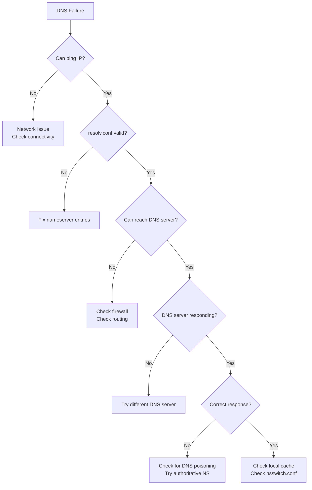

# How to Fix 'DNS Resolution Failed' Errors

Author: [nawazdhandala](https://www.github.com/nawazdhandala)

Tags: Linux, DNS, Networking, Troubleshooting, System Administration

Description: Learn how to diagnose and resolve DNS resolution failures on Linux systems with practical debugging techniques.

---

DNS resolution failures can bring your entire infrastructure to a halt. When your system cannot translate domain names to IP addresses, services fail, APIs timeout, and users get frustrated. This guide walks you through systematic diagnosis and resolution of DNS problems.

## Understanding DNS Resolution Flow

Before troubleshooting, understand how DNS queries flow through your system.

```mermaid
flowchart TD
    A[Application] --> B[/etc/nsswitch.conf]
    B --> C{Check Order}
    C --> D[/etc/hosts]
    C --> E[DNS Resolver]
    E --> F[/etc/resolv.conf]
    F --> G[Local DNS Cache]
    G --> H{Cache Hit?}
    H -->|Yes| I[Return Cached IP]
    H -->|No| J[Query DNS Server]
    J --> K{Response?}
    K -->|Yes| L[Cache Result]
    L --> M[Return IP]
    K -->|No| N[Resolution Failed]
    D --> O{Found?}
    O -->|Yes| M
    O -->|No| E
```

## 1. Initial Diagnostics

Start by identifying where the DNS resolution is failing.

```bash
# Test basic DNS resolution with different tools
# nslookup queries DNS servers directly
nslookup google.com

# dig provides detailed DNS query information
dig google.com

# host is a simpler DNS lookup utility
host google.com

# getent uses the system's configured name resolution
getent hosts google.com

# Test if the issue is DNS-specific by using an IP address
ping 8.8.8.8
# If ping works but DNS fails, the problem is DNS configuration
```

## 2. Check DNS Configuration Files

Examine the key configuration files that control DNS resolution.

```bash
# View the primary DNS resolver configuration
cat /etc/resolv.conf

# Example healthy resolv.conf:
# nameserver 8.8.8.8
# nameserver 8.8.4.4
# search example.com
# options timeout:2 attempts:3

# Check how name resolution is ordered
cat /etc/nsswitch.conf | grep hosts

# Typical output: hosts: files dns
# This means /etc/hosts is checked before DNS servers

# View local hostname mappings
cat /etc/hosts
```

## 3. Common DNS Error Patterns

Here's how to identify and fix the most common DNS issues.

### Error: "Temporary failure in name resolution"

```bash
# This usually indicates DNS server connectivity issues
# Check if you can reach the DNS server
ping -c 3 $(grep nameserver /etc/resolv.conf | head -1 | awk '{print $2}')

# Verify DNS port is accessible
nc -zv 8.8.8.8 53

# Check if systemd-resolved is running (Ubuntu/Debian)
systemctl status systemd-resolved

# Restart the resolver service if needed
sudo systemctl restart systemd-resolved
```

### Error: "Name or service not known"

```bash
# Check if resolv.conf has valid nameservers
cat /etc/resolv.conf

# If empty or missing, add nameservers
sudo tee /etc/resolv.conf << EOF
nameserver 8.8.8.8
nameserver 8.8.4.4
EOF

# Check if resolv.conf is a symlink being overwritten
ls -la /etc/resolv.conf

# For systemd-resolved systems, check the stub resolver
cat /run/systemd/resolve/resolv.conf
```

### Error: "Connection timed out; no servers could be reached"

```bash
# DNS server is unreachable - check network connectivity
ip route show

# Verify default gateway is set
ip route | grep default

# Check if firewall is blocking DNS (port 53)
sudo iptables -L -n | grep 53
sudo nft list ruleset | grep 53

# Test with a different DNS server
dig @1.1.1.1 google.com
```

## 4. DNS Resolution Troubleshooting Workflow

Follow this systematic approach to diagnose DNS issues.



## 5. Fixing systemd-resolved Issues

Modern Linux distributions use systemd-resolved for DNS. Here's how to troubleshoot it.

```bash
# Check systemd-resolved status
systemctl status systemd-resolved

# View current DNS configuration
resolvectl status

# Check which DNS servers are being used
resolvectl dns

# Flush the DNS cache
sudo resolvectl flush-caches

# View cache statistics
resolvectl statistics

# If systemd-resolved is failing, check its configuration
cat /etc/systemd/resolved.conf
```

### Configure systemd-resolved properly

```bash
# Edit the configuration file
sudo nano /etc/systemd/resolved.conf

# Add reliable DNS servers
# /etc/systemd/resolved.conf
[Resolve]
DNS=8.8.8.8 8.8.4.4 1.1.1.1
FallbackDNS=9.9.9.9 149.112.112.112
DNSSEC=allow-downgrade
DNSOverTLS=opportunistic
Cache=yes

# Restart the service
sudo systemctl restart systemd-resolved

# Verify the symlink is correct
sudo ln -sf /run/systemd/resolve/stub-resolv.conf /etc/resolv.conf
```

## 6. Fixing NetworkManager DNS Issues

NetworkManager can override DNS settings. Here's how to manage it.

```bash
# Check NetworkManager status
systemctl status NetworkManager

# View NetworkManager DNS configuration
nmcli device show | grep DNS

# Set DNS servers for a specific connection
nmcli connection modify "Wired connection 1" ipv4.dns "8.8.8.8 8.8.4.4"
nmcli connection modify "Wired connection 1" ipv4.ignore-auto-dns yes

# Apply the changes
nmcli connection down "Wired connection 1"
nmcli connection up "Wired connection 1"

# Prevent NetworkManager from overwriting resolv.conf
# Edit /etc/NetworkManager/NetworkManager.conf
[main]
dns=none
```

## 7. Testing DNS with Detailed Output

Use dig for comprehensive DNS debugging.

```bash
# Perform a detailed DNS query with full trace
dig +trace google.com

# Query a specific DNS server
dig @8.8.8.8 google.com

# Check different record types
dig google.com A        # IPv4 address
dig google.com AAAA     # IPv6 address
dig google.com MX       # Mail servers
dig google.com NS       # Name servers
dig google.com TXT      # Text records

# Get timing information
dig google.com +stats

# Check for DNSSEC validation
dig google.com +dnssec

# Reverse DNS lookup
dig -x 8.8.8.8
```

## 8. Local DNS Cache Management

Clear and manage DNS caches at various levels.

```bash
# Clear systemd-resolved cache
sudo resolvectl flush-caches

# Clear nscd cache (if installed)
sudo nscd -i hosts

# Clear dnsmasq cache (if used)
sudo systemctl restart dnsmasq

# Check if local caching is causing issues by bypassing it
dig @8.8.8.8 +nocache google.com

# For applications using their own cache (like browsers)
# Restart the application or use internal cache clear
```

## 9. Firewall and Network Diagnostics

Ensure DNS traffic is not being blocked.

```bash
# Check iptables rules affecting DNS
sudo iptables -L -n -v | grep -E "53|dns"

# Check nftables rules
sudo nft list ruleset | grep -E "53|dns"

# Allow DNS traffic through firewall (iptables)
sudo iptables -A OUTPUT -p udp --dport 53 -j ACCEPT
sudo iptables -A OUTPUT -p tcp --dport 53 -j ACCEPT
sudo iptables -A INPUT -p udp --sport 53 -j ACCEPT
sudo iptables -A INPUT -p tcp --sport 53 -j ACCEPT

# Allow DNS traffic through firewall (ufw)
sudo ufw allow out 53/udp
sudo ufw allow out 53/tcp

# Capture DNS traffic for analysis
sudo tcpdump -i any port 53 -n
```

## 10. DNS Configuration for Different Scenarios

### Static Server Configuration

```bash
# For servers that should not use DHCP for DNS
# Create immutable resolv.conf
sudo rm /etc/resolv.conf
sudo tee /etc/resolv.conf << EOF
# Static DNS configuration
nameserver 8.8.8.8
nameserver 8.8.4.4
nameserver 1.1.1.1
options timeout:2 attempts:3 rotate
search example.com
EOF

# Make it immutable to prevent overwrites
sudo chattr +i /etc/resolv.conf

# To modify later, remove immutable flag first
# sudo chattr -i /etc/resolv.conf
```

### Docker Container DNS Issues

```bash
# Check Docker's DNS configuration
docker info | grep -i dns

# Specify DNS in Docker daemon configuration
# /etc/docker/daemon.json
{
    "dns": ["8.8.8.8", "8.8.4.4"]
}

# Restart Docker daemon
sudo systemctl restart docker

# Or specify DNS per container
docker run --dns 8.8.8.8 --dns 8.8.4.4 myimage

# For Docker Compose
# docker-compose.yml
services:
  myservice:
    dns:
      - 8.8.8.8
      - 8.8.4.4
```

## 11. Setting Up a Local DNS Cache

Improve performance and reliability with a local caching resolver.

```bash
# Install dnsmasq for local caching
sudo apt install dnsmasq

# Configure dnsmasq
sudo tee /etc/dnsmasq.conf << EOF
# Listen only on localhost
listen-address=127.0.0.1
bind-interfaces

# Use these upstream DNS servers
server=8.8.8.8
server=8.8.4.4
server=1.1.1.1

# Cache size (default is 150)
cache-size=1000

# Don't read /etc/resolv.conf
no-resolv

# Log queries for debugging (disable in production)
# log-queries
EOF

# Update resolv.conf to use local resolver
sudo tee /etc/resolv.conf << EOF
nameserver 127.0.0.1
EOF

# Start dnsmasq
sudo systemctl enable dnsmasq
sudo systemctl start dnsmasq

# Test the local resolver
dig @127.0.0.1 google.com
```

## 12. DNS Troubleshooting Quick Reference

```mermaid
flowchart LR
    subgraph Tools
        A[dig] --> B[Detailed queries]
        C[nslookup] --> D[Quick lookups]
        E[resolvectl] --> F[systemd status]
        G[tcpdump] --> H[Packet capture]
    end
    subgraph Files
        I[/etc/resolv.conf] --> J[DNS servers]
        K[/etc/hosts] --> L[Local overrides]
        M[/etc/nsswitch.conf] --> N[Resolution order]
    end
    subgraph Services
        O[systemd-resolved] --> P[Modern resolver]
        Q[NetworkManager] --> R[Network config]
        S[dnsmasq] --> T[Local cache]
    end
```

## 13. Monitoring DNS Health

Set up ongoing monitoring to catch DNS issues early.

```bash
#!/bin/bash
# /usr/local/bin/dns-health-check.sh
# Simple DNS health monitoring script

DOMAINS=("google.com" "cloudflare.com" "github.com")
DNS_SERVERS=("8.8.8.8" "1.1.1.1")
LOG_FILE="/var/log/dns-health.log"

log() {
    echo "[$(date '+%Y-%m-%d %H:%M:%S')] $1" >> "$LOG_FILE"
}

for domain in "${DOMAINS[@]}"; do
    for dns in "${DNS_SERVERS[@]}"; do
        result=$(dig @"$dns" "$domain" +short +time=2 +tries=1 2>/dev/null)
        if [ -z "$result" ]; then
            log "FAIL: $domain via $dns - no response"
        else
            log "OK: $domain via $dns - $result"
        fi
    done
done
```

Add to crontab for regular monitoring:

```bash
# Check DNS health every 5 minutes
*/5 * * * * /usr/local/bin/dns-health-check.sh
```

---

DNS issues can be frustrating, but systematic debugging will help you identify the root cause quickly. Always verify basic network connectivity first, then work through the resolution chain from local configuration to upstream DNS servers.
