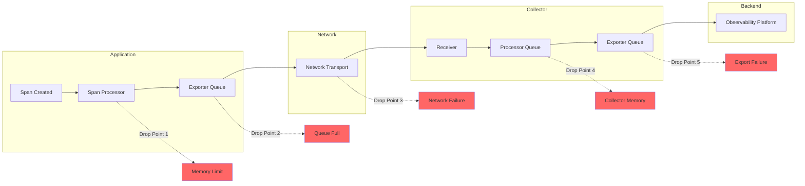

# How to Fix "Dropped Spans" in OpenTelemetry

Author: [nawazdhandala](https://www.github.com/nawazdhandala)

Tags: OpenTelemetry, Tracing, Debugging, Performance, Observability, Spans, Collector, Troubleshooting

Description: A comprehensive guide to diagnosing and fixing dropped spans in OpenTelemetry, covering common causes and practical solutions.

---

Dropped spans are one of the most frustrating issues in OpenTelemetry deployments. You instrument your code, configure your collector, and yet traces appear incomplete or spans go missing entirely. This guide will help you identify why spans are being dropped and how to fix each scenario.

---

## Understanding Dropped Spans

Spans can be dropped at multiple points in the telemetry pipeline. Understanding where and why helps you target the fix.



---

## Common Causes and Solutions

### Cause 1: Exporter Queue Overflow

The most common cause of dropped spans is when the exporter queue fills up faster than it can be drained.

#### Symptoms

- Warning logs: `Dropping span data, buffer is full`
- Incomplete traces during traffic spikes
- Spans from high-throughput services missing

#### Solution: Increase Queue Size and Batch Settings

**Node.js Configuration:**

```javascript
// tracing.js - Configure larger queue and batch settings
const { NodeSDK } = require('@opentelemetry/sdk-node');
const { BatchSpanProcessor } = require('@opentelemetry/sdk-trace-base');
const { OTLPTraceExporter } = require('@opentelemetry/exporter-trace-otlp-http');

const exporter = new OTLPTraceExporter({
  url: 'https://oneuptime.com/otlp/v1/traces',
  headers: {
    'x-oneuptime-token': process.env.ONEUPTIME_TOKEN,
  },
});

// Configure batch processor with larger queue
const spanProcessor = new BatchSpanProcessor(exporter, {
  // Maximum queue size before dropping spans
  maxQueueSize: 4096,  // Default is 2048

  // Maximum batch size per export
  maxExportBatchSize: 512,  // Default is 512

  // How long to wait before exporting a batch
  scheduledDelayMillis: 5000,  // Default is 5000ms

  // Timeout for export operations
  exportTimeoutMillis: 30000,  // Default is 30000ms
});

const sdk = new NodeSDK({
  spanProcessor: spanProcessor,
  // ... other config
});
```

**Python Configuration:**

```python
# tracing.py - Configure batch processor with larger queue
from opentelemetry.sdk.trace.export import BatchSpanProcessor
from opentelemetry.exporter.otlp.proto.http.trace_exporter import OTLPSpanExporter

exporter = OTLPSpanExporter(
    endpoint="https://oneuptime.com/otlp/v1/traces",
    headers={"x-oneuptime-token": os.getenv("ONEUPTIME_TOKEN")},
)

# Configure batch processor with custom settings
span_processor = BatchSpanProcessor(
    exporter,
    max_queue_size=4096,          # Maximum spans in queue
    max_export_batch_size=512,     # Spans per batch
    schedule_delay_millis=5000,    # Export interval
    export_timeout_millis=30000,   # Export timeout
)

provider.add_span_processor(span_processor)
```

---

### Cause 2: Memory Pressure in the Collector

When the OpenTelemetry Collector runs out of memory, it must drop data to prevent crashing.

#### Solution: Configure Memory Limiter Processor

```yaml
# otel-collector-config.yaml
processors:
  # Memory limiter MUST be first in the pipeline
  memory_limiter:
    # Check memory usage at this interval
    check_interval: 1s

    # Hard limit - collector will drop data above this
    limit_mib: 1500

    # Soft limit - collector will start refusing data
    spike_limit_mib: 500

  batch:
    send_batch_size: 512
    timeout: 10s

service:
  pipelines:
    traces:
      receivers: [otlp]
      # Memory limiter must be first
      processors: [memory_limiter, batch]
      exporters: [otlphttp]
```

---

### Cause 3: Network Timeouts and Failures

Network issues between your application and the collector, or between the collector and backend, cause export failures.

#### Solution: Configure Retry and Timeout Settings

```yaml
# otel-collector-config.yaml
exporters:
  otlphttp:
    endpoint: https://oneuptime.com/otlp
    encoding: json
    headers:
      Content-Type: application/json
      x-oneuptime-token: ${ONEUPTIME_TOKEN}

    # Timeout for each export attempt
    timeout: 30s

    # Retry configuration
    retry_on_failure:
      enabled: true
      initial_interval: 5s
      max_interval: 30s
      max_elapsed_time: 300s

    # Queue configuration with persistent storage
    sending_queue:
      enabled: true
      num_consumers: 10
      queue_size: 10000
```

---

### Cause 4: Span Processor Not Flushed on Shutdown

When applications terminate without flushing the span processor, buffered spans are lost.

#### Solution: Implement Graceful Shutdown

**Node.js Graceful Shutdown:**

```javascript
// tracing.js - Ensure spans are flushed on shutdown
const { NodeSDK } = require('@opentelemetry/sdk-node');

const sdk = new NodeSDK({
  // ... configuration
});

sdk.start();

// Handle graceful shutdown
async function shutdown() {
  console.log('Shutting down telemetry...');

  try {
    // This flushes all pending spans before shutdown
    await sdk.shutdown();
    console.log('Telemetry shutdown complete');
  } catch (error) {
    console.error('Error during telemetry shutdown:', error);
  }

  process.exit(0);
}

// Listen for termination signals
process.on('SIGTERM', shutdown);
process.on('SIGINT', shutdown);
```

---

## Summary Checklist

When troubleshooting dropped spans, check these items in order:

1. **Application Side**
   - Queue size is adequate for traffic volume
   - Batch processor configured with appropriate timeouts
   - Graceful shutdown implemented
   - Consistent sampling configuration

2. **Network**
   - Connectivity to collector verified
   - Retry logic configured
   - Timeouts are reasonable

3. **Collector**
   - Memory limiter configured
   - Adequate resources allocated
   - Sending queue enabled with persistence
   - Receiver limits appropriate for traffic

4. **Monitoring**
   - Collector metrics being collected
   - Alerts on dropped span metrics
   - Debug logging available when needed

---

## Related Reading

- [How to Reduce Noise in OpenTelemetry](https://oneuptime.com/blog/post/2025-08-25-how-to-reduce-noise-in-opentelemetry/view)
- [What is OpenTelemetry Collector and Why Use One](https://oneuptime.com/blog/post/2025-09-18-what-is-opentelemetry-collector-and-why-use-one/view)
