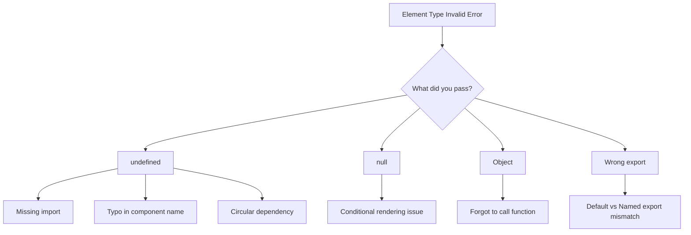
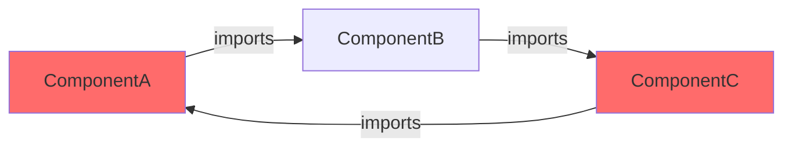
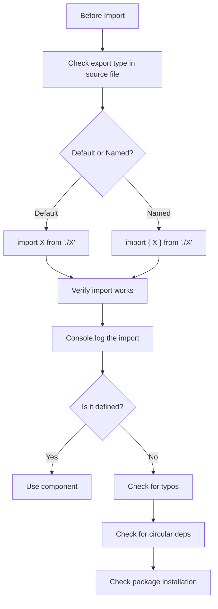

# How to Fix "Element Type Is Invalid" Errors in React

Author: [nawazdhandala](https://github.com/nawazdhandala)

Tags: React, JavaScript, Debugging, Frontend, Troubleshooting

Description: A practical guide to diagnosing and fixing the "Element type is invalid" error in React applications, covering common causes and solutions.

---

The "Element type is invalid: expected a string (for built-in components) or a class/function (for composite components) but got: undefined" error is one of the most common and frustrating errors in React development. This guide will help you understand why it happens and how to fix it.

## Understanding the Error

This error occurs when React tries to render something that is not a valid React element. The most common causes are:



## Common Causes and Solutions

### 1. Default vs Named Export Mismatch

This is the most frequent cause. When a component uses a default export but you import it as a named export (or vice versa), you get undefined.

```javascript
// MyComponent.js - Default export
const MyComponent = () => {
  return <div>Hello World</div>;
};

// CORRECT: Default export
export default MyComponent;

// App.js - WRONG import (treating default as named)
import { MyComponent } from './MyComponent'; // Returns undefined!

// App.js - CORRECT import (default import)
import MyComponent from './MyComponent'; // Works correctly
```

The reverse can also happen:

```javascript
// Button.js - Named export
export const Button = ({ children }) => {
  return <button>{children}</button>;
};

// App.js - WRONG import (treating named as default)
import Button from './Button'; // Returns undefined!

// App.js - CORRECT import (named import)
import { Button } from './Button'; // Works correctly
```

### 2. Typo in Component Name

A simple typo can cause the import to fail silently:

```javascript
// WRONG - typo in filename or component name
import MyComponet from './MyComponent'; // Typo: 'Componet'

// File might export 'MyComponent' but you are looking for 'MyComponet'
// Result: undefined

// CORRECT
import MyComponent from './MyComponent';
```

### 3. Circular Dependencies

Circular dependencies can cause components to be undefined at import time:



```javascript
// ComponentA.js
import ComponentC from './ComponentC';

export const ComponentA = () => {
  return <ComponentC />;
};

// ComponentB.js
import ComponentA from './ComponentA';

export const ComponentB = () => {
  return <ComponentA />;
};

// ComponentC.js - Creates circular dependency!
import ComponentB from './ComponentB';

export const ComponentC = () => {
  return <ComponentB />;
};
```

Solution: Refactor to break the circular dependency:

```javascript
// SharedComponents.js - Extract shared components
export const BaseComponent = ({ children }) => {
  return <div className="base">{children}</div>;
};

// ComponentA.js
import { BaseComponent } from './SharedComponents';

export const ComponentA = () => {
  return <BaseComponent>A</BaseComponent>;
};
```

### 4. Incorrect Re-exports from Index Files

When using barrel exports (index.js files), mistakes are common:

```javascript
// components/Button.js
const Button = ({ children, onClick }) => {
  return <button onClick={onClick}>{children}</button>;
};

export default Button;

// components/index.js - WRONG
export { Button } from './Button'; // This looks for a named export!

// components/index.js - CORRECT
export { default as Button } from './Button';

// Or alternatively:
import Button from './Button';
export { Button };
```

### 5. Missing or Failed Package Import

External packages can fail to install correctly:

```javascript
// WRONG - Package not installed or incorrectly installed
import { SomeComponent } from 'some-package';
// If package installation failed, SomeComponent will be undefined

// Debug by checking the import
import * as SomePackage from 'some-package';
console.log('Package contents:', SomePackage);
// This will show you what is actually exported
```

## Debugging Techniques

### Debug Helper Component

Create a helper to identify problematic components:

```javascript
// debugRender.js
export const debugRender = (Component, name) => {
  if (Component === undefined) {
    console.error(`Component "${name}" is undefined!`);
    return () => (
      <div style={{
        background: '#ff6b6b',
        color: 'white',
        padding: '10px'
      }}>
        Error: {name} is undefined
      </div>
    );
  }

  if (Component === null) {
    console.error(`Component "${name}" is null!`);
    return () => (
      <div style={{
        background: '#ffa500',
        color: 'white',
        padding: '10px'
      }}>
        Error: {name} is null
      </div>
    );
  }

  if (typeof Component !== 'function' && typeof Component !== 'object') {
    console.error(`Component "${name}" is not a valid type:`, typeof Component);
    return () => (
      <div style={{
        background: '#ff6b6b',
        color: 'white',
        padding: '10px'
      }}>
        Error: {name} has invalid type: {typeof Component}
      </div>
    );
  }

  return Component;
};

// Usage in your app
import { Button } from './components';
import { debugRender } from './debugRender';

const SafeButton = debugRender(Button, 'Button');

function App() {
  return <SafeButton>Click me</SafeButton>;
}
```

### Console Logging Imports

Add logging to trace the issue:

```javascript
// At the top of your file with the error
import MyComponent from './MyComponent';
import { AnotherComponent } from './AnotherComponent';

// Debug logging
console.log('MyComponent:', MyComponent);
console.log('AnotherComponent:', AnotherComponent);

// Check if they are valid React components
console.log('MyComponent type:', typeof MyComponent);
console.log('AnotherComponent type:', typeof AnotherComponent);
```

### Using ESLint to Catch Issues

Configure ESLint to catch import/export mismatches:

```javascript
// .eslintrc.js
module.exports = {
  plugins: ['import'],
  rules: {
    // Ensure imports point to a file/module that can be resolved
    'import/no-unresolved': 'error',

    // Ensure named imports correspond to a named export
    'import/named': 'error',

    // Ensure default imports correspond to a default export
    'import/default': 'error',

    // Detect cycles in dependencies
    'import/no-cycle': 'error',

    // Ensure consistent use of file extension
    'import/extensions': ['error', 'ignorePackages'],
  },
  settings: {
    'import/resolver': {
      node: {
        extensions: ['.js', '.jsx', '.ts', '.tsx'],
      },
    },
  },
};
```

## Common Scenarios and Fixes

### React Router Components

```javascript
// WRONG - Old React Router v5 syntax in v6
import { Switch, Route } from 'react-router-dom';

// In React Router v6, Switch was renamed to Routes
// and Route syntax changed

// CORRECT - React Router v6
import { Routes, Route } from 'react-router-dom';

function App() {
  return (
    <Routes>
      <Route path="/" element={<Home />} />
      <Route path="/about" element={<About />} />
    </Routes>
  );
}
```

### Lazy Loaded Components

```javascript
// WRONG - Lazy loading a named export
const MyComponent = React.lazy(() => import('./MyComponent'));
// This fails if MyComponent uses named export

// CORRECT - Lazy loading with named export
const MyComponent = React.lazy(() =>
  import('./MyComponent').then(module => ({
    default: module.MyComponent
  }))
);

// Or ensure the component uses default export
// MyComponent.js
export default function MyComponent() {
  return <div>Lazy loaded!</div>;
}
```

### Higher-Order Components

```javascript
// WRONG - HOC returning undefined
const withAuth = (WrappedComponent) => {
  // Forgot to return the component!
  const AuthComponent = (props) => {
    return <WrappedComponent {...props} />;
  };
  // Missing return statement
};

// CORRECT
const withAuth = (WrappedComponent) => {
  const AuthComponent = (props) => {
    const isAuthenticated = useAuth();

    if (!isAuthenticated) {
      return <Navigate to="/login" />;
    }

    return <WrappedComponent {...props} />;
  };

  return AuthComponent; // Don't forget to return!
};

// Usage
const ProtectedDashboard = withAuth(Dashboard);
```

## Prevention Checklist



## Summary

The "Element type is invalid" error almost always comes down to:

1. Export/import type mismatch (default vs named)
2. Typos in component names or file paths
3. Circular dependencies causing undefined imports
4. Missing or incorrectly installed packages
5. Incorrect re-exports in barrel files

Use the debugging techniques above to identify the exact cause, and the ESLint rules to prevent these issues from occurring in the first place.
