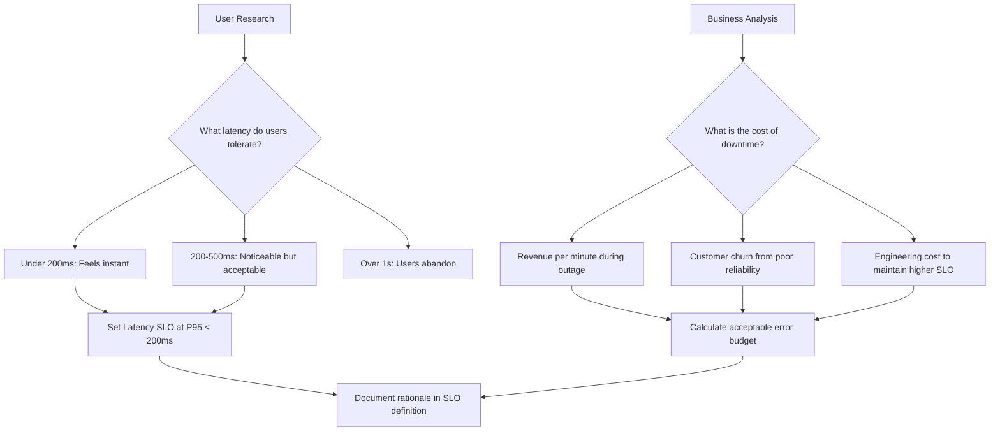
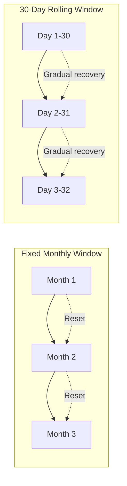

# How to Fix Error Budget Management Issues

Author: [nawazdhandala](https://www.github.com/nawazdhandala)

Tags: Site Reliability Engineering, SRE, Error Budget, SLO, Reliability, Incident Management, Risk Management

Description: A practical guide to diagnosing and fixing common error budget management problems that prevent SRE teams from balancing reliability with feature velocity.

---

## The Error Budget Problem

Error budgets sound simple in theory: if your SLO is 99.9% availability, you have 0.1% of time (about 43 minutes per month) where failures are acceptable. In practice, teams struggle with error budget management for reasons that have little to do with math.

The most common complaint I hear is that error budgets feel either meaningless (no one pays attention to them) or punitive (they become a stick to beat engineering with). Neither outcome helps your reliability.

This guide addresses the real-world issues that make error budget management fail and provides concrete fixes.

## Issue 1: Nobody Knows the Budget Status

If engineers cannot quickly answer "how much error budget do we have left?" then your error budget is not working.

The fix is visibility. Create dashboards that show budget status at a glance. Here is a Prometheus query that calculates remaining error budget:

```promql
# Calculate remaining error budget percentage
# SLO target: 99.9% (0.999)
# Window: 30 days

# First, calculate actual success rate over the window
(
  sum(increase(http_requests_total{status=~"2..|3.."}[30d]))
  /
  sum(increase(http_requests_total[30d]))
)

# Compare against SLO to get budget consumption
# If actual is 99.95%, and SLO is 99.9%, budget used = (0.001 - 0.0005) / 0.001 = 50%
```

A cleaner approach is to compute this in your monitoring platform and expose it as a metric:

```python
# error_budget_calculator.py
# Calculate and expose error budget metrics

from prometheus_client import Gauge
import time

# Metric that will be scraped by Prometheus
error_budget_remaining = Gauge(
    'error_budget_remaining_percent',
    'Percentage of error budget remaining for the current window',
    ['service', 'slo_name']
)

def calculate_error_budget(service_name, slo_target, window_seconds,
                           good_events, total_events):
    """
    Calculate remaining error budget as a percentage.

    Args:
        service_name: Name of the service
        slo_target: Target as decimal (0.999 for 99.9%)
        window_seconds: SLO window in seconds
        good_events: Count of successful events in window
        total_events: Count of total events in window

    Returns:
        Remaining budget as percentage (0-100)
    """
    if total_events == 0:
        return 100.0  # No traffic means full budget

    # Calculate actual performance
    actual_success_rate = good_events / total_events

    # Calculate allowed failure rate and actual failure rate
    allowed_failure_rate = 1 - slo_target
    actual_failure_rate = 1 - actual_success_rate

    # Budget consumed is actual failures / allowed failures
    if allowed_failure_rate == 0:
        return 0.0 if actual_failure_rate > 0 else 100.0

    budget_consumed = actual_failure_rate / allowed_failure_rate
    budget_remaining = max(0, (1 - budget_consumed) * 100)

    # Update the Prometheus metric
    error_budget_remaining.labels(
        service=service_name,
        slo_name='availability'
    ).set(budget_remaining)

    return budget_remaining
```

## Issue 2: Error Budget Burns Without Anyone Noticing

Slow burns are insidious. Your budget drains gradually over days or weeks, and by the time someone notices, it is exhausted.

Configure burn rate alerts at multiple thresholds. This catches both rapid incidents and gradual degradation:

```yaml
# burn-rate-alerts.yaml
# Alert configuration for error budget burn rates

groups:
  - name: error-budget-burn-rate
    rules:
      # 2% of monthly budget consumed in 1 hour
      # This pace would exhaust budget in ~2 days
      - alert: ErrorBudgetFastBurn
        expr: |
          (1 - (
            sum(rate(http_requests_total{status=~"2.."}[1h]))
            / sum(rate(http_requests_total[1h]))
          )) > (14.4 * 0.001)
        for: 2m
        labels:
          severity: critical
        annotations:
          summary: "Error budget burning at 14x normal rate"
          description: "At this rate, monthly budget exhausts in 2 days"

      # 5% of monthly budget consumed in 6 hours
      # Catches slower but still problematic burns
      - alert: ErrorBudgetSlowBurn
        expr: |
          (1 - (
            sum(rate(http_requests_total{status=~"2.."}[6h]))
            / sum(rate(http_requests_total[6h]))
          )) > (2 * 0.001)
        for: 10m
        labels:
          severity: warning
        annotations:
          summary: "Error budget burning at elevated rate"
          description: "Investigate recent changes or degradation"
```

## Issue 3: The Budget Feels Arbitrary

When stakeholders ask "why 99.9% and not 99.95%?" and you cannot give a good answer, the budget loses credibility.

Tie your SLO to user research or business metrics. Here is how to approach this:



Document the reasoning in your SLO specification:

```yaml
# slo-specification.yaml
# SLO with documented rationale

slos:
  - name: checkout-availability
    target: 99.9%

    rationale: |
      Based on analysis of checkout abandonment rates:
      - At 99.9% availability, we see ~0.3% abandonment from errors
      - At 99.5% availability, abandonment rises to ~2.1%
      - Revenue impact of going from 99.9% to 99.5%: ~$180K/month

      Engineering cost to maintain 99.99%: ~$300K/year
      Revenue protection from 99.99% vs 99.9%: ~$50K/year

      Conclusion: 99.9% is the optimal target for this service.
```

## Issue 4: Budget Exhaustion Has No Consequences

If depleting the error budget does not change anything, engineers will (correctly) ignore it.

Create and enforce a budget policy with real consequences:

```python
# deployment_gate.py
# Deployment gating based on error budget

import requests
from datetime import datetime

class DeploymentGate:
    def __init__(self, monitoring_api_url, service_name):
        self.api_url = monitoring_api_url
        self.service = service_name

    def check_deployment_allowed(self, change_risk_level='normal'):
        """
        Check if deployment is allowed based on error budget status.

        Args:
            change_risk_level: 'low', 'normal', or 'high'

        Returns:
            tuple: (allowed: bool, reason: str)
        """
        budget = self._get_error_budget()

        # Define thresholds for different risk levels
        thresholds = {
            'low': 10,      # Bug fixes allowed with 10% budget
            'normal': 25,   # Normal deploys need 25% budget
            'high': 50      # Risky changes need 50% budget
        }

        required_budget = thresholds.get(change_risk_level, 25)

        if budget['remaining_percent'] < required_budget:
            return (
                False,
                f"Deployment blocked: {budget['remaining_percent']:.1f}% budget "
                f"remaining, {required_budget}% required for {change_risk_level} "
                f"risk changes. Focus on reliability improvements."
            )

        # Check for active incidents
        if budget.get('active_incidents', 0) > 0:
            return (
                False,
                f"Deployment blocked: {budget['active_incidents']} active "
                f"incidents. Resolve incidents before deploying."
            )

        return (True, "Deployment allowed")

    def _get_error_budget(self):
        """Fetch current error budget status from monitoring API."""
        response = requests.get(
            f"{self.api_url}/api/v1/services/{self.service}/error-budget"
        )
        return response.json()

# Usage in CI/CD pipeline
def pre_deployment_check():
    gate = DeploymentGate(
        monitoring_api_url="https://api.oneuptime.com",
        service_name="checkout-service"
    )

    allowed, reason = gate.check_deployment_allowed(
        change_risk_level='normal'
    )

    if not allowed:
        print(f"BLOCKED: {reason}")
        exit(1)

    print(f"APPROVED: {reason}")
```

## Issue 5: Error Budget Resets Feel Unfair

Monthly resets can feel arbitrary. A team that barely exhausted their budget last month starts fresh, while another team might have a major incident on day one of a new period.

Consider rolling windows instead of fixed calendar periods:



With a rolling window, bad days gradually roll out of the calculation rather than disappearing at midnight on the first of the month. This provides more stable and predictable budget behavior.

## Issue 6: Different Teams Have Different Definitions

When each team calculates error budget differently, comparisons become meaningless.

Standardize your SLI definitions across the organization:

```yaml
# standard-sli-definitions.yaml
# Organization-wide SLI calculation standards

standards:
  availability:
    definition: |
      Ratio of successful requests to total requests.
      A request is successful if it returns a non-5xx status code.

    calculation: |
      sum(requests{status!~"5.."}) / sum(requests)

    exclusions:
      - "Health check endpoints (/health, /ready)"
      - "Requests during planned maintenance windows"
      - "Requests from internal monitoring systems"

  latency:
    definition: |
      Server-side request duration from receipt to response.
      Measured at the application layer, not including network transit.

    calculation: |
      histogram_quantile(0.95, request_duration_seconds_bucket)

    exclusions:
      - "Long-polling endpoints"
      - "File upload/download endpoints"
      - "Batch processing endpoints"
```

## Putting It All Together

Error budget management works when it becomes part of engineering culture rather than a metric that only SREs care about. The key elements are:

1. Visibility that makes budget status obvious to everyone
2. Alerts that catch burns before budgets exhaust
3. Rationale that connects SLOs to user and business needs
4. Consequences that make budgets meaningful
5. Fair calculation methods that teams trust
6. Standardization that enables organizational learning

Start by fixing the visibility problem. Everything else becomes easier when the team can answer "how much budget do we have?" without opening a spreadsheet.
