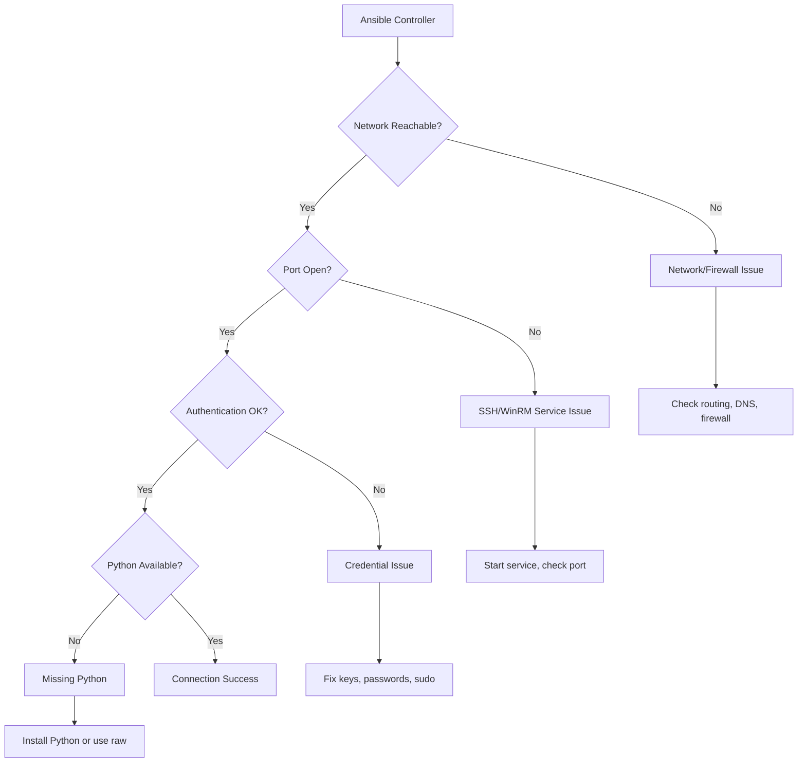
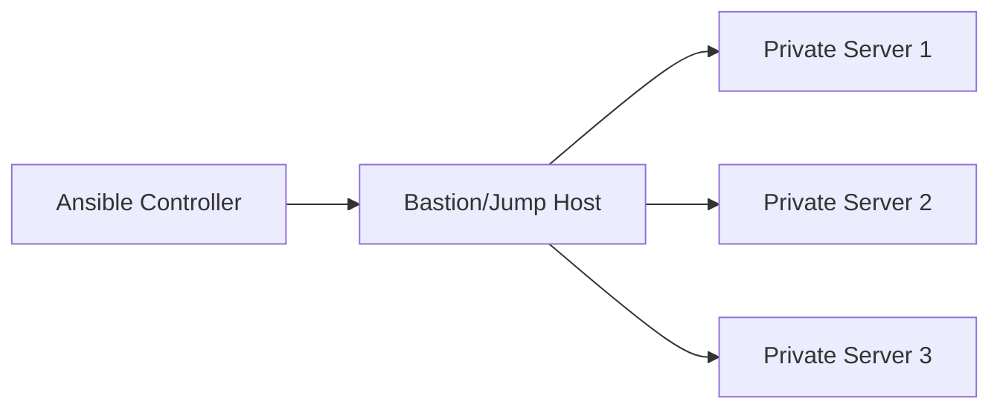

# How to Fix "Failed to connect to host" Errors

Author: [nawazdhandala](https://www.github.com/nawazdhandala)

Tags: Ansible, SSH, Networking, Troubleshooting, DevOps, Connectivity, WinRM

Description: Learn how to diagnose and fix Ansible connection failures including SSH issues, firewall problems, and authentication errors.

---

Nothing is more frustrating than an Ansible playbook that cannot reach its target hosts. The error "Failed to connect to the host via ssh" or "UNREACHABLE!" stops your automation before it even starts. This guide walks through the systematic process of diagnosing and fixing these connection problems.

## Understanding Connection Errors

Ansible connection failures can occur at multiple layers.



## Common Error Messages and Their Causes

### Error: "Failed to connect to the host via ssh"

```
fatal: [server1]: UNREACHABLE! => {
    "changed": false,
    "msg": "Failed to connect to the host via ssh: ssh: connect to host server1 port 22: Connection refused",
    "unreachable": true
}
```

### Error: "Permission denied"

```
fatal: [server1]: UNREACHABLE! => {
    "changed": false,
    "msg": "Failed to connect to the host via ssh: Permission denied (publickey,password).",
    "unreachable": true
}
```

### Error: "Host key verification failed"

```
fatal: [server1]: UNREACHABLE! => {
    "changed": false,
    "msg": "Failed to connect to the host via ssh: Host key verification failed.",
    "unreachable": true
}
```

## Step-by-Step Diagnosis

### Step 1: Verify Basic Network Connectivity

```bash
# Check if host is reachable
ping server1

# Check DNS resolution
nslookup server1
dig server1

# Check if you can reach the SSH port
nc -zv server1 22
# or
telnet server1 22

# Check routing
traceroute server1
```

### Step 2: Test SSH Connection Manually

```bash
# Basic SSH test with verbose output
ssh -v user@server1

# Very verbose output for detailed debugging
ssh -vvv user@server1

# Test with specific key
ssh -i /path/to/key -v user@server1

# Test with specific port
ssh -p 2222 -v user@server1
```

### Step 3: Verify Ansible Can Connect

```bash
# Test connection with Ansible ping module
ansible server1 -m ping -vvv

# Test with specific user
ansible server1 -m ping -u deploy -vvv

# Test with specific key
ansible server1 -m ping --private-key=/path/to/key -vvv

# Test with password (will prompt)
ansible server1 -m ping -u deploy --ask-pass
```

## Fixing Network and Firewall Issues

### Check Firewall Rules on Controller

```bash
# Check if outbound SSH is allowed (Linux)
iptables -L OUTPUT -n | grep 22
nft list ruleset | grep 22

# macOS
sudo pfctl -sr | grep 22
```

### Check Firewall Rules on Target Host

```bash
# Check SSH port is listening
sudo ss -tlnp | grep 22
sudo netstat -tlnp | grep 22

# Check firewall allows SSH (firewalld)
sudo firewall-cmd --list-all
sudo firewall-cmd --add-service=ssh --permanent
sudo firewall-cmd --reload

# Check firewall (ufw)
sudo ufw status
sudo ufw allow ssh

# Check firewall (iptables)
sudo iptables -L INPUT -n | grep 22
```

### AWS Security Groups

```yaml
# Ansible task to ensure SSH access in AWS
- name: Ensure SSH access in security group
  amazon.aws.ec2_security_group:
    name: ansible-access
    description: Allow Ansible SSH access
    vpc_id: vpc-12345678
    rules:
      - proto: tcp
        ports:
          - 22
        cidr_ip: "{{ ansible_controller_ip }}/32"
        rule_desc: Ansible controller access
```

## Fixing SSH Configuration Issues

### Check SSH Service on Target

```bash
# Check SSH service status
sudo systemctl status sshd

# Start SSH service if not running
sudo systemctl start sshd
sudo systemctl enable sshd

# Check SSH configuration
sudo sshd -T | grep -E "^(port|listenaddress|permitrootlogin|passwordauthentication|pubkeyauthentication)"
```

### SSH Configuration File Issues

```bash
# /etc/ssh/sshd_config - common settings to check

# Ensure public key authentication is enabled
PubkeyAuthentication yes

# Allow the user to log in
AllowUsers deploy ansible

# Or allow a group
AllowGroups wheel ansible

# If using password authentication
PasswordAuthentication yes

# If allowing root login (not recommended)
PermitRootLogin prohibit-password

# After changes, restart SSH
sudo systemctl restart sshd
```

## Fixing Authentication Issues

### SSH Key Problems

```bash
# Generate new SSH key if needed
ssh-keygen -t ed25519 -C "ansible@controller"

# Copy key to target host
ssh-copy-id -i ~/.ssh/id_ed25519.pub user@server1

# Or manually add to authorized_keys
cat ~/.ssh/id_ed25519.pub | ssh user@server1 "mkdir -p ~/.ssh && cat >> ~/.ssh/authorized_keys"

# Fix permissions on target (critical!)
ssh user@server1 "chmod 700 ~/.ssh && chmod 600 ~/.ssh/authorized_keys"
```

### Key Permission Errors

```bash
# On the Ansible controller - fix key permissions
chmod 700 ~/.ssh
chmod 600 ~/.ssh/id_ed25519
chmod 644 ~/.ssh/id_ed25519.pub
chmod 644 ~/.ssh/known_hosts

# On target host
chmod 700 ~/.ssh
chmod 600 ~/.ssh/authorized_keys
```

### Multiple Keys and SSH Agent

```bash
# Start SSH agent
eval $(ssh-agent -s)

# Add key to agent
ssh-add ~/.ssh/id_ed25519

# List loaded keys
ssh-add -l

# For Ansible, you can also use SSH agent forwarding
ansible-playbook playbook.yml --ssh-extra-args="-A"
```

## Ansible Connection Configuration

### Inventory Configuration

```ini
# inventory.ini
[webservers]
web1 ansible_host=192.168.1.10 ansible_user=deploy
web2 ansible_host=192.168.1.11 ansible_user=deploy

[webservers:vars]
ansible_ssh_private_key_file=/path/to/key
ansible_port=22
ansible_connection=ssh

# For hosts with non-standard SSH port
[legacy]
oldserver ansible_host=10.0.0.5 ansible_port=2222

# For local connections
[local]
localhost ansible_connection=local
```

### YAML Inventory with Connection Details

```yaml
# inventory.yml
all:
  children:
    webservers:
      hosts:
        web1:
          ansible_host: 192.168.1.10
        web2:
          ansible_host: 192.168.1.11
      vars:
        ansible_user: deploy
        ansible_ssh_private_key_file: /home/ansible/.ssh/deploy_key
        ansible_ssh_common_args: '-o StrictHostKeyChecking=no'

    legacy_servers:
      hosts:
        old1:
          ansible_host: 10.0.0.5
          ansible_port: 2222
          ansible_user: admin
          ansible_ssh_pass: "{{ vault_legacy_password }}"
```

### ansible.cfg Connection Settings

```ini
# ansible.cfg
[defaults]
# Default remote user
remote_user = deploy

# Default private key
private_key_file = /home/ansible/.ssh/id_ed25519

# SSH connection settings
host_key_checking = False
timeout = 30

# Retry failed connections
retries = 3

[ssh_connection]
# SSH arguments
ssh_args = -C -o ControlMaster=auto -o ControlPersist=60s

# Pipelining (faster, but requires tty)
pipelining = True

# Control path for SSH multiplexing
control_path = /tmp/ansible-ssh-%%h-%%p-%%r

# Connection timeout
timeout = 30
```

## Host Key Verification Issues

### Disable Host Key Checking (Development Only)

```ini
# ansible.cfg
[defaults]
host_key_checking = False
```

Or use environment variable:

```bash
export ANSIBLE_HOST_KEY_CHECKING=False
ansible-playbook playbook.yml
```

### Proper Host Key Management

```bash
# Scan and add host keys properly
ssh-keyscan -H server1 >> ~/.ssh/known_hosts
ssh-keyscan -H server2 >> ~/.ssh/known_hosts

# Scan multiple hosts
for host in server1 server2 server3; do
    ssh-keyscan -H $host >> ~/.ssh/known_hosts
done
```

```yaml
# Ansible task to manage known_hosts
- name: Add host keys to known_hosts
  known_hosts:
    name: "{{ item }}"
    key: "{{ lookup('pipe', 'ssh-keyscan -t rsa ' + item) }}"
    state: present
  loop: "{{ groups['all'] }}"
  delegate_to: localhost
```

## Debugging Connection Issues

### Enable Maximum Verbosity

```bash
# Four levels of verbosity
ansible-playbook playbook.yml -v    # Verbose
ansible-playbook playbook.yml -vv   # More verbose
ansible-playbook playbook.yml -vvv  # Debug
ansible-playbook playbook.yml -vvvv # Connection debug
```

### Debug Connection Variables

```yaml
# playbook.yml
---
- name: Debug connection
  hosts: all
  gather_facts: no
  tasks:
    - name: Show connection variables
      debug:
        msg: |
          Host: {{ inventory_hostname }}
          ansible_host: {{ ansible_host | default('not set') }}
          ansible_user: {{ ansible_user | default('not set') }}
          ansible_port: {{ ansible_port | default(22) }}
          ansible_connection: {{ ansible_connection | default('ssh') }}
```

### Test Raw Connection

```bash
# Use raw module to bypass Python requirement
ansible server1 -m raw -a "echo 'Connection works'" -vvv

# This helps identify if issue is SSH or Python related
```

## Special Connection Scenarios

### Jump Host / Bastion Configuration



```ini
# inventory.ini
[private_servers]
private1 ansible_host=10.0.1.10
private2 ansible_host=10.0.1.11

[private_servers:vars]
ansible_ssh_common_args='-o ProxyJump=user@bastion.example.com'
```

Or using SSH config:

```
# ~/.ssh/config
Host bastion
    HostName bastion.example.com
    User ansible
    IdentityFile ~/.ssh/bastion_key

Host 10.0.1.*
    User deploy
    ProxyJump bastion
    IdentityFile ~/.ssh/private_key
```

### Windows Hosts (WinRM)

```yaml
# inventory.yml
all:
  children:
    windows:
      hosts:
        win1:
          ansible_host: 192.168.1.100
      vars:
        ansible_connection: winrm
        ansible_port: 5986
        ansible_winrm_transport: ntlm
        ansible_winrm_server_cert_validation: ignore
        ansible_user: Administrator
        ansible_password: "{{ vault_windows_password }}"
```

### Docker Containers

```yaml
# inventory.yml
all:
  children:
    containers:
      hosts:
        app_container:
          ansible_connection: docker
          ansible_docker_extra_args: "-H tcp://docker-host:2375"
          ansible_host: my_container_name
```

## Complete Troubleshooting Checklist

```yaml
# troubleshoot_connection.yml
---
- name: Connection troubleshooting playbook
  hosts: all
  gather_facts: no

  tasks:
    - name: Step 1 - Raw connectivity test
      raw: echo "Raw connection successful"
      register: raw_result
      ignore_errors: yes

    - name: Step 2 - Check Python
      raw: which python3 || which python
      register: python_check
      ignore_errors: yes

    - name: Step 3 - Gather minimal facts
      setup:
        gather_subset:
          - '!all'
          - min
      register: facts_result
      ignore_errors: yes

    - name: Display results
      debug:
        msg: |
          Raw connection: {{ 'OK' if raw_result is succeeded else 'FAILED' }}
          Python path: {{ python_check.stdout | default('Not found') | trim }}
          Facts gathered: {{ 'OK' if facts_result is succeeded else 'FAILED' }}
```

## Quick Reference: Common Fixes

| Error | Common Cause | Quick Fix |
|-------|--------------|-----------|
| Connection refused | SSH not running | `systemctl start sshd` |
| Connection timed out | Firewall blocking | Check security groups/firewall |
| Permission denied | Wrong key/password | Verify credentials, check permissions |
| Host key verification | Unknown host | `ssh-keyscan -H host >> known_hosts` |
| No route to host | Network issue | Check routing, VPN, DNS |
| Connection reset | SSH config issue | Check `/etc/ssh/sshd_config` |

---

Connection errors are usually straightforward once you break them down systematically. Start with basic network connectivity, then verify SSH access, then check authentication. Use verbose mode liberally during debugging, and remember that the raw module can help isolate SSH issues from Python issues. Most connection problems come down to firewalls, permissions, or misconfigured SSH settings.
