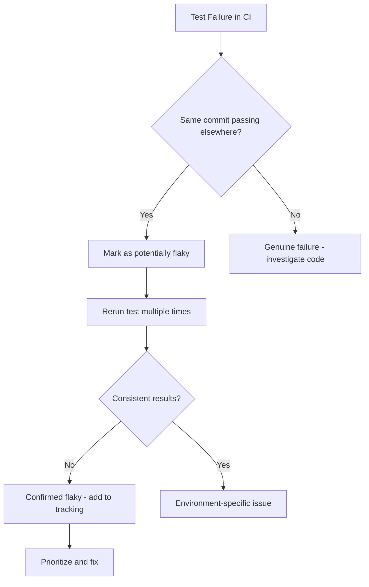

# How to Fix "Flaky Tests" in CI/CD

Author: [nawazdhandala](https://github.com/nawazdhandala)

Tags: Testing, CI/CD, DevOps, Flaky Tests, Automation

Description: Learn how to identify, diagnose, and fix flaky tests that cause intermittent failures in your CI/CD pipelines.

---

Flaky tests are the silent killers of developer productivity. They pass sometimes and fail other times without any code changes, eroding trust in your test suite and slowing down your entire team. This guide covers practical strategies to identify, diagnose, and eliminate flaky tests from your CI/CD pipelines.

## What Makes a Test Flaky?

A flaky test produces inconsistent results when run multiple times against the same code. The root causes typically fall into these categories:

| Category | Examples |
|----------|----------|
| **Timing issues** | Race conditions, timeouts, async operations |
| **Environment dependencies** | File system, network, time zones |
| **Shared state** | Global variables, database pollution |
| **Resource contention** | Ports, files, memory limits |
| **Non-deterministic data** | Random values, timestamps |

## Detecting Flaky Tests

Before fixing flaky tests, you need to identify them. Here is a simple detection workflow:



### Automated Flaky Test Detection

Add a retry mechanism to your CI pipeline that tracks flakiness:

```yaml
# .github/workflows/test.yml
name: Tests with Flaky Detection

on: [push, pull_request]

jobs:
  test:
    runs-on: ubuntu-latest
    steps:
      - uses: actions/checkout@v4

      - name: Run tests with retry tracking
        run: |
          # Run tests and capture exit code
          npm test -- --json --outputFile=results.json || true

          # Check for flaky tests by running failures again
          if [ -f results.json ]; then
            node scripts/detect-flaky.js results.json
          fi

      - name: Upload flaky test report
        if: always()
        uses: actions/upload-artifact@v4
        with:
          name: flaky-report
          path: flaky-tests.json
```

Create a detection script that reruns failed tests:

```javascript
// scripts/detect-flaky.js
const { execSync } = require('child_process');
const fs = require('fs');

const results = JSON.parse(fs.readFileSync(process.argv[2], 'utf-8'));
const failedTests = results.testResults
  .filter(t => t.status === 'failed')
  .map(t => t.name);

const flakyTests = [];

// Rerun each failed test multiple times to check for flakiness
for (const testName of failedTests) {
  let passCount = 0;
  let failCount = 0;

  // Run 3 times to detect inconsistency
  for (let i = 0; i < 3; i++) {
    try {
      execSync(`npm test -- --testNamePattern="${testName}"`, {
        stdio: 'pipe'
      });
      passCount++;
    } catch {
      failCount++;
    }
  }

  // If results are mixed, the test is flaky
  if (passCount > 0 && failCount > 0) {
    flakyTests.push({
      name: testName,
      passRate: passCount / 3,
      detectedAt: new Date().toISOString()
    });
  }
}

fs.writeFileSync('flaky-tests.json', JSON.stringify(flakyTests, null, 2));

if (flakyTests.length > 0) {
  console.log(`Found ${flakyTests.length} flaky tests:`);
  flakyTests.forEach(t => console.log(`  - ${t.name} (${t.passRate * 100}% pass rate)`));
}
```

## Common Flaky Test Patterns and Fixes

### 1. Timing and Race Conditions

The most common source of flakiness is improper handling of asynchronous operations.

**Problem: Not waiting for async operations to complete**

```javascript
// FLAKY: Test might complete before the async operation finishes
it('should update user status', () => {
  updateUserStatus('active');  // Returns a promise but we ignore it
  expect(getUser().status).toBe('active');  // Might check too early
});
```

**Solution: Properly await async operations**

```javascript
// FIXED: Wait for the async operation to complete
it('should update user status', async () => {
  await updateUserStatus('active');  // Wait for promise to resolve
  const user = await getUser();       // Also wait for this
  expect(user.status).toBe('active');
});
```

### 2. Fixed Timeouts

Hardcoded timeouts are problematic because CI environments have variable performance.

**Problem: Arbitrary timeout values**

```javascript
// FLAKY: 100ms might be enough locally but not in CI
it('should load data', async () => {
  loadData();
  await new Promise(resolve => setTimeout(resolve, 100));
  expect(getData()).toBeDefined();
});
```

**Solution: Poll for expected state instead of waiting arbitrary time**

```javascript
// FIXED: Wait for the actual condition, not arbitrary time
async function waitFor(condition, timeout = 5000, interval = 50) {
  const startTime = Date.now();
  while (Date.now() - startTime < timeout) {
    if (await condition()) {
      return true;
    }
    await new Promise(resolve => setTimeout(resolve, interval));
  }
  throw new Error('Condition not met within timeout');
}

it('should load data', async () => {
  loadData();
  // Poll until data is available instead of fixed wait
  await waitFor(() => getData() !== undefined);
  expect(getData()).toBeDefined();
});
```

### 3. Test Order Dependencies

Tests that rely on other tests running first create hidden dependencies.

**Problem: Test depends on state from previous test**

```javascript
// FLAKY: Depends on test order
describe('User API', () => {
  it('should create user', async () => {
    const user = await createUser({ name: 'Test' });
    // Stores user ID in module-level variable
    createdUserId = user.id;
  });

  it('should fetch user', async () => {
    // Uses ID from previous test - fails if run in isolation
    const user = await getUser(createdUserId);
    expect(user.name).toBe('Test');
  });
});
```

**Solution: Each test sets up its own data**

```javascript
// FIXED: Each test is self-contained
describe('User API', () => {
  it('should create user', async () => {
    const user = await createUser({ name: 'Test' });
    expect(user.id).toBeDefined();
  });

  it('should fetch user', async () => {
    // Create the user within this test
    const created = await createUser({ name: 'Test' });
    const fetched = await getUser(created.id);
    expect(fetched.name).toBe('Test');
  });
});
```

### 4. Shared Resources

Tests competing for the same resources cause intermittent failures.

**Problem: Multiple tests use the same port**

```javascript
// FLAKY: Port might still be in use from previous test
describe('Server', () => {
  it('should start on port 3000', async () => {
    const server = await startServer(3000);
    // Test logic
    await server.close();
  });

  it('should handle requests', async () => {
    // Previous server might not have released port yet
    const server = await startServer(3000);
    // ...
  });
});
```

**Solution: Use dynamic ports or ensure cleanup**

```javascript
// FIXED: Use dynamic port allocation
describe('Server', () => {
  let server;

  beforeEach(async () => {
    // Let the OS assign an available port
    server = await startServer(0);
  });

  afterEach(async () => {
    if (server) {
      await server.close();
      // Wait for port to be released
      await new Promise(resolve => setTimeout(resolve, 100));
    }
  });

  it('should handle requests', async () => {
    // Use the dynamically assigned port
    const port = server.address().port;
    const response = await fetch(`http://localhost:${port}/health`);
    expect(response.ok).toBe(true);
  });
});
```

### 5. Time-Dependent Tests

Tests that depend on the current time are notoriously flaky.

**Problem: Test behavior changes based on when it runs**

```javascript
// FLAKY: Fails at midnight, month boundaries, or year end
it('should check if subscription is active', () => {
  const subscription = {
    expiresAt: new Date('2026-01-25')  // Tomorrow
  };
  expect(isActive(subscription)).toBe(true);
});
```

**Solution: Mock the current time**

```javascript
// FIXED: Control the clock in tests
describe('Subscription', () => {
  beforeEach(() => {
    // Set a fixed date for all tests
    jest.useFakeTimers();
    jest.setSystemTime(new Date('2026-01-24T12:00:00Z'));
  });

  afterEach(() => {
    jest.useRealTimers();
  });

  it('should check if subscription is active', () => {
    const subscription = {
      expiresAt: new Date('2026-01-25T12:00:00Z')
    };
    expect(isActive(subscription)).toBe(true);
  });

  it('should detect expired subscription', () => {
    const subscription = {
      expiresAt: new Date('2026-01-23T12:00:00Z')  // Yesterday
    };
    expect(isActive(subscription)).toBe(false);
  });
});
```

## CI/CD Configuration for Reliability

Configure your CI pipeline to handle flaky tests gracefully:

```yaml
# .github/workflows/test.yml
jobs:
  test:
    runs-on: ubuntu-latest
    strategy:
      # Continue running other jobs even if one fails
      fail-fast: false
    steps:
      - uses: actions/checkout@v4

      - name: Run tests with retries
        uses: nick-invision/retry@v2
        with:
          timeout_minutes: 10
          max_attempts: 3
          # Only retry if exit code indicates test failure
          retry_on: error
          command: npm test

      - name: Quarantine known flaky tests
        if: failure()
        run: |
          # Run quarantined tests separately
          npm test -- --testPathPattern="quarantine" || true
```

## Tracking and Prioritizing Flaky Tests

Maintain a flaky test dashboard to track patterns:

```javascript
// scripts/flaky-report.js
// Run periodically to generate flakiness trends

const flakyHistory = require('./flaky-history.json');

// Calculate flakiness score for prioritization
const testStats = {};

for (const run of flakyHistory) {
  for (const test of run.flakyTests) {
    if (!testStats[test.name]) {
      testStats[test.name] = { occurrences: 0, totalRuns: 0 };
    }
    testStats[test.name].occurrences++;
    testStats[test.name].totalRuns = flakyHistory.length;
  }
}

// Sort by flakiness frequency
const prioritized = Object.entries(testStats)
  .map(([name, stats]) => ({
    name,
    flakiness: stats.occurrences / stats.totalRuns,
    occurrences: stats.occurrences
  }))
  .sort((a, b) => b.flakiness - a.flakiness);

console.log('Top 10 Flakiest Tests:');
prioritized.slice(0, 10).forEach((t, i) => {
  console.log(`${i + 1}. ${t.name} - ${(t.flakiness * 100).toFixed(1)}% flaky`);
});
```

## Summary

| Issue | Solution |
|-------|----------|
| Race conditions | Proper async/await handling |
| Fixed timeouts | Poll for conditions |
| Test order dependency | Self-contained tests |
| Shared resources | Dynamic allocation, cleanup |
| Time dependence | Mock the clock |
| Environment variance | Consistent CI configuration |

The key to eliminating flaky tests is treating them as first-class bugs. Track them, prioritize them, and fix them systematically. A reliable test suite is worth the investment - it enables confident deployments and keeps your team moving fast.
