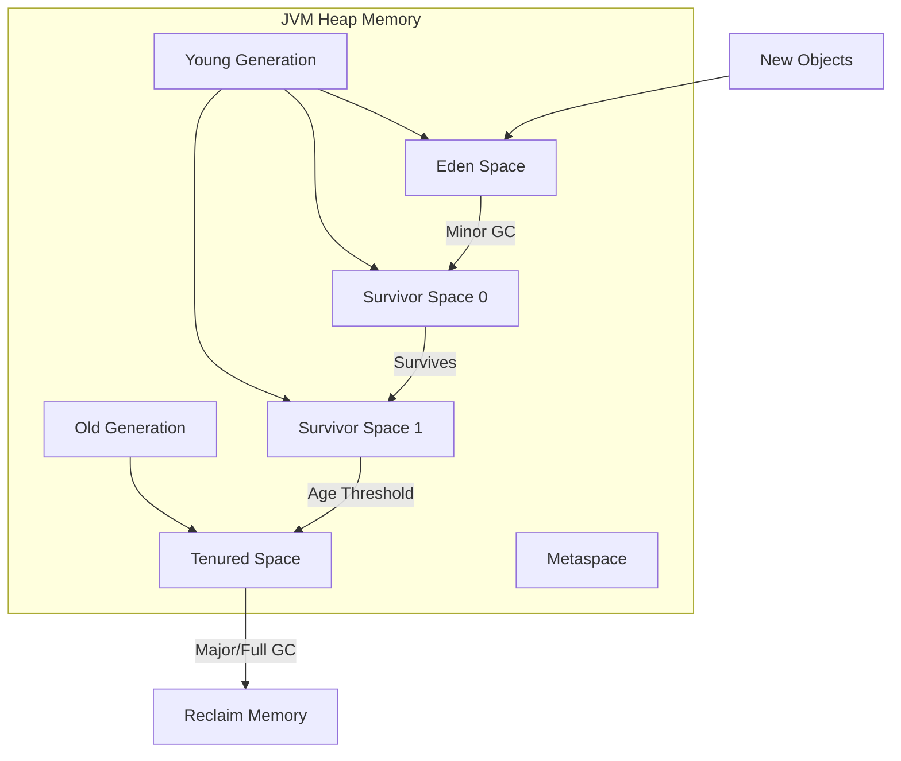
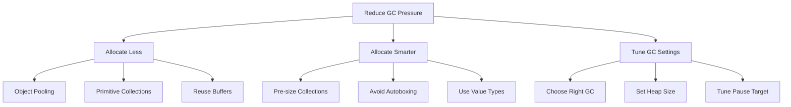

# How to Fix "Garbage Collection" Pauses

Author: [nawazdhandala](https://www.github.com/nawazdhandala)

Tags: JVM, Java, Go, Performance, Memory, Garbage Collection, Tuning, Backend

Description: Learn how to diagnose and fix garbage collection pauses that cause application latency spikes and performance degradation.

---

Garbage collection pauses are a common source of latency spikes in managed language runtimes like Java, Go, and .NET. During a GC pause, your application stops responding while the runtime reclaims unused memory. A poorly tuned application might experience pauses of hundreds of milliseconds or even seconds, causing request timeouts and degraded user experience. This guide covers how to diagnose GC issues and implement fixes that reduce pause times dramatically.

## Understanding Garbage Collection

Modern garbage collectors divide memory into generations based on object lifetime. Most objects die young, so collecting the young generation frequently is efficient.



| GC Type | Scope | Typical Duration | Frequency |
|---------|-------|------------------|-----------|
| Minor GC | Young generation only | 10-50ms | Frequent |
| Major GC | Old generation | 100-500ms | Less frequent |
| Full GC | Entire heap | 500ms-several seconds | Rare (ideally) |

## Diagnosing GC Issues

### Enable GC Logging (Java)

```bash
# Java 11+ GC logging
java -Xlog:gc*:file=gc.log:time,uptime,level,tags \
     -Xlog:gc+heap=debug \
     -Xlog:safepoint \
     -jar myapp.jar

# Java 8 GC logging
java -XX:+PrintGCDetails \
     -XX:+PrintGCDateStamps \
     -XX:+PrintGCTimeStamps \
     -Xloggc:gc.log \
     -jar myapp.jar
```

### Analyze GC Logs

Look for patterns in your GC logs:

```
# Healthy GC pattern - short, frequent minor GCs
[0.234s] GC(0) Pause Young (Normal) 24M->8M(256M) 12.345ms
[0.456s] GC(1) Pause Young (Normal) 32M->10M(256M) 15.678ms

# Problematic pattern - long Full GC pauses
[45.678s] GC(42) Pause Full (Allocation Failure) 2048M->1800M(2048M) 4523.456ms
```

### Key Metrics to Monitor

```java
import java.lang.management.GarbageCollectorMXBean;
import java.lang.management.ManagementFactory;

public class GCMetrics {
    public static void printGCStats() {
        for (GarbageCollectorMXBean gc : ManagementFactory.getGarbageCollectorMXBeans()) {
            System.out.printf("GC: %s%n", gc.getName());
            System.out.printf("  Collections: %d%n", gc.getCollectionCount());
            System.out.printf("  Total time: %d ms%n", gc.getCollectionTime());

            if (gc.getCollectionCount() > 0) {
                double avgPause = (double) gc.getCollectionTime() / gc.getCollectionCount();
                System.out.printf("  Average pause: %.2f ms%n", avgPause);
            }
        }
    }
}
```

### Go Runtime Metrics

```go
package main

import (
    "fmt"
    "runtime"
    "time"
)

func monitorGC() {
    var stats runtime.MemStats

    for {
        runtime.ReadMemStats(&stats)

        fmt.Printf("Heap Alloc: %d MB\n", stats.HeapAlloc/1024/1024)
        fmt.Printf("Heap Sys: %d MB\n", stats.HeapSys/1024/1024)
        fmt.Printf("Num GC: %d\n", stats.NumGC)
        fmt.Printf("Last GC Pause: %v\n", time.Duration(stats.PauseNs[(stats.NumGC+255)%256]))
        fmt.Printf("Total GC Pause: %v\n", time.Duration(stats.PauseTotalNs))
        fmt.Println("---")

        time.Sleep(10 * time.Second)
    }
}
```

## JVM GC Tuning

### Choose the Right Garbage Collector

```bash
# G1GC - Good default for most applications (Java 9+ default)
java -XX:+UseG1GC \
     -XX:MaxGCPauseMillis=200 \
     -XX:G1HeapRegionSize=16m \
     -jar myapp.jar

# ZGC - Ultra-low latency (<10ms pauses), Java 15+
java -XX:+UseZGC \
     -XX:+ZGenerational \
     -jar myapp.jar

# Shenandoah - Low latency alternative
java -XX:+UseShenandoahGC \
     -jar myapp.jar
```

### Heap Sizing

```bash
# Set initial and maximum heap size equal to avoid resize pauses
java -Xms4g -Xmx4g \
     -XX:+UseG1GC \
     -jar myapp.jar

# For containers, use percentage-based sizing
java -XX:InitialRAMPercentage=75.0 \
     -XX:MaxRAMPercentage=75.0 \
     -XX:+UseG1GC \
     -jar myapp.jar
```

### G1GC Tuning

```bash
java -XX:+UseG1GC \
     # Target max pause time
     -XX:MaxGCPauseMillis=100 \
     # Region size (1-32MB, power of 2)
     -XX:G1HeapRegionSize=16m \
     # Increase parallel GC threads
     -XX:ParallelGCThreads=8 \
     # Concurrent GC threads (usually ParallelGCThreads/4)
     -XX:ConcGCThreads=2 \
     # Start marking when heap is 45% full
     -XX:InitiatingHeapOccupancyPercent=45 \
     -jar myapp.jar
```

## Reducing Object Allocation

The best way to reduce GC pressure is to allocate fewer objects.

### Object Pooling

```java
import java.util.concurrent.ArrayBlockingQueue;

public class ObjectPool<T> {
    private final ArrayBlockingQueue<T> pool;
    private final ObjectFactory<T> factory;

    public interface ObjectFactory<T> {
        T create();
        void reset(T object);
    }

    public ObjectPool(int size, ObjectFactory<T> factory) {
        this.pool = new ArrayBlockingQueue<>(size);
        this.factory = factory;

        // Pre-populate pool
        for (int i = 0; i < size; i++) {
            pool.offer(factory.create());
        }
    }

    public T borrow() {
        T object = pool.poll();
        return object != null ? object : factory.create();
    }

    public void release(T object) {
        factory.reset(object);
        pool.offer(object);  // Returns false if full, object will be GC'd
    }
}

// Usage for expensive objects like byte buffers
ObjectPool<ByteBuffer> bufferPool = new ObjectPool<>(100, new ObjectFactory<>() {
    public ByteBuffer create() {
        return ByteBuffer.allocate(8192);
    }

    public void reset(ByteBuffer buffer) {
        buffer.clear();
    }
});

ByteBuffer buffer = bufferPool.borrow();
try {
    // Use buffer
} finally {
    bufferPool.release(buffer);
}
```

### Avoid Autoboxing

```java
// BAD: Creates Integer objects
public int sumValues(List<Integer> values) {
    int sum = 0;
    for (Integer value : values) {  // Unboxing for each element
        sum += value;
    }
    return sum;
}

// GOOD: Use primitive collections (Eclipse Collections, Trove, etc.)
import org.eclipse.collections.impl.list.mutable.primitive.IntArrayList;

public int sumValues(IntArrayList values) {
    int sum = 0;
    for (int i = 0; i < values.size(); i++) {
        sum += values.get(i);  // No boxing/unboxing
    }
    return sum;
}
```

### Reuse StringBuilder

```java
// BAD: Creates new StringBuilder each call
public String formatMessage(String name, int count) {
    return "User " + name + " has " + count + " items";  // Multiple allocations
}

// GOOD: Reuse StringBuilder (thread-local for thread safety)
private static final ThreadLocal<StringBuilder> STRING_BUILDER =
    ThreadLocal.withInitial(() -> new StringBuilder(256));

public String formatMessage(String name, int count) {
    StringBuilder sb = STRING_BUILDER.get();
    sb.setLength(0);  // Reset without reallocating
    sb.append("User ").append(name).append(" has ").append(count).append(" items");
    return sb.toString();
}
```

## Go GC Tuning

### GOGC Environment Variable

```bash
# Default is 100 (GC when heap doubles)
# Higher value = less frequent GC, more memory usage
export GOGC=200

# Or set in code
import "runtime/debug"

func init() {
    // Set GC target percentage
    debug.SetGCPercent(200)
}
```

### Memory Limit (Go 1.19+)

```go
import "runtime/debug"

func init() {
    // Hard memory limit - GC becomes more aggressive near limit
    debug.SetMemoryLimit(4 * 1024 * 1024 * 1024)  // 4GB
}
```

### Reduce Allocations in Go

```go
// BAD: Allocates new slice every call
func processItems(items []Item) []Result {
    results := make([]Result, 0)  // Grows and reallocates
    for _, item := range items {
        results = append(results, process(item))
    }
    return results
}

// GOOD: Pre-allocate with known capacity
func processItems(items []Item) []Result {
    results := make([]Result, 0, len(items))  // Pre-sized
    for _, item := range items {
        results = append(results, process(item))
    }
    return results
}

// BETTER: Use sync.Pool for frequently allocated objects
var resultPool = sync.Pool{
    New: func() interface{} {
        return make([]Result, 0, 1000)
    },
}

func processItems(items []Item) []Result {
    results := resultPool.Get().([]Result)
    results = results[:0]  // Reset length, keep capacity

    for _, item := range items {
        results = append(results, process(item))
    }

    // Copy results before returning to pool
    output := make([]Result, len(results))
    copy(output, results)

    resultPool.Put(results)
    return output
}
```

## GC-Friendly Patterns



## Monitoring GC in Production

### Prometheus Metrics (Java)

```java
import io.micrometer.core.instrument.MeterRegistry;
import io.micrometer.core.instrument.binder.jvm.JvmGcMetrics;
import io.micrometer.core.instrument.binder.jvm.JvmMemoryMetrics;

public class MetricsConfig {
    public void configureMetrics(MeterRegistry registry) {
        // JVM GC metrics
        new JvmGcMetrics().bindTo(registry);

        // JVM memory metrics
        new JvmMemoryMetrics().bindTo(registry);
    }
}
```

Key metrics to alert on:

| Metric | Warning Threshold | Critical Threshold |
|--------|------------------|-------------------|
| GC pause time (p99) | >200ms | >500ms |
| GC pause time (max) | >500ms | >1s |
| Time spent in GC | >5% | >10% |
| Full GC frequency | >1/hour | >1/10min |

### Prometheus Metrics (Go)

```go
import (
    "github.com/prometheus/client_golang/prometheus"
    "github.com/prometheus/client_golang/prometheus/promauto"
    "runtime"
)

var (
    gcPauseHistogram = promauto.NewHistogram(prometheus.HistogramOpts{
        Name:    "go_gc_pause_seconds",
        Help:    "GC pause duration",
        Buckets: []float64{.001, .005, .01, .025, .05, .1, .25, .5, 1},
    })
)

func recordGCMetrics() {
    var stats runtime.MemStats
    var lastNumGC uint32

    for {
        runtime.ReadMemStats(&stats)

        // Record new GC pauses
        for i := lastNumGC; i < stats.NumGC; i++ {
            pause := stats.PauseNs[i%256]
            gcPauseHistogram.Observe(float64(pause) / 1e9)
        }
        lastNumGC = stats.NumGC

        time.Sleep(time.Second)
    }
}
```

## Summary

Fixing GC pauses requires a combination of approaches:

1. **Profile first** - Enable GC logging and identify the actual problem
2. **Choose the right GC** - ZGC/Shenandoah for low latency, G1 for balanced workloads
3. **Size your heap properly** - Too small causes frequent GC, too large causes long pauses
4. **Reduce allocations** - Pool objects, use primitives, pre-size collections
5. **Monitor continuously** - Track GC metrics and alert on anomalies

For most applications, switching to a modern low-pause collector (ZGC, Shenandoah) and ensuring adequate heap size will solve GC pause issues. For high-throughput systems, reducing allocation rate through object pooling and careful coding practices provides the biggest improvements.
