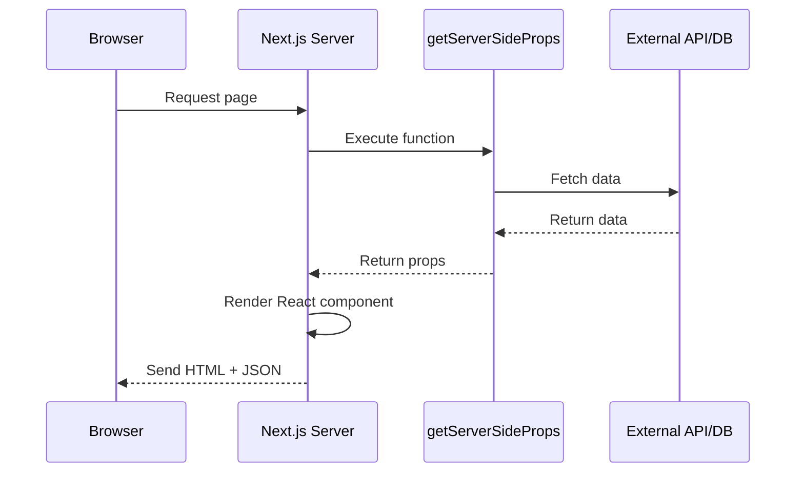
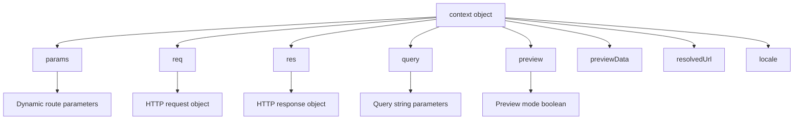
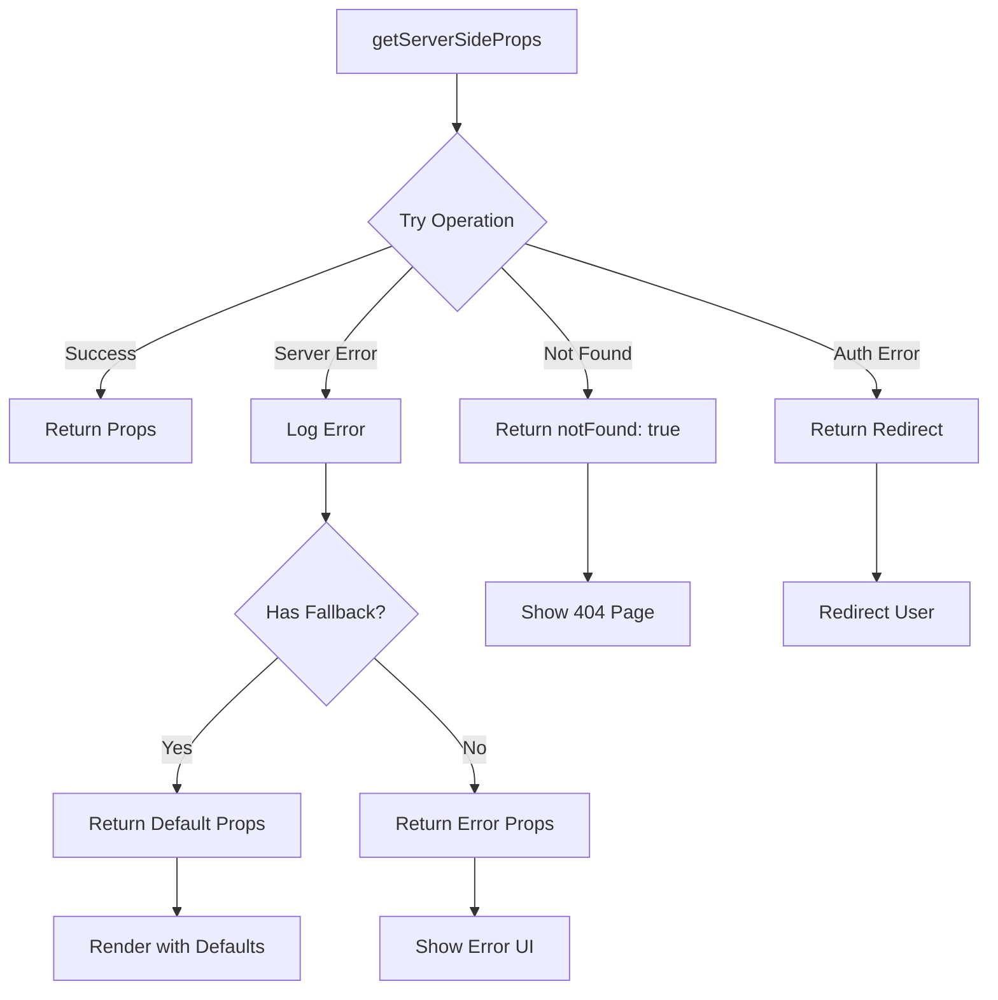

# How to Fix "getServerSideProps" Errors in Next.js

Author: [nawazdhandala](https://www.github.com/nawazdhandala)

Tags: Next.js, Server-Side Rendering, SSR, JavaScript, React, Debugging, Web Development

Description: A comprehensive guide to diagnosing and fixing common getServerSideProps errors in Next.js applications.

---

## Introduction

`getServerSideProps` is one of Next.js's most powerful features for server-side rendering (SSR). It allows you to fetch data on each request and pre-render pages with dynamic content. However, developers often encounter errors when implementing this function. This guide covers the most common issues and provides practical solutions.

## Understanding getServerSideProps

Before diving into error fixes, let's understand how `getServerSideProps` fits into the Next.js request lifecycle.



## Common Errors and Solutions

### Error 1: "getServerSideProps" is not a function

This error occurs when the function is not properly exported or has a typo.

```javascript
// Wrong: Not exported as a named export
// pages/products.js
const getServerSideProps = async () => {
  return { props: {} };
};

// Correct: Must be exported as a named export
// pages/products.js
export async function getServerSideProps(context) {
  // Fetch data from an API
  const response = await fetch('https://api.example.com/products');
  const products = await response.json();

  return {
    props: {
      products,
    },
  };
}

export default function ProductsPage({ products }) {
  return (
    <div>
      {products.map((product) => (
        <div key={product.id}>{product.name}</div>
      ))}
    </div>
  );
}
```

### Error 2: Returning Invalid Props

The `props` object must be serializable. You cannot return functions, `undefined`, or circular references.

```javascript
// Wrong: Returning non-serializable data
export async function getServerSideProps() {
  return {
    props: {
      // Error: Date objects are not serializable
      createdAt: new Date(),
      // Error: Functions cannot be serialized
      onClick: () => console.log('clicked'),
      // Error: undefined values cause issues
      maybeData: undefined,
    },
  };
}

// Correct: Return only serializable data
export async function getServerSideProps() {
  const createdAt = new Date();

  return {
    props: {
      // Convert Date to ISO string
      createdAt: createdAt.toISOString(),
      // Remove functions entirely
      // Handle undefined by providing defaults or removing
      maybeData: null,
    },
  };
}
```

### Error 3: Using Client-Side APIs

Server-side code cannot access browser APIs like `window`, `document`, or `localStorage`.

```javascript
// Wrong: Using window on the server
export async function getServerSideProps() {
  // Error: window is not defined
  const token = window.localStorage.getItem('token');

  return {
    props: { token },
  };
}

// Correct: Use cookies or headers from the request context
export async function getServerSideProps(context) {
  // Access cookies from the request
  const { req } = context;
  const cookies = req.cookies;
  const token = cookies.authToken || null;

  // Or parse cookies manually
  const cookieHeader = req.headers.cookie || '';

  return {
    props: {
      token,
    },
  };
}
```

### Error 4: Async/Await Issues

Forgetting to await async operations leads to unresolved promises in props.

```javascript
// Wrong: Missing await
export async function getServerSideProps() {
  // This returns a Promise, not the actual data
  const data = fetch('https://api.example.com/data').then(res => res.json());

  return {
    props: {
      // Error: Passing a Promise instead of resolved data
      data,
    },
  };
}

// Correct: Properly await all async operations
export async function getServerSideProps() {
  try {
    const response = await fetch('https://api.example.com/data');

    // Check if the response is ok
    if (!response.ok) {
      throw new Error(`HTTP error! status: ${response.status}`);
    }

    const data = await response.json();

    return {
      props: {
        data,
      },
    };
  } catch (error) {
    console.error('Error fetching data:', error);

    return {
      props: {
        data: null,
        error: 'Failed to fetch data',
      },
    };
  }
}
```

### Error 5: Context Parameter Issues

The `context` parameter provides request information. Misusing it causes errors.



```javascript
// Example: Using context correctly
// pages/posts/[id].js
export async function getServerSideProps(context) {
  // Extract parameters from context
  const { params, query, req, res } = context;

  // Dynamic route parameter
  const postId = params.id;

  // Query string parameters (e.g., ?page=2)
  const page = query.page || '1';

  // Access request headers
  const userAgent = req.headers['user-agent'];

  // You can set response headers
  res.setHeader('Cache-Control', 'public, s-maxage=60, stale-while-revalidate=300');

  // Fetch the post
  const response = await fetch(`https://api.example.com/posts/${postId}?page=${page}`);
  const post = await response.json();

  // Handle not found
  if (!post) {
    return {
      notFound: true,
    };
  }

  return {
    props: {
      post,
      page: parseInt(page, 10),
    },
  };
}
```

### Error 6: Redirect Issues

Returning redirects incorrectly causes runtime errors.

```javascript
// Wrong: Invalid redirect format
export async function getServerSideProps(context) {
  const { req } = context;
  const isAuthenticated = checkAuth(req);

  if (!isAuthenticated) {
    // Error: Missing required properties
    return {
      redirect: '/login',
    };
  }

  return { props: {} };
}

// Correct: Proper redirect format
export async function getServerSideProps(context) {
  const { req } = context;
  const isAuthenticated = await checkAuth(req);

  if (!isAuthenticated) {
    return {
      redirect: {
        destination: '/login',
        // permanent: false means 307 status code (temporary redirect)
        // permanent: true means 308 status code (permanent redirect)
        permanent: false,
      },
    };
  }

  // You can also redirect with query parameters
  const user = await getUser(req);
  if (user.needsOnboarding) {
    return {
      redirect: {
        destination: `/onboarding?userId=${user.id}`,
        permanent: false,
      },
    };
  }

  return {
    props: {
      user,
    },
  };
}
```

### Error 7: Environment Variable Issues

Server-side environment variables must be configured correctly.

```javascript
// Wrong: Using NEXT_PUBLIC_ prefix for server-only secrets
// .env.local
// NEXT_PUBLIC_DATABASE_URL=postgresql://... (EXPOSED TO CLIENT!)

// Correct: Use non-prefixed variables for server-side secrets
// .env.local
// DATABASE_URL=postgresql://...

export async function getServerSideProps() {
  // Server-side environment variables (no NEXT_PUBLIC_ prefix)
  const databaseUrl = process.env.DATABASE_URL;
  const apiSecret = process.env.API_SECRET;

  // These are available on the server
  console.log('Database URL exists:', !!databaseUrl);

  // Connect to database
  const db = await connectToDatabase(databaseUrl);
  const data = await db.query('SELECT * FROM posts');

  return {
    props: {
      // Never expose sensitive data to the client
      posts: data,
      // Wrong: Don't do this
      // databaseUrl: databaseUrl,
    },
  };
}
```

## Error Handling Best Practices



```javascript
// Comprehensive error handling pattern
export async function getServerSideProps(context) {
  const { params, req } = context;

  try {
    // Validate parameters
    if (!params.id || isNaN(parseInt(params.id, 10))) {
      return {
        notFound: true,
      };
    }

    // Check authentication
    const session = await getSession(req);
    if (!session) {
      return {
        redirect: {
          destination: '/login?returnUrl=' + encodeURIComponent(context.resolvedUrl),
          permanent: false,
        },
      };
    }

    // Fetch data with timeout
    const controller = new AbortController();
    const timeoutId = setTimeout(() => controller.abort(), 5000);

    const response = await fetch(
      `${process.env.API_URL}/posts/${params.id}`,
      {
        headers: {
          'Authorization': `Bearer ${session.accessToken}`,
        },
        signal: controller.signal,
      }
    );

    clearTimeout(timeoutId);

    if (response.status === 404) {
      return {
        notFound: true,
      };
    }

    if (!response.ok) {
      throw new Error(`API error: ${response.status}`);
    }

    const post = await response.json();

    return {
      props: {
        post,
        user: session.user,
      },
    };

  } catch (error) {
    // Log the error for debugging
    console.error('getServerSideProps error:', error);

    // Check for specific error types
    if (error.name === 'AbortError') {
      return {
        props: {
          error: 'Request timed out. Please try again.',
          post: null,
        },
      };
    }

    // Return error state for the component to handle
    return {
      props: {
        error: 'An error occurred while loading the page.',
        post: null,
      },
    };
  }
}
```

## Debugging Tips

### Enable Detailed Logging

```javascript
// Add detailed logging for debugging
export async function getServerSideProps(context) {
  const startTime = Date.now();

  console.log('[GSSP] Starting execution', {
    url: context.resolvedUrl,
    params: context.params,
    query: context.query,
  });

  try {
    const data = await fetchData();

    console.log('[GSSP] Data fetched successfully', {
      duration: Date.now() - startTime,
      dataSize: JSON.stringify(data).length,
    });

    return { props: { data } };

  } catch (error) {
    console.error('[GSSP] Error occurred', {
      duration: Date.now() - startTime,
      error: error.message,
      stack: error.stack,
    });

    return { props: { error: error.message } };
  }
}
```

### Check Server Logs

When debugging `getServerSideProps` errors, always check your terminal running the Next.js development server. All `console.log` statements from server-side code appear there, not in the browser console.

## Summary

Fixing `getServerSideProps` errors requires understanding that this function runs exclusively on the server. Key points to remember:

1. Always export the function as a named export
2. Return only serializable data in props
3. Never use browser APIs like `window` or `localStorage`
4. Properly await all async operations
5. Use the context parameter correctly for accessing request data
6. Format redirects with `destination` and `permanent` properties
7. Handle errors gracefully with try-catch blocks
8. Use environment variables without the `NEXT_PUBLIC_` prefix for secrets

By following these patterns and understanding the server-side execution context, you can effectively debug and resolve `getServerSideProps` errors in your Next.js applications.
