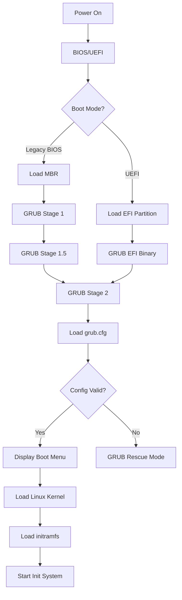
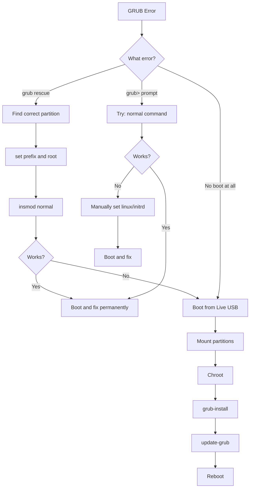

# How to Fix 'GRUB Boot Loader' Errors

Author: [nawazdhandala](https://www.github.com/nawazdhandala)

Tags: Linux, GRUB, Boot Loader, System Recovery, Troubleshooting, System Administration

Description: Learn how to diagnose and fix common GRUB boot loader errors including rescue mode, missing OS, and configuration issues.

---

GRUB (GRand Unified Bootloader) is the default boot loader for most Linux distributions. When GRUB fails, your system cannot boot. This guide covers common GRUB errors and step-by-step recovery procedures.

## Understanding GRUB Boot Process



## Common GRUB Errors

### Error: "grub rescue>"

This appears when GRUB cannot find its configuration or modules.

```text
error: unknown filesystem.
grub rescue>
```

### Error: "error: no such partition"

GRUB cannot find the partition containing the kernel or configuration.

```text
error: no such partition.
grub rescue>
```

### Error: "minimal BASH-like line editing is supported"

You see the GRUB command line instead of the boot menu.

```text
GRUB loading.
Welcome to GRUB!
grub>
```

### Error: "error: file not found"

GRUB cannot find the kernel or initramfs.

```text
error: file '/boot/vmlinuz-5.15.0-generic' not found.
```

## Recovery from GRUB Rescue Mode

### Step 1: Find Your Partitions

```bash
# List available partitions
grub rescue> ls
(hd0) (hd0,msdos1) (hd0,msdos2) (hd0,msdos5)

# For GPT disks
(hd0) (hd0,gpt1) (hd0,gpt2) (hd0,gpt3)
```

### Step 2: Find the Partition with Linux

```bash
# Check each partition for Linux filesystem
grub rescue> ls (hd0,msdos1)/
# If you see "unknown filesystem", try the next partition

grub rescue> ls (hd0,msdos2)/
# Look for: boot/ etc/ home/ root/ usr/ var/

grub rescue> ls (hd0,msdos2)/boot/
# Should show: vmlinuz-* initrd.img-* grub/
```

### Step 3: Set Root and Load Modules

```bash
# Set the root partition (replace with your correct partition)
grub rescue> set prefix=(hd0,msdos2)/boot/grub
grub rescue> set root=(hd0,msdos2)

# Load the normal module
grub rescue> insmod normal

# Start normal mode
grub rescue> normal
```

### Step 4: Boot Manually (if normal mode fails)

```bash
# Load required modules
grub rescue> insmod linux
grub rescue> insmod ext2  # or ext4, xfs, btrfs depending on filesystem

# Set kernel and initrd (adjust version numbers)
grub rescue> linux /boot/vmlinuz-5.15.0-generic root=/dev/sda2
grub rescue> initrd /boot/initrd.img-5.15.0-generic

# Boot
grub rescue> boot
```

## Recovery Using Live USB

### Step 1: Boot from Live USB

Boot your system from a Linux live USB (Ubuntu, Fedora, etc.).

### Step 2: Identify Partitions

```bash
# List all partitions
sudo fdisk -l

# Or use lsblk for a cleaner view
lsblk -f

# Example output:
# NAME   FSTYPE LABEL  MOUNTPOINT
# sda
# |-sda1 vfat   EFI
# |-sda2 ext4   root
# |-sda3 swap   swap
```

### Step 3: Mount the Root Partition

```bash
# Mount root partition
sudo mount /dev/sda2 /mnt

# If you have a separate boot partition, mount it too
sudo mount /dev/sda1 /mnt/boot

# For UEFI systems, mount EFI partition
sudo mount /dev/sda1 /mnt/boot/efi
```

### Step 4: Mount System Directories

```bash
# Mount required virtual filesystems
sudo mount --bind /dev /mnt/dev
sudo mount --bind /dev/pts /mnt/dev/pts
sudo mount --bind /proc /mnt/proc
sudo mount --bind /sys /mnt/sys

# For UEFI systems
sudo mount --bind /sys/firmware/efi/efivars /mnt/sys/firmware/efi/efivars
```

### Step 5: Chroot into System

```bash
# Enter the chroot environment
sudo chroot /mnt /bin/bash
```

### Step 6: Reinstall GRUB

```bash
# For Legacy BIOS systems
grub-install /dev/sda
update-grub

# For UEFI systems
grub-install --target=x86_64-efi --efi-directory=/boot/efi --bootloader-id=ubuntu
update-grub
```

### Step 7: Exit and Reboot

```bash
# Exit chroot
exit

# Unmount filesystems
sudo umount -R /mnt

# Reboot
sudo reboot
```

## Fixing Specific GRUB Issues

### Fix Missing GRUB Configuration

```bash
# Regenerate GRUB configuration
sudo update-grub

# Or manually
sudo grub-mkconfig -o /boot/grub/grub.cfg

# Check the generated config
cat /boot/grub/grub.cfg | grep menuentry
```

### Fix Incorrect Root UUID

```bash
# Find correct UUID
sudo blkid

# Output example:
# /dev/sda2: UUID="abc123-def456" TYPE="ext4"

# Edit GRUB config if needed
sudo nano /etc/default/grub

# Regenerate configuration
sudo update-grub
```

### Fix GRUB After Windows Installation

Windows often overwrites the MBR, removing GRUB.

```bash
# Boot from Live USB, then:
sudo mount /dev/sda2 /mnt
sudo mount --bind /dev /mnt/dev
sudo mount --bind /proc /mnt/proc
sudo mount --bind /sys /mnt/sys

# Chroot and reinstall GRUB
sudo chroot /mnt
grub-install /dev/sda
update-grub
exit
```

### Fix GRUB on Dual-Boot Systems

```bash
# Detect other operating systems
sudo os-prober

# If os-prober is disabled, enable it
sudo nano /etc/default/grub
# Add or modify: GRUB_DISABLE_OS_PROBER=false

# Regenerate GRUB config
sudo update-grub
```

## GRUB Configuration

### Default Configuration File

The main configuration is in `/etc/default/grub`:

```bash
# Default boot entry (0 = first entry)
GRUB_DEFAULT=0

# Timeout before auto-boot (seconds)
GRUB_TIMEOUT=5

# Timeout style (menu, countdown, hidden)
GRUB_TIMEOUT_STYLE=menu

# Kernel command line parameters
GRUB_CMDLINE_LINUX_DEFAULT="quiet splash"

# Additional kernel parameters
GRUB_CMDLINE_LINUX=""

# Enable os-prober for dual boot
GRUB_DISABLE_OS_PROBER=false
```

### Apply Configuration Changes

```bash
# After editing /etc/default/grub, regenerate config
sudo update-grub

# Verify changes
grep -E "timeout|default" /boot/grub/grub.cfg
```

### Set Default Boot Entry

```bash
# List available menu entries
grep -E "^menuentry" /boot/grub/grub.cfg

# Set default by name
sudo grub-set-default "Ubuntu"

# Or by number (0-indexed)
sudo grub-set-default 0

# Set to boot last selected entry
# Edit /etc/default/grub:
GRUB_DEFAULT=saved
GRUB_SAVEDEFAULT=true

# Regenerate
sudo update-grub
```

## GRUB Boot Architecture

```mermaid
flowchart TD
    subgraph "BIOS/Legacy Boot"
        A1[MBR 512 bytes] --> A2[GRUB Stage 1.5]
        A2 --> A3[GRUB Stage 2]
        A3 --> A4[/boot/grub/grub.cfg]
    end

    subgraph "UEFI Boot"
        B1[EFI System Partition] --> B2[/EFI/ubuntu/grubx64.efi]
        B2 --> B3[/boot/grub/grub.cfg]
    end

    A4 --> C[Load Kernel + initramfs]
    B3 --> C
    C --> D[Boot Linux]
```

## Backup and Restore GRUB

### Backup GRUB

```bash
# Backup GRUB configuration
sudo cp -r /boot/grub /boot/grub.backup

# Backup MBR (for Legacy BIOS)
sudo dd if=/dev/sda of=/root/mbr-backup.img bs=512 count=1

# Backup EFI files (for UEFI)
sudo cp -r /boot/efi/EFI /root/efi-backup
```

### Restore GRUB from Backup

```bash
# Restore GRUB configuration
sudo cp -r /boot/grub.backup/* /boot/grub/

# Restore MBR (for Legacy BIOS)
sudo dd if=/root/mbr-backup.img of=/dev/sda bs=512 count=1

# Reinstall GRUB to be safe
sudo grub-install /dev/sda
```

## GRUB Command Line Reference

When you land at the `grub>` prompt, these commands help:

```bash
# List devices and partitions
grub> ls

# List files in a partition
grub> ls (hd0,msdos1)/

# Set root partition
grub> set root=(hd0,msdos2)

# Check current root
grub> echo $root

# Load a module
grub> insmod ext2

# Set kernel
grub> linux /boot/vmlinuz-5.15.0 root=/dev/sda2

# Set initrd
grub> initrd /boot/initrd.img-5.15.0

# Boot the system
grub> boot

# Enter normal mode
grub> normal

# Get help
grub> help
```

## Recovery Boot Parameters

### Boot to Single User Mode

From GRUB menu, press `e` to edit, then add to the linux line:

```bash
linux /boot/vmlinuz-5.15.0 root=/dev/sda2 single
# or
linux /boot/vmlinuz-5.15.0 root=/dev/sda2 init=/bin/bash
```

### Boot with Recovery Options

```bash
# Verbose boot (see all messages)
linux /boot/vmlinuz-5.15.0 root=/dev/sda2 nosplash

# Skip broken graphics
linux /boot/vmlinuz-5.15.0 root=/dev/sda2 nomodeset

# Emergency mode
linux /boot/vmlinuz-5.15.0 root=/dev/sda2 systemd.unit=emergency.target
```

## UEFI-Specific Issues

### Repair UEFI Boot Entry

```bash
# List current UEFI boot entries
efibootmgr -v

# Add new GRUB entry
sudo efibootmgr --create --disk /dev/sda --part 1 \
    --label "Ubuntu" --loader "\EFI\ubuntu\grubx64.efi"

# Set boot order
sudo efibootmgr --bootorder 0001,0002,0003

# Delete broken entry
sudo efibootmgr --delete-bootnum --bootnum 0005
```

### Rebuild EFI Directory

```bash
# Reinstall GRUB for UEFI
sudo grub-install --target=x86_64-efi \
    --efi-directory=/boot/efi \
    --bootloader-id=ubuntu \
    --recheck

# Install to fallback path (some systems need this)
sudo grub-install --target=x86_64-efi \
    --efi-directory=/boot/efi \
    --removable
```

## Troubleshooting Flowchart



## Prevention Tips

### Regular GRUB Maintenance

```bash
# Keep GRUB updated
sudo apt update && sudo apt upgrade grub-pc  # Debian/Ubuntu
sudo dnf update grub2  # Fedora

# Clean old kernels (keeps boot partition clean)
sudo apt autoremove --purge

# Verify GRUB after kernel updates
sudo update-grub
```

### Create Recovery USB

```bash
# Install Super Grub2 Disk or use your distro's live USB
# Keep it accessible for emergencies

# Download Super Grub2 Disk
# https://www.supergrubdisk.org/
```

### Document Your Setup

```bash
# Save partition info
sudo fdisk -l > /root/partition-info.txt
sudo blkid >> /root/partition-info.txt
lsblk -f >> /root/partition-info.txt

# Save GRUB config
cp /etc/default/grub /root/grub-default-backup
```

## Quick Reference

```bash
# Reinstall GRUB (Legacy BIOS)
sudo grub-install /dev/sda
sudo update-grub

# Reinstall GRUB (UEFI)
sudo grub-install --target=x86_64-efi --efi-directory=/boot/efi
sudo update-grub

# Boot to recovery from GRUB menu
# Press 'e' on menu entry, add 'single' or 'init=/bin/bash'

# Find partition from grub rescue
grub rescue> ls
grub rescue> ls (hd0,msdos1)/

# Set root and boot
grub rescue> set root=(hd0,msdos2)
grub rescue> set prefix=(hd0,msdos2)/boot/grub
grub rescue> insmod normal
grub rescue> normal
```

---

GRUB errors can be intimidating, but they are usually fixable with a live USB and the right commands. The key is understanding whether you are on a BIOS or UEFI system and knowing which partition contains your Linux installation. Keep a recovery USB handy and document your partition layout before problems occur.
