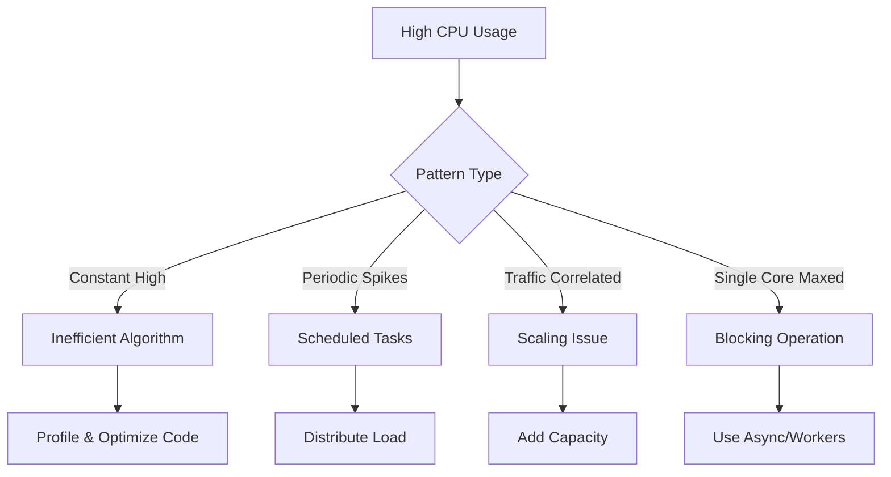
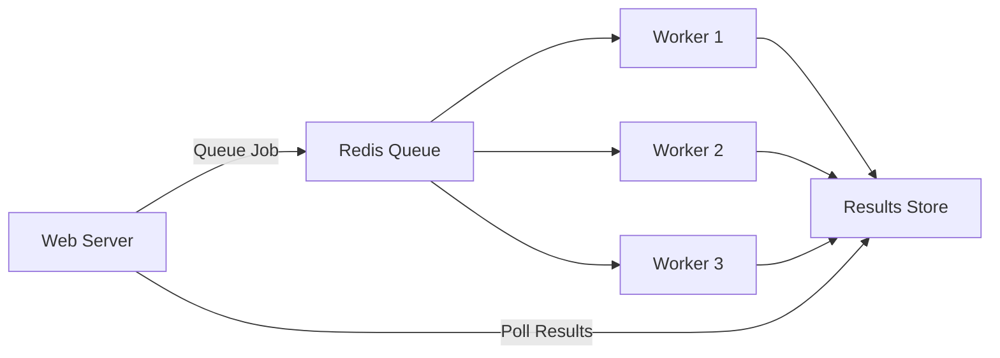

# How to Fix 'High CPU Usage' Issues

Author: [nawazdhandala](https://www.github.com/nawazdhandala)

Tags: Performance, CPU, Debugging, Profiling, Node.js, Python, Linux, Optimization

Description: A practical guide to diagnosing and fixing high CPU usage in production applications with profiling techniques and optimization strategies.

---

High CPU usage can cause slow response times, increased infrastructure costs, and degraded user experience. Unlike memory issues that build up gradually, CPU spikes can appear suddenly and bring down your system. In this guide, we will walk through practical techniques to diagnose and fix CPU issues.

## Understanding CPU Usage Patterns

CPU issues typically fall into these categories:



## Step 1: Identify the Problem

### System-Level Diagnosis

```bash
# Check overall CPU usage
top -b -n 1 | head -20

# See CPU usage per core
mpstat -P ALL 1 5

# Find top CPU-consuming processes
ps aux --sort=-%cpu | head -10

# Watch process CPU usage over time
pidstat -p <PID> 1

# Check if CPU is waiting on I/O
iostat -x 1 5
```

### Understanding CPU Metrics

| Metric | What It Means | Healthy Range |
|--------|--------------|---------------|
| %user | Time in user space (your code) | < 70% |
| %system | Time in kernel (system calls) | < 30% |
| %iowait | Waiting for I/O | < 20% |
| %idle | Doing nothing | > 20% |
| Load average | Queue of processes waiting | < CPU cores |

### Application-Level Profiling

```javascript
// cpu-profiler.js
// Node.js CPU profiling

const v8Profiler = require('v8-profiler-next');
const fs = require('fs');

class CPUProfiler {
    constructor() {
        this.profileId = 0;
    }

    startProfiling(title = 'cpu-profile') {
        const id = `${title}-${++this.profileId}`;
        v8Profiler.startProfiling(id, true);
        console.log(`Started CPU profiling: ${id}`);
        return id;
    }

    stopProfiling(id) {
        const profile = v8Profiler.stopProfiling(id);

        return new Promise((resolve, reject) => {
            const filename = `/tmp/${id}-${Date.now()}.cpuprofile`;

            profile.export((error, result) => {
                if (error) {
                    reject(error);
                    return;
                }

                fs.writeFileSync(filename, result);
                profile.delete();

                console.log(`CPU profile saved: ${filename}`);
                resolve(filename);
            });
        });
    }

    // Profile a specific function
    async profileFunction(fn, title = 'function-profile') {
        const id = this.startProfiling(title);

        try {
            const result = await fn();
            return result;
        } finally {
            await this.stopProfiling(id);
        }
    }
}

// Usage
const profiler = new CPUProfiler();

// Profile on demand via signal
process.on('SIGUSR1', async () => {
    console.log('Starting 30-second CPU profile...');
    const id = profiler.startProfiling('on-demand');

    setTimeout(async () => {
        await profiler.stopProfiling(id);
    }, 30000);
});

module.exports = { CPUProfiler };
```

### Python CPU Profiling

```python
# cpu_profiler.py
# Python CPU profiling utilities

import cProfile
import pstats
import io
from functools import wraps
import time

def profile_cpu(output_file=None):
    """Decorator to profile CPU usage of a function."""
    def decorator(func):
        @wraps(func)
        def wrapper(*args, **kwargs):
            profiler = cProfile.Profile()
            profiler.enable()

            try:
                result = func(*args, **kwargs)
                return result
            finally:
                profiler.disable()

                # Print stats
                stream = io.StringIO()
                stats = pstats.Stats(profiler, stream=stream)
                stats.sort_stats('cumulative')
                stats.print_stats(20)  # Top 20 functions

                print(f"\nCPU Profile for {func.__name__}:")
                print(stream.getvalue())

                # Save to file if specified
                if output_file:
                    stats.dump_stats(output_file)
                    print(f"Profile saved to: {output_file}")

        return wrapper
    return decorator

# Example usage
@profile_cpu(output_file='/tmp/process_data.prof')
def process_data(data):
    result = []
    for item in data:
        # Some CPU-intensive operation
        result.append(heavy_computation(item))
    return result

def heavy_computation(item):
    # Simulated heavy work
    total = 0
    for i in range(10000):
        total += i * item
    return total

# Using cProfile directly for scripts
if __name__ == '__main__':
    import sys

    if '--profile' in sys.argv:
        profiler = cProfile.Profile()
        profiler.enable()

        # Your main code here
        main()

        profiler.disable()
        profiler.dump_stats('/tmp/main.prof')

        # View with: python -m pstats /tmp/main.prof
```

## Step 2: Common CPU Issues and Fixes

### Issue 1: Inefficient Loops

```javascript
// bad-loop.js - O(n^2) complexity
function findDuplicates(array) {
    const duplicates = [];

    // BAD: Nested loop is O(n^2)
    for (let i = 0; i < array.length; i++) {
        for (let j = i + 1; j < array.length; j++) {
            if (array[i] === array[j]) {
                duplicates.push(array[i]);
            }
        }
    }

    return duplicates;
}

// good-loop.js - O(n) complexity
function findDuplicatesOptimized(array) {
    const seen = new Set();
    const duplicates = new Set();

    // GOOD: Single pass with Set lookup O(1)
    for (const item of array) {
        if (seen.has(item)) {
            duplicates.add(item);
        } else {
            seen.add(item);
        }
    }

    return Array.from(duplicates);
}

// Performance comparison
const testArray = Array.from({ length: 10000 }, () =>
    Math.floor(Math.random() * 1000)
);

console.time('O(n^2)');
findDuplicates(testArray);
console.timeEnd('O(n^2)');  // ~500ms

console.time('O(n)');
findDuplicatesOptimized(testArray);
console.timeEnd('O(n)');    // ~2ms
```

### Issue 2: Blocking the Event Loop

```javascript
// blocking-event-loop.js
// Problem: Synchronous CPU-heavy work blocks everything

const express = require('express');
const app = express();

// BAD: Blocks event loop
app.get('/compute-bad', (req, res) => {
    // This blocks ALL requests while computing
    const result = heavyComputation(req.query.n);
    res.json({ result });
});

function heavyComputation(n) {
    let result = 0;
    for (let i = 0; i < n; i++) {
        result += Math.sqrt(i) * Math.sin(i);
    }
    return result;
}

// GOOD: Use worker threads for CPU-intensive work
const { Worker, isMainThread, parentPort, workerData } = require('worker_threads');

app.get('/compute-good', async (req, res) => {
    try {
        const result = await runInWorker(parseInt(req.query.n));
        res.json({ result });
    } catch (error) {
        res.status(500).json({ error: error.message });
    }
});

function runInWorker(n) {
    return new Promise((resolve, reject) => {
        const worker = new Worker(__filename, {
            workerData: { n }
        });

        worker.on('message', resolve);
        worker.on('error', reject);
        worker.on('exit', (code) => {
            if (code !== 0) {
                reject(new Error(`Worker exited with code ${code}`));
            }
        });
    });
}

// Worker thread code
if (!isMainThread) {
    const { n } = workerData;
    const result = heavyComputation(n);
    parentPort.postMessage(result);
}
```

### Issue 3: Regex Catastrophic Backtracking

```javascript
// regex-cpu.js
// Bad regex can cause exponential CPU usage

// BAD: Vulnerable to ReDoS
const badEmailRegex = /^([a-zA-Z0-9]+)+@([a-zA-Z0-9]+\.)+[a-zA-Z]{2,}$/;

// This can take seconds or more with malicious input
const maliciousInput = 'aaaaaaaaaaaaaaaaaaaaaaaaaaaa@';
console.time('bad regex');
badEmailRegex.test(maliciousInput);  // Hangs!
console.timeEnd('bad regex');

// GOOD: Non-backtracking regex
const goodEmailRegex = /^[a-zA-Z0-9._%+-]+@[a-zA-Z0-9.-]+\.[a-zA-Z]{2,}$/;

console.time('good regex');
goodEmailRegex.test(maliciousInput);  // Instant
console.timeEnd('good regex');

// Better: Use a library for email validation
const validator = require('validator');

function validateEmail(email) {
    // Set a timeout for safety
    return validator.isEmail(email, {
        allow_display_name: false,
        require_display_name: false,
        allow_utf8_local_part: true
    });
}
```

### Issue 4: JSON Parsing Large Objects

```javascript
// json-optimization.js
// Large JSON operations are CPU-intensive

const { Transform } = require('stream');
const JSONStream = require('jsonstream-next');

// BAD: Parse entire file at once
async function processLargeJsonBad(filepath) {
    const fs = require('fs').promises;

    // Loads entire file into memory and blocks CPU
    const content = await fs.readFile(filepath, 'utf8');
    const data = JSON.parse(content);  // CPU spike!

    return data.items.map(processItem);
}

// GOOD: Stream and parse incrementally
async function processLargeJsonGood(filepath) {
    const fs = require('fs');

    return new Promise((resolve, reject) => {
        const results = [];

        fs.createReadStream(filepath)
            .pipe(JSONStream.parse('items.*'))
            .on('data', (item) => {
                // Process each item as it is parsed
                results.push(processItem(item));
            })
            .on('end', () => resolve(results))
            .on('error', reject);
    });
}

function processItem(item) {
    // Your processing logic
    return { id: item.id, processed: true };
}
```

## Step 3: Optimization Strategies

### Strategy 1: Caching Computed Results

```python
# caching.py
# Cache expensive computations

from functools import lru_cache
import hashlib
import json
import redis

# Simple in-memory cache with LRU eviction
@lru_cache(maxsize=1000)
def expensive_computation(n):
    """Cache results of expensive computation."""
    result = 0
    for i in range(n):
        result += i ** 2
    return result

# Redis-backed cache for distributed systems
class RedisCache:
    def __init__(self, redis_url='redis://localhost:6379'):
        self.client = redis.from_url(redis_url)
        self.default_ttl = 3600  # 1 hour

    def _make_key(self, func_name, args, kwargs):
        """Create unique cache key from function call."""
        key_data = {
            'func': func_name,
            'args': args,
            'kwargs': kwargs
        }
        key_str = json.dumps(key_data, sort_keys=True)
        return f"cache:{hashlib.md5(key_str.encode()).hexdigest()}"

    def cached(self, ttl=None):
        """Decorator to cache function results in Redis."""
        def decorator(func):
            def wrapper(*args, **kwargs):
                cache_key = self._make_key(func.__name__, args, kwargs)

                # Try to get from cache
                cached_result = self.client.get(cache_key)
                if cached_result:
                    return json.loads(cached_result)

                # Compute and cache
                result = func(*args, **kwargs)
                self.client.setex(
                    cache_key,
                    ttl or self.default_ttl,
                    json.dumps(result)
                )

                return result
            return wrapper
        return decorator

# Usage
cache = RedisCache()

@cache.cached(ttl=300)
def get_user_analytics(user_id, date_range):
    """Expensive analytics computation."""
    # Complex database queries and calculations
    pass
```

### Strategy 2: Batch Processing

```javascript
// batch-processing.js
// Process items in batches to spread CPU load

class BatchProcessor {
    constructor(options = {}) {
        this.batchSize = options.batchSize || 100;
        this.delayBetweenBatches = options.delayMs || 10;
    }

    async processBatched(items, processFn) {
        const results = [];

        for (let i = 0; i < items.length; i += this.batchSize) {
            const batch = items.slice(i, i + this.batchSize);

            // Process batch
            const batchResults = await Promise.all(
                batch.map(item => processFn(item))
            );
            results.push(...batchResults);

            // Yield to event loop between batches
            if (i + this.batchSize < items.length) {
                await this.delay(this.delayBetweenBatches);
            }

            // Log progress
            console.log(`Processed ${Math.min(i + this.batchSize, items.length)}/${items.length}`);
        }

        return results;
    }

    delay(ms) {
        return new Promise(resolve => setTimeout(resolve, ms));
    }
}

// Usage
const processor = new BatchProcessor({
    batchSize: 50,
    delayMs: 10
});

async function processAllUsers(users) {
    return processor.processBatched(users, async (user) => {
        // CPU-intensive processing per user
        return computeUserScore(user);
    });
}
```

### Strategy 3: Offload to Background Workers



```javascript
// job-queue.js
// Offload CPU work to background workers

const Queue = require('bull');
const cluster = require('cluster');
const numCPUs = require('os').cpus().length;

// Create queue
const processingQueue = new Queue('cpu-intensive', {
    redis: { host: 'localhost', port: 6379 }
});

if (cluster.isMaster) {
    // Master process handles web requests
    const express = require('express');
    const app = express();

    app.post('/process', async (req, res) => {
        // Queue the job instead of processing directly
        const job = await processingQueue.add({
            data: req.body.data,
            userId: req.user.id
        });

        res.json({
            jobId: job.id,
            status: 'queued'
        });
    });

    app.get('/job/:id', async (req, res) => {
        const job = await processingQueue.getJob(req.params.id);

        if (!job) {
            return res.status(404).json({ error: 'Job not found' });
        }

        const state = await job.getState();
        const result = job.returnvalue;

        res.json({
            id: job.id,
            state,
            result: state === 'completed' ? result : null
        });
    });

    app.listen(3000);

    // Fork workers
    for (let i = 0; i < numCPUs - 1; i++) {
        cluster.fork();
    }
} else {
    // Worker processes handle CPU-intensive jobs
    processingQueue.process(async (job) => {
        console.log(`Worker ${process.pid} processing job ${job.id}`);

        const result = await heavyProcessing(job.data);

        return result;
    });
}

async function heavyProcessing(data) {
    // CPU-intensive work here
    return { processed: true };
}
```

## Monitoring CPU Usage

```yaml
# prometheus-alerts.yaml
# CPU usage alerts

groups:
  - name: cpu-alerts
    rules:
      - alert: HighCPUUsage
        expr: |
          100 - (avg by(instance) (rate(node_cpu_seconds_total{mode="idle"}[5m])) * 100) > 80
        for: 5m
        labels:
          severity: warning
        annotations:
          summary: "High CPU usage on {{ $labels.instance }}"
          description: "CPU usage is above 80% for 5 minutes"

      - alert: CPUThrottling
        expr: |
          rate(container_cpu_cfs_throttled_seconds_total[5m]) > 0.1
        for: 5m
        labels:
          severity: warning
        annotations:
          summary: "Container CPU throttling detected"
          description: "Container is being throttled due to CPU limits"

      - alert: HighLoadAverage
        expr: |
          node_load1 > count(node_cpu_seconds_total{mode="idle"}) by (instance)
        for: 5m
        labels:
          severity: warning
        annotations:
          summary: "High load average"
          description: "Load average exceeds CPU count"
```

## Quick Checklist

When debugging high CPU usage:

1. **Identify the process** - Use top/htop to find which process
2. **Check if it is user or system** - User means your code, system means I/O
3. **Profile the code** - Use language-specific profilers
4. **Look for hot functions** - Focus on top CPU consumers
5. **Check algorithm complexity** - O(n^2) or worse causes issues at scale
6. **Review regex patterns** - Test for catastrophic backtracking
7. **Consider async/workers** - Offload CPU work from main thread
8. **Add caching** - Do not recompute what can be cached
9. **Batch large operations** - Spread load over time
10. **Set up alerts** - Catch issues before users complain

---

*OneUptime provides comprehensive CPU monitoring across your infrastructure. Track CPU usage trends, set up intelligent alerts, and correlate CPU spikes with deployments and traffic patterns.*
