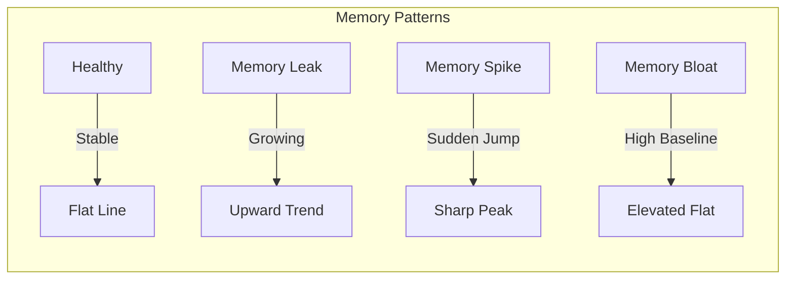
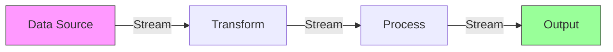

# How to Fix 'High Memory Usage' Issues

Author: [nawazdhandala](https://www.github.com/nawazdhandala)

Tags: Performance, Memory, Debugging, Node.js, Python, Observability, Profiling

Description: A practical guide to diagnosing and fixing high memory usage issues in production applications with real-world examples and monitoring strategies.

---

High memory usage is one of the most common performance issues in production systems. It can lead to slow response times, out-of-memory crashes, and expensive infrastructure costs. In this guide, we will walk through practical techniques to identify, diagnose, and fix memory issues in your applications.

## Understanding Memory Usage Patterns

Before diving into fixes, you need to understand how memory behaves in your application. Memory issues typically fall into three categories:

1. **Memory leaks** - Memory that is allocated but never released
2. **Memory bloat** - Excessive memory allocation for the workload
3. **Memory spikes** - Sudden increases during specific operations

Here is how these patterns typically manifest over time:



## Diagnosing Memory Issues

### Step 1: Monitor and Baseline

First, establish what normal memory usage looks like. Use monitoring tools to track memory over time:

```bash
# Linux - Check current memory usage
free -h

# Get process-specific memory usage
ps aux --sort=-%mem | head -10

# Watch memory usage in real-time
watch -n 1 'free -h'
```

For Node.js applications, you can expose memory metrics:

```javascript
// memory-monitor.js
// Simple memory monitoring endpoint for Express apps

const express = require('express');
const app = express();

app.get('/health/memory', (req, res) => {
    const memUsage = process.memoryUsage();

    res.json({
        // Heap used by V8 for objects
        heapUsed: Math.round(memUsage.heapUsed / 1024 / 1024) + ' MB',
        // Total heap allocated
        heapTotal: Math.round(memUsage.heapTotal / 1024 / 1024) + ' MB',
        // Memory used by C++ objects bound to JS
        external: Math.round(memUsage.external / 1024 / 1024) + ' MB',
        // Resident Set Size - total memory allocated
        rss: Math.round(memUsage.rss / 1024 / 1024) + ' MB',
        // Array buffers memory
        arrayBuffers: Math.round(memUsage.arrayBuffers / 1024 / 1024) + ' MB'
    });
});

app.listen(3000);
```

### Step 2: Identify the Culprit

Use heap snapshots to find what is consuming memory. In Node.js:

```javascript
// heap-snapshot.js
// Generate heap snapshots for analysis

const v8 = require('v8');
const fs = require('fs');

function takeHeapSnapshot() {
    const snapshotPath = `/tmp/heap-${Date.now()}.heapsnapshot`;

    // Write heap snapshot to file
    const snapshotStream = v8.writeHeapSnapshot(snapshotPath);

    console.log(`Heap snapshot written to: ${snapshotStream}`);
    return snapshotStream;
}

// Take snapshot on demand via signal
process.on('SIGUSR2', () => {
    console.log('Received SIGUSR2, taking heap snapshot...');
    takeHeapSnapshot();
});

// Export for programmatic use
module.exports = { takeHeapSnapshot };
```

For Python applications:

```python
# memory_profiler.py
# Track memory usage in Python applications

import tracemalloc
import linecache
from functools import wraps

def start_memory_tracking():
    """Start tracking memory allocations."""
    tracemalloc.start()

def get_memory_snapshot():
    """Get current memory allocation snapshot."""
    snapshot = tracemalloc.take_snapshot()
    top_stats = snapshot.statistics('lineno')

    print("Top 10 memory consumers:")
    for stat in top_stats[:10]:
        print(f"  {stat}")

    return top_stats

def memory_profile(func):
    """Decorator to profile memory usage of a function."""
    @wraps(func)
    def wrapper(*args, **kwargs):
        tracemalloc.start()

        result = func(*args, **kwargs)

        current, peak = tracemalloc.get_traced_memory()
        tracemalloc.stop()

        print(f"{func.__name__}:")
        print(f"  Current memory: {current / 1024 / 1024:.2f} MB")
        print(f"  Peak memory: {peak / 1024 / 1024:.2f} MB")

        return result
    return wrapper

# Example usage
@memory_profile
def process_large_data():
    data = [i ** 2 for i in range(1000000)]
    return sum(data)
```

## Common Memory Issues and Fixes

### Issue 1: Unbounded Caches

Caches that grow without limits are a frequent cause of memory issues.

```javascript
// bad-cache.js - This will leak memory
const cache = {};

function addToCache(key, value) {
    cache[key] = value;  // Never removed!
}

// good-cache.js - LRU cache with size limit
class LRUCache {
    constructor(maxSize = 1000) {
        this.maxSize = maxSize;
        this.cache = new Map();
    }

    get(key) {
        if (!this.cache.has(key)) return undefined;

        // Move to end (most recently used)
        const value = this.cache.get(key);
        this.cache.delete(key);
        this.cache.set(key, value);
        return value;
    }

    set(key, value) {
        // Delete if exists to update position
        if (this.cache.has(key)) {
            this.cache.delete(key);
        }

        // Remove oldest if at capacity
        if (this.cache.size >= this.maxSize) {
            const oldestKey = this.cache.keys().next().value;
            this.cache.delete(oldestKey);
        }

        this.cache.set(key, value);
    }

    get size() {
        return this.cache.size;
    }
}

// Usage
const userCache = new LRUCache(500);
userCache.set('user:123', { name: 'John' });
```

### Issue 2: Event Listener Leaks

Forgetting to remove event listeners is a classic memory leak:

```javascript
// event-listener-leak.js
// Problem: Listeners accumulate on each request

class LeakyService {
    constructor(eventEmitter) {
        this.emitter = eventEmitter;
    }

    // BAD: Adds listener but never removes it
    handleRequest(req) {
        this.emitter.on('data', (data) => {
            // Process data for this request
        });
    }
}

// fixed-event-listener.js
// Solution: Properly manage listener lifecycle

class FixedService {
    constructor(eventEmitter) {
        this.emitter = eventEmitter;
    }

    handleRequest(req) {
        // Create named handler so we can remove it
        const handler = (data) => {
            // Process data for this request
        };

        this.emitter.on('data', handler);

        // Clean up when request ends
        req.on('close', () => {
            this.emitter.off('data', handler);
        });
    }
}
```

### Issue 3: Large Object Retention

Holding references to large objects longer than needed:

```python
# large_object_retention.py
# Problem: Loading entire file into memory

def process_large_file_bad(filepath):
    # BAD: Loads entire file into memory
    with open(filepath, 'r') as f:
        data = f.read()  # Could be gigabytes!

    lines = data.split('\n')
    for line in lines:
        process_line(line)

def process_large_file_good(filepath):
    # GOOD: Process line by line, constant memory
    with open(filepath, 'r') as f:
        for line in f:
            process_line(line)

def process_line(line):
    # Your processing logic here
    pass
```

### Issue 4: Circular References

Circular references can prevent garbage collection in some cases:

```javascript
// circular-reference.js
// Problem: Objects reference each other

function createCircularLeak() {
    const parent = { name: 'parent' };
    const child = { name: 'child' };

    // Circular reference
    parent.child = child;
    child.parent = parent;

    // Even after function returns, these may not be collected
    // in older JS engines or certain scenarios
}

// Solution: Use WeakRef for optional references
function createWithWeakRef() {
    const parent = { name: 'parent' };
    const child = { name: 'child' };

    parent.child = child;
    // WeakRef allows garbage collection of parent
    child.parentRef = new WeakRef(parent);

    // Access parent when needed
    const parentObj = child.parentRef.deref();
    if (parentObj) {
        console.log(parentObj.name);
    }
}
```

## Memory Optimization Strategies

### Strategy 1: Streaming Large Data



```javascript
// stream-processing.js
// Process large files with constant memory usage

const fs = require('fs');
const readline = require('readline');
const { Transform } = require('stream');

async function processLargeFile(inputPath, outputPath) {
    const readStream = fs.createReadStream(inputPath);
    const writeStream = fs.createWriteStream(outputPath);

    // Create transform stream for processing
    const transformStream = new Transform({
        transform(chunk, encoding, callback) {
            // Process chunk without loading entire file
            const processed = chunk.toString().toUpperCase();
            callback(null, processed);
        }
    });

    // Pipe streams together - memory efficient
    readStream
        .pipe(transformStream)
        .pipe(writeStream);

    return new Promise((resolve, reject) => {
        writeStream.on('finish', resolve);
        writeStream.on('error', reject);
    });
}
```

### Strategy 2: Object Pooling

Reuse objects instead of creating new ones:

```javascript
// object-pool.js
// Reuse objects to reduce allocation overhead

class ObjectPool {
    constructor(factory, reset, initialSize = 10) {
        this.factory = factory;
        this.reset = reset;
        this.pool = [];

        // Pre-allocate objects
        for (let i = 0; i < initialSize; i++) {
            this.pool.push(this.factory());
        }
    }

    acquire() {
        // Get from pool or create new
        return this.pool.pop() || this.factory();
    }

    release(obj) {
        // Reset and return to pool
        this.reset(obj);
        this.pool.push(obj);
    }
}

// Example: Buffer pool for network operations
const bufferPool = new ObjectPool(
    () => Buffer.alloc(1024),           // Factory
    (buf) => buf.fill(0),               // Reset
    100                                  // Initial size
);

// Usage in request handler
function handleRequest(data) {
    const buffer = bufferPool.acquire();
    try {
        // Use buffer for processing
        data.copy(buffer);
        // ... process ...
    } finally {
        bufferPool.release(buffer);
    }
}
```

### Strategy 3: Pagination and Batching

Never load unbounded data sets:

```python
# pagination.py
# Process large datasets in batches

def process_all_users_bad(db):
    # BAD: Loads all users into memory
    users = db.query("SELECT * FROM users")
    for user in users:
        process_user(user)

def process_all_users_good(db, batch_size=1000):
    # GOOD: Process in batches
    offset = 0
    while True:
        users = db.query(
            f"SELECT * FROM users LIMIT {batch_size} OFFSET {offset}"
        )

        if not users:
            break

        for user in users:
            process_user(user)

        offset += batch_size

        # Optional: Force garbage collection between batches
        import gc
        gc.collect()
```

## Monitoring Memory in Production

Set up alerts before memory becomes critical:

```yaml
# prometheus-alerts.yaml
# Memory usage alerts for proactive monitoring

groups:
  - name: memory-alerts
    rules:
      - alert: HighMemoryUsage
        expr: |
          (node_memory_MemTotal_bytes - node_memory_MemAvailable_bytes)
          / node_memory_MemTotal_bytes * 100 > 85
        for: 5m
        labels:
          severity: warning
        annotations:
          summary: "High memory usage detected"
          description: "Memory usage is above 85% for 5 minutes"

      - alert: MemoryLeakSuspected
        expr: |
          increase(process_resident_memory_bytes[1h]) > 500000000
        for: 30m
        labels:
          severity: warning
        annotations:
          summary: "Possible memory leak"
          description: "Memory increased by 500MB+ in the last hour"
```

## Quick Checklist

When debugging high memory usage, follow this checklist:

1. **Establish baseline** - Know what normal looks like
2. **Identify growth pattern** - Leak, spike, or bloat?
3. **Take heap snapshots** - Compare before and after
4. **Check common culprits** - Caches, listeners, large objects
5. **Implement fixes** - Streaming, pooling, pagination
6. **Verify improvement** - Monitor after deployment
7. **Set up alerts** - Catch issues early next time

Memory issues are often gradual and sneaky. Regular profiling and monitoring will help you catch problems before they become outages.

---

*OneUptime provides comprehensive memory monitoring and alerting for your applications. Track memory usage trends, set up intelligent alerts, and correlate memory issues with other performance metrics.*
