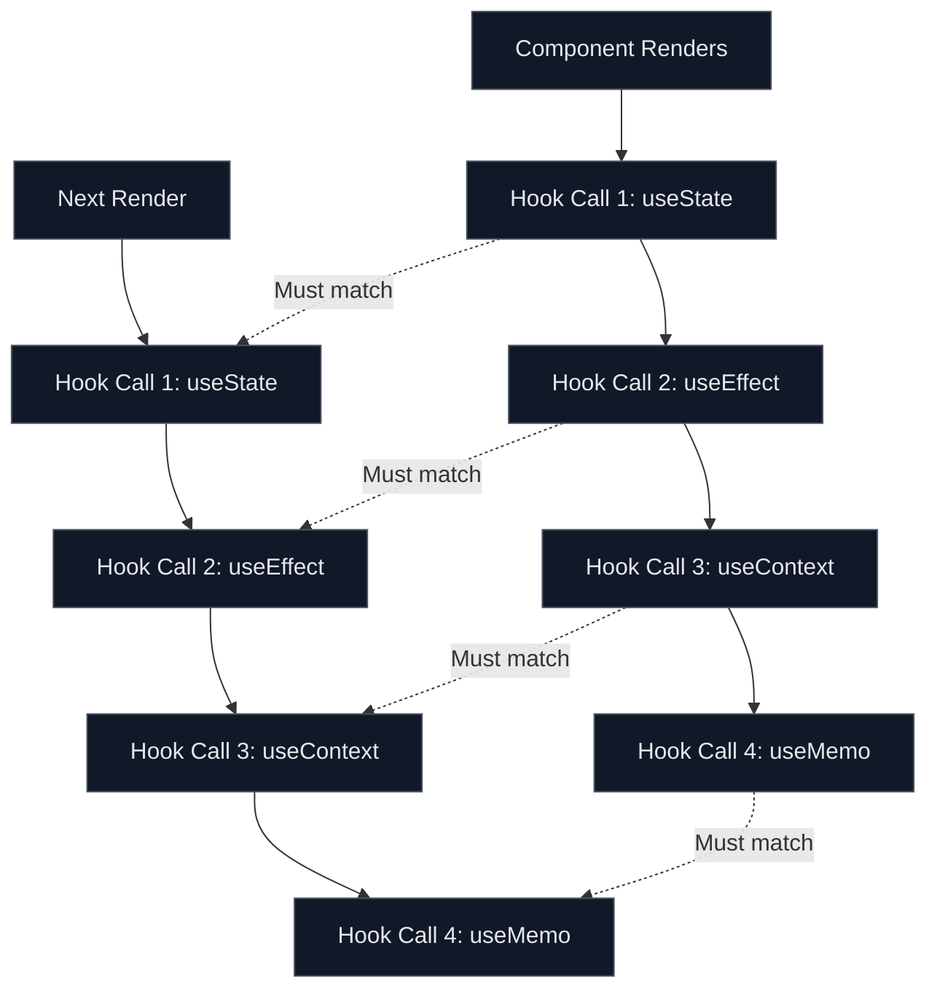
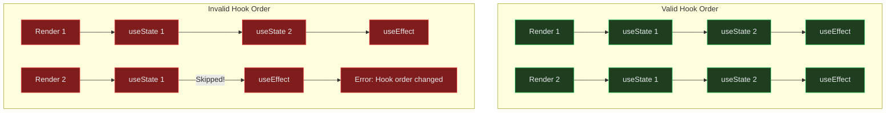
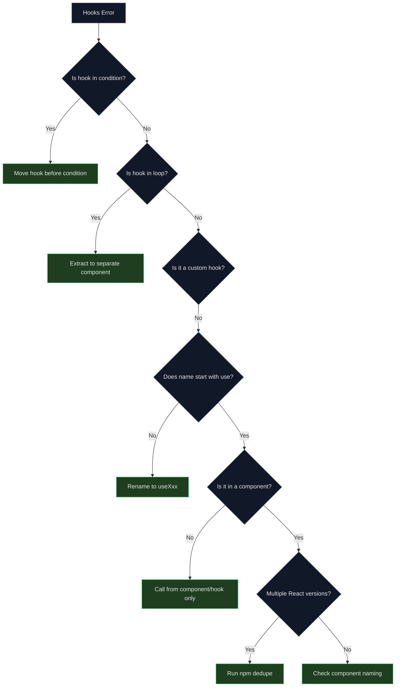

# How to Fix 'Hooks Can Only Be Called Inside' Errors

Author: [nawazdhandala](https://www.github.com/nawazdhandala)

Tags: React, Hooks, JavaScript, TypeScript, Debugging, Error Handling, Components

Description: A detailed troubleshooting guide for fixing the 'Hooks can only be called inside of the body of a function component' error, with common causes and solutions.

---

The error "Hooks can only be called inside of the body of a function component" is one of the most common React errors developers encounter. This error occurs when React's Rules of Hooks are violated. This guide explains the rules, common violations, and how to fix them.

## Understanding the Rules of Hooks

React hooks must follow specific rules to work correctly:

1. **Only call hooks at the top level** - Not inside loops, conditions, or nested functions
2. **Only call hooks from React functions** - Either function components or custom hooks
3. **Hooks must be called in the same order** - Every render must call the same hooks

## How React Tracks Hooks



## Common Causes and Solutions

### 1. Calling Hooks Inside Conditions

```tsx
// BAD: Hook inside a condition
function UserProfile({ userId }: { userId: string | null }) {
  if (!userId) {
    return <div>Please log in</div>;
  }

  // This hook is only called conditionally - ERROR!
  const [user, setUser] = useState(null);

  useEffect(() => {
    fetchUser(userId).then(setUser);
  }, [userId]);

  return <div>{user?.name}</div>;
}

// GOOD: Move the condition after hooks
function UserProfile({ userId }: { userId: string | null }) {
  const [user, setUser] = useState(null);

  useEffect(() => {
    if (userId) {
      fetchUser(userId).then(setUser);
    }
  }, [userId]);

  // Early return AFTER hooks
  if (!userId) {
    return <div>Please log in</div>;
  }

  return <div>{user?.name}</div>;
}
```

### 2. Calling Hooks Inside Loops

```tsx
// BAD: Hook inside a loop
function ItemList({ items }: { items: Item[] }) {
  const itemStates = items.map(item => {
    // This creates a different number of hooks each render - ERROR!
    const [expanded, setExpanded] = useState(false);
    return { item, expanded, setExpanded };
  });

  return (
    <ul>
      {itemStates.map(({ item, expanded }) => (
        <li key={item.id}>{expanded ? item.details : item.title}</li>
      ))}
    </ul>
  );
}

// GOOD: Create a separate component for each item
function ItemList({ items }: { items: Item[] }) {
  return (
    <ul>
      {items.map(item => (
        <ListItem key={item.id} item={item} />
      ))}
    </ul>
  );
}

function ListItem({ item }: { item: Item }) {
  // Each component has its own hook - OK!
  const [expanded, setExpanded] = useState(false);

  return (
    <li onClick={() => setExpanded(!expanded)}>
      {expanded ? item.details : item.title}
    </li>
  );
}
```

### 3. Calling Hooks in Regular Functions

```tsx
// BAD: Hook in a regular function (not a component or custom hook)
function fetchUserData(userId: string) {
  // This is a regular function, not a component - ERROR!
  const [loading, setLoading] = useState(true);
  const [data, setData] = useState(null);

  useEffect(() => {
    fetch(`/api/users/${userId}`)
      .then(res => res.json())
      .then(data => {
        setData(data);
        setLoading(false);
      });
  }, [userId]);

  return { loading, data };
}

// GOOD: Create a custom hook (name must start with 'use')
function useUserData(userId: string) {
  const [loading, setLoading] = useState(true);
  const [data, setData] = useState(null);

  useEffect(() => {
    fetch(`/api/users/${userId}`)
      .then(res => res.json())
      .then(data => {
        setData(data);
        setLoading(false);
      });
  }, [userId]);

  return { loading, data };
}

// Usage in a component
function UserProfile({ userId }: { userId: string }) {
  const { loading, data } = useUserData(userId);

  if (loading) return <Spinner />;
  return <div>{data?.name}</div>;
}
```

### 4. Calling Hooks in Event Handlers

```tsx
// BAD: Hook inside an event handler
function Form() {
  const handleSubmit = () => {
    // Hooks cannot be called here - ERROR!
    const [submitting, setSubmitting] = useState(false);
    setSubmitting(true);
  };

  return <button onClick={handleSubmit}>Submit</button>;
}

// GOOD: Declare hooks at the component level
function Form() {
  const [submitting, setSubmitting] = useState(false);

  const handleSubmit = () => {
    setSubmitting(true);
    // Perform submission logic
  };

  return (
    <button onClick={handleSubmit} disabled={submitting}>
      {submitting ? 'Submitting...' : 'Submit'}
    </button>
  );
}
```

### 5. Calling Hooks in Class Components

```tsx
// BAD: Hooks in class components - ERROR!
class UserProfile extends React.Component {
  componentDidMount() {
    // Hooks cannot be used in class components
    const [user, setUser] = useState(null);
  }

  render() {
    return <div>Profile</div>;
  }
}

// GOOD: Convert to function component
function UserProfile() {
  const [user, setUser] = useState(null);

  useEffect(() => {
    // Effect logic here
  }, []);

  return <div>Profile</div>;
}

// ALTERNATIVE: Use hooks via a wrapper
function withUser(Component: React.ComponentType<{ user: User | null }>) {
  return function WrappedComponent(props: any) {
    const [user, setUser] = useState<User | null>(null);

    useEffect(() => {
      fetchUser().then(setUser);
    }, []);

    return <Component {...props} user={user} />;
  };
}
```

## Hook Call Order Visualization



### 6. Duplicate React Versions

If you have multiple versions of React in your project, hooks will fail:

```bash
# Check for duplicate React versions
npm ls react

# If you see multiple versions, dedupe
npm dedupe

# Or ensure a single version in package.json
# For monorepos, use resolutions/overrides
```

```json
// package.json - Using npm overrides
{
  "overrides": {
    "react": "^18.2.0",
    "react-dom": "^18.2.0"
  }
}

// package.json - Using yarn resolutions
{
  "resolutions": {
    "react": "^18.2.0",
    "react-dom": "^18.2.0"
  }
}
```

### 7. Incorrect Function Component Naming

```tsx
// BAD: Lowercase function name (React treats as regular function)
function myComponent() {
  const [count, setCount] = useState(0);  // May cause issues
  return <div>{count}</div>;
}

// GOOD: PascalCase for components
function MyComponent() {
  const [count, setCount] = useState(0);
  return <div>{count}</div>;
}
```

### 8. Async Functions as Components

```tsx
// BAD: Async function components (not supported)
async function UserProfile({ userId }: { userId: string }) {
  const user = await fetchUser(userId);  // Cannot use await here
  const [editing, setEditing] = useState(false);  // Hook may fail

  return <div>{user.name}</div>;
}

// GOOD: Use hooks for async operations
function UserProfile({ userId }: { userId: string }) {
  const [user, setUser] = useState<User | null>(null);
  const [loading, setLoading] = useState(true);
  const [editing, setEditing] = useState(false);

  useEffect(() => {
    setLoading(true);
    fetchUser(userId)
      .then(setUser)
      .finally(() => setLoading(false));
  }, [userId]);

  if (loading) return <Spinner />;
  return <div>{user?.name}</div>;
}
```

## Debugging Checklist



## ESLint Configuration

Use the React Hooks ESLint plugin to catch these errors early:

```bash
npm install -D eslint-plugin-react-hooks
```

```javascript
// .eslintrc.js
module.exports = {
  plugins: ['react-hooks'],
  rules: {
    'react-hooks/rules-of-hooks': 'error',
    'react-hooks/exhaustive-deps': 'warn',
  },
};
```

## Quick Reference

| Error Scenario | Solution |
|---------------|----------|
| Hook inside if statement | Move hook before condition, put logic inside |
| Hook inside loop | Extract loop item to separate component |
| Hook in regular function | Rename function to start with `use` |
| Hook in event handler | Declare state at component level |
| Hook in class component | Convert to function component |
| Multiple React versions | Run `npm dedupe` or use resolutions |
| Lowercase component name | Use PascalCase for components |
| Async component | Use useEffect for async operations |

## Summary

The "Hooks can only be called inside" error always comes down to one of these issues:

1. **Conditional hook calls** - Move conditions after hooks
2. **Hooks in loops** - Extract to separate components
3. **Regular functions** - Rename to custom hooks or call from components
4. **Wrong context** - Only call from function components or custom hooks
5. **Duplicate React** - Ensure single React version

Follow the Rules of Hooks, use the ESLint plugin, and structure your code to keep hooks at the top level of your components. This will prevent these errors and make your React applications more predictable.
