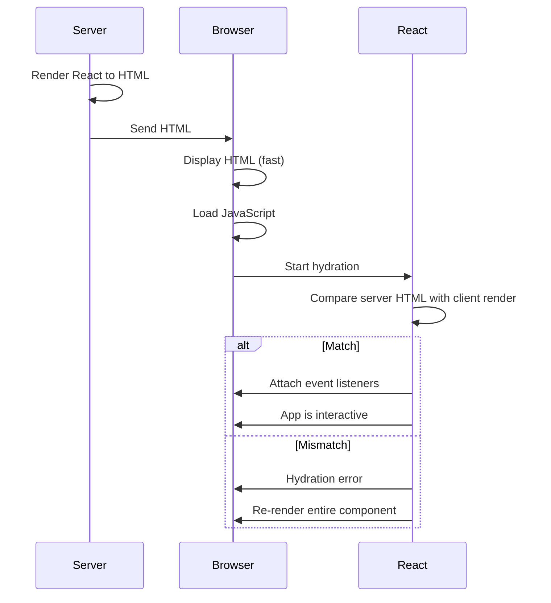
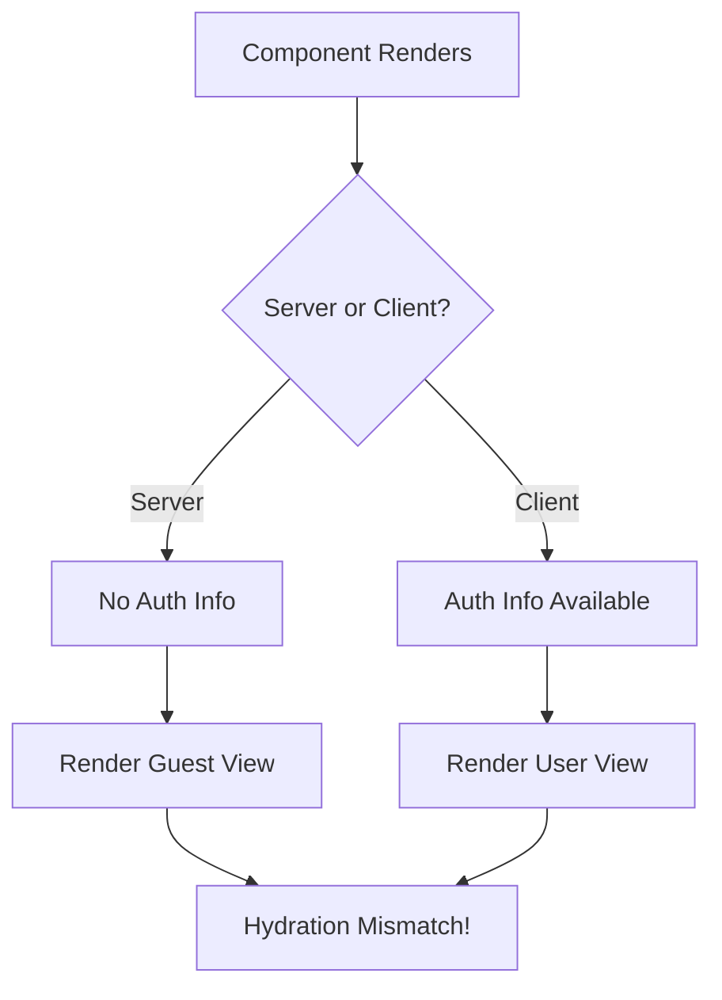
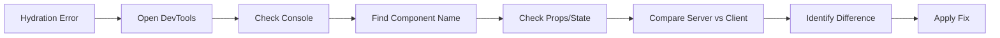

# How to Fix "Hydration Mismatch" Errors in Next.js

Author: [nawazdhandala](https://www.github.com/nawazdhandala)

Tags: Next.js, React, Hydration, SSR, Debugging, JavaScript, Web Development

Description: A practical guide to understanding and resolving hydration mismatch errors in Next.js applications.

---

## Introduction

Hydration mismatch errors occur when the HTML rendered on the server differs from what React expects to render on the client. These errors can cause visual glitches, broken interactivity, or complete application failures. This guide explains why these errors happen and provides proven solutions.

## Understanding Hydration

Hydration is the process where React attaches event listeners to server-rendered HTML and makes it interactive.



## Common Causes and Solutions

### Cause 1: Using Browser-Only APIs During Render

The most common cause is accessing browser APIs like `window`, `document`, or `localStorage` during the initial render.

```javascript
// Wrong: Accessing window during render
function MyComponent() {
  // This runs on both server and client
  // Server has no window object!
  const width = window.innerWidth;  // Error on server

  return <div>Width: {width}</div>;
}
```

```javascript
// Correct: Use useEffect for browser-only code
import { useState, useEffect } from 'react';

function MyComponent() {
  const [width, setWidth] = useState(0);

  useEffect(() => {
    // This only runs on the client
    setWidth(window.innerWidth);

    const handleResize = () => setWidth(window.innerWidth);
    window.addEventListener('resize', handleResize);

    return () => window.removeEventListener('resize', handleResize);
  }, []);

  return <div>Width: {width}</div>;
}
```

```javascript
// Alternative: Check if window exists
function MyComponent() {
  const [isClient, setIsClient] = useState(false);

  useEffect(() => {
    setIsClient(true);
  }, []);

  if (!isClient) {
    return <div>Loading...</div>;
  }

  // Safe to use browser APIs here
  return <div>Width: {window.innerWidth}</div>;
}
```

### Cause 2: Date and Time Rendering

Dates rendered on the server will differ from the client due to timezone differences or timing.

```javascript
// Wrong: Rendering current time during SSR
function Clock() {
  // Server time differs from client time!
  return <div>Current time: {new Date().toLocaleTimeString()}</div>;
}
```

```javascript
// Correct: Render time only on client
import { useState, useEffect } from 'react';

function Clock() {
  const [time, setTime] = useState(null);

  useEffect(() => {
    // Set initial time on client
    setTime(new Date().toLocaleTimeString());

    // Update every second
    const interval = setInterval(() => {
      setTime(new Date().toLocaleTimeString());
    }, 1000);

    return () => clearInterval(interval);
  }, []);

  // Show placeholder during SSR
  if (!time) {
    return <div>Current time: --:--:--</div>;
  }

  return <div>Current time: {time}</div>;
}
```

```javascript
// Alternative: Use suppressHydrationWarning for acceptable mismatches
function Clock() {
  return (
    <div suppressHydrationWarning>
      Current time: {new Date().toLocaleTimeString()}
    </div>
  );
}
```

### Cause 3: Random Values and IDs

Random values generate different results on server and client.

```javascript
// Wrong: Random ID during render
function ListItem({ item }) {
  // Different ID on server vs client!
  const id = Math.random().toString(36).substr(2, 9);

  return <li id={id}>{item.name}</li>;
}
```

```javascript
// Correct: Use stable IDs from data or useId hook
import { useId } from 'react';

function ListItem({ item }) {
  // useId generates consistent IDs across server and client
  const id = useId();

  return <li id={id}>{item.name}</li>;
}

// Or use data-driven IDs
function ListItem({ item }) {
  return <li id={`item-${item.id}`}>{item.name}</li>;
}
```

### Cause 4: Conditional Rendering Based on Client State

Rendering different content based on authentication or feature flags fetched client-side.



```javascript
// Wrong: Conditional rendering based on client-only data
function Header() {
  // On server, this is always null
  // On client, it might have a value
  const user = typeof window !== 'undefined'
    ? JSON.parse(localStorage.getItem('user'))
    : null;

  return (
    <header>
      {user ? <span>Welcome, {user.name}</span> : <span>Please log in</span>}
    </header>
  );
}
```

```javascript
// Correct: Defer client-specific content
import { useState, useEffect } from 'react';

function Header() {
  const [user, setUser] = useState(null);
  const [isLoading, setIsLoading] = useState(true);

  useEffect(() => {
    const storedUser = localStorage.getItem('user');
    if (storedUser) {
      setUser(JSON.parse(storedUser));
    }
    setIsLoading(false);
  }, []);

  // Render consistent placeholder during SSR and initial client render
  if (isLoading) {
    return (
      <header>
        <span>Loading...</span>
      </header>
    );
  }

  return (
    <header>
      {user ? <span>Welcome, {user.name}</span> : <span>Please log in</span>}
    </header>
  );
}
```

### Cause 5: Third-Party Scripts and Extensions

Browser extensions can modify the DOM, causing mismatches.

```javascript
// Correct: Mark containers that might be modified externally
function AdContainer() {
  return (
    <div
      id="ad-container"
      suppressHydrationWarning
      dangerouslySetInnerHTML={{ __html: '' }}
    />
  );
}
```

```javascript
// Correct: Load third-party widgets client-side only
import { useEffect, useRef } from 'react';

function TwitterEmbed({ tweetId }) {
  const containerRef = useRef(null);

  useEffect(() => {
    // Load Twitter widget script
    const script = document.createElement('script');
    script.src = 'https://platform.twitter.com/widgets.js';
    script.async = true;
    document.body.appendChild(script);

    script.onload = () => {
      window.twttr?.widgets?.createTweet(tweetId, containerRef.current);
    };

    return () => {
      document.body.removeChild(script);
    };
  }, [tweetId]);

  return <div ref={containerRef} />;
}
```

### Cause 6: Invalid HTML Nesting

Invalid HTML structure causes browsers to modify the DOM during parsing.

```javascript
// Wrong: Invalid HTML nesting
function BadNesting() {
  return (
    <p>
      This is a paragraph with
      <div>a div inside it</div>  {/* Invalid! Browsers will fix this */}
      which causes issues
    </p>
  );
}
```

```javascript
// Correct: Valid HTML structure
function GoodNesting() {
  return (
    <div>
      <p>This is a paragraph.</p>
      <div>This is a separate div.</div>
      <p>Another paragraph.</p>
    </div>
  );
}
```

```javascript
// Wrong: Interactive elements nested incorrectly
function BadButton() {
  return (
    <button>
      Click me
      <a href="/link">or this link</a>  {/* Invalid! */}
    </button>
  );
}

// Correct: Separate interactive elements
function GoodButton() {
  return (
    <div>
      <button>Click me</button>
      <a href="/link">or this link</a>
    </div>
  );
}
```

### Cause 7: CSS-in-JS Libraries

Some CSS-in-JS libraries generate different class names on server and client.

```javascript
// For styled-components, ensure proper SSR setup
// pages/_document.js

import Document from 'next/document';
import { ServerStyleSheet } from 'styled-components';

export default class MyDocument extends Document {
  static async getInitialProps(ctx) {
    const sheet = new ServerStyleSheet();
    const originalRenderPage = ctx.renderPage;

    try {
      ctx.renderPage = () =>
        originalRenderPage({
          enhanceApp: (App) => (props) =>
            sheet.collectStyles(<App {...props} />),
        });

      const initialProps = await Document.getInitialProps(ctx);
      return {
        ...initialProps,
        styles: (
          <>
            {initialProps.styles}
            {sheet.getStyleElement()}
          </>
        ),
      };
    } finally {
      sheet.seal();
    }
  }
}
```

```javascript
// For Emotion with Next.js App Router
// app/layout.js

import { CacheProvider } from '@emotion/react';
import createEmotionCache from '@/lib/createEmotionCache';

const clientSideEmotionCache = createEmotionCache();

export default function RootLayout({ children }) {
  return (
    <html>
      <body>
        <CacheProvider value={clientSideEmotionCache}>
          {children}
        </CacheProvider>
      </body>
    </html>
  );
}
```

## Using Dynamic Imports

For components that should only render on the client, use dynamic imports with `ssr: false`.

```javascript
import dynamic from 'next/dynamic';

// Component will only render on client
const MapComponent = dynamic(
  () => import('@/components/Map'),
  {
    ssr: false,
    loading: () => <div>Loading map...</div>
  }
);

// Component that uses browser APIs
const ChartComponent = dynamic(
  () => import('@/components/Chart'),
  { ssr: false }
);

function Dashboard() {
  return (
    <div>
      <h1>Dashboard</h1>
      <MapComponent />
      <ChartComponent data={chartData} />
    </div>
  );
}
```

## Creating a Client-Only Wrapper

```javascript
// components/ClientOnly.js

import { useState, useEffect } from 'react';

export default function ClientOnly({ children, fallback = null }) {
  const [hasMounted, setHasMounted] = useState(false);

  useEffect(() => {
    setHasMounted(true);
  }, []);

  if (!hasMounted) {
    return fallback;
  }

  return children;
}
```

```javascript
// Usage
import ClientOnly from '@/components/ClientOnly';

function MyPage() {
  return (
    <div>
      <h1>My Page</h1>

      <ClientOnly fallback={<div>Loading user info...</div>}>
        <UserProfile />
      </ClientOnly>

      <ClientOnly>
        <BrowserOnlyWidget />
      </ClientOnly>
    </div>
  );
}
```

## Debugging Hydration Errors

### Enable Detailed Error Messages

```javascript
// next.config.js

module.exports = {
  reactStrictMode: true,

  // In development, log detailed hydration errors
  onDemandEntries: {
    maxInactiveAge: 25 * 1000,
    pagesBufferLength: 2,
  },
};
```

### Use React DevTools



### Add Debug Logging

```javascript
// Temporarily add logging to debug
function DebugComponent({ data }) {
  // Log what renders on server vs client
  console.log('Rendering with data:', JSON.stringify(data));
  console.log('Is browser:', typeof window !== 'undefined');

  if (typeof window !== 'undefined') {
    console.log('Client-side render');
  } else {
    console.log('Server-side render');
  }

  return <div>{data.value}</div>;
}
```

## App Router Specific Solutions

### Using 'use client' Directive

```javascript
// components/BrowserComponent.js
'use client';

import { useState, useEffect } from 'react';

export default function BrowserComponent() {
  const [mounted, setMounted] = useState(false);

  useEffect(() => {
    setMounted(true);
  }, []);

  if (!mounted) {
    return <div>Loading...</div>;
  }

  // Safe to use browser APIs
  return <div>Screen width: {window.innerWidth}px</div>;
}
```

```javascript
// app/page.js (Server Component)
import BrowserComponent from '@/components/BrowserComponent';

export default function Page() {
  return (
    <main>
      <h1>My App</h1>
      {/* Client component handles browser-specific rendering */}
      <BrowserComponent />
    </main>
  );
}
```

### Server and Client Component Boundaries

```javascript
// components/UserGreeting.js
'use client';

import { useEffect, useState } from 'react';

export default function UserGreeting() {
  const [user, setUser] = useState(null);

  useEffect(() => {
    // Fetch user data client-side
    fetch('/api/user')
      .then(res => res.json())
      .then(setUser);
  }, []);

  if (!user) {
    return <span>Welcome, Guest</span>;
  }

  return <span>Welcome, {user.name}</span>;
}
```

```javascript
// app/layout.js (Server Component)
import UserGreeting from '@/components/UserGreeting';

export default function RootLayout({ children }) {
  return (
    <html>
      <body>
        <header>
          <nav>
            <UserGreeting />
          </nav>
        </header>
        {children}
      </body>
    </html>
  );
}
```

## Common Patterns for Hydration-Safe Code

### Pattern 1: Isomorphic State Initialization

```javascript
import { useState, useEffect } from 'react';

function useLocalStorage(key, initialValue) {
  // Initialize with a function to avoid SSR issues
  const [storedValue, setStoredValue] = useState(() => {
    // Return initial value for SSR
    return initialValue;
  });

  // Sync with localStorage after mount
  useEffect(() => {
    try {
      const item = window.localStorage.getItem(key);
      if (item) {
        setStoredValue(JSON.parse(item));
      }
    } catch (error) {
      console.error(error);
    }
  }, [key]);

  const setValue = (value) => {
    try {
      setStoredValue(value);
      window.localStorage.setItem(key, JSON.stringify(value));
    } catch (error) {
      console.error(error);
    }
  };

  return [storedValue, setValue];
}
```

### Pattern 2: Media Query Hook

```javascript
import { useState, useEffect } from 'react';

function useMediaQuery(query) {
  // Default to false for SSR
  const [matches, setMatches] = useState(false);

  useEffect(() => {
    const media = window.matchMedia(query);

    // Set initial value
    setMatches(media.matches);

    // Listen for changes
    const listener = (event) => setMatches(event.matches);
    media.addEventListener('change', listener);

    return () => media.removeEventListener('change', listener);
  }, [query]);

  return matches;
}

// Usage
function ResponsiveComponent() {
  const isMobile = useMediaQuery('(max-width: 768px)');

  return (
    <div>
      {isMobile ? <MobileView /> : <DesktopView />}
    </div>
  );
}
```

### Pattern 3: Deferred Content

```javascript
import { useState, useEffect, Suspense } from 'react';

function DeferredContent({ children, fallback }) {
  const [isClient, setIsClient] = useState(false);

  useEffect(() => {
    setIsClient(true);
  }, []);

  return (
    <Suspense fallback={fallback}>
      {isClient ? children : fallback}
    </Suspense>
  );
}

// Usage
function Page() {
  return (
    <div>
      <h1>Static content renders immediately</h1>

      <DeferredContent fallback={<div>Loading dynamic content...</div>}>
        <DynamicUserContent />
      </DeferredContent>
    </div>
  );
}
```

## Summary

Hydration mismatch errors in Next.js occur when server-rendered HTML differs from client-rendered content. To fix these errors:

1. Move browser-only APIs (`window`, `localStorage`, etc.) into `useEffect` hooks
2. Avoid rendering timestamps or random values during SSR
3. Use `useId` for generating consistent IDs
4. Defer authentication-dependent content to client-side
5. Use `dynamic` imports with `ssr: false` for browser-only components
6. Ensure valid HTML nesting
7. Configure CSS-in-JS libraries properly for SSR
8. Create client-only wrapper components for complex cases
9. Use the 'use client' directive appropriately in App Router

By understanding the hydration process and following these patterns, you can build Next.js applications that render consistently across server and client environments.
