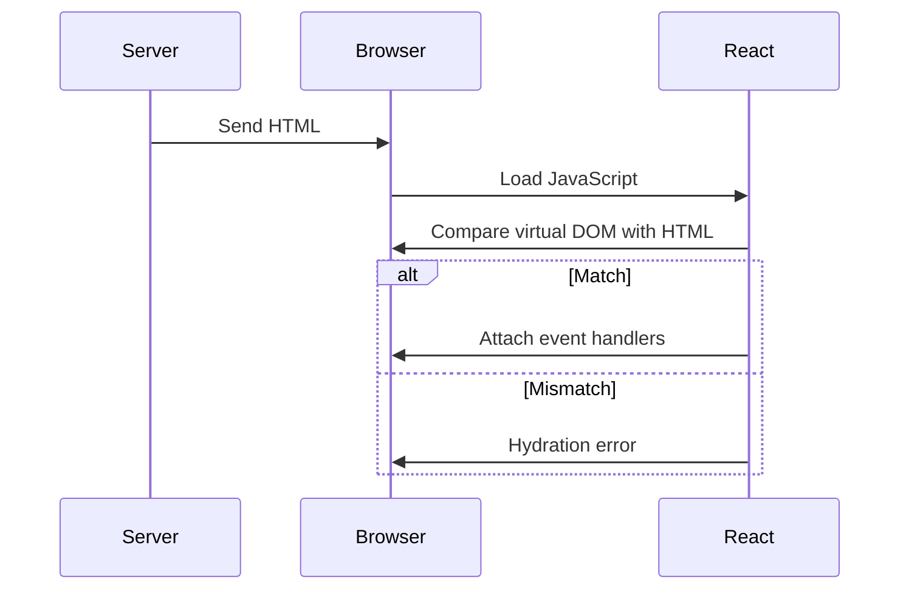
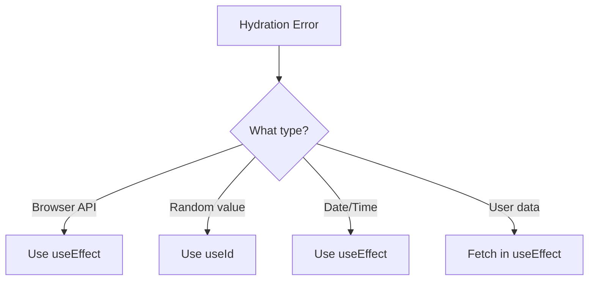

# How to Fix "Hydration Mismatch" Errors in SSR

Author: [nawazdhandala](https://www.github.com/nawazdhandala)

Tags: React, SSR, Hydration, Next.js, Server-Side Rendering, Debugging, TypeScript, Performance

Description: Learn how to identify, debug, and fix hydration mismatch errors that occur when server-rendered HTML differs from client-rendered output.

---

Hydration mismatch errors occur when server-rendered HTML differs from client-rendered output. This guide explains causes and solutions.

## What Is Hydration?



## Common Causes and Fixes

### Browser-Only APIs

```typescript
// BAD: window undefined on server
function BadComponent() {
  const width = window.innerWidth;
  return <div>Width: {width}</div>;
}

// GOOD: Use useEffect
import { useState, useEffect } from 'react';

function GoodComponent() {
  const [width, setWidth] = useState<number | null>(null);

  useEffect(() => {
    setWidth(window.innerWidth);
  }, []);

  if (width === null) return <div>Loading...</div>;
  return <div>Width: {width}</div>;
}
```

### Random Values

```typescript
// BAD: Different on server vs client
const id = Math.random().toString();

// GOOD: Use useId
import { useId } from 'react';
const id = useId();
```

### Date/Time Differences

```typescript
// BAD
const now = new Date().toISOString();

// GOOD
const [timestamp, setTimestamp] = useState('');
useEffect(() => {
  setTimestamp(new Date().toISOString());
}, []);
```

## Client-Only Component Pattern

```typescript
'use client';

import { useState, useEffect, ReactNode } from 'react';

function ClientOnly({ children, fallback = null }: { children: ReactNode; fallback?: ReactNode }) {
  const [mounted, setMounted] = useState(false);

  useEffect(() => {
    setMounted(true);
  }, []);

  if (!mounted) return fallback;
  return <>{children}</>;
}
```

## Decision Flow



## Summary

| Cause | Solution |
|-------|----------|
| Browser APIs | Use useEffect |
| Random IDs | Use useId hook |
| Date/time | Pass from server or useEffect |
| localStorage | Defer to useEffect |

The key principle is ensuring initial client render matches server output.
