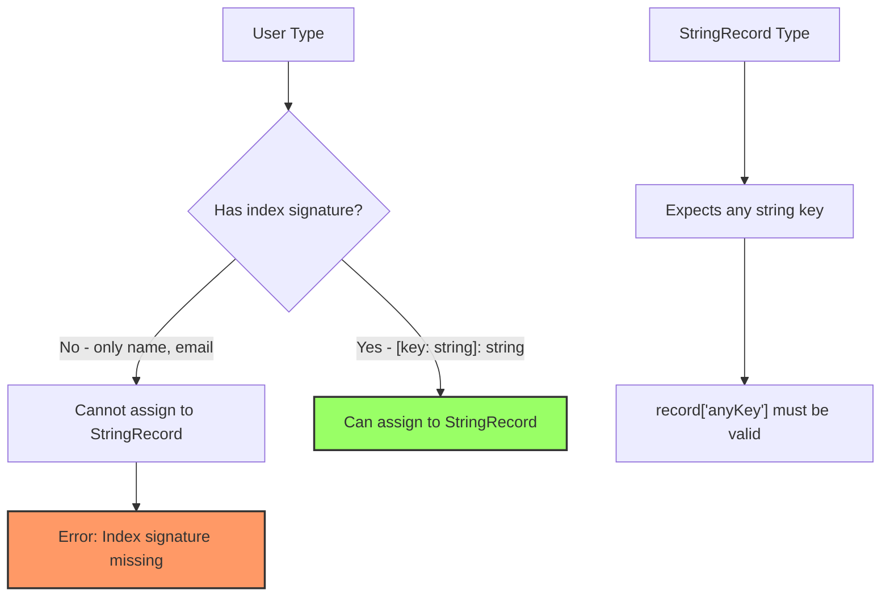
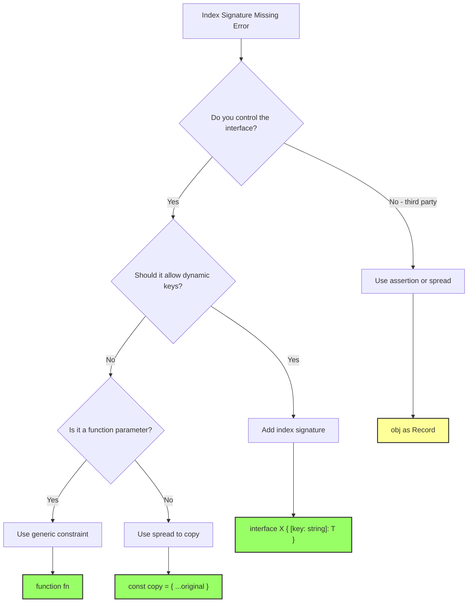

# How to Fix "Index Signature Missing" Errors

Author: [nawazdhandala](https://www.github.com/nawazdhandala)

Tags: TypeScript, Types, Interfaces, Type Safety, Debugging

Description: Resolve TypeScript "Index signature is missing" errors when working with dynamic object keys and type assignments.

---

The "Index signature is missing in type" error occurs when TypeScript cannot guarantee that an object type supports arbitrary string or number keys. This guide explains why this happens and how to fix it safely.

## Understanding the Error

When you try to assign an object with specific known properties to a type that expects dynamic key access, TypeScript raises this error to prevent potential runtime errors.

```typescript
// The interface has specific known properties
interface User {
  name: string;
  email: string;
}

// This type expects any string key to return a string
type StringRecord = Record<string, string>;

const user: User = { name: 'Alice', email: 'alice@example.com' };

// Error: Index signature for type 'string' is missing in type 'User'
const record: StringRecord = user;
```



## Why This Error Exists

TypeScript prevents this assignment because the destination type makes a promise the source type cannot keep:

```typescript
// StringRecord promises: "any string key returns a string"
type StringRecord = Record<string, string>;

// User only promises: "name and email exist and are strings"
interface User {
  name: string;
  email: string;
}

// If this assignment were allowed:
const record: StringRecord = user as any;

// This would be "valid" according to the type
const value: string = record['nonExistent'];  // undefined at runtime!

// TypeScript prevents this type unsafety
```

## Solution 1: Add an Index Signature

Add an index signature to your interface to explicitly allow dynamic access:

```typescript
// Add [key: string]: string to allow any string key
// This tells TypeScript the object can have additional properties
interface User {
  name: string;
  email: string;
  [key: string]: string;  // Index signature
}

const user: User = { name: 'Alice', email: 'alice@example.com' };

// Now this works because User has an index signature
const record: Record<string, string> = user;
```

**Caution:** This changes your interface to accept any string property:

```typescript
// With index signature, these are now valid
const user: User = {
  name: 'Alice',
  email: 'alice@example.com',
  anyRandomKey: 'value',  // Allowed
  anotherKey: 'value',    // Allowed
};
```

## Solution 2: Use Type Assertion

When you know the assignment is safe, use a type assertion:

```typescript
interface User {
  name: string;
  email: string;
}

const user: User = { name: 'Alice', email: 'alice@example.com' };

// Assert the type when you know it is safe
// Use this when you control how the object will be accessed
const record = user as Record<string, string>;

// Or use a double assertion for stricter types
const record2 = user as unknown as Record<string, string>;
```

**Warning:** Type assertions bypass TypeScript's safety checks. Only use them when you are certain the code is correct.

## Solution 3: Create a New Object

Create a new object that satisfies the target type:

```typescript
interface User {
  name: string;
  email: string;
}

const user: User = { name: 'Alice', email: 'alice@example.com' };

// Create a new object using spread
// This preserves type safety by explicitly constructing the target type
const record: Record<string, string> = { ...user };

// Or use Object.entries for transformation
const recordFromEntries: Record<string, string> = Object.fromEntries(
  Object.entries(user)
) as Record<string, string>;
```

## Solution 4: Use Generic Constraints

Design your functions to accept the specific type instead of requiring an index signature:

```typescript
// BAD: Requires index signature
function processRecord(record: Record<string, string>): void {
  // ...
}

// GOOD: Accept any object with string values
// The generic constraint is more flexible
function processObject<T extends Record<string, string>>(obj: T): void {
  // Access known keys safely
  for (const key in obj) {
    const value: string = obj[key];
    console.log(key, value);
  }
}

// Now both work
interface User {
  name: string;
  email: string;
}

const user: User = { name: 'Alice', email: 'alice@example.com' };
processObject(user);  // Works without index signature

const record: Record<string, string> = { key: 'value' };
processObject(record);  // Also works
```

## Solution 5: Use Mapped Types

Create a utility type that adds an index signature:

```typescript
// Utility type that adds an index signature to any object type
// Preserves the original properties while allowing dynamic access
type WithIndexSignature<T> = T & { [key: string]: T[keyof T] };

interface User {
  name: string;
  email: string;
}

// Add index signature to User
type IndexableUser = WithIndexSignature<User>;

const user: IndexableUser = { name: 'Alice', email: 'alice@example.com' };
const record: Record<string, string> = user;  // Works
```

## Common Scenarios

### Scenario 1: Object.keys() Iteration

```typescript
interface Config {
  apiUrl: string;
  timeout: string;
  retries: string;
}

const config: Config = {
  apiUrl: 'https://api.example.com',
  timeout: '5000',
  retries: '3',
};

// Error when trying to iterate with dynamic keys
function printConfig(cfg: Record<string, string>): void {
  Object.keys(cfg).forEach(key => {
    console.log(`${key}: ${cfg[key]}`);
  });
}

printConfig(config);  // Error: Index signature missing

// Fix 1: Use generic constraint
function printConfigFixed<T extends Record<string, string>>(cfg: T): void {
  (Object.keys(cfg) as Array<keyof T>).forEach(key => {
    console.log(`${String(key)}: ${cfg[key]}`);
  });
}

printConfigFixed(config);  // Works

// Fix 2: Pass a copy
printConfig({ ...config });  // Works
```

### Scenario 2: Dynamic Property Access

```typescript
interface FormData {
  username: string;
  password: string;
}

const form: FormData = { username: 'alice', password: 'secret' };

// You want to access properties dynamically
function getFieldValue(
  data: Record<string, string>,
  field: string
): string {
  return data[field];
}

getFieldValue(form, 'username');  // Error: Index signature missing

// Fix: Use keyof for type-safe dynamic access
function getFieldValueTyped<T>(
  data: T,
  field: keyof T
): T[keyof T] {
  return data[field];
}

getFieldValueTyped(form, 'username');  // Works and type-safe
```

### Scenario 3: Object.assign() with Generic Types

```typescript
interface Defaults {
  theme: string;
  language: string;
}

interface UserPrefs {
  theme: string;
  language: string;
}

const defaults: Defaults = { theme: 'dark', language: 'en' };
const userPrefs: Partial<UserPrefs> = { theme: 'light' };

// Merge objects
// Error if function expects Record<string, string>
function merge(
  base: Record<string, string>,
  override: Record<string, string>
): Record<string, string> {
  return { ...base, ...override };
}

// Fix: Use generics
function mergeTyped<T extends object, U extends Partial<T>>(
  base: T,
  override: U
): T & U {
  return { ...base, ...override };
}

const merged = mergeTyped(defaults, userPrefs);
// Type is Defaults & Partial<UserPrefs>
```

## Decision Flow for Fixing This Error



## Best Practices

| Approach | When to Use | Trade-offs |
|----------|-------------|------------|
| Add index signature | Interface should accept any key | Loses specific property checking |
| Type assertion | You know it is safe, quick fix | Bypasses type safety |
| Spread operator | Need a new object anyway | Creates copy, slight overhead |
| Generic constraints | Writing reusable functions | More complex type signatures |
| Mapped utility type | Common pattern in codebase | Adds complexity |

## Summary

The "Index signature is missing" error protects you from accessing non-existent properties. Choose your fix based on your specific needs:

1. **Add index signature** if your type genuinely should allow arbitrary keys
2. **Use type assertion** when you know the assignment is safe but cannot change the types
3. **Spread into new object** when you need a quick, safe conversion
4. **Use generics** when writing functions that should work with various object types
5. **Create utility types** for repeated patterns in your codebase

The goal is to maintain type safety while enabling the dynamic access patterns you need.
