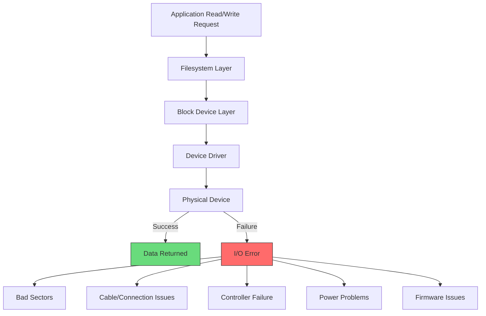
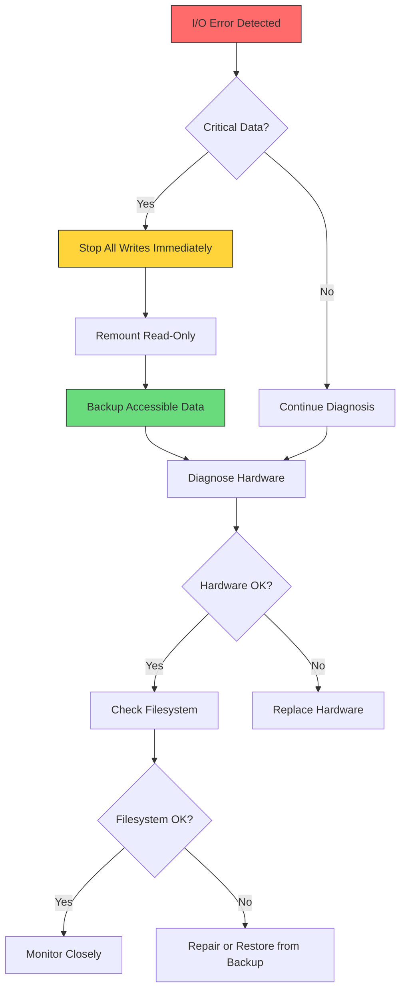
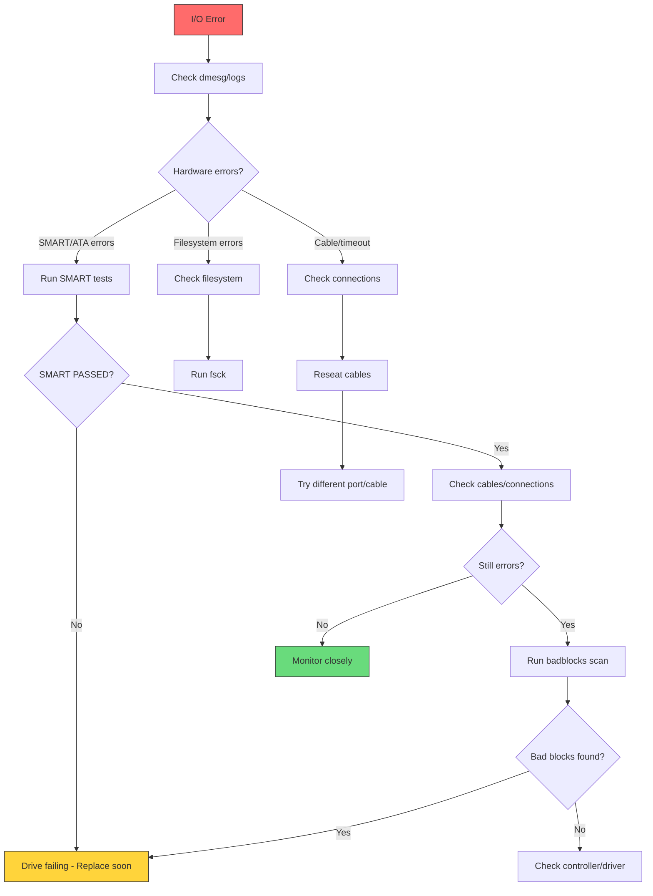
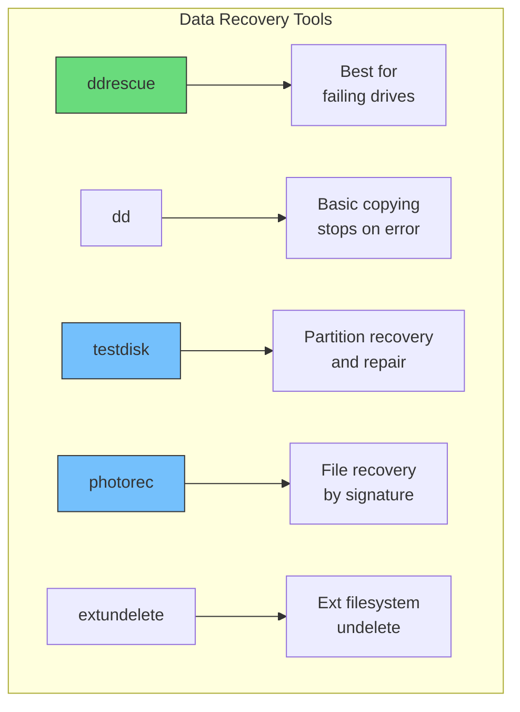

# How to Fix "Input/Output Error" Disk Errors

Author: [nawazdhandala](https://www.github.com/nawazdhandala)

Tags: Linux, System Administration, Disk Errors, Storage, Troubleshooting, Data Recovery, Hardware

Description: Learn how to diagnose and fix Input/Output errors in Linux, including identifying failing drives, recovering data, and implementing preventive measures.

---

Input/Output (I/O) errors are among the most serious issues you can encounter on a Linux system. These errors indicate that the system cannot read from or write to a storage device, often signaling hardware failure or filesystem corruption. This guide will help you diagnose the cause, recover what you can, and prevent future occurrences.

## Understanding I/O Errors

I/O errors occur when the operating system cannot complete a read or write operation to a storage device:



### Common Error Messages

```bash
# Typical I/O error messages in dmesg or /var/log/syslog:

# Generic I/O error
"I/O error, dev sda, sector 123456789"

# SCSI errors
"sd 0:0:0:0: [sda] tag#0 FAILED Result: hostbyte=DID_OK driverbyte=DRIVER_SENSE"
"sd 0:0:0:0: [sda] Sense Key : Medium Error [current]"

# ATA/SATA errors
"ata1.00: exception Emask 0x0 SAct 0x0 SErr 0x0 action 0x0"
"ata1.00: failed command: READ DMA"

# Filesystem errors
"EXT4-fs error (device sda1): ext4_find_entry:1234: inode #567890: comm process: reading directory lblock 0"
```

## Immediate Response

When you encounter I/O errors, act quickly to prevent data loss:



### Emergency Read-Only Remount

```bash
# Remount filesystem as read-only to prevent further damage
sudo mount -o remount,ro /dev/sda1

# Or for the root filesystem
sudo mount -o remount,ro /

# Check current mount options
mount | grep sda1
```

## Diagnosing the Problem

### Check System Logs

```bash
# View recent kernel messages about disk errors
dmesg | grep -i -E "error|fail|sda|ata" | tail -50

# Check system logs
sudo journalctl -k | grep -i -E "error|fail|sda" | tail -50

# Search syslog for disk errors
sudo grep -i "i/o error" /var/log/syslog | tail -20

# Monitor in real-time
dmesg -w | grep -i -E "error|fail|ata|scsi"
```

### Check SMART Status

SMART (Self-Monitoring, Analysis and Reporting Technology) provides early warning of drive failures:

```bash
# Install smartmontools if not present
sudo apt install smartmontools   # Debian/Ubuntu
sudo yum install smartmontools   # RHEL/CentOS

# Check if SMART is supported and enabled
sudo smartctl -i /dev/sda

# Get SMART health status (quick check)
sudo smartctl -H /dev/sda

# Example output:
# SMART overall-health self-assessment test result: PASSED
# or
# SMART overall-health self-assessment test result: FAILED!

# Get detailed SMART attributes
sudo smartctl -A /dev/sda

# Key attributes to watch (values approaching thresholds indicate failure):
# 5   - Reallocated_Sector_Ct    (bad sectors remapped)
# 187 - Reported_Uncorrect       (uncorrectable errors)
# 188 - Command_Timeout          (command timeouts)
# 197 - Current_Pending_Sector   (sectors waiting to be remapped)
# 198 - Offline_Uncorrectable    (uncorrectable errors found offline)
```

### Understanding SMART Output

```bash
# Example SMART attribute analysis
sudo smartctl -A /dev/sda

# ID# ATTRIBUTE_NAME          FLAG     VALUE WORST THRESH TYPE      UPDATED  WHEN_FAILED RAW_VALUE
#   5 Reallocated_Sector_Ct   0x0033   100   100   010    Pre-fail  Always       -       0
# 187 Reported_Uncorrect      0x0032   100   100   000    Old_age   Always       -       0
# 197 Current_Pending_Sector  0x0012   100   100   000    Old_age   Always       -       0
# 198 Offline_Uncorrectable   0x0010   100   100   000    Old_age   Offline      -       0

# WARNING signs:
# - RAW_VALUE for Reallocated_Sector_Ct increasing
# - Any non-zero Current_Pending_Sector
# - WHEN_FAILED column showing anything other than "-"
```

### Run SMART Tests

```bash
# Short test (1-2 minutes)
sudo smartctl -t short /dev/sda

# Extended test (can take hours)
sudo smartctl -t long /dev/sda

# Check test progress
sudo smartctl -l selftest /dev/sda

# View test results
sudo smartctl -a /dev/sda | grep -A 20 "SMART Self-test log"
```

### Check for Bad Blocks

```bash
# Non-destructive read test (safe, but slow)
# This reads every block and reports errors
sudo badblocks -v /dev/sda1 > /tmp/badblocks.txt

# Read-write test (DESTRUCTIVE - erases all data!)
# Only use on empty drives
sudo badblocks -wvs /dev/sdb

# Check specific region around error
# If error reported at sector 123456789:
# Check 1000 sectors around it
sudo badblocks -v /dev/sda 123457789 123455789

# Use hdparm to read specific sector
sudo hdparm --read-sector 123456789 /dev/sda
```

## Diagnostic Workflow



## Recovery Steps

### Step 1: Backup What You Can

```bash
# Create image of the disk (even with errors)
# ddrescue is better than dd for failing drives
sudo apt install gddrescue

# Create disk image, skipping bad sectors initially
sudo ddrescue -d /dev/sda /backup/sda.img /backup/sda.log

# Second pass - try harder on bad sectors
sudo ddrescue -d -r3 /dev/sda /backup/sda.img /backup/sda.log

# Options explained:
# -d      Direct access (bypass cache)
# -r3     Retry bad sectors 3 times
# logfile Allows resuming interrupted recovery

# For specific partitions
sudo ddrescue -d /dev/sda1 /backup/sda1.img /backup/sda1.log
```

### Step 2: Check and Repair Filesystem

```bash
# Unmount the filesystem first
sudo umount /dev/sda1

# Check ext4 filesystem
sudo fsck.ext4 -v /dev/sda1

# Force check even if filesystem appears clean
sudo fsck.ext4 -f /dev/sda1

# Automatically fix errors (use with caution)
sudo fsck.ext4 -y /dev/sda1

# For XFS filesystems
sudo xfs_repair /dev/sda1

# For checking mounted root filesystem, schedule on reboot
sudo touch /forcefsck
sudo reboot
```

### Step 3: Mark Bad Blocks

```bash
# Find bad blocks and create list
sudo badblocks -v /dev/sda1 > /tmp/badblocks.txt

# Tell filesystem to avoid bad blocks (ext4)
sudo e2fsck -l /tmp/badblocks.txt /dev/sda1

# View bad blocks already marked
sudo dumpe2fs -b /dev/sda1
```

### Step 4: Attempt Sector Recovery

```bash
# For drives with few bad sectors, you might force reallocation
# Write zeros to bad sector (may trigger reallocation)
# WARNING: This destroys data in that sector
sudo hdparm --write-sector 123456789 --yes-i-know-what-i-am-doing /dev/sda

# For SSD, try TRIM to reclaim blocks
sudo fstrim -v /mount/point
```

## Common Causes and Solutions

### Cause 1: Failing Hard Drive

```bash
# Signs: Increasing SMART errors, clicking sounds, slow response

# Solution: Replace drive immediately
# 1. Get new drive
# 2. Clone using ddrescue
sudo ddrescue -d /dev/sda /dev/sdb /tmp/rescue.log

# 3. Or restore from backup to new drive
```

### Cause 2: Bad SATA/SAS Cable

```bash
# Signs: Intermittent errors, errors after movement/temperature change

# Solution:
# 1. Power down system
# 2. Reseat or replace SATA cable
# 3. Try different SATA port on motherboard
# 4. Check power cable to drive
```

### Cause 3: Filesystem Corruption

```bash
# Signs: Errors reference specific files or inodes

# Solution:
sudo umount /dev/sda1
sudo fsck -f /dev/sda1

# For severe corruption
sudo fsck -y /dev/sda1   # Auto-fix (may lose data)
```

### Cause 4: NFS/Network Storage Errors

```bash
# Signs: Errors on network-mounted filesystems

# Check network connectivity
ping nfs-server

# Check NFS status
showmount -e nfs-server
nfsstat -c

# Remount NFS share
sudo umount -f /mnt/nfs
sudo mount -t nfs server:/share /mnt/nfs

# Check for firewall issues
sudo iptables -L | grep -i nfs
```

### Cause 5: USB Drive Errors

```bash
# Signs: Errors on /dev/sd[x] that is a USB drive

# Check USB connection
lsusb

# View USB errors
dmesg | grep -i usb | tail -20

# Try different USB port (preferably USB 3.0)
# Use powered USB hub for high-capacity drives
# Check if drive works on another computer
```

## Preventive Measures

### Set Up SMART Monitoring

```bash
# Enable SMART daemon
sudo systemctl enable smartd
sudo systemctl start smartd

# Configure /etc/smartd.conf
# Monitor all drives, email on issues
DEVICESCAN -a -o on -S on -n standby,q -s (S/../.././02|L/../../6/03) -W 4,35,40 -m admin@example.com

# Options:
# -a         Monitor all attributes
# -o on      Enable automatic offline testing
# -S on      Enable attribute autosave
# -n standby Don't wake sleeping drives
# -s (...)   Schedule short test daily at 2am, long test Saturday 3am
# -W 4,35,40 Temperature warning at 35C, critical at 40C
# -m email   Send alerts to this address
```

### Create Monitoring Script

```bash
#!/bin/bash
# /usr/local/bin/check-disk-health.sh

DRIVES=$(lsblk -d -o NAME,TYPE | grep disk | awk '{print $1}')
ALERT_EMAIL="admin@example.com"

for drive in $DRIVES; do
    # Skip non-rotational (SSD may not support all SMART)
    if [ "$(cat /sys/block/$drive/queue/rotational)" = "0" ]; then
        continue
    fi

    # Check SMART health
    HEALTH=$(smartctl -H /dev/$drive | grep "result" | awk -F: '{print $2}' | xargs)

    if [ "$HEALTH" != "PASSED" ]; then
        echo "ALERT: Drive $drive SMART health: $HEALTH" | \
            mail -s "Disk Health Alert: $drive" $ALERT_EMAIL
    fi

    # Check for reallocated sectors
    REALLOCATED=$(smartctl -A /dev/$drive | grep "Reallocated_Sector_Ct" | awk '{print $10}')

    if [ -n "$REALLOCATED" ] && [ "$REALLOCATED" -gt 0 ]; then
        echo "WARNING: Drive $drive has $REALLOCATED reallocated sectors" | \
            mail -s "Disk Reallocated Sectors: $drive" $ALERT_EMAIL
    fi
done
```

### Schedule Regular Checks

```bash
# Add to crontab
sudo crontab -e

# Daily SMART health check at 6am
0 6 * * * /usr/local/bin/check-disk-health.sh

# Weekly filesystem check report
0 7 * * 0 /sbin/fsck -n /dev/sda1 > /var/log/fsck-weekly.log 2>&1
```

## Recovery Tools Comparison



### Using testdisk for Partition Recovery

```bash
# Install testdisk
sudo apt install testdisk

# Run testdisk
sudo testdisk /dev/sda

# Navigation:
# 1. Select disk
# 2. Select partition table type (usually Intel/PC)
# 3. Analyze - search for lost partitions
# 4. Write - write recovered partition table
```

### Using photorec for File Recovery

```bash
# Run photorec (included with testdisk)
sudo photorec /dev/sda1

# Select partition
# Choose filesystem type
# Select where to save recovered files
# Wait for scan to complete

# Files recovered by type into numbered directories
```

## Quick Reference

| Command | Description |
|---------|-------------|
| `dmesg \| grep -i error` | View kernel error messages |
| `smartctl -H /dev/sda` | Quick SMART health check |
| `smartctl -A /dev/sda` | View SMART attributes |
| `smartctl -t long /dev/sda` | Run extended SMART test |
| `badblocks -v /dev/sda1` | Scan for bad blocks |
| `fsck -f /dev/sda1` | Force filesystem check |
| `ddrescue /dev/sda img log` | Create recovery image |
| `mount -o remount,ro /` | Remount as read-only |

## Conclusion

I/O errors are serious warnings that require immediate attention. The key to handling them effectively is quick diagnosis, careful data preservation, and understanding whether the problem is hardware or software related.

Key takeaways:
- Immediately remount as read-only when I/O errors occur
- Use SMART tools to check drive health before complete failure
- Always backup data before attempting repairs
- Use ddrescue instead of dd for failing drives
- Set up monitoring to catch problems early
- Have a backup and recovery plan ready before disaster strikes
- When in doubt, treat persistent I/O errors as drive failure and replace the hardware
