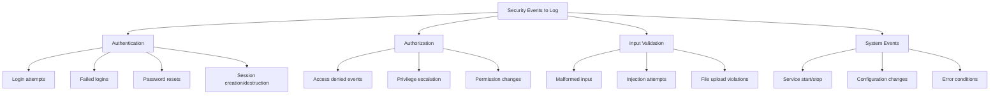
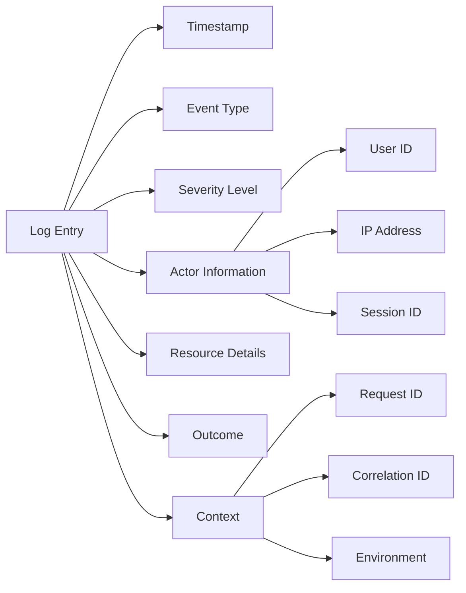
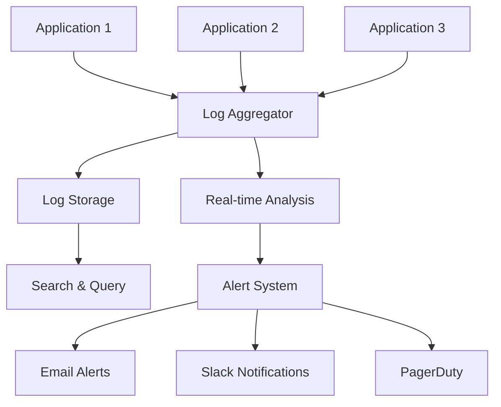

# How to Fix 'Insufficient Logging' Issues

Author: [nawazdhandala](https://www.github.com/nawazdhandala)

Tags: Security, Logging, Monitoring, OWASP, Observability, Best Practices

Description: Learn how to identify and fix insufficient logging vulnerabilities in your applications to improve security monitoring and incident response.

---

Insufficient logging is one of the most overlooked security vulnerabilities in modern applications. When your application fails to log critical events properly, you lose visibility into attacks, making it nearly impossible to detect breaches or understand what happened during a security incident.

---

## Why Insufficient Logging Is Dangerous

The OWASP Top 10 includes insufficient logging and monitoring as a critical vulnerability. Without proper logs, attackers can:

- Probe your systems without detection
- Maintain persistent access for extended periods
- Cover their tracks after a breach
- Exploit vulnerabilities repeatedly

Studies show that the average time to detect a breach is over 200 days. Proper logging can reduce this dramatically.

---

## What Should You Log?



---

## Bad Logging Example

Here is a common anti-pattern where critical events are not logged:

```python
# BAD: No logging of security events
def login(username, password):
    user = find_user(username)
    if user and verify_password(password, user.password_hash):
        return create_session(user)
    return None  # Silent failure - attacker gets no feedback, but neither do you

def access_resource(user, resource_id):
    resource = get_resource(resource_id)
    if not user.can_access(resource):
        return None  # No record of unauthorized access attempt
    return resource
```

This code works functionally but provides no visibility into authentication failures or unauthorized access attempts.

---

## Implementing Proper Logging

### Python Example with Structured Logging

```python
import logging
import json
from datetime import datetime
from functools import wraps

# Configure structured logging
class SecurityLogger:
    def __init__(self, name):
        self.logger = logging.getLogger(name)
        self.logger.setLevel(logging.INFO)

        # Use JSON formatter for structured logs
        handler = logging.StreamHandler()
        handler.setFormatter(logging.Formatter('%(message)s'))
        self.logger.addHandler(handler)

    def log_event(self, event_type, details, severity="INFO"):
        log_entry = {
            "timestamp": datetime.utcnow().isoformat(),
            "event_type": event_type,
            "severity": severity,
            "details": details
        }

        if severity == "CRITICAL":
            self.logger.critical(json.dumps(log_entry))
        elif severity == "WARNING":
            self.logger.warning(json.dumps(log_entry))
        else:
            self.logger.info(json.dumps(log_entry))

security_log = SecurityLogger("security")

def login(username, password, ip_address):
    user = find_user(username)

    # Log all authentication attempts
    if not user:
        security_log.log_event(
            "AUTH_FAILURE",
            {
                "reason": "user_not_found",
                "username": username,
                "ip_address": ip_address
            },
            severity="WARNING"
        )
        return None

    if not verify_password(password, user.password_hash):
        security_log.log_event(
            "AUTH_FAILURE",
            {
                "reason": "invalid_password",
                "username": username,
                "user_id": user.id,
                "ip_address": ip_address,
                "failed_attempts": user.failed_login_count + 1
            },
            severity="WARNING"
        )
        increment_failed_attempts(user)
        return None

    # Log successful login
    security_log.log_event(
        "AUTH_SUCCESS",
        {
            "username": username,
            "user_id": user.id,
            "ip_address": ip_address
        }
    )

    reset_failed_attempts(user)
    return create_session(user)
```

---

### Node.js Example with Winston

```javascript
const winston = require('winston');

// Create security-focused logger
const securityLogger = winston.createLogger({
    level: 'info',
    format: winston.format.combine(
        winston.format.timestamp(),
        winston.format.json()
    ),
    defaultMeta: { service: 'auth-service' },
    transports: [
        // Write security events to dedicated file
        new winston.transports.File({
            filename: 'logs/security.log',
            level: 'warn'
        }),
        // Also send to centralized logging
        new winston.transports.Console()
    ]
});

async function authenticateUser(username, password, req) {
    const ipAddress = req.ip;
    const userAgent = req.headers['user-agent'];

    try {
        const user = await User.findByUsername(username);

        if (!user) {
            // Log failed attempt with context
            securityLogger.warn('Authentication failed', {
                event: 'AUTH_FAILURE',
                reason: 'user_not_found',
                username: username,
                ipAddress: ipAddress,
                userAgent: userAgent,
                timestamp: new Date().toISOString()
            });
            return { success: false };
        }

        const isValid = await bcrypt.compare(password, user.passwordHash);

        if (!isValid) {
            securityLogger.warn('Authentication failed', {
                event: 'AUTH_FAILURE',
                reason: 'invalid_password',
                userId: user.id,
                username: username,
                ipAddress: ipAddress,
                failedAttempts: user.failedAttempts + 1
            });

            await user.incrementFailedAttempts();

            // Detect brute force
            if (user.failedAttempts >= 5) {
                securityLogger.error('Possible brute force attack', {
                    event: 'BRUTE_FORCE_DETECTED',
                    userId: user.id,
                    ipAddress: ipAddress,
                    attemptCount: user.failedAttempts
                });
            }

            return { success: false };
        }

        // Log successful authentication
        securityLogger.info('Authentication successful', {
            event: 'AUTH_SUCCESS',
            userId: user.id,
            ipAddress: ipAddress
        });

        return { success: true, user: user };

    } catch (error) {
        // Log unexpected errors
        securityLogger.error('Authentication error', {
            event: 'AUTH_ERROR',
            error: error.message,
            stack: error.stack,
            ipAddress: ipAddress
        });
        throw error;
    }
}
```

---

## Log Structure Best Practices



---

## What NOT to Log

While comprehensive logging is important, some data should never appear in logs:

```python
# NEVER log these items
SENSITIVE_FIELDS = [
    'password',
    'credit_card',
    'ssn',
    'api_key',
    'token',
    'secret'
]

def sanitize_log_data(data):
    """Remove sensitive fields before logging"""
    if isinstance(data, dict):
        return {
            k: '[REDACTED]' if k.lower() in SENSITIVE_FIELDS else sanitize_log_data(v)
            for k, v in data.items()
        }
    return data

# Example usage
def log_request(request_data):
    safe_data = sanitize_log_data(request_data)
    security_log.log_event("API_REQUEST", safe_data)
```

---

## Centralized Logging Architecture



---

## Setting Up Alerts

Logs are useless if nobody reviews them. Set up automated alerts for critical events:

```python
# Alert thresholds configuration
ALERT_RULES = {
    "failed_logins": {
        "threshold": 5,
        "window_minutes": 10,
        "severity": "high"
    },
    "privilege_escalation": {
        "threshold": 1,
        "window_minutes": 1,
        "severity": "critical"
    },
    "unusual_access_pattern": {
        "threshold": 100,
        "window_minutes": 5,
        "severity": "medium"
    }
}

class AlertManager:
    def check_thresholds(self, event_type, count, user_id=None):
        rule = ALERT_RULES.get(event_type)
        if rule and count >= rule["threshold"]:
            self.send_alert(
                event_type=event_type,
                severity=rule["severity"],
                details={
                    "count": count,
                    "user_id": user_id,
                    "window": rule["window_minutes"]
                }
            )

    def send_alert(self, event_type, severity, details):
        # Integration with alerting systems
        if severity == "critical":
            self.page_on_call_engineer(event_type, details)
        self.send_to_slack(event_type, severity, details)
```

---

## Log Retention Policy

Different types of logs require different retention periods:

| Log Type | Minimum Retention | Recommended |
|----------|------------------|-------------|
| Authentication logs | 90 days | 1 year |
| Access control logs | 90 days | 1 year |
| Error logs | 30 days | 90 days |
| Debug logs | 7 days | 14 days |
| Audit logs | 1 year | 7 years |

---

## Testing Your Logging

```python
import unittest
from unittest.mock import patch, MagicMock

class TestSecurityLogging(unittest.TestCase):

    @patch('security.security_log')
    def test_failed_login_is_logged(self, mock_logger):
        # Attempt login with wrong password
        result = login("testuser", "wrongpassword", "192.168.1.1")

        # Verify the event was logged
        mock_logger.log_event.assert_called()
        call_args = mock_logger.log_event.call_args

        self.assertEqual(call_args[0][0], "AUTH_FAILURE")
        self.assertEqual(call_args[1]["severity"], "WARNING")

    @patch('security.security_log')
    def test_successful_login_is_logged(self, mock_logger):
        # Create test user
        create_test_user("testuser", "correctpassword")

        result = login("testuser", "correctpassword", "192.168.1.1")

        # Verify success event was logged
        mock_logger.log_event.assert_called()
        call_args = mock_logger.log_event.call_args

        self.assertEqual(call_args[0][0], "AUTH_SUCCESS")
```

---

## Summary

Fixing insufficient logging requires a systematic approach:

1. **Identify critical events** that need logging (authentication, authorization, errors)
2. **Use structured logging** with consistent formats (JSON is ideal)
3. **Include context** like timestamps, user IDs, IP addresses, and request IDs
4. **Never log sensitive data** like passwords or API keys
5. **Centralize your logs** for easier analysis and correlation
6. **Set up alerts** for suspicious patterns
7. **Test your logging** to ensure events are captured correctly
8. **Define retention policies** based on compliance requirements

---

*Need help monitoring your application's security events? [OneUptime](https://oneuptime.com) provides centralized logging, real-time alerting, and security monitoring to help you detect and respond to threats faster.*
