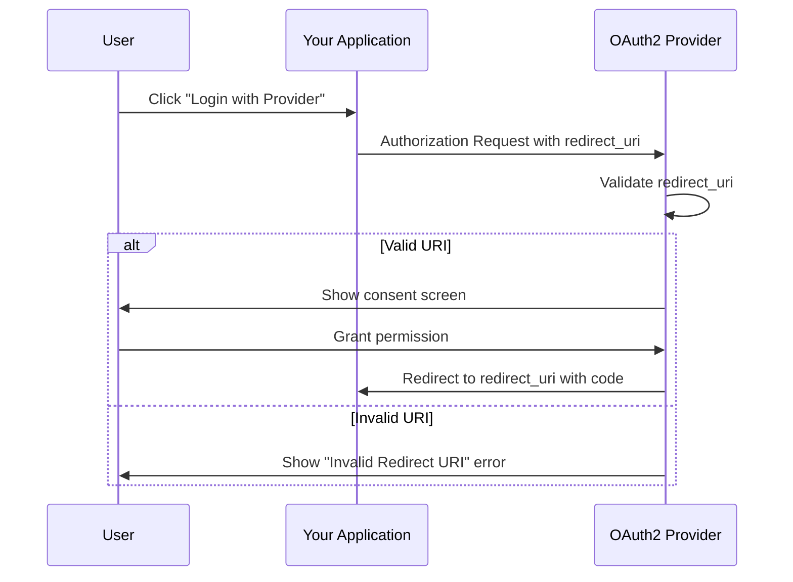
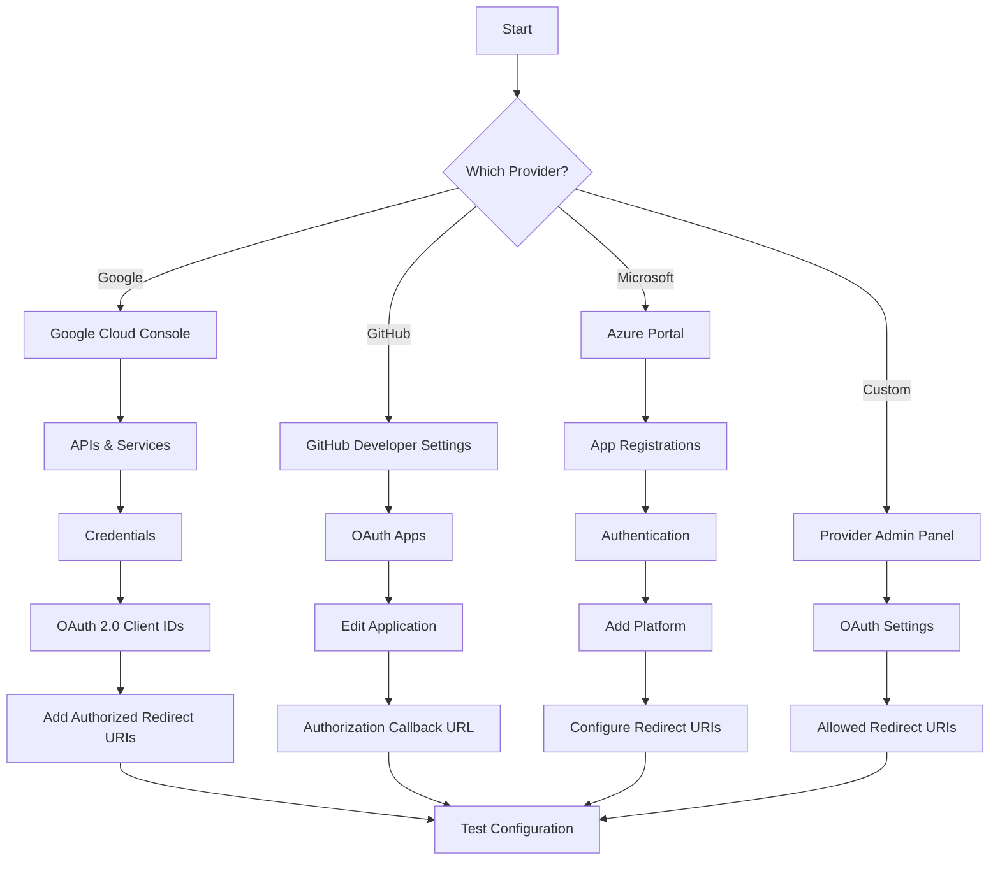

# How to Fix 'Invalid Redirect URI' OAuth2 Errors

Author: [nawazdhandala](https://github.com/nawazdhandala)

Tags: OAuth2, Authentication, Security, Debugging, Web Development

Description: Learn how to diagnose and fix the common 'Invalid Redirect URI' error in OAuth2 implementations with practical examples and configuration tips.

---

The "Invalid Redirect URI" error is one of the most common OAuth2 issues developers encounter. This error occurs when the redirect URI in your authorization request does not match any of the URIs registered with your OAuth2 provider. This guide will help you understand why this happens and how to fix it.

## Understanding the OAuth2 Redirect Flow

Before diving into the fix, let us understand how redirect URIs work in OAuth2. The redirect URI is where the authorization server sends the user after they grant or deny permission.



## Common Causes of Invalid Redirect URI Errors

### 1. Mismatched Protocol (HTTP vs HTTPS)

The most common cause is a protocol mismatch. If you registered `https://example.com/callback` but your application sends `http://example.com/callback`, the request will fail.

```python
# Incorrect - Using HTTP in development but HTTPS registered
redirect_uri = "http://localhost:3000/auth/callback"

# Correct - Match exactly what is registered
redirect_uri = "https://localhost:3000/auth/callback"
```

### 2. Trailing Slash Differences

A trailing slash can cause the validation to fail:

```javascript
// Registered URI: https://myapp.com/callback

// This will FAIL - has trailing slash
const redirectUri = "https://myapp.com/callback/";

// This will SUCCEED - exact match
const redirectUri = "https://myapp.com/callback";
```

### 3. Query Parameters in Redirect URI

Some providers do not allow query parameters in redirect URIs:

```python
# This may fail with many providers
redirect_uri = "https://myapp.com/callback?source=google"

# Use state parameter instead for passing data
redirect_uri = "https://myapp.com/callback"
state = "source=google"
```

### 4. Port Number Mismatches

During development, different port numbers cause failures:

```javascript
// Registered: http://localhost:3000/callback

// This will FAIL - wrong port
const redirectUri = "http://localhost:8080/callback";

// This will SUCCEED - correct port
const redirectUri = "http://localhost:3000/callback";
```

### 5. Case Sensitivity

Some OAuth2 providers perform case-sensitive matching:

```python
# Registered: https://myapp.com/Auth/Callback

# This may FAIL - different case
redirect_uri = "https://myapp.com/auth/callback"

# This will SUCCEED - exact case match
redirect_uri = "https://myapp.com/Auth/Callback"
```

## Fixing the Error in Different OAuth2 Providers

### Google OAuth2

In the Google Cloud Console, add all redirect URIs you need:

```python
# settings.py for Django with Google OAuth2

SOCIALACCOUNT_PROVIDERS = {
    'google': {
        'APP': {
            'client_id': 'your-client-id.apps.googleusercontent.com',
            'secret': 'your-client-secret',
            'key': ''
        },
        'SCOPE': [
            'profile',
            'email',
        ],
        'AUTH_PARAMS': {
            'access_type': 'online',
        }
    }
}

# Make sure this matches what is in Google Cloud Console
# Authorized redirect URIs:
# - http://localhost:8000/accounts/google/login/callback/
# - https://yourproduction.com/accounts/google/login/callback/
```

### GitHub OAuth2

For GitHub, configure in Settings > Developer settings > OAuth Apps:

```javascript
// Node.js Express example
const passport = require('passport');
const GitHubStrategy = require('passport-github2').Strategy;

passport.use(new GitHubStrategy({
    clientID: process.env.GITHUB_CLIENT_ID,
    clientSecret: process.env.GITHUB_CLIENT_SECRET,
    // This must match the callback URL in GitHub OAuth App settings
    callbackURL: process.env.NODE_ENV === 'production'
        ? "https://yourapp.com/auth/github/callback"
        : "http://localhost:3000/auth/github/callback"
  },
  function(accessToken, refreshToken, profile, done) {
    // Handle authentication
    return done(null, profile);
  }
));
```

### Microsoft Azure AD

Azure AD requires explicit redirect URI registration:

```csharp
// appsettings.json for ASP.NET Core
{
  "AzureAd": {
    "Instance": "https://login.microsoftonline.com/",
    "TenantId": "your-tenant-id",
    "ClientId": "your-client-id",
    "CallbackPath": "/signin-oidc"
  }
}

// The full redirect URI will be: https://yourapp.com/signin-oidc
// Register this exact URI in Azure Portal > App registrations > Authentication
```

## Debugging Invalid Redirect URI Errors

### Step 1: Check the Authorization URL

Log the complete authorization URL your application generates:

```python
# Python example with requests-oauthlib
from requests_oauthlib import OAuth2Session

client_id = "your-client-id"
redirect_uri = "https://yourapp.com/callback"

oauth = OAuth2Session(client_id, redirect_uri=redirect_uri)
authorization_url, state = oauth.authorization_url(
    "https://provider.com/oauth/authorize"
)

# Print and verify this URL
print(f"Authorization URL: {authorization_url}")
# Check the redirect_uri parameter in this URL
```

### Step 2: Compare with Registered URIs

Create a checklist to compare:

```python
def validate_redirect_uri(registered_uris, requested_uri):
    """
    Helper function to diagnose redirect URI mismatches.
    """
    print(f"Requested URI: {requested_uri}")
    print(f"Requested URI length: {len(requested_uri)}")
    print(f"Requested URI ends with slash: {requested_uri.endswith('/')}")

    for registered in registered_uris:
        print(f"\nComparing with: {registered}")
        print(f"  Exact match: {registered == requested_uri}")
        print(f"  Case-insensitive match: {registered.lower() == requested_uri.lower()}")
        print(f"  Length difference: {len(registered) - len(requested_uri)}")

        # Check each component
        from urllib.parse import urlparse
        reg_parsed = urlparse(registered)
        req_parsed = urlparse(requested_uri)

        print(f"  Scheme match: {reg_parsed.scheme == req_parsed.scheme}")
        print(f"  Host match: {reg_parsed.netloc == req_parsed.netloc}")
        print(f"  Path match: {reg_parsed.path == req_parsed.path}")

# Usage
registered = [
    "https://myapp.com/auth/callback",
    "http://localhost:3000/auth/callback"
]
validate_redirect_uri(registered, "https://myapp.com/auth/callback/")
```

### Step 3: Use Environment-Specific Configuration

```javascript
// config.js - Environment-aware redirect URI configuration
const config = {
    development: {
        redirectUri: "http://localhost:3000/auth/callback",
        baseUrl: "http://localhost:3000"
    },
    staging: {
        redirectUri: "https://staging.myapp.com/auth/callback",
        baseUrl: "https://staging.myapp.com"
    },
    production: {
        redirectUri: "https://myapp.com/auth/callback",
        baseUrl: "https://myapp.com"
    }
};

// Get the correct config based on NODE_ENV
const getConfig = () => {
    const env = process.env.NODE_ENV || 'development';
    return config[env];
};

module.exports = { getConfig };
```

## Complete Working Example

Here is a complete Node.js example with proper redirect URI handling:

```javascript
// server.js
const express = require('express');
const axios = require('axios');
const querystring = require('querystring');

const app = express();

// Configuration
const OAUTH_CONFIG = {
    clientId: process.env.OAUTH_CLIENT_ID,
    clientSecret: process.env.OAUTH_CLIENT_SECRET,
    authorizationEndpoint: 'https://provider.com/oauth/authorize',
    tokenEndpoint: 'https://provider.com/oauth/token',
    // Dynamically determine redirect URI based on environment
    getRedirectUri: (req) => {
        const protocol = req.secure ? 'https' : 'http';
        const host = req.get('host');
        return `${protocol}://${host}/auth/callback`;
    }
};

// Initiate OAuth flow
app.get('/auth/login', (req, res) => {
    const redirectUri = OAUTH_CONFIG.getRedirectUri(req);

    // Log for debugging
    console.log(`Using redirect URI: ${redirectUri}`);

    const params = querystring.stringify({
        client_id: OAUTH_CONFIG.clientId,
        redirect_uri: redirectUri,
        response_type: 'code',
        scope: 'openid profile email',
        state: generateRandomState() // Implement CSRF protection
    });

    res.redirect(`${OAUTH_CONFIG.authorizationEndpoint}?${params}`);
});

// Handle OAuth callback
app.get('/auth/callback', async (req, res) => {
    const { code, state, error } = req.query;

    // Handle errors from the provider
    if (error) {
        console.error(`OAuth error: ${error}`);
        return res.redirect('/login?error=' + error);
    }

    // Verify state to prevent CSRF
    if (!verifyState(state)) {
        return res.status(403).send('Invalid state parameter');
    }

    try {
        // Exchange code for tokens
        const redirectUri = OAUTH_CONFIG.getRedirectUri(req);

        const tokenResponse = await axios.post(
            OAUTH_CONFIG.tokenEndpoint,
            querystring.stringify({
                grant_type: 'authorization_code',
                code: code,
                redirect_uri: redirectUri, // Must match the original request
                client_id: OAUTH_CONFIG.clientId,
                client_secret: OAUTH_CONFIG.clientSecret
            }),
            {
                headers: {
                    'Content-Type': 'application/x-www-form-urlencoded'
                }
            }
        );

        // Handle successful authentication
        const { access_token, refresh_token } = tokenResponse.data;
        // Store tokens and create session

        res.redirect('/dashboard');
    } catch (err) {
        console.error('Token exchange failed:', err.response?.data || err.message);
        res.redirect('/login?error=token_exchange_failed');
    }
});

// Helper functions
function generateRandomState() {
    return require('crypto').randomBytes(16).toString('hex');
}

function verifyState(state) {
    // Implement proper state verification
    // Compare with stored state from session
    return true; // Placeholder
}

app.listen(3000, () => {
    console.log('Server running on port 3000');
});
```

## Provider-Specific Configuration

### Registering Redirect URIs



## Best Practices

### 1. Use Exact Matching

Always register the exact URI your application will use:

```python
# Register all variants you need
ALLOWED_REDIRECT_URIS = [
    # Development
    "http://localhost:3000/auth/callback",
    "http://127.0.0.1:3000/auth/callback",

    # Staging
    "https://staging.myapp.com/auth/callback",

    # Production
    "https://myapp.com/auth/callback",
    "https://www.myapp.com/auth/callback",
]
```

### 2. Avoid Dynamic Redirect URIs

Do not construct redirect URIs from user input:

```python
# DANGEROUS - Never do this
redirect_uri = f"https://{user_provided_domain}/callback"

# SAFE - Use predefined URIs only
redirect_uri = ALLOWED_REDIRECT_URIS[environment]
```

### 3. Use Environment Variables

```bash
# .env.development
OAUTH_REDIRECT_URI=http://localhost:3000/auth/callback

# .env.production
OAUTH_REDIRECT_URI=https://myapp.com/auth/callback
```

### 4. Test in All Environments

Create a testing checklist:

```markdown
## Redirect URI Testing Checklist

- [ ] Local development (http://localhost:PORT)
- [ ] Local with IP (http://127.0.0.1:PORT)
- [ ] Staging environment
- [ ] Production without www
- [ ] Production with www
- [ ] HTTPS enforcement in production
- [ ] Mobile app deep links (if applicable)
```

## Troubleshooting Specific Error Messages

### "redirect_uri_mismatch" (Google)

```python
# Google requires exact match including trailing slash behavior
# Check Google Cloud Console > APIs & Services > Credentials

# If your app uses: https://myapp.com/callback
# Register exactly: https://myapp.com/callback
# NOT: https://myapp.com/callback/
```

### "The redirect_uri is not valid" (GitHub)

```javascript
// GitHub only allows one callback URL per OAuth App
// For multiple environments, create separate OAuth Apps

// Development App: http://localhost:3000/auth/github/callback
// Production App: https://myapp.com/auth/github/callback

// Use different client IDs per environment
const clientId = process.env.NODE_ENV === 'production'
    ? process.env.GITHUB_CLIENT_ID_PROD
    : process.env.GITHUB_CLIENT_ID_DEV;
```

### "AADSTS50011: Reply URL mismatch" (Azure AD)

```csharp
// Azure AD error - check these common issues:
// 1. Reply URL not registered in App Registration
// 2. Wrong tenant configuration
// 3. Protocol mismatch (http vs https)

// In Azure Portal:
// App registrations > Your App > Authentication > Add platform > Web
// Add your redirect URI exactly as it appears in your application
```

## Conclusion

The "Invalid Redirect URI" error is almost always caused by a mismatch between what your application sends and what is registered with the OAuth2 provider. To fix this error:

1. Check for exact string matching including protocol, host, port, path, and trailing slashes
2. Register all environment-specific URIs with your OAuth2 provider
3. Use environment variables to manage different redirect URIs
4. Test thoroughly in all deployment environments

By following these guidelines and using the debugging techniques shown above, you can quickly identify and resolve redirect URI mismatches in your OAuth2 implementation.
