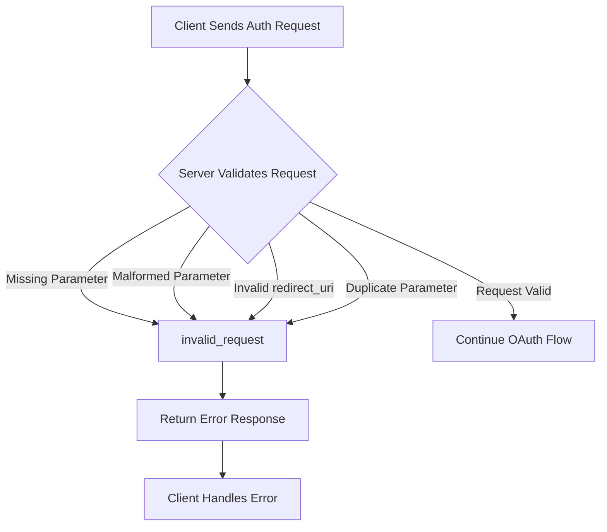
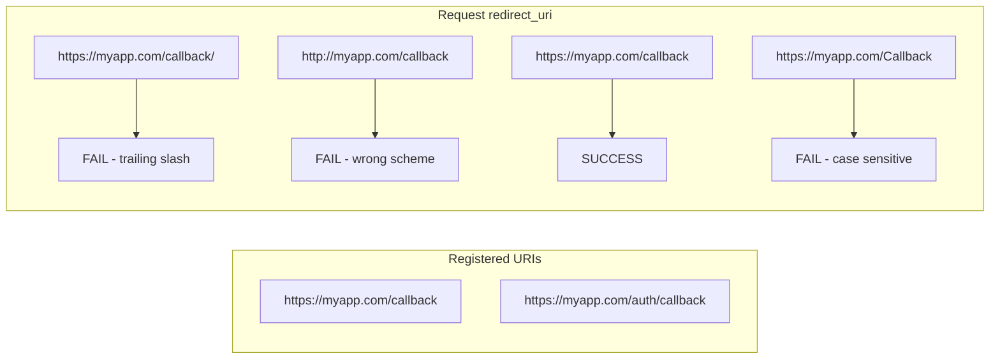
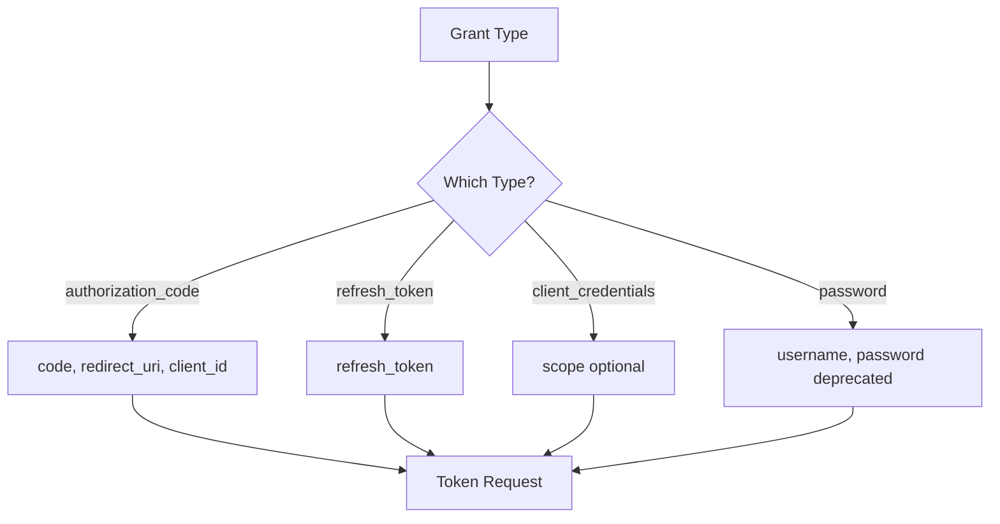

# How to Fix "Invalid Request" OAuth2 Errors

Author: [nawazdhandala](https://www.github.com/nawazdhandala)

Tags: OAuth2, Authentication, Security, API, Troubleshooting, Authorization

Description: A practical guide to diagnosing and fixing "invalid_request" OAuth2 errors, covering common causes like malformed parameters, missing required fields, and redirect URI mismatches.

---

The "invalid_request" error is one of the most common OAuth2 errors you will encounter. It indicates that the authorization server cannot understand or process your request due to malformed syntax, missing parameters, or invalid values. This guide walks through systematic debugging and fixes.

## Understanding the Error

The OAuth2 specification defines "invalid_request" as a catch-all for requests that are malformed or missing required parameters.



### Common Error Response Format

```json
{
  "error": "invalid_request",
  "error_description": "The request is missing a required parameter, includes an invalid parameter value, includes a parameter more than once, or is otherwise malformed.",
  "error_uri": "https://tools.ietf.org/html/rfc6749#section-4.1.2.1"
}
```

## Root Cause 1: Missing Required Parameters

The authorization endpoint requires specific parameters that vary by grant type.

### Authorization Code Flow Required Parameters

```javascript
// Incorrect - missing required parameters
const authUrl = 'https://auth.example.com/authorize?client_id=abc123';

// Correct - all required parameters included
const authUrl = new URL('https://auth.example.com/authorize');
authUrl.searchParams.set('client_id', 'abc123');
authUrl.searchParams.set('response_type', 'code');
authUrl.searchParams.set('redirect_uri', 'https://myapp.com/callback');
authUrl.searchParams.set('scope', 'openid profile email');
authUrl.searchParams.set('state', generateSecureState());

console.log(authUrl.toString());
```

### Token Endpoint Required Parameters

```javascript
// Token exchange request
async function exchangeCodeForToken(code) {
    const params = new URLSearchParams();

    // All required parameters for authorization_code grant
    params.append('grant_type', 'authorization_code');
    params.append('code', code);
    params.append('redirect_uri', 'https://myapp.com/callback');
    params.append('client_id', process.env.CLIENT_ID);
    params.append('client_secret', process.env.CLIENT_SECRET);

    const response = await fetch('https://auth.example.com/oauth/token', {
        method: 'POST',
        headers: {
            'Content-Type': 'application/x-www-form-urlencoded',
        },
        body: params.toString(),
    });

    if (!response.ok) {
        const error = await response.json();
        console.error('Token exchange failed:', error);
        throw new Error(error.error_description || error.error);
    }

    return response.json();
}
```

## Root Cause 2: Redirect URI Mismatch

The redirect_uri must exactly match one registered with the authorization server.



### Debugging Redirect URI Issues

```javascript
// Utility to validate redirect URI before sending request
function validateRedirectUri(requestedUri, registeredUris) {
    const issues = [];

    // Check exact match
    if (!registeredUris.includes(requestedUri)) {
        issues.push(`URI "${requestedUri}" not in registered list`);

        // Check for common problems
        for (const registered of registeredUris) {
            // Trailing slash difference
            if (requestedUri === registered + '/' || requestedUri + '/' === registered) {
                issues.push(`Trailing slash mismatch with "${registered}"`);
            }

            // Case difference
            if (requestedUri.toLowerCase() === registered.toLowerCase()) {
                issues.push(`Case mismatch with "${registered}"`);
            }

            // Scheme difference
            const requestedUrl = new URL(requestedUri);
            const registeredUrl = new URL(registered);
            if (requestedUrl.hostname === registeredUrl.hostname &&
                requestedUrl.pathname === registeredUrl.pathname &&
                requestedUrl.protocol !== registeredUrl.protocol) {
                issues.push(`Protocol mismatch: ${requestedUrl.protocol} vs ${registeredUrl.protocol}`);
            }
        }
    }

    return {
        valid: issues.length === 0,
        issues,
    };
}

// Usage
const registered = [
    'https://myapp.com/callback',
    'https://staging.myapp.com/callback',
];

const result = validateRedirectUri('https://myapp.com/callback/', registered);
if (!result.valid) {
    console.error('Redirect URI issues:', result.issues);
}
```

## Root Cause 3: Malformed or Encoded Parameters

Improper URL encoding causes many invalid_request errors.

```javascript
// Incorrect - double encoding
const scope = encodeURIComponent(encodeURIComponent('openid profile'));
// Results in: openid%2520profile (wrong)

// Correct - single encoding or use URLSearchParams
const params = new URLSearchParams();
params.set('scope', 'openid profile'); // Automatically encoded correctly
// Results in: openid%20profile (correct)
```

### Building Authorization URLs Safely

```javascript
class OAuth2Client {
    constructor(config) {
        this.authorizationEndpoint = config.authorizationEndpoint;
        this.tokenEndpoint = config.tokenEndpoint;
        this.clientId = config.clientId;
        this.clientSecret = config.clientSecret;
        this.redirectUri = config.redirectUri;
        this.scopes = config.scopes || [];
    }

    buildAuthorizationUrl(options = {}) {
        const url = new URL(this.authorizationEndpoint);

        // Required parameters
        url.searchParams.set('client_id', this.clientId);
        url.searchParams.set('response_type', options.responseType || 'code');
        url.searchParams.set('redirect_uri', this.redirectUri);

        // Scope - join with space, URLSearchParams handles encoding
        const scopes = options.scopes || this.scopes;
        if (scopes.length > 0) {
            url.searchParams.set('scope', scopes.join(' '));
        }

        // State - required for security
        const state = options.state || this.generateState();
        url.searchParams.set('state', state);

        // Optional PKCE parameters
        if (options.codeChallenge) {
            url.searchParams.set('code_challenge', options.codeChallenge);
            url.searchParams.set('code_challenge_method', options.codeChallengeMethod || 'S256');
        }

        // Optional parameters
        if (options.nonce) {
            url.searchParams.set('nonce', options.nonce);
        }

        if (options.prompt) {
            url.searchParams.set('prompt', options.prompt);
        }

        return {
            url: url.toString(),
            state,
        };
    }

    generateState() {
        const array = new Uint8Array(32);
        crypto.getRandomValues(array);
        return Array.from(array, b => b.toString(16).padStart(2, '0')).join('');
    }
}

// Usage
const client = new OAuth2Client({
    authorizationEndpoint: 'https://auth.example.com/authorize',
    tokenEndpoint: 'https://auth.example.com/oauth/token',
    clientId: 'your-client-id',
    redirectUri: 'https://myapp.com/callback',
    scopes: ['openid', 'profile', 'email'],
});

const { url, state } = client.buildAuthorizationUrl();
// Store state for validation when callback returns
sessionStorage.setItem('oauth_state', state);
```

## Root Cause 4: Duplicate Parameters

OAuth2 does not allow the same parameter to appear multiple times.

```javascript
// Incorrect - duplicate parameters
const badUrl = 'https://auth.example.com/authorize?client_id=abc&client_id=xyz&response_type=code';

// Validation function
function checkDuplicateParams(url) {
    const urlObj = new URL(url);
    const params = new URLSearchParams(urlObj.search);
    const seen = new Set();
    const duplicates = [];

    for (const key of params.keys()) {
        if (seen.has(key)) {
            duplicates.push(key);
        }
        seen.add(key);
    }

    if (duplicates.length > 0) {
        console.error('Duplicate parameters found:', duplicates);
        return false;
    }
    return true;
}
```

## Root Cause 5: Invalid Grant Type

Different grant types have different parameter requirements.



### Grant Type Parameter Matrix

```javascript
const GRANT_TYPE_PARAMS = {
    authorization_code: {
        required: ['code', 'redirect_uri', 'client_id'],
        optional: ['code_verifier'],
    },
    refresh_token: {
        required: ['refresh_token'],
        optional: ['scope'],
    },
    client_credentials: {
        required: [],
        optional: ['scope'],
    },
    // Deprecated but still seen
    password: {
        required: ['username', 'password'],
        optional: ['scope'],
    },
};

function validateTokenRequest(grantType, params) {
    const requirements = GRANT_TYPE_PARAMS[grantType];
    if (!requirements) {
        return { valid: false, error: `Unknown grant type: ${grantType}` };
    }

    const missing = requirements.required.filter(p => !params.has(p));
    if (missing.length > 0) {
        return {
            valid: false,
            error: `Missing required parameters for ${grantType}: ${missing.join(', ')}`
        };
    }

    return { valid: true };
}
```

## Root Cause 6: Content-Type Header Issues

Token requests must use the correct Content-Type.

```javascript
// Incorrect - JSON body with wrong content type
const badRequest = await fetch('https://auth.example.com/oauth/token', {
    method: 'POST',
    headers: {
        'Content-Type': 'application/json', // Wrong for OAuth2 token endpoint
    },
    body: JSON.stringify({
        grant_type: 'authorization_code',
        code: authCode,
    }),
});

// Correct - form-urlencoded
const goodRequest = await fetch('https://auth.example.com/oauth/token', {
    method: 'POST',
    headers: {
        'Content-Type': 'application/x-www-form-urlencoded',
    },
    body: new URLSearchParams({
        grant_type: 'authorization_code',
        code: authCode,
        redirect_uri: redirectUri,
        client_id: clientId,
        client_secret: clientSecret,
    }).toString(),
});
```

## Debugging Checklist

```javascript
class OAuth2Debugger {
    static analyzeAuthorizationRequest(url) {
        const issues = [];
        const urlObj = new URL(url);
        const params = urlObj.searchParams;

        // Check required parameters
        const required = ['client_id', 'response_type', 'redirect_uri'];
        for (const param of required) {
            if (!params.has(param)) {
                issues.push(`Missing required parameter: ${param}`);
            }
        }

        // Check response_type validity
        const validResponseTypes = ['code', 'token', 'id_token', 'code token', 'code id_token'];
        if (params.has('response_type') && !validResponseTypes.includes(params.get('response_type'))) {
            issues.push(`Invalid response_type: ${params.get('response_type')}`);
        }

        // Check state presence (security best practice)
        if (!params.has('state')) {
            issues.push('Missing state parameter (security warning)');
        }

        // Check redirect_uri format
        if (params.has('redirect_uri')) {
            try {
                new URL(params.get('redirect_uri'));
            } catch {
                issues.push('Invalid redirect_uri format');
            }
        }

        return {
            valid: issues.length === 0,
            issues,
            params: Object.fromEntries(params),
        };
    }
}

// Usage
const analysis = OAuth2Debugger.analyzeAuthorizationRequest(
    'https://auth.example.com/authorize?client_id=abc&response_type=code'
);
console.log(analysis);
// { valid: false, issues: ['Missing required parameter: redirect_uri', 'Missing state parameter'] }
```

## Summary

The "invalid_request" error usually comes from one of these issues:

1. Missing required parameters (client_id, response_type, redirect_uri)
2. Redirect URI not matching registered URIs exactly
3. Improper URL encoding of parameters
4. Duplicate parameters in the request
5. Wrong Content-Type header on token requests
6. Provider-specific parameter requirements

Use the debugging utilities provided here to systematically identify and fix the issue. Always validate your requests before sending them to the authorization server.
