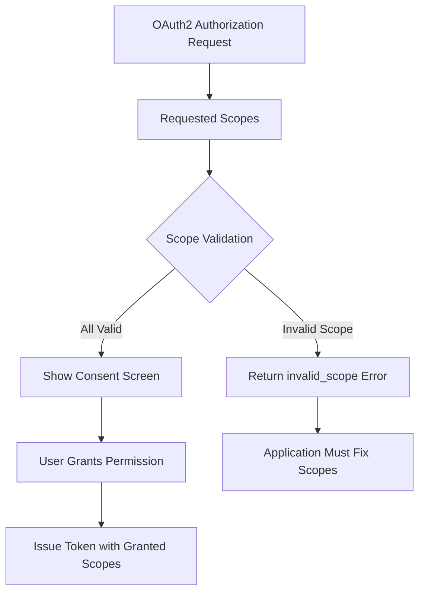
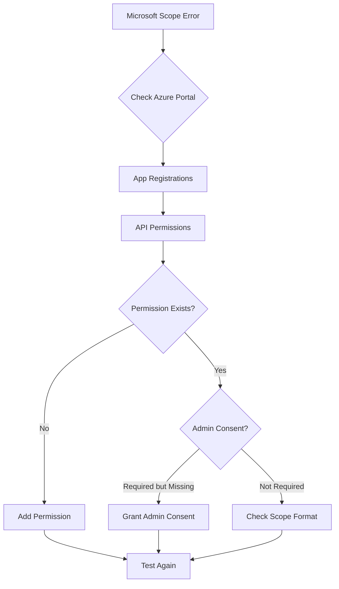

# How to Fix "Invalid Scope" OAuth2 Errors

Author: [nawazdhandala](https://github.com/nawazdhandala)

Tags: OAuth2, Scopes, Authentication, Security, API, Debugging

Description: Learn how to diagnose and fix "invalid_scope" OAuth2 errors with practical examples for common providers and best practices for scope management.

---

The "invalid_scope" error in OAuth2 occurs when your application requests scopes that are not recognized, not allowed, or incorrectly formatted. This guide explains why this error happens and how to fix it for different OAuth2 providers.

## Understanding OAuth2 Scopes

Scopes define the level of access your application requests from the user. They act as permissions that limit what your application can do with the user's account.



## Common Causes of Invalid Scope Errors

### 1. Typos in Scope Names

```python
# Incorrect - typo in scope name
SCOPES = [
    'openid',
    'profle',  # Typo: should be 'profile'
    'email'
]

# Correct
SCOPES = [
    'openid',
    'profile',
    'email'
]
```

### 2. Using Wrong Scope Format

Different providers use different scope formats:

```python
# Google uses URL-style scopes
GOOGLE_SCOPES = [
    'openid',
    'https://www.googleapis.com/auth/userinfo.email',
    'https://www.googleapis.com/auth/userinfo.profile'
]

# Or shorthand versions
GOOGLE_SCOPES_SHORT = ['openid', 'email', 'profile']

# GitHub uses simple strings
GITHUB_SCOPES = ['user:email', 'read:user', 'repo']

# Microsoft uses URL-style or simple strings
MICROSOFT_SCOPES = [
    'openid',
    'profile',
    'email',
    'offline_access',
    'https://graph.microsoft.com/User.Read'
]
```

### 3. Requesting Scopes Not Enabled for Your App

```python
# Error: Requesting admin scopes without proper app configuration
SCOPES = [
    'openid',
    'profile',
    'admin.directory.user.readonly'  # Requires admin consent and special setup
]

# Fix: Only request scopes your app is configured for
SCOPES = [
    'openid',
    'profile',
    'email'
]
```

### 4. Incorrect Scope Separator

```python
# Incorrect - using commas
scope_param = 'openid,profile,email'  # Wrong!

# Correct - using spaces
scope_param = 'openid profile email'

# Or in URL encoding
from urllib.parse import urlencode
params = urlencode({'scope': 'openid profile email'})
# Results in: scope=openid+profile+email
```

## Fixing Invalid Scope by Provider

### Google

```python
# google_scopes.py - Google OAuth2 Scope Configuration

# Valid Google OAuth2 scopes
GOOGLE_SCOPES = {
    # OpenID Connect scopes
    'basic': [
        'openid',           # Required for OIDC
        'profile',          # Basic profile info
        'email'             # Email address
    ],

    # Google API scopes (full URL format)
    'calendar_readonly': 'https://www.googleapis.com/auth/calendar.readonly',
    'calendar_full': 'https://www.googleapis.com/auth/calendar',
    'drive_readonly': 'https://www.googleapis.com/auth/drive.readonly',
    'drive_file': 'https://www.googleapis.com/auth/drive.file',
    'gmail_readonly': 'https://www.googleapis.com/auth/gmail.readonly',
    'gmail_send': 'https://www.googleapis.com/auth/gmail.send',

    # Sheets API
    'sheets_readonly': 'https://www.googleapis.com/auth/spreadsheets.readonly',
    'sheets_full': 'https://www.googleapis.com/auth/spreadsheets'
}

def get_google_scopes(requested_features):
    """Build a valid scope list based on requested features."""
    scopes = list(GOOGLE_SCOPES['basic'])  # Always include basic scopes

    for feature in requested_features:
        if feature in GOOGLE_SCOPES:
            scope = GOOGLE_SCOPES[feature]
            if isinstance(scope, list):
                scopes.extend(scope)
            else:
                scopes.append(scope)

    return list(set(scopes))  # Remove duplicates

# Usage
scopes = get_google_scopes(['calendar_readonly', 'drive_file'])
# Returns: ['openid', 'profile', 'email',
#           'https://www.googleapis.com/auth/calendar.readonly',
#           'https://www.googleapis.com/auth/drive.file']
```

#### Checking Google Scope Validity

```python
import requests

def validate_google_scopes(scopes):
    """Validate Google OAuth2 scopes before use."""
    # Google's scope validation endpoint
    validation_url = 'https://www.googleapis.com/oauth2/v1/tokeninfo'

    valid_prefixes = [
        'openid',
        'email',
        'profile',
        'https://www.googleapis.com/auth/'
    ]

    invalid_scopes = []
    for scope in scopes:
        is_valid = any(scope.startswith(prefix) or scope == prefix
                      for prefix in valid_prefixes)
        if not is_valid:
            invalid_scopes.append(scope)

    if invalid_scopes:
        return False, f"Invalid scopes: {', '.join(invalid_scopes)}"

    return True, "All scopes valid"

# Check scopes before authorization
is_valid, message = validate_google_scopes(['openid', 'invalid_scope'])
if not is_valid:
    print(f"Error: {message}")
```

### GitHub

```python
# github_scopes.py - GitHub OAuth2 Scope Configuration

# Valid GitHub OAuth scopes (as of 2024)
GITHUB_SCOPES = {
    # User scopes
    'user': 'Full user profile access',
    'user:email': 'Read user email addresses',
    'user:follow': 'Follow/unfollow users',
    'read:user': 'Read user profile data',

    # Repository scopes
    'repo': 'Full repository access',
    'repo:status': 'Commit status access',
    'repo_deployment': 'Deployment status access',
    'public_repo': 'Public repository access only',
    'repo:invite': 'Repository invitation access',
    'security_events': 'Security events access',

    # Organization scopes
    'admin:org': 'Full org admin access',
    'write:org': 'Write org access',
    'read:org': 'Read org access',

    # Other common scopes
    'gist': 'Create and read gists',
    'notifications': 'Read notifications',
    'workflow': 'GitHub Actions workflows',
    'write:packages': 'Publish packages',
    'read:packages': 'Download packages',
    'delete:packages': 'Delete packages',
    'admin:gpg_key': 'Manage GPG keys',
    'write:gpg_key': 'Write GPG keys',
    'read:gpg_key': 'Read GPG keys'
}

def build_github_scopes(needs_email=True, needs_repos=False, needs_org=False):
    """Build appropriate GitHub scopes based on needs."""
    scopes = []

    if needs_email:
        scopes.extend(['user:email', 'read:user'])

    if needs_repos:
        scopes.append('repo')  # Or 'public_repo' for public only

    if needs_org:
        scopes.append('read:org')

    return scopes

# Common mistake: Using Google-style scopes with GitHub
# Wrong: 'https://github.com/user/email'
# Correct: 'user:email'
```

### Microsoft / Azure AD

```python
# microsoft_scopes.py - Microsoft OAuth2 Scope Configuration

# Microsoft Graph API scopes
MICROSOFT_SCOPES = {
    # OpenID Connect scopes
    'basic': [
        'openid',
        'profile',
        'email',
        'offline_access'  # Required for refresh tokens
    ],

    # User scopes
    'user_read': 'https://graph.microsoft.com/User.Read',
    'user_read_all': 'https://graph.microsoft.com/User.Read.All',
    'user_write': 'https://graph.microsoft.com/User.ReadWrite',

    # Mail scopes
    'mail_read': 'https://graph.microsoft.com/Mail.Read',
    'mail_send': 'https://graph.microsoft.com/Mail.Send',

    # Calendar scopes
    'calendar_read': 'https://graph.microsoft.com/Calendars.Read',
    'calendar_write': 'https://graph.microsoft.com/Calendars.ReadWrite',

    # Files scopes
    'files_read': 'https://graph.microsoft.com/Files.Read',
    'files_write': 'https://graph.microsoft.com/Files.ReadWrite'
}

def get_microsoft_scopes(features):
    """Build Microsoft Graph API scopes."""
    scopes = list(MICROSOFT_SCOPES['basic'])

    for feature in features:
        if feature in MICROSOFT_SCOPES:
            scope = MICROSOFT_SCOPES[feature]
            if isinstance(scope, list):
                scopes.extend(scope)
            else:
                scopes.append(scope)

    return scopes

# Important: Microsoft requires specific API permissions in Azure Portal
# The app must have these permissions configured before requesting them
```



### OAuth2 Provider-Agnostic Solution

```python
# scope_manager.py - Universal Scope Management

class ScopeManager:
    """Manages OAuth2 scopes across different providers."""

    PROVIDERS = {
        'google': {
            'separator': ' ',
            'case_sensitive': True,
            'url_format': True,
            'base_scopes': ['openid', 'email', 'profile']
        },
        'github': {
            'separator': ' ',
            'case_sensitive': True,
            'url_format': False,
            'base_scopes': ['user:email', 'read:user']
        },
        'microsoft': {
            'separator': ' ',
            'case_sensitive': False,
            'url_format': True,
            'base_scopes': ['openid', 'profile', 'email', 'offline_access']
        },
        'facebook': {
            'separator': ',',
            'case_sensitive': True,
            'url_format': False,
            'base_scopes': ['email', 'public_profile']
        }
    }

    def __init__(self, provider):
        if provider not in self.PROVIDERS:
            raise ValueError(f"Unknown provider: {provider}")
        self.provider = provider
        self.config = self.PROVIDERS[provider]

    def format_scopes(self, scopes):
        """Format scopes for the authorization URL."""
        # Normalize case if not case sensitive
        if not self.config['case_sensitive']:
            scopes = [s.lower() for s in scopes]

        # Remove duplicates while preserving order
        seen = set()
        unique_scopes = []
        for scope in scopes:
            if scope not in seen:
                seen.add(scope)
                unique_scopes.append(scope)

        return self.config['separator'].join(unique_scopes)

    def get_base_scopes(self):
        """Get the base scopes for this provider."""
        return self.config['base_scopes'].copy()

    def validate_scope_format(self, scope):
        """Validate that a scope has the correct format for the provider."""
        if self.config['url_format']:
            # Check if URL-style scope is valid
            if scope.startswith('http'):
                return True
            # Allow simple OIDC scopes
            if scope in ['openid', 'profile', 'email', 'offline_access']:
                return True
        else:
            # Non-URL providers shouldn't have URL scopes
            if scope.startswith('http'):
                return False
        return True

# Usage
manager = ScopeManager('google')
scopes = manager.get_base_scopes()
scopes.append('https://www.googleapis.com/auth/calendar.readonly')
formatted = manager.format_scopes(scopes)
# Returns: 'openid email profile https://www.googleapis.com/auth/calendar.readonly'
```

## Debugging Invalid Scope Errors

### Step 1: Log the Exact Error

```python
@app.route('/auth/callback')
def oauth_callback():
    error = request.args.get('error')
    error_description = request.args.get('error_description')

    if error == 'invalid_scope':
        # Log detailed information
        app.logger.error(f"Invalid scope error: {error_description}")
        app.logger.error(f"Requested scopes: {session.get('requested_scopes')}")

        # Try to extract which scope is invalid from the description
        # Different providers format this differently
        return render_template('scope_error.html',
            error=error,
            description=error_description,
            scopes=session.get('requested_scopes'))
```

### Step 2: Compare with Provider Documentation

```python
# scope_validator.py - Validate scopes against known valid scopes

import requests

class ScopeValidator:
    """Validate OAuth2 scopes before making requests."""

    # Known valid scopes by provider (maintain this list)
    KNOWN_SCOPES = {
        'google': {
            'openid', 'profile', 'email',
            'https://www.googleapis.com/auth/calendar',
            'https://www.googleapis.com/auth/calendar.readonly',
            'https://www.googleapis.com/auth/drive',
            'https://www.googleapis.com/auth/drive.file',
            'https://www.googleapis.com/auth/drive.readonly',
            # Add more as needed
        },
        'github': {
            'user', 'user:email', 'user:follow', 'read:user',
            'repo', 'repo:status', 'public_repo',
            'admin:org', 'write:org', 'read:org',
            'gist', 'notifications', 'workflow'
        }
    }

    @classmethod
    def validate(cls, provider, scopes):
        """Validate scopes against known valid scopes."""
        if provider not in cls.KNOWN_SCOPES:
            return True, []  # Cannot validate unknown providers

        known = cls.KNOWN_SCOPES[provider]
        invalid = [s for s in scopes if s not in known]

        if invalid:
            return False, invalid
        return True, []

    @classmethod
    def suggest_fixes(cls, provider, invalid_scopes):
        """Suggest fixes for invalid scopes."""
        if provider not in cls.KNOWN_SCOPES:
            return {}

        known = cls.KNOWN_SCOPES[provider]
        suggestions = {}

        for invalid in invalid_scopes:
            # Find similar scopes
            similar = [
                k for k in known
                if invalid.lower() in k.lower() or k.lower() in invalid.lower()
            ]
            if similar:
                suggestions[invalid] = similar

        return suggestions

# Usage
is_valid, invalid = ScopeValidator.validate('google', ['openid', 'profle'])
if not is_valid:
    print(f"Invalid scopes: {invalid}")
    suggestions = ScopeValidator.suggest_fixes('google', invalid)
    for scope, fixes in suggestions.items():
        print(f"  {scope} -> Did you mean: {fixes}?")
```

### Step 3: Test Scopes Incrementally

```python
def test_scopes_incrementally(base_url, client_id, redirect_uri, scopes):
    """Test scopes one by one to find the problematic one."""
    from urllib.parse import urlencode

    working_scopes = []
    failed_scopes = []

    for scope in scopes:
        test_scopes = working_scopes + [scope]

        params = {
            'response_type': 'code',
            'client_id': client_id,
            'redirect_uri': redirect_uri,
            'scope': ' '.join(test_scopes)
        }

        auth_url = f"{base_url}?{urlencode(params)}"

        print(f"Testing scope: {scope}")
        print(f"Auth URL: {auth_url}")
        print("Try this URL in a browser to test...")

        result = input("Did it work? (y/n): ").strip().lower()

        if result == 'y':
            working_scopes.append(scope)
        else:
            failed_scopes.append(scope)

    return working_scopes, failed_scopes
```

## Best Practices for Scope Management

### 1. Request Minimum Necessary Scopes

```python
# Bad: Requesting more scopes than needed
SCOPES = [
    'openid', 'profile', 'email',
    'https://www.googleapis.com/auth/drive',  # Full drive access
    'https://www.googleapis.com/auth/calendar',  # Full calendar access
    'https://www.googleapis.com/auth/gmail.modify'  # Modify emails
]

# Good: Request only what you need
SCOPES = [
    'openid', 'profile', 'email',
    'https://www.googleapis.com/auth/drive.file'  # Only files created by app
]
```

### 2. Use Incremental Authorization

```python
# Request additional scopes only when needed
class IncrementalAuth:
    """Request additional scopes when features are accessed."""

    BASE_SCOPES = ['openid', 'profile', 'email']

    FEATURE_SCOPES = {
        'calendar': ['https://www.googleapis.com/auth/calendar.readonly'],
        'drive': ['https://www.googleapis.com/auth/drive.file'],
        'gmail': ['https://www.googleapis.com/auth/gmail.readonly']
    }

    def get_scopes_for_feature(self, feature, existing_scopes):
        """Get additional scopes needed for a feature."""
        required = self.FEATURE_SCOPES.get(feature, [])
        missing = [s for s in required if s not in existing_scopes]
        return missing

    def needs_additional_auth(self, feature, existing_scopes):
        """Check if additional authorization is needed."""
        return len(self.get_scopes_for_feature(feature, existing_scopes)) > 0

# Usage in route
@app.route('/calendar')
def calendar():
    auth = IncrementalAuth()
    current_scopes = session.get('scopes', [])

    if auth.needs_additional_auth('calendar', current_scopes):
        # Redirect to re-authorize with additional scopes
        additional = auth.get_scopes_for_feature('calendar', current_scopes)
        return redirect(url_for('authorize',
            additional_scopes=','.join(additional),
            return_to='/calendar'))

    # User has necessary permissions
    return render_template('calendar.html')
```

### 3. Handle Scope Downgrades

Sometimes users grant fewer permissions than requested:

```python
@app.route('/auth/callback')
def oauth_callback():
    # ... token exchange code ...

    # Check granted scopes
    granted_scopes = tokens.get('scope', '').split()
    requested_scopes = session.get('requested_scopes', [])

    missing_scopes = set(requested_scopes) - set(granted_scopes)

    if missing_scopes:
        # User declined some permissions
        app.logger.info(f"User declined scopes: {missing_scopes}")

        # Determine which features are unavailable
        unavailable_features = determine_unavailable_features(missing_scopes)

        # Store granted scopes
        session['granted_scopes'] = granted_scopes
        session['unavailable_features'] = unavailable_features

        # Continue with reduced functionality
        return redirect(url_for('dashboard',
            notice='some_features_unavailable'))

    # All scopes granted
    session['granted_scopes'] = granted_scopes
    return redirect(url_for('dashboard'))
```

### 4. Document Scope Requirements

```python
# scope_documentation.py - Self-documenting scope requirements

SCOPE_DOCUMENTATION = {
    'openid': {
        'description': 'Authenticate using OpenID Connect',
        'required': True,
        'user_facing': 'Sign in with your account'
    },
    'profile': {
        'description': 'Read basic profile information',
        'required': True,
        'user_facing': 'View your basic profile info (name, picture)'
    },
    'email': {
        'description': 'Read email address',
        'required': True,
        'user_facing': 'View your email address'
    },
    'https://www.googleapis.com/auth/calendar.readonly': {
        'description': 'Read calendar events',
        'required': False,
        'feature': 'calendar_sync',
        'user_facing': 'View your calendar events'
    }
}

def get_scope_explanations(scopes):
    """Get user-friendly explanations for requested scopes."""
    explanations = []
    for scope in scopes:
        if scope in SCOPE_DOCUMENTATION:
            explanations.append({
                'scope': scope,
                'explanation': SCOPE_DOCUMENTATION[scope]['user_facing']
            })
    return explanations
```

## Conclusion

The "invalid_scope" error typically results from:

1. Typos in scope names
2. Using the wrong scope format for the provider
3. Requesting scopes not enabled for your application
4. Using incorrect scope separators

To fix these issues:

1. Verify scope names against the provider's documentation
2. Use the correct format (URL-style vs simple strings)
3. Configure required permissions in the provider's developer console
4. Use space-separated scopes (except for Facebook which uses commas)
5. Request only the minimum scopes needed
6. Implement incremental authorization for additional permissions

By following these practices and using the validation tools provided in this guide, you can avoid scope-related errors and create a smooth authentication experience for your users.
