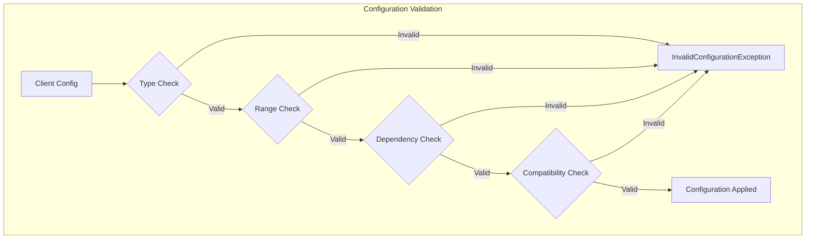
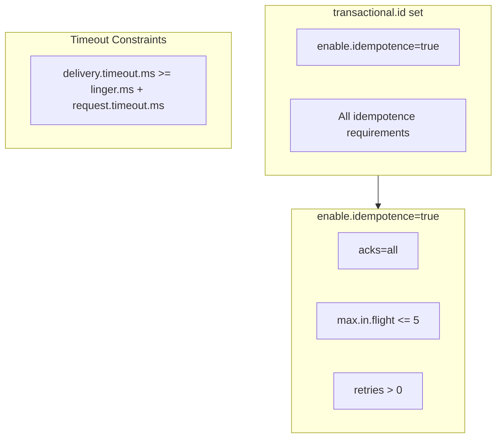

# How to Fix 'InvalidConfigurationException' in Kafka

Author: [nawazdhandala](https://www.github.com/nawazdhandala)

Tags: Kafka, InvalidConfigurationException, Configuration, Java, Troubleshooting, Producer, Consumer, Broker

Description: Learn how to diagnose and fix InvalidConfigurationException errors in Kafka by understanding configuration validation, common misconfigurations, and best practices for managing Kafka settings.

---

> InvalidConfigurationException is Kafka's way of telling you that something in your configuration does not make sense. The error message usually points directly to the problem, but understanding why certain configurations are invalid helps you avoid these issues entirely.

The `InvalidConfigurationException` occurs when Kafka detects conflicting, out-of-range, or incompatible configuration values. This guide covers the most common causes and their solutions.

---

## Understanding Configuration Validation

Kafka validates configuration at multiple levels:



---

## Common InvalidConfigurationException Causes

### 1. Incompatible Producer Settings

#### Idempotence Requirements

```java
// WRONG: Idempotent producer with incompatible settings
Properties props = new Properties();
props.put(ProducerConfig.ENABLE_IDEMPOTENCE_CONFIG, "true");
props.put(ProducerConfig.ACKS_CONFIG, "1"); // ERROR: Must be "all"
props.put(ProducerConfig.MAX_IN_FLIGHT_REQUESTS_PER_CONNECTION, 10); // ERROR: Must be <= 5
```

When `enable.idempotence=true`, Kafka enforces:
- `acks` must be `all`
- `max.in.flight.requests.per.connection` must be <= 5
- `retries` must be > 0

```java
// CORRECT: Idempotent producer configuration
Properties props = new Properties();
props.put(ProducerConfig.BOOTSTRAP_SERVERS_CONFIG, "localhost:9092");
props.put(ProducerConfig.KEY_SERIALIZER_CLASS_CONFIG, StringSerializer.class.getName());
props.put(ProducerConfig.VALUE_SERIALIZER_CLASS_CONFIG, StringSerializer.class.getName());

// Idempotence with compatible settings
props.put(ProducerConfig.ENABLE_IDEMPOTENCE_CONFIG, "true");
props.put(ProducerConfig.ACKS_CONFIG, "all");
props.put(ProducerConfig.MAX_IN_FLIGHT_REQUESTS_PER_CONNECTION, 5);
props.put(ProducerConfig.RETRIES_CONFIG, Integer.MAX_VALUE);

KafkaProducer<String, String> producer = new KafkaProducer<>(props);
```

#### Transactional Producer Requirements

```java
// WRONG: Transactional producer without required settings
Properties props = new Properties();
props.put(ProducerConfig.TRANSACTIONAL_ID_CONFIG, "my-txn-id");
// Missing: enable.idempotence (implicitly required)

// CORRECT: Transactional producer configuration
Properties props = new Properties();
props.put(ProducerConfig.BOOTSTRAP_SERVERS_CONFIG, "localhost:9092");
props.put(ProducerConfig.KEY_SERIALIZER_CLASS_CONFIG, StringSerializer.class.getName());
props.put(ProducerConfig.VALUE_SERIALIZER_CLASS_CONFIG, StringSerializer.class.getName());

// Transactional settings
props.put(ProducerConfig.TRANSACTIONAL_ID_CONFIG, "order-processor-txn");
props.put(ProducerConfig.ENABLE_IDEMPOTENCE_CONFIG, "true"); // Required for transactions
props.put(ProducerConfig.ACKS_CONFIG, "all");
props.put(ProducerConfig.MAX_IN_FLIGHT_REQUESTS_PER_CONNECTION, 5);

// Transaction timeout must be within broker limits
props.put(ProducerConfig.TRANSACTION_TIMEOUT_CONFIG, 60000);
```

### 2. Invalid Timeout Configurations

```java
// WRONG: Delivery timeout less than linger + request timeout
Properties props = new Properties();
props.put(ProducerConfig.LINGER_MS_CONFIG, 5000);
props.put(ProducerConfig.REQUEST_TIMEOUT_MS_CONFIG, 30000);
props.put(ProducerConfig.DELIVERY_TIMEOUT_MS_CONFIG, 10000); // ERROR: Must be >= 35000
```

The rule is: `delivery.timeout.ms >= linger.ms + request.timeout.ms`

```java
// CORRECT: Valid timeout configuration
Properties props = new Properties();
props.put(ProducerConfig.BOOTSTRAP_SERVERS_CONFIG, "localhost:9092");
props.put(ProducerConfig.KEY_SERIALIZER_CLASS_CONFIG, StringSerializer.class.getName());
props.put(ProducerConfig.VALUE_SERIALIZER_CLASS_CONFIG, StringSerializer.class.getName());

// Timing configuration that satisfies constraints
props.put(ProducerConfig.LINGER_MS_CONFIG, 5000);        // 5 seconds
props.put(ProducerConfig.REQUEST_TIMEOUT_MS_CONFIG, 30000); // 30 seconds
props.put(ProducerConfig.DELIVERY_TIMEOUT_MS_CONFIG, 120000); // 2 minutes (>= 35 seconds)
```

### 3. Consumer Group Configuration Issues

```java
// WRONG: Invalid session timeout
Properties props = new Properties();
props.put(ConsumerConfig.SESSION_TIMEOUT_MS_CONFIG, 5000); // May be below broker minimum
props.put(ConsumerConfig.HEARTBEAT_INTERVAL_MS_CONFIG, 3000); // Too close to session timeout
```

The heartbeat interval should be roughly 1/3 of the session timeout:

```java
// CORRECT: Valid consumer group configuration
Properties props = new Properties();
props.put(ConsumerConfig.BOOTSTRAP_SERVERS_CONFIG, "localhost:9092");
props.put(ConsumerConfig.GROUP_ID_CONFIG, "my-consumer-group");
props.put(ConsumerConfig.KEY_DESERIALIZER_CLASS_CONFIG, StringDeserializer.class.getName());
props.put(ConsumerConfig.VALUE_DESERIALIZER_CLASS_CONFIG, StringDeserializer.class.getName());

// Session and heartbeat configuration
// Session timeout must be between group.min.session.timeout.ms and group.max.session.timeout.ms
props.put(ConsumerConfig.SESSION_TIMEOUT_MS_CONFIG, 45000);  // 45 seconds
props.put(ConsumerConfig.HEARTBEAT_INTERVAL_MS_CONFIG, 15000); // 15 seconds (1/3 of session)

// Max poll interval should be greater than expected processing time
props.put(ConsumerConfig.MAX_POLL_INTERVAL_MS_CONFIG, 300000); // 5 minutes
```

### 4. Invalid Partition Assignment Strategy

```java
// WRONG: Non-existent or misspelled assignor
Properties props = new Properties();
props.put(ConsumerConfig.PARTITION_ASSIGNMENT_STRATEGY_CONFIG, "RoundRobinAssigner"); // ERROR
```

```java
// CORRECT: Valid partition assignment strategies
Properties props = new Properties();
props.put(ConsumerConfig.BOOTSTRAP_SERVERS_CONFIG, "localhost:9092");
props.put(ConsumerConfig.GROUP_ID_CONFIG, "my-group");

// Use fully qualified class name
props.put(ConsumerConfig.PARTITION_ASSIGNMENT_STRATEGY_CONFIG,
    "org.apache.kafka.clients.consumer.RoundRobinAssignor");

// Or use multiple assignors for compatibility
props.put(ConsumerConfig.PARTITION_ASSIGNMENT_STRATEGY_CONFIG,
    "org.apache.kafka.clients.consumer.CooperativeStickyAssignor");

// Available built-in assignors:
// - RangeAssignor (default)
// - RoundRobinAssignor
// - StickyAssignor
// - CooperativeStickyAssignor (recommended for minimal rebalancing)
```

### 5. SSL/TLS Configuration Errors

```java
// WRONG: Incomplete SSL configuration
Properties props = new Properties();
props.put("security.protocol", "SSL");
props.put("ssl.truststore.location", "/path/to/truststore.jks");
// Missing: ssl.truststore.password
```

```java
// CORRECT: Complete SSL configuration
Properties props = new Properties();
props.put(ProducerConfig.BOOTSTRAP_SERVERS_CONFIG, "kafka:9093");
props.put(ProducerConfig.KEY_SERIALIZER_CLASS_CONFIG, StringSerializer.class.getName());
props.put(ProducerConfig.VALUE_SERIALIZER_CLASS_CONFIG, StringSerializer.class.getName());

// Security protocol
props.put("security.protocol", "SSL");

// Truststore configuration (for server authentication)
props.put("ssl.truststore.location", "/path/to/truststore.jks");
props.put("ssl.truststore.password", "truststore-password");
props.put("ssl.truststore.type", "JKS");

// Keystore configuration (for client authentication, if required)
props.put("ssl.keystore.location", "/path/to/keystore.jks");
props.put("ssl.keystore.password", "keystore-password");
props.put("ssl.key.password", "key-password");
props.put("ssl.keystore.type", "JKS");

// Optional: endpoint identification
props.put("ssl.endpoint.identification.algorithm", "https");
```

### 6. SASL Configuration Errors

```java
// WRONG: Incomplete SASL configuration
Properties props = new Properties();
props.put("security.protocol", "SASL_SSL");
props.put("sasl.mechanism", "PLAIN");
// Missing: sasl.jaas.config
```

```java
// CORRECT: Complete SASL/PLAIN configuration
Properties props = new Properties();
props.put(ProducerConfig.BOOTSTRAP_SERVERS_CONFIG, "kafka:9093");
props.put(ProducerConfig.KEY_SERIALIZER_CLASS_CONFIG, StringSerializer.class.getName());
props.put(ProducerConfig.VALUE_SERIALIZER_CLASS_CONFIG, StringSerializer.class.getName());

// Security protocol
props.put("security.protocol", "SASL_SSL");
props.put("sasl.mechanism", "PLAIN");

// JAAS configuration inline
props.put("sasl.jaas.config",
    "org.apache.kafka.common.security.plain.PlainLoginModule required " +
    "username=\"client\" " +
    "password=\"client-secret\";");

// SSL truststore for SASL_SSL
props.put("ssl.truststore.location", "/path/to/truststore.jks");
props.put("ssl.truststore.password", "truststore-password");
```

---

## Configuration Validation Utility

Create a utility to validate configurations before creating clients:

```java
import org.apache.kafka.clients.producer.ProducerConfig;
import org.apache.kafka.clients.consumer.ConsumerConfig;
import org.apache.kafka.common.config.ConfigException;
import java.util.*;

public class KafkaConfigValidator {

    // Validate producer configuration
    public static List<String> validateProducerConfig(Properties props) {
        List<String> errors = new ArrayList<>();

        // Check required properties
        if (!props.containsKey(ProducerConfig.BOOTSTRAP_SERVERS_CONFIG)) {
            errors.add("Missing required property: bootstrap.servers");
        }

        // Check idempotence constraints
        if (Boolean.parseBoolean(props.getProperty(ProducerConfig.ENABLE_IDEMPOTENCE_CONFIG, "false"))) {
            String acks = props.getProperty(ProducerConfig.ACKS_CONFIG, "1");
            if (!acks.equals("all") && !acks.equals("-1")) {
                errors.add("When enable.idempotence=true, acks must be 'all' or '-1'");
            }

            int maxInFlight = Integer.parseInt(
                props.getProperty(ProducerConfig.MAX_IN_FLIGHT_REQUESTS_PER_CONNECTION, "5"));
            if (maxInFlight > 5) {
                errors.add("When enable.idempotence=true, max.in.flight.requests.per.connection must be <= 5");
            }
        }

        // Check timeout constraints
        int lingerMs = Integer.parseInt(props.getProperty(ProducerConfig.LINGER_MS_CONFIG, "0"));
        int requestTimeoutMs = Integer.parseInt(
            props.getProperty(ProducerConfig.REQUEST_TIMEOUT_MS_CONFIG, "30000"));
        int deliveryTimeoutMs = Integer.parseInt(
            props.getProperty(ProducerConfig.DELIVERY_TIMEOUT_MS_CONFIG, "120000"));

        if (deliveryTimeoutMs < lingerMs + requestTimeoutMs) {
            errors.add(String.format(
                "delivery.timeout.ms (%d) must be >= linger.ms (%d) + request.timeout.ms (%d)",
                deliveryTimeoutMs, lingerMs, requestTimeoutMs));
        }

        // Check transactional constraints
        if (props.containsKey(ProducerConfig.TRANSACTIONAL_ID_CONFIG)) {
            String idempotence = props.getProperty(ProducerConfig.ENABLE_IDEMPOTENCE_CONFIG, "false");
            if (!Boolean.parseBoolean(idempotence)) {
                errors.add("When transactional.id is set, enable.idempotence must be true");
            }
        }

        return errors;
    }

    // Validate consumer configuration
    public static List<String> validateConsumerConfig(Properties props) {
        List<String> errors = new ArrayList<>();

        // Check required properties
        if (!props.containsKey(ConsumerConfig.BOOTSTRAP_SERVERS_CONFIG)) {
            errors.add("Missing required property: bootstrap.servers");
        }

        if (!props.containsKey(ConsumerConfig.GROUP_ID_CONFIG)) {
            errors.add("Missing required property: group.id");
        }

        // Check heartbeat vs session timeout
        int sessionTimeoutMs = Integer.parseInt(
            props.getProperty(ConsumerConfig.SESSION_TIMEOUT_MS_CONFIG, "45000"));
        int heartbeatIntervalMs = Integer.parseInt(
            props.getProperty(ConsumerConfig.HEARTBEAT_INTERVAL_MS_CONFIG, "3000"));

        if (heartbeatIntervalMs >= sessionTimeoutMs) {
            errors.add("heartbeat.interval.ms must be less than session.timeout.ms");
        }

        // Recommended: heartbeat should be ~1/3 of session timeout
        if (heartbeatIntervalMs > sessionTimeoutMs / 3) {
            errors.add("Warning: heartbeat.interval.ms should be approximately 1/3 of session.timeout.ms");
        }

        return errors;
    }

    // Validate and throw if invalid
    public static void validateOrThrow(Properties props, boolean isProducer) {
        List<String> errors = isProducer ?
            validateProducerConfig(props) :
            validateConsumerConfig(props);

        if (!errors.isEmpty()) {
            throw new ConfigException("Configuration validation failed:\n" +
                String.join("\n", errors));
        }
    }
}
```

Usage example:

```java
public class ValidatedKafkaClient {

    public static KafkaProducer<String, String> createValidatedProducer(Properties props) {
        // Validate before creating
        List<String> errors = KafkaConfigValidator.validateProducerConfig(props);

        if (!errors.isEmpty()) {
            System.err.println("Configuration errors:");
            errors.forEach(e -> System.err.println("  - " + e));
            throw new IllegalArgumentException("Invalid Kafka configuration");
        }

        return new KafkaProducer<>(props);
    }

    public static void main(String[] args) {
        Properties props = new Properties();
        props.put(ProducerConfig.BOOTSTRAP_SERVERS_CONFIG, "localhost:9092");
        props.put(ProducerConfig.KEY_SERIALIZER_CLASS_CONFIG, StringSerializer.class.getName());
        props.put(ProducerConfig.VALUE_SERIALIZER_CLASS_CONFIG, StringSerializer.class.getName());

        // This will be validated
        props.put(ProducerConfig.ENABLE_IDEMPOTENCE_CONFIG, "true");
        props.put(ProducerConfig.ACKS_CONFIG, "all");
        props.put(ProducerConfig.MAX_IN_FLIGHT_REQUESTS_PER_CONNECTION, 5);

        try {
            KafkaProducer<String, String> producer = createValidatedProducer(props);
            System.out.println("Producer created successfully");
        } catch (IllegalArgumentException e) {
            System.err.println("Failed to create producer: " + e.getMessage());
        }
    }
}
```

---

## Configuration Reference Card

### Producer Configuration Dependencies



### Valid Configuration Combinations

| Setting | Requirement | Why |
|---------|-------------|-----|
| `enable.idempotence=true` | `acks=all` | Idempotence needs leader confirmation |
| `enable.idempotence=true` | `max.in.flight<=5` | Sequence ordering guarantee |
| `transactional.id` set | `enable.idempotence=true` | Transactions require idempotence |
| `delivery.timeout.ms` | `>= linger.ms + request.timeout.ms` | Total timeout must cover batching + request |
| `heartbeat.interval.ms` | `< session.timeout.ms` | Heartbeat must fit within session |

---

## Broker-Side Configuration Limits

Some client configurations must align with broker settings:

```java
public class BrokerAlignedConfig {

    // Configuration that respects broker limits
    public static Properties createBrokerAlignedProducerConfig() {
        Properties props = new Properties();
        props.put(ProducerConfig.BOOTSTRAP_SERVERS_CONFIG, "localhost:9092");
        props.put(ProducerConfig.KEY_SERIALIZER_CLASS_CONFIG, StringSerializer.class.getName());
        props.put(ProducerConfig.VALUE_SERIALIZER_CLASS_CONFIG, StringSerializer.class.getName());

        // Transaction timeout must be <= broker's transaction.max.timeout.ms
        // Default broker max is 900000 (15 minutes)
        props.put(ProducerConfig.TRANSACTION_TIMEOUT_CONFIG, 60000);

        // Message size must be <= broker's message.max.bytes
        // Default broker max is 1048576 (1MB)
        props.put(ProducerConfig.MAX_REQUEST_SIZE_CONFIG, 1048576);

        return props;
    }

    public static Properties createBrokerAlignedConsumerConfig(String groupId) {
        Properties props = new Properties();
        props.put(ConsumerConfig.BOOTSTRAP_SERVERS_CONFIG, "localhost:9092");
        props.put(ConsumerConfig.GROUP_ID_CONFIG, groupId);
        props.put(ConsumerConfig.KEY_DESERIALIZER_CLASS_CONFIG, StringDeserializer.class.getName());
        props.put(ConsumerConfig.VALUE_DESERIALIZER_CLASS_CONFIG, StringDeserializer.class.getName());

        // Session timeout must be within broker's limits:
        // group.min.session.timeout.ms (default: 6000)
        // group.max.session.timeout.ms (default: 1800000)
        props.put(ConsumerConfig.SESSION_TIMEOUT_MS_CONFIG, 45000);

        // Fetch size must consider broker's fetch.max.bytes
        props.put(ConsumerConfig.FETCH_MAX_BYTES_CONFIG, 52428800);

        return props;
    }
}
```

Check broker configuration:

```bash
# Get broker configuration
kafka-configs.sh --bootstrap-server localhost:9092 \
  --entity-type brokers \
  --entity-default \
  --describe

# Key broker settings that affect client configuration:
# - transaction.max.timeout.ms
# - message.max.bytes
# - group.min.session.timeout.ms
# - group.max.session.timeout.ms
# - max.connections.per.ip
```

---

## Spring Boot Configuration

For Spring Boot applications, use typed configuration:

```java
import org.springframework.boot.autoconfigure.kafka.KafkaProperties;
import org.springframework.context.annotation.Bean;
import org.springframework.context.annotation.Configuration;
import org.springframework.kafka.core.DefaultKafkaProducerFactory;
import org.springframework.kafka.core.KafkaTemplate;
import org.springframework.kafka.core.ProducerFactory;

@Configuration
public class KafkaConfig {

    @Bean
    public ProducerFactory<String, String> producerFactory(KafkaProperties kafkaProperties) {
        Map<String, Object> props = kafkaProperties.buildProducerProperties();

        // Override or add additional properties
        props.put(ProducerConfig.ENABLE_IDEMPOTENCE_CONFIG, true);
        props.put(ProducerConfig.ACKS_CONFIG, "all");
        props.put(ProducerConfig.MAX_IN_FLIGHT_REQUESTS_PER_CONNECTION, 5);

        // Validate configuration
        List<String> errors = validateConfig(props);
        if (!errors.isEmpty()) {
            throw new IllegalStateException("Invalid Kafka config: " + errors);
        }

        return new DefaultKafkaProducerFactory<>(props);
    }

    @Bean
    public KafkaTemplate<String, String> kafkaTemplate(
            ProducerFactory<String, String> producerFactory) {
        return new KafkaTemplate<>(producerFactory);
    }

    private List<String> validateConfig(Map<String, Object> props) {
        // Validation logic
        return Collections.emptyList();
    }
}
```

Application properties:

```yaml
# application.yml
spring:
  kafka:
    bootstrap-servers: localhost:9092
    producer:
      key-serializer: org.apache.kafka.common.serialization.StringSerializer
      value-serializer: org.apache.kafka.common.serialization.StringSerializer
      acks: all
      retries: 2147483647
      properties:
        enable.idempotence: true
        max.in.flight.requests.per.connection: 5
        delivery.timeout.ms: 120000
        linger.ms: 10
        request.timeout.ms: 30000
    consumer:
      group-id: my-application
      key-deserializer: org.apache.kafka.common.serialization.StringDeserializer
      value-deserializer: org.apache.kafka.common.serialization.StringDeserializer
      auto-offset-reset: earliest
      enable-auto-commit: false
      properties:
        session.timeout.ms: 45000
        heartbeat.interval.ms: 15000
        max.poll.interval.ms: 300000
```

---

## Debugging Configuration Issues

### Enable Debug Logging

```java
// Add to your logging configuration
import org.slf4j.Logger;
import org.slf4j.LoggerFactory;

public class ConfigDebugger {
    private static final Logger logger = LoggerFactory.getLogger(ConfigDebugger.class);

    public static void logEffectiveConfig(Properties props) {
        logger.info("=== Kafka Configuration ===");
        props.forEach((key, value) -> {
            // Mask sensitive values
            String displayValue = key.toString().contains("password") ?
                "********" : value.toString();
            logger.info("{} = {}", key, displayValue);
        });
    }
}
```

### Programmatic Configuration Dump

```java
public class ConfigInspector {

    public static void inspectProducerConfig(KafkaProducer<?, ?> producer) {
        // Get metrics which include effective configuration
        producer.metrics().forEach((name, metric) -> {
            if (name.group().equals("producer-metrics")) {
                System.out.printf("%s: %s%n", name.name(), metric.metricValue());
            }
        });
    }
}
```

---

## Summary

To avoid `InvalidConfigurationException`:

1. **Understand dependencies** - Some settings require others to be set correctly
2. **Validate early** - Check configurations before creating clients
3. **Match broker settings** - Ensure client config aligns with broker limits
4. **Use typed configuration** - Leverage frameworks like Spring Boot for validation
5. **Test configurations** - Verify settings in development before production

---

*Need help monitoring your Kafka configuration across environments? [OneUptime](https://oneuptime.com) provides configuration tracking and alerting for Kafka clusters, helping you catch misconfigurations before they cause issues.*

**Related Reading:**
- [Kafka Security Best Practices](https://oneuptime.com/blog/post/2026-01-21-kafka-security-sasl-ssl)
- [Managing Kafka Configuration at Scale](https://oneuptime.com/blog/post/2026-01-21-kafka-offset-management)
