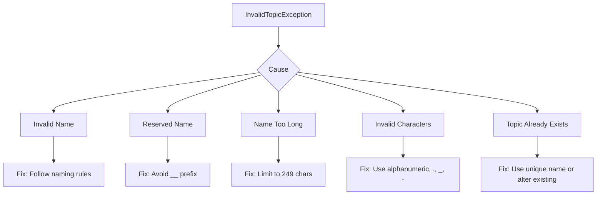
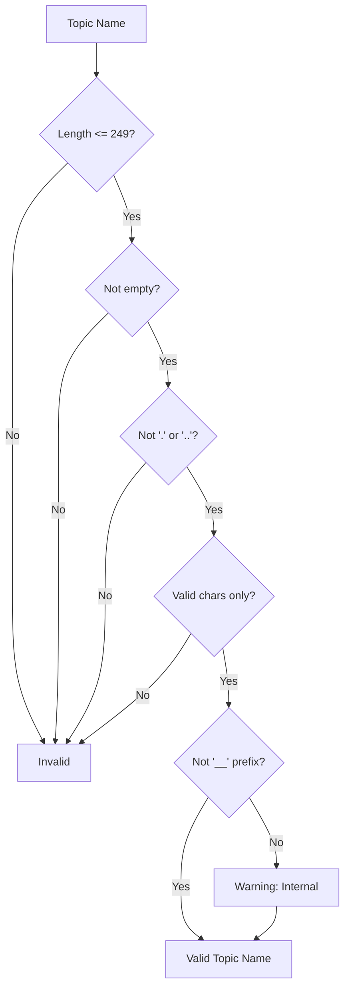

# How to Fix "InvalidTopicException" in Kafka

Author: [nawazdhandala](https://www.github.com/nawazdhandala)

Tags: Apache Kafka, InvalidTopicException, Troubleshooting, Error Handling, Topics, DevOps

Description: A comprehensive guide to diagnosing and fixing InvalidTopicException errors in Apache Kafka, covering naming rules, configuration issues, and common pitfalls.

---

The `InvalidTopicException` in Kafka occurs when you try to create, produce to, or consume from a topic with an invalid name or configuration. This guide covers all the causes and their fixes.

## Understanding the Exception



## Topic Naming Rules

Kafka has strict rules for topic names. Violating any of these triggers `InvalidTopicException`.

### Rule 1: Maximum Length

Topic names cannot exceed 249 characters.

```java
// Bad - exceeds 249 characters
String topicName = "this-is-an-extremely-long-topic-name-that-goes-on-and-on-" +
    "and-keeps-going-until-it-exceeds-the-maximum-allowed-length-" +
    "of-two-hundred-and-forty-nine-characters-which-kafka-enforces-" +
    "strictly-and-will-throw-an-invalid-topic-exception-if-violated-here";

// Good - concise and descriptive
String topicName = "user-events-v1";
```

### Rule 2: Allowed Characters

Only alphanumeric characters, periods (.), underscores (_), and hyphens (-) are allowed.

```bash
# Invalid topic names
my topic          # spaces not allowed
user@events       # @ not allowed
orders#processed  # # not allowed
data/stream       # / not allowed

# Valid topic names
my-topic
user_events
orders.processed
data-stream-v1
```

### Rule 3: Cannot Be Empty

```java
// Throws InvalidTopicException
producer.send(new ProducerRecord<>("", "key", "value"));
```

### Rule 4: Cannot Be "." or ".."

```bash
# These are reserved filesystem names
kafka-topics.sh --create --topic .     # Invalid
kafka-topics.sh --create --topic ..    # Invalid
```

### Rule 5: Avoid Internal Topic Prefix

Topics starting with double underscore (__) are reserved for Kafka internal use.

```bash
# Internal topics - do not create manually
__consumer_offsets
__transaction_state

# Your topics should not use this prefix
kafka-topics.sh --create --topic __my-topic  # Bad practice, may fail
```

## Common Error Scenarios and Fixes

### Scenario 1: Invalid Characters in Topic Name

**Error:**
```
org.apache.kafka.common.errors.InvalidTopicException:
Topic name "user@events" is illegal, contains a character other than
ASCII alphanumerics, '.', '_' and '-'
```

**Fix:**
```java
public class TopicNameValidator {
    // Regex pattern for valid Kafka topic names
    private static final Pattern VALID_TOPIC_PATTERN =
        Pattern.compile("^[a-zA-Z0-9._-]+$");

    public static String sanitize(String topicName) {
        if (topicName == null || topicName.isEmpty()) {
            throw new IllegalArgumentException("Topic name cannot be null or empty");
        }

        // Replace invalid characters with hyphens
        String sanitized = topicName.replaceAll("[^a-zA-Z0-9._-]", "-");

        // Remove consecutive hyphens
        sanitized = sanitized.replaceAll("-+", "-");

        // Remove leading/trailing hyphens
        sanitized = sanitized.replaceAll("^-|-$", "");

        // Validate length
        if (sanitized.length() > 249) {
            sanitized = sanitized.substring(0, 249);
        }

        return sanitized;
    }

    public static boolean isValid(String topicName) {
        if (topicName == null || topicName.isEmpty()) {
            return false;
        }
        if (topicName.equals(".") || topicName.equals("..")) {
            return false;
        }
        if (topicName.length() > 249) {
            return false;
        }
        return VALID_TOPIC_PATTERN.matcher(topicName).matches();
    }
}
```

### Scenario 2: Topic Name Too Long

**Error:**
```
org.apache.kafka.common.errors.InvalidTopicException:
Topic name is illegal, it exceeds max length of 249
```

**Fix:**
```java
public String createTopicName(String service, String entity, String action) {
    String fullName = String.format("%s-%s-%s", service, entity, action);

    if (fullName.length() > 249) {
        // Truncate with hash suffix for uniqueness
        String hash = Integer.toHexString(fullName.hashCode());
        int maxPrefix = 249 - hash.length() - 1;
        return fullName.substring(0, maxPrefix) + "-" + hash;
    }

    return fullName;
}
```

### Scenario 3: Topic Does Not Exist (Auto-Create Disabled)

**Error:**
```
org.apache.kafka.common.errors.InvalidTopicException:
Topic user-events not found in metadata after 60000 ms
```

**Diagnosis:**
```bash
# Check if auto.create.topics.enable is true
kafka-configs.sh --bootstrap-server localhost:9092 \
  --entity-type brokers --entity-default --describe | grep auto.create

# List existing topics
kafka-topics.sh --bootstrap-server localhost:9092 --list
```

**Fix Option 1: Create the topic manually**
```bash
kafka-topics.sh --create \
  --bootstrap-server localhost:9092 \
  --topic user-events \
  --partitions 12 \
  --replication-factor 3
```

**Fix Option 2: Enable auto-creation (not recommended for production)**
```properties
# server.properties
auto.create.topics.enable=true
```

**Fix Option 3: Create topic programmatically before use**
```java
public class TopicCreator {
    public static void ensureTopicExists(String bootstrapServers, String topicName,
                                         int partitions, short replication) {
        Properties props = new Properties();
        props.put("bootstrap.servers", bootstrapServers);

        try (AdminClient admin = AdminClient.create(props)) {
            // Check if topic exists
            Set<String> existingTopics = admin.listTopics().names().get();

            if (!existingTopics.contains(topicName)) {
                NewTopic topic = new NewTopic(topicName, partitions, replication);
                admin.createTopics(Collections.singleton(topic)).all().get();
                System.out.println("Created topic: " + topicName);
            }
        } catch (Exception e) {
            throw new RuntimeException("Failed to create topic: " + topicName, e);
        }
    }
}
```

### Scenario 4: Attempting to Create Internal Topic

**Error:**
```
org.apache.kafka.common.errors.InvalidTopicException:
Topic name "__custom-offsets" is illegal, it starts with reserved prefix "__"
```

**Fix:**
```java
// Bad - uses reserved prefix
String topicName = "__custom-offsets";

// Good - use different prefix
String topicName = "_custom-offsets";  // single underscore is fine
String topicName = "internal-custom-offsets";
```

### Scenario 5: Period/Underscore Collision

Topics with periods and underscores can collide in metrics. Kafka warns about this.

**Warning:**
```
WARN Topic name my.topic collides with existing topic my_topic
```

**Best Practice:**
```java
// Choose one convention and stick to it
// Option 1: Use hyphens (recommended)
String topicName = "my-topic";

// Option 2: Use underscores only
String topicName = "my_topic";

// Option 3: Use periods only
String topicName = "my.topic";

// Avoid mixing in the same cluster
```

## Handling InvalidTopicException in Code

### Producer Error Handling

```java
import org.apache.kafka.clients.producer.*;
import org.apache.kafka.common.errors.InvalidTopicException;

public class SafeProducer {
    private final KafkaProducer<String, String> producer;

    public SafeProducer(Properties props) {
        this.producer = new KafkaProducer<>(props);
    }

    public void send(String topic, String key, String value) {
        // Validate topic name before sending
        if (!TopicNameValidator.isValid(topic)) {
            throw new IllegalArgumentException(
                "Invalid topic name: " + topic +
                ". Use only alphanumeric, '.', '_', '-' and max 249 chars");
        }

        ProducerRecord<String, String> record =
            new ProducerRecord<>(topic, key, value);

        producer.send(record, (metadata, exception) -> {
            if (exception != null) {
                if (exception instanceof InvalidTopicException) {
                    // Log detailed error for debugging
                    System.err.println("Invalid topic: " + topic);
                    System.err.println("Reason: " + exception.getMessage());
                    // Consider alerting or circuit breaking
                } else {
                    exception.printStackTrace();
                }
            }
        });
    }
}
```

### Consumer Error Handling

```java
import org.apache.kafka.clients.consumer.*;
import org.apache.kafka.common.errors.InvalidTopicException;

public class SafeConsumer {
    public static KafkaConsumer<String, String> createAndSubscribe(
            Properties props, List<String> topics) {

        // Validate all topics before subscribing
        List<String> invalidTopics = topics.stream()
            .filter(t -> !TopicNameValidator.isValid(t))
            .collect(Collectors.toList());

        if (!invalidTopics.isEmpty()) {
            throw new IllegalArgumentException(
                "Invalid topic names: " + invalidTopics);
        }

        KafkaConsumer<String, String> consumer = new KafkaConsumer<>(props);

        try {
            consumer.subscribe(topics);
            return consumer;
        } catch (InvalidTopicException e) {
            consumer.close();
            throw new RuntimeException(
                "Failed to subscribe to topics: " + e.getMessage(), e);
        }
    }
}
```

## Debugging InvalidTopicException

### Step 1: Check Topic Name Validity

```bash
#!/bin/bash
# validate_topic_name.sh

TOPIC=$1

# Check length
if [ ${#TOPIC} -gt 249 ]; then
    echo "ERROR: Topic name exceeds 249 characters"
    exit 1
fi

# Check for empty
if [ -z "$TOPIC" ]; then
    echo "ERROR: Topic name cannot be empty"
    exit 1
fi

# Check for . or ..
if [ "$TOPIC" = "." ] || [ "$TOPIC" = ".." ]; then
    echo "ERROR: Topic name cannot be '.' or '..'"
    exit 1
fi

# Check for invalid characters
if [[ ! "$TOPIC" =~ ^[a-zA-Z0-9._-]+$ ]]; then
    echo "ERROR: Topic contains invalid characters"
    echo "Allowed: a-z, A-Z, 0-9, '.', '_', '-'"
    exit 1
fi

# Check for internal prefix
if [[ "$TOPIC" == __* ]]; then
    echo "WARNING: Topic starts with '__' which is reserved for internal use"
fi

echo "Topic name '$TOPIC' is valid"
```

### Step 2: Check Broker Logs

```bash
# Search for InvalidTopicException in Kafka logs
grep -r "InvalidTopicException" /var/log/kafka/

# Check for topic creation failures
grep -r "Error.*topic" /var/log/kafka/server.log | tail -20
```

### Step 3: Verify Topic Metadata

```bash
# Describe topic to see if it exists and its configuration
kafka-topics.sh --bootstrap-server localhost:9092 \
  --describe --topic your-topic-name

# List all topics to check naming patterns
kafka-topics.sh --bootstrap-server localhost:9092 --list | sort
```

## Prevention Strategies

### 1. Centralized Topic Registry

```java
public class TopicRegistry {
    private static final Map<String, TopicConfig> TOPICS = new HashMap<>();

    static {
        // Register all valid topics
        register("user-events", 12, 3);
        register("order-events", 24, 3);
        register("audit-logs", 6, 3);
    }

    private static void register(String name, int partitions, int replication) {
        if (!TopicNameValidator.isValid(name)) {
            throw new IllegalArgumentException("Invalid topic name: " + name);
        }
        TOPICS.put(name, new TopicConfig(name, partitions, replication));
    }

    public static String getTopic(String name) {
        if (!TOPICS.containsKey(name)) {
            throw new IllegalArgumentException("Unknown topic: " + name);
        }
        return name;
    }
}
```

### 2. Input Validation Middleware

```java
public class KafkaTopicInterceptor implements ProducerInterceptor<String, String> {

    @Override
    public ProducerRecord<String, String> onSend(ProducerRecord<String, String> record) {
        String topic = record.topic();

        if (!TopicNameValidator.isValid(topic)) {
            throw new IllegalArgumentException(
                "Interceptor blocked invalid topic: " + topic);
        }

        return record;
    }

    @Override
    public void onAcknowledgement(RecordMetadata metadata, Exception exception) {}

    @Override
    public void close() {}

    @Override
    public void configure(Map<String, ?> configs) {}
}
```

### 3. CI/CD Topic Name Validation

```yaml
# .github/workflows/validate-topics.yml
name: Validate Kafka Topics

on: [push, pull_request]

jobs:
  validate:
    runs-on: ubuntu-latest
    steps:
      - uses: actions/checkout@v4

      - name: Validate topic names
        run: |
          # Find all topic names in configuration files
          grep -rh "topic:" config/ | awk -F: '{print $2}' | tr -d ' "' | while read topic; do
            if [[ ! "$topic" =~ ^[a-zA-Z0-9._-]+$ ]] || [ ${#topic} -gt 249 ]; then
              echo "Invalid topic name: $topic"
              exit 1
            fi
          done
          echo "All topic names are valid"
```

## Quick Reference: Naming Rules



| Rule | Example Invalid | Example Valid |
|------|-----------------|---------------|
| Max 249 chars | `very-long-name...` (250+) | `user-events` |
| Not empty | `""` | `events` |
| Not `.` or `..` | `.`, `..` | `my.topic` |
| Valid chars | `user@events` | `user-events` |
| No `__` prefix | `__my-topic` | `_my-topic` |

---

InvalidTopicException is always preventable. Validate topic names at the point of creation, use a centralized registry for production systems, and implement validation in your CI/CD pipeline. Catching these errors early saves debugging time in production.
