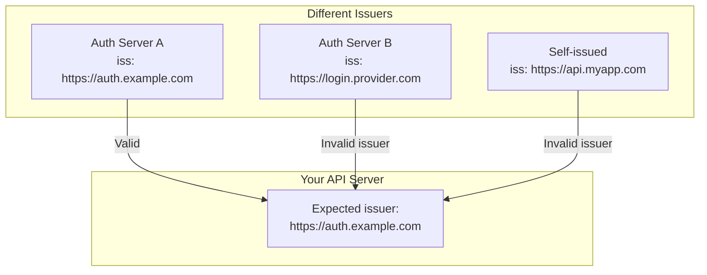
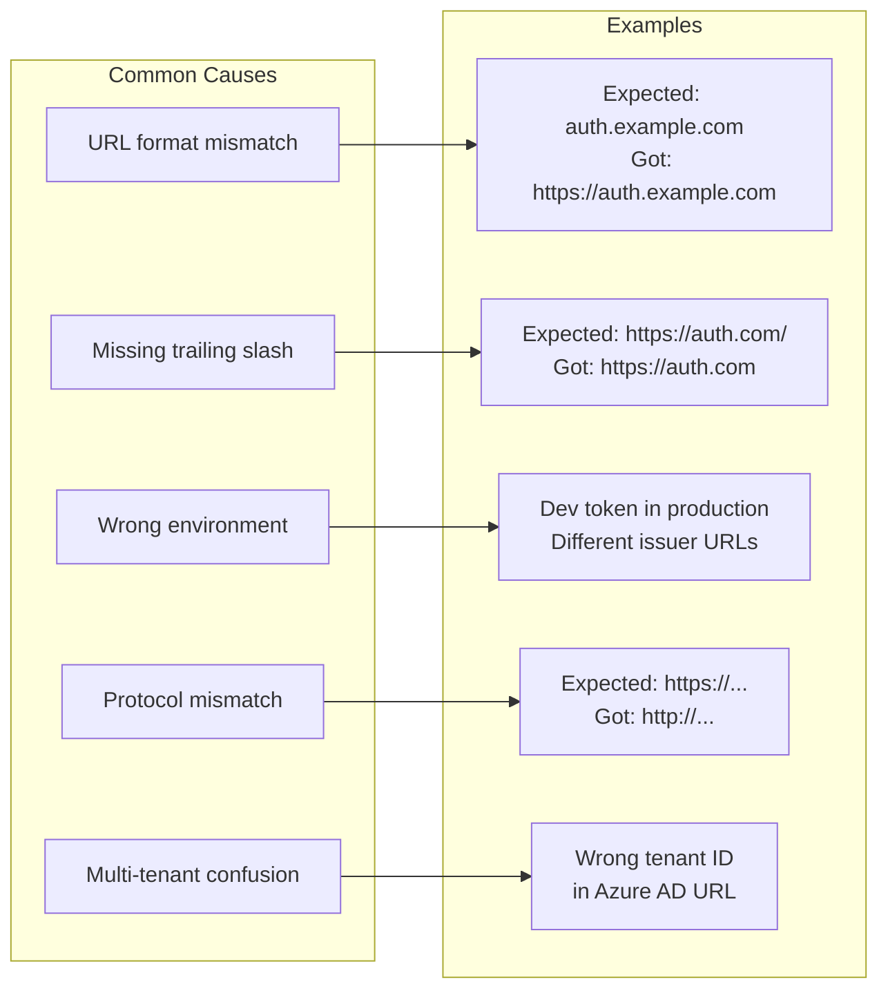
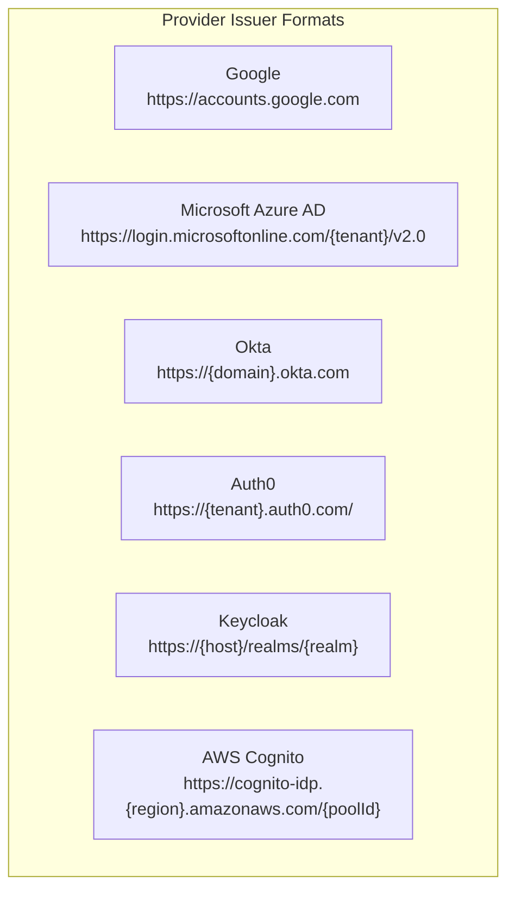

# How to Fix 'Issuer Invalid' JWT Errors

Author: [nawazdhandala](https://www.github.com/nawazdhandala)

Tags: JWT, Authentication, Security, Debugging, OIDC, OAuth2

Description: A practical guide to diagnosing and resolving JWT issuer validation errors with examples for common identity providers and frameworks.

---

The "Issuer Invalid" error occurs when a JWT's `iss` (issuer) claim does not match what the verifying server expects. The issuer claim identifies who created and signed the token, and validation prevents accepting tokens from untrusted sources. This guide explains how to diagnose and fix issuer validation failures.

## Understanding the Issuer Claim

The `iss` claim is a string that identifies the principal that issued the JWT. It is typically a URL pointing to the authorization server.



### JWT Structure with Issuer

```javascript
// JWT payload with issuer claim
{
    "iss": "https://auth.example.com",    // Issuer - who created this token
    "sub": "user123",                      // Subject - who the token is about
    "aud": "https://api.example.com",      // Audience - intended recipient
    "exp": 1706144400,                     // Expiration time
    "iat": 1706140800,                     // Issued at time
    "scope": "read write"                  // Token permissions
}
```

## Common Causes of Issuer Errors



## Debugging Issuer Errors

First, decode the JWT to see the actual issuer value.

```javascript
// Debug JWT issuer
function debugJWTIssuer(token, expectedIssuer) {
    // Decode without verification for debugging
    const parts = token.split('.');
    if (parts.length !== 3) {
        console.error('Invalid JWT format');
        return;
    }

    const payload = JSON.parse(
        Buffer.from(parts[1], 'base64url').toString('utf8')
    );

    console.log('=== JWT Issuer Debug ===');
    console.log('Token issuer (iss):', payload.iss);
    console.log('Expected issuer:', expectedIssuer);

    // Check if issuer exists
    if (!payload.iss) {
        console.error('Problem: Token has no issuer claim');
        return false;
    }

    // Detailed comparison
    const tokenIss = payload.iss;
    const expected = expectedIssuer;

    console.log('\nComparison:');
    console.log('  Exact match:', tokenIss === expected);
    console.log('  Token length:', tokenIss.length);
    console.log('  Expected length:', expected.length);
    console.log('  Case match:', tokenIss.toLowerCase() === expected.toLowerCase());

    // Check for common issues
    if (tokenIss.replace(/\/$/, '') === expected.replace(/\/$/, '')) {
        console.log('  Issue: Trailing slash mismatch');
    }

    if (tokenIss.replace(/^https?:\/\//, '') === expected.replace(/^https?:\/\//, '')) {
        console.log('  Issue: Protocol mismatch (http vs https)');
    }

    // Check for URL encoding issues
    const decodedToken = decodeURIComponent(tokenIss);
    const decodedExpected = decodeURIComponent(expected);
    if (decodedToken !== tokenIss || decodedExpected !== expected) {
        console.log('  Note: URL encoding present');
        console.log('  Decoded token iss:', decodedToken);
        console.log('  Decoded expected:', decodedExpected);
    }

    return tokenIss === expected;
}

// Usage
const token = 'eyJhbGciOiJSUzI1NiIsInR5cCI6IkpXVCJ9...';
debugJWTIssuer(token, 'https://auth.example.com');
```

```python
# Python debug function
import jwt
import base64
import json
from urllib.parse import unquote

def debug_jwt_issuer(token: str, expected_issuer: str) -> bool:
    """Debug JWT issuer claim issues."""

    # Decode without verification
    try:
        payload = jwt.decode(token, options={"verify_signature": False})
    except Exception as e:
        print(f"Failed to decode token: {e}")
        return False

    print("=== JWT Issuer Debug ===")
    print(f"Token issuer (iss): {payload.get('iss')}")
    print(f"Expected issuer: {expected_issuer}")

    token_iss = payload.get('iss')

    if not token_iss:
        print("Problem: Token has no issuer claim")
        return False

    print("\nComparison:")
    print(f"  Exact match: {token_iss == expected_issuer}")
    print(f"  Token length: {len(token_iss)}")
    print(f"  Expected length: {len(expected_issuer)}")
    print(f"  Case match: {token_iss.lower() == expected_issuer.lower()}")

    # Check trailing slash
    if token_iss.rstrip('/') == expected_issuer.rstrip('/'):
        print("  Issue: Trailing slash mismatch")

    # Check protocol
    token_no_proto = token_iss.replace('https://', '').replace('http://', '')
    expected_no_proto = expected_issuer.replace('https://', '').replace('http://', '')
    if token_no_proto == expected_no_proto:
        print("  Issue: Protocol mismatch (http vs https)")

    return token_iss == expected_issuer
```

## Fixing Issuer Validation

### Node.js with jsonwebtoken

```javascript
const jwt = require('jsonwebtoken');

// Basic issuer verification
function verifyToken(token, secret) {
    try {
        const decoded = jwt.verify(token, secret, {
            issuer: 'https://auth.example.com'
        });
        return { valid: true, payload: decoded };
    } catch (error) {
        if (error.message.includes('issuer')) {
            console.error('Issuer validation failed');
            // Decode to see actual issuer
            const payload = jwt.decode(token);
            console.error('Token issuer:', payload?.iss);
        }
        return { valid: false, error: error.message };
    }
}

// Multiple valid issuers
function verifyTokenMultipleIssuers(token, secret) {
    const validIssuers = [
        'https://auth.example.com',
        'https://auth.example.com/',  // With trailing slash
        'https://login.example.com'   // Alternative issuer
    ];

    try {
        // jsonwebtoken accepts array of issuers
        const decoded = jwt.verify(token, secret, {
            issuer: validIssuers
        });
        return { valid: true, payload: decoded };
    } catch (error) {
        return { valid: false, error: error.message };
    }
}

// Normalize issuer before comparison
function normalizeIssuer(issuer) {
    if (!issuer) return null;

    let normalized = issuer;

    // Convert to lowercase
    normalized = normalized.toLowerCase();

    // Remove trailing slash
    normalized = normalized.replace(/\/$/, '');

    // Ensure https
    if (normalized.startsWith('http://')) {
        normalized = normalized.replace('http://', 'https://');
    }

    return normalized;
}

// Custom verification with normalization
function verifyTokenNormalized(token, secret, expectedIssuer) {
    // First decode to check issuer
    const decoded = jwt.decode(token);

    if (!decoded || !decoded.iss) {
        throw new Error('Token missing issuer claim');
    }

    const normalizedTokenIss = normalizeIssuer(decoded.iss);
    const normalizedExpected = normalizeIssuer(expectedIssuer);

    if (normalizedTokenIss !== normalizedExpected) {
        throw new Error(
            `Issuer mismatch: expected ${expectedIssuer}, got ${decoded.iss}`
        );
    }

    // Now verify signature (without issuer check since we did it manually)
    return jwt.verify(token, secret, { issuer: decoded.iss });
}
```

### Python with PyJWT

```python
import jwt
from typing import List, Union

def verify_token(token: str, secret: str, expected_issuer: str) -> dict:
    """Verify token with issuer check."""
    try:
        payload = jwt.decode(
            token,
            secret,
            algorithms=["HS256"],
            issuer=expected_issuer
        )
        return {"valid": True, "payload": payload}
    except jwt.InvalidIssuerError as e:
        return {"valid": False, "error": f"Issuer invalid: {e}"}
    except jwt.InvalidTokenError as e:
        return {"valid": False, "error": str(e)}

def verify_token_multi_issuer(
    token: str,
    secret: str,
    valid_issuers: List[str]
) -> dict:
    """Verify token accepting multiple issuers."""
    # PyJWT doesn't natively support multiple issuers
    # So we decode first and check manually

    try:
        # Decode without issuer verification
        unverified = jwt.decode(
            token,
            secret,
            algorithms=["HS256"],
            options={"verify_iss": False}
        )

        token_issuer = unverified.get('iss')

        if token_issuer not in valid_issuers:
            return {
                "valid": False,
                "error": f"Issuer '{token_issuer}' not in allowed list"
            }

        return {"valid": True, "payload": unverified}
    except jwt.InvalidTokenError as e:
        return {"valid": False, "error": str(e)}

def normalize_issuer(issuer: str) -> str:
    """Normalize issuer URL for comparison."""
    if not issuer:
        return ""

    normalized = issuer.lower()
    normalized = normalized.rstrip('/')

    if normalized.startswith('http://'):
        normalized = normalized.replace('http://', 'https://', 1)

    return normalized

def verify_token_normalized(
    token: str,
    secret: str,
    expected_issuer: str
) -> dict:
    """Verify token with normalized issuer comparison."""
    try:
        # Decode without issuer verification
        payload = jwt.decode(
            token,
            secret,
            algorithms=["HS256"],
            options={"verify_iss": False}
        )

        token_iss = payload.get('iss', '')
        if normalize_issuer(token_iss) != normalize_issuer(expected_issuer):
            return {
                "valid": False,
                "error": f"Issuer mismatch: expected {expected_issuer}, got {token_iss}"
            }

        return {"valid": True, "payload": payload}
    except jwt.InvalidTokenError as e:
        return {"valid": False, "error": str(e)}
```

### Express Middleware with Flexible Issuer

```javascript
const jwt = require('jsonwebtoken');

// Middleware factory with configurable issuer handling
function createAuthMiddleware(options = {}) {
    const {
        issuers = [],
        normalizeIssuers = true,
        requireIssuer = true
    } = options;

    return async (req, res, next) => {
        const authHeader = req.headers.authorization;

        if (!authHeader || !authHeader.startsWith('Bearer ')) {
            return res.status(401).json({ error: 'No token provided' });
        }

        const token = authHeader.substring(7);

        try {
            // Decode first to check issuer
            const decoded = jwt.decode(token);

            if (!decoded) {
                return res.status(401).json({ error: 'Invalid token format' });
            }

            if (requireIssuer && !decoded.iss) {
                return res.status(401).json({ error: 'Token missing issuer' });
            }

            // Check issuer
            let validIssuer = false;
            const tokenIss = normalizeIssuers
                ? normalizeIssuer(decoded.iss)
                : decoded.iss;

            for (const issuer of issuers) {
                const compareIss = normalizeIssuers
                    ? normalizeIssuer(issuer)
                    : issuer;

                if (tokenIss === compareIss) {
                    validIssuer = true;
                    break;
                }
            }

            if (issuers.length > 0 && !validIssuer) {
                return res.status(401).json({
                    error: 'invalid_issuer',
                    message: 'Token issuer not recognized',
                    tokenIssuer: decoded.iss,
                    allowedIssuers: issuers
                });
            }

            // Verify signature
            // Get the appropriate secret/key based on issuer
            const secret = await getSecretForIssuer(decoded.iss);
            const verified = jwt.verify(token, secret);

            req.user = verified;
            next();
        } catch (error) {
            return res.status(401).json({
                error: 'invalid_token',
                message: error.message
            });
        }
    };
}

// Get signing key based on issuer (for multi-provider setups)
async function getSecretForIssuer(issuer) {
    const secrets = {
        'https://auth.example.com': process.env.AUTH_SECRET,
        'https://login.provider.com': process.env.PROVIDER_SECRET
    };

    const normalizedIss = normalizeIssuer(issuer);

    for (const [iss, secret] of Object.entries(secrets)) {
        if (normalizeIssuer(iss) === normalizedIss) {
            return secret;
        }
    }

    throw new Error(`Unknown issuer: ${issuer}`);
}

function normalizeIssuer(issuer) {
    if (!issuer) return '';
    return issuer.toLowerCase().replace(/\/$/, '');
}

// Usage
const app = require('express')();

app.use('/api', createAuthMiddleware({
    issuers: [
        'https://auth.example.com',
        'https://login.provider.com'
    ],
    normalizeIssuers: true
}));
```

## Provider-Specific Issuer Formats

Different OAuth2/OIDC providers use different issuer formats.



### Google

```javascript
// Google issuer is always the same
const GOOGLE_ISSUER = 'https://accounts.google.com';

function verifyGoogleToken(token) {
    // Google uses RS256, need to fetch public keys
    const { OAuth2Client } = require('google-auth-library');
    const client = new OAuth2Client(process.env.GOOGLE_CLIENT_ID);

    return client.verifyIdToken({
        idToken: token,
        audience: process.env.GOOGLE_CLIENT_ID
    });
}
```

### Azure AD

```javascript
// Azure AD issuer includes tenant ID
// Format: https://login.microsoftonline.com/{tenantId}/v2.0
// Or: https://sts.windows.net/{tenantId}/

const TENANT_ID = process.env.AZURE_TENANT_ID;

// V2 endpoint issuer
const AZURE_ISSUER_V2 = `https://login.microsoftonline.com/${TENANT_ID}/v2.0`;

// V1 endpoint issuer (older apps)
const AZURE_ISSUER_V1 = `https://sts.windows.net/${TENANT_ID}/`;

// Multi-tenant apps might see different tenant IDs
function getAzureIssuers() {
    if (process.env.AZURE_MULTI_TENANT === 'true') {
        // Accept any tenant (validate separately)
        return [
            /^https:\/\/login\.microsoftonline\.com\/[a-f0-9-]+\/v2\.0$/,
            /^https:\/\/sts\.windows\.net\/[a-f0-9-]+\/$/
        ];
    }

    return [AZURE_ISSUER_V2, AZURE_ISSUER_V1];
}
```

### Okta

```javascript
// Okta issuer is your org URL
// Format: https://{yourOktaDomain}.okta.com

const OKTA_DOMAIN = process.env.OKTA_DOMAIN;
const OKTA_ISSUER = `https://${OKTA_DOMAIN}`;

// Custom authorization server
const OKTA_ISSUER_CUSTOM = `https://${OKTA_DOMAIN}/oauth2/default`;
// Or with custom server ID
const OKTA_ISSUER_SERVER = `https://${OKTA_DOMAIN}/oauth2/${SERVER_ID}`;
```

### Auth0

```javascript
// Auth0 issuer includes trailing slash
// Format: https://{tenant}.auth0.com/

const AUTH0_DOMAIN = process.env.AUTH0_DOMAIN;

// Note the trailing slash - Auth0 includes it
const AUTH0_ISSUER = `https://${AUTH0_DOMAIN}/`;

// Custom domain
const AUTH0_ISSUER_CUSTOM = `https://${process.env.AUTH0_CUSTOM_DOMAIN}/`;
```

## Dynamic Issuer Discovery

For OIDC providers, discover the issuer from the well-known endpoint.

```javascript
// Discover and cache issuer configuration
class IssuerDiscovery {
    constructor() {
        this.cache = new Map();
    }

    async discover(issuerUrl) {
        // Check cache
        if (this.cache.has(issuerUrl)) {
            return this.cache.get(issuerUrl);
        }

        // Fetch discovery document
        const discoveryUrl = `${issuerUrl.replace(/\/$/, '')}/.well-known/openid-configuration`;

        const response = await fetch(discoveryUrl);
        if (!response.ok) {
            throw new Error(`Failed to discover issuer: ${response.status}`);
        }

        const config = await response.json();

        // Verify the issuer in discovery matches what we expected
        if (normalizeIssuer(config.issuer) !== normalizeIssuer(issuerUrl)) {
            console.warn(
                `Issuer mismatch in discovery: expected ${issuerUrl}, got ${config.issuer}`
            );
        }

        // Cache the configuration
        this.cache.set(issuerUrl, config);

        // Also cache by the canonical issuer from the document
        this.cache.set(config.issuer, config);

        return config;
    }

    // Get JWKS URI for issuer
    async getJwksUri(issuerUrl) {
        const config = await this.discover(issuerUrl);
        return config.jwks_uri;
    }

    // Validate token against discovered configuration
    async validateToken(token, expectedIssuer) {
        const decoded = jwt.decode(token, { complete: true });

        if (!decoded || !decoded.payload.iss) {
            throw new Error('Invalid token or missing issuer');
        }

        // Discover the issuer configuration
        const config = await this.discover(decoded.payload.iss);

        // Verify the issuer matches (with normalization)
        if (normalizeIssuer(config.issuer) !== normalizeIssuer(expectedIssuer)) {
            throw new Error(
                `Issuer mismatch: token issued by ${config.issuer}, expected ${expectedIssuer}`
            );
        }

        // Fetch signing keys
        const jwks = await this.fetchJwks(config.jwks_uri);

        // Verify token
        return this.verifyWithJwks(token, jwks, config.issuer);
    }

    async fetchJwks(jwksUri) {
        const response = await fetch(jwksUri);
        return response.json();
    }

    verifyWithJwks(token, jwks, issuer) {
        // Implementation depends on your JWT library
        // This is a simplified example
        const decoded = jwt.decode(token, { complete: true });
        const kid = decoded.header.kid;

        const key = jwks.keys.find(k => k.kid === kid);
        if (!key) {
            throw new Error('Signing key not found');
        }

        // Convert JWK to PEM and verify
        const pem = jwkToPem(key);
        return jwt.verify(token, pem, { issuer });
    }
}

function normalizeIssuer(issuer) {
    if (!issuer) return '';
    return issuer.toLowerCase().replace(/\/$/, '');
}
```

## Environment Configuration

Handle different issuers across environments.

```javascript
// Environment-aware issuer configuration
const issuerConfig = {
    development: {
        self: 'http://localhost:3000',
        google: 'https://accounts.google.com',
        auth0: 'https://dev-tenant.auth0.com/'
    },
    staging: {
        self: 'https://auth.staging.example.com',
        google: 'https://accounts.google.com',
        auth0: 'https://staging-tenant.auth0.com/'
    },
    production: {
        self: 'https://auth.example.com',
        google: 'https://accounts.google.com',
        auth0: 'https://prod-tenant.auth0.com/'
    }
};

function getIssuers() {
    const env = process.env.NODE_ENV || 'development';
    return issuerConfig[env] || issuerConfig.development;
}

function getAllowedIssuers() {
    const issuers = getIssuers();
    return Object.values(issuers);
}

// Middleware using environment config
app.use('/api', createAuthMiddleware({
    issuers: getAllowedIssuers(),
    normalizeIssuers: true
}));
```

## Issuer Validation Checklist

- [ ] Token includes `iss` claim
- [ ] Server configured with correct expected issuer
- [ ] Trailing slash handled consistently
- [ ] Protocol matches (http vs https)
- [ ] Case sensitivity handled
- [ ] Multi-tenant scenarios addressed
- [ ] Environment-specific issuers configured
- [ ] OIDC discovery used when available
- [ ] Error messages helpful for debugging

---

Issuer validation is a critical security feature that ensures tokens come from trusted sources. When debugging issuer errors, always decode the token first to see the actual `iss` value and compare it carefully with your configuration. Pay attention to trailing slashes, protocols, and tenant-specific URLs especially when working with Azure AD or other multi-tenant providers.
