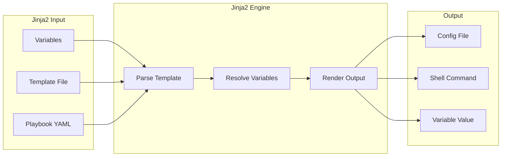
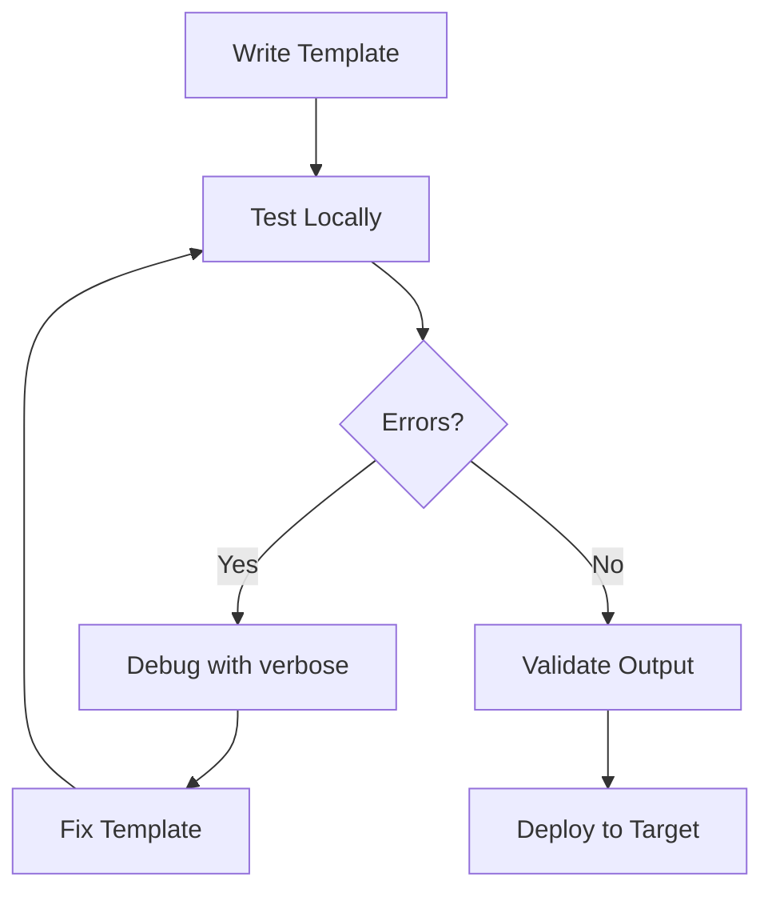

# How to Fix "Jinja2 Template" Errors in Ansible

Author: [nawazdhandala](https://www.github.com/nawazdhandala)

Tags: Ansible, Jinja2, Templates, Debugging, DevOps, Troubleshooting

Description: A practical guide to diagnosing and fixing common Jinja2 template errors in Ansible playbooks and templates.

---

Jinja2 is the templating engine that powers Ansible's variable substitution and template processing. When templates fail, the error messages can be confusing. This guide covers the most common Jinja2 errors and how to fix them.

## Understanding Jinja2 in Ansible

Ansible uses Jinja2 for two main purposes:

1. **Inline templating** in playbooks (variables, conditionals, loops)
2. **File templates** using the `template` module



## Error: "undefined variable"

The most common Jinja2 error occurs when referencing a variable that does not exist.

### Error Message

```
fatal: [host]: FAILED! => {"msg": "The task includes an option with an undefined variable.
The error was: 'app_version' is undefined"}
```

### Cause

The variable `app_version` was not defined anywhere in your inventory, vars files, or playbook.

### Solution 1: Define the Variable

```yaml
# group_vars/all.yml
app_version: "1.2.3"
```

Or in the playbook:

```yaml
- name: Deploy application
  hosts: all
  vars:
    app_version: "1.2.3"
  tasks:
    - name: Show version
      debug:
        msg: "Deploying version {{ app_version }}"
```

### Solution 2: Use Default Filter

Provide a fallback value when the variable might not exist:

```yaml
# Use default filter to provide fallback
- name: Show version
  debug:
    msg: "Version: {{ app_version | default('unknown') }}"

# Default to empty string
config_value: "{{ optional_setting | default('') }}"

# Default to omit (removes the parameter entirely)
- name: Create user
  user:
    name: "{{ username }}"
    shell: "{{ user_shell | default(omit) }}"
```

### Solution 3: Check if Variable is Defined

```yaml
- name: Conditional task based on variable
  debug:
    msg: "App version is {{ app_version }}"
  when: app_version is defined
```

## Error: "AnsibleUndefinedVariable" in Templates

### Error Message

```
AnsibleUndefinedVariable: 'dict object' has no attribute 'port'
```

### Cause

Trying to access a dictionary key or object attribute that does not exist.

### Bad Template

```jinja2
{# template.conf.j2 #}
server_port = {{ database.port }}
```

If `database` is defined but `port` is not a key in it.

### Solution 1: Use Default Filter

```jinja2
{# template.conf.j2 #}
server_port = {{ database.port | default(5432) }}
```

### Solution 2: Check Attribute Exists

```jinja2

server_port = {{ database.port }}

server_port = 5432

```

### Solution 3: Use dict.get() Method

```jinja2
server_port = {{ database.get('port', 5432) }}
```

## Error: "TemplateSyntaxError"

### Error Message

```
TemplateSyntaxError: unexpected '}'
```

### Common Causes and Fixes

**Missing closing bracket:**

```yaml
# Bad
message: "Hello {{ name }"

# Good
message: "Hello {{ name }}"
```

**Unescaped special characters:**

```yaml
# Bad - Ansible interprets {{ as Jinja2
shell: "echo ${USER}"  # This works
shell: "echo {{ env_var }}"  # This fails if env_var undefined

# Good - Escape literal braces
shell: "echo {{ '{{' }} literal braces {{ '}}' }}"
```

**Incorrect block syntax:**

```jinja2
{# Bad #}
{% if condition }
  content


{# Good #}

  content

```

## Error: "expected token 'end of statement block'"

### Error Message

```
expected token 'end of statement block', got 'string'
```

### Cause

Usually mixing Jinja2 syntax incorrectly.

### Common Mistakes

```jinja2
{# Bad - Missing quotes around string comparison #}


{# Good #}

```

```jinja2
{# Bad - Extra brackets #}
{{ {{ variable }} }}

{# Good #}
{{ variable }}
```

```jinja2
{# Bad - Using = instead of == in conditions #}


{# Good #}

```

## Error: "Unexpected templating type error"

### Error Message

```
Unexpected templating type error occurred on ({{ items }}): 'int' object is not iterable
```

### Cause

Trying to iterate over a non-iterable value.

### Solution

```yaml
# Ensure variable is a list
- name: Process items
  debug:
    msg: "Item: {{ item }}"
  loop: "{{ items | default([]) }}"

# Or check if iterable
- name: Process items safely
  debug:
    msg: "Item: {{ item }}"
  loop: "{{ items if items is iterable else [] }}"
  when: items is defined
```

## Error: YAML Parsing Issues with Jinja2

### Error Message

```
could not determine a constructor for the tag '!vault'
```

Or

```
found character that cannot start any token
```

### Cause

YAML interprets certain Jinja2 constructs as YAML syntax.

### Solution: Quote Your Jinja2 Expressions

```yaml
# Bad - YAML interprets the colon
message: Value is: {{ some_var }}

# Good - Quote the entire value
message: "Value is: {{ some_var }}"
```

```yaml
# Bad - Braces at start confuse YAML
shell: "{{ command }}"

# Good - This works but prefer quoting
shell: "{{ command }}"

# Better - Explicit full quoting
shell: >
  {{ command }}
```

### When Starting with Curly Braces

```yaml
# Bad - YAML thinks this is a dictionary
value: {{ my_dict | to_json }}

# Good - Quote it
value: "{{ my_dict | to_json }}"
```

## Error: "recursive loop detected"

### Error Message

```
recursive loop detected in template string
```

### Cause

A variable references itself directly or indirectly.

```yaml
# Bad - Recursive reference
vars:
  config: "{{ config }}"
```

### Solution

```yaml
# Good - Use a different variable name or break the cycle
vars:
  base_config: "/etc/app"
  config: "{{ base_config }}/app.conf"
```

## Debugging Jinja2 Templates

### Enable Debug Output

```yaml
- name: Debug template rendering
  debug:
    msg: |
      Variable values:
      - app_name: {{ app_name | default('NOT SET') }}
      - app_port: {{ app_port | default('NOT SET') }}
      - database: {{ database | default({}) | to_nice_yaml }}
```

### Test Template Rendering Locally

```bash
# Create a test playbook to render template
ansible-playbook test-template.yml -e "app_name=myapp" --check
```

```yaml
# test-template.yml
- hosts: localhost
  gather_facts: no
  vars:
    app_name: test
    database:
      host: localhost
      port: 5432
  tasks:
    - name: Render template to stdout
      debug:
        msg: "{{ lookup('template', 'template.conf.j2') }}"
```

### Use the ansible Command for Testing

```bash
# Test a simple expression
ansible localhost -m debug -a "msg={{ '192.168.1.1' | ipaddr }}"

# Test with variables
ansible localhost -m debug -a "msg={{ hostvars }}" -e "test_var=hello"
```

## Common Jinja2 Filters and Their Errors

### Type Conversion Filters

```yaml
# Convert to integer (fails if not a number)
port: "{{ port_string | int }}"

# Safe conversion with default
port: "{{ port_string | int(default=8080) }}"

# Boolean conversion
enabled: "{{ enable_feature | bool }}"

# String conversion
name: "{{ item | string }}"
```

### List and Dict Filters

```yaml
# Get first/last element (fails on empty list)
first_item: "{{ items | first }}"

# Safe version
first_item: "{{ items | first | default('none') }}"

# Combine lists
all_packages: "{{ base_packages | union(extra_packages) }}"

# Merge dictionaries
full_config: "{{ default_config | combine(custom_config) }}"
```

### String Manipulation

```yaml
# Replace characters
clean_name: "{{ filename | replace(' ', '_') }}"

# Regular expression
valid_name: "{{ input | regex_replace('[^a-zA-Z0-9]', '') }}"

# Trim whitespace
clean_value: "{{ raw_value | trim }}"
```

## Template File Best Practices

### Add Header Comments

```jinja2
{#
  template: nginx.conf.j2
  description: Nginx configuration for {{ app_name }}
  variables required:
    - app_name: Application name
    - app_port: Application port (default: 8080)
    - server_name: Domain name
#}

server {
    listen 80;
    server_name {{ server_name }};

    location / {
        proxy_pass http://127.0.0.1:{{ app_port | default(8080) }};
    }
}
```

### Use Macros for Repeated Patterns

```jinja2
{# Define a macro for upstream blocks #}

upstream {{ name }} {

    server {{ server }}:{{ port }};

}


{# Use the macro #}
{{ upstream('web_backend', web_servers, 8080) }}
{{ upstream('api_backend', api_servers, 3000) }}
```

### Control Whitespace

```jinja2
{# Without whitespace control - produces blank lines #}

{{ item }}


{# With whitespace control - cleaner output #}

{{ item }}


{# Remove all whitespace around block #}

content

```

## Template Testing Workflow



### Complete Testing Example

```yaml
# test-templates.yml - Validate all templates

---
- name: Test templates
  hosts: localhost
  gather_facts: yes
  vars_files:
    - vars/test-values.yml

  tasks:
    - name: Test nginx template
      template:
        src: nginx.conf.j2
        dest: /tmp/nginx.conf.test
      check_mode: yes
      register: nginx_test

    - name: Validate nginx syntax
      command: nginx -t -c /tmp/nginx.conf.test
      when: not nginx_test.changed
      delegate_to: localhost

    - name: Show template output
      debug:
        msg: "{{ lookup('template', 'nginx.conf.j2') }}"
```

---

Jinja2 template errors in Ansible usually come down to undefined variables, syntax mistakes, or type mismatches. Use the `default` filter liberally for optional variables, quote your YAML values when they contain Jinja2 expressions, and test templates locally before deploying. When debugging, enable verbose mode and use the `debug` module to inspect variable values. With these techniques, you can quickly identify and fix most template issues.
