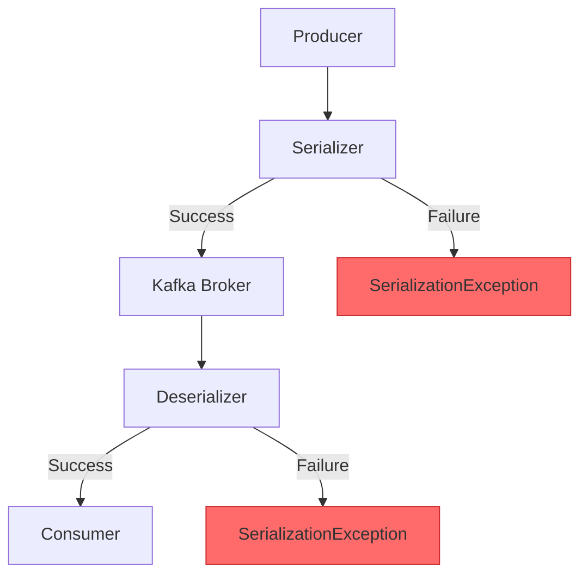
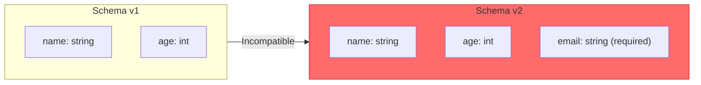
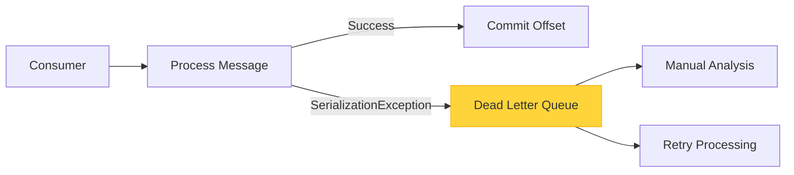

# How to Fix "SerializationException" in Kafka

Author: [nawazdhandala](https://www.github.com/nawazdhandala)

Tags: Kafka, Serialization, Java, Debugging, Message Queue, Avro, JSON, Backend

Description: Learn how to diagnose and fix SerializationException errors in Apache Kafka, including schema mismatches, incompatible types, and serializer configuration issues.

---

> SerializationException is one of the most common errors in Kafka applications. It occurs when a producer cannot serialize a message or a consumer cannot deserialize it. Understanding the root causes helps you fix these issues quickly and prevent data loss.

Serialization errors break your data pipeline. Proper configuration and schema management prevent production incidents.

---

## Understanding SerializationException



---

## Common Causes

### 1. Mismatched Serializer and Deserializer

The most frequent cause is using different serializers on producer and consumer sides:

```java
// Producer configuration - using JSON serializer
// This serializer converts Java objects to JSON bytes
Properties producerProps = new Properties();
producerProps.put(ProducerConfig.BOOTSTRAP_SERVERS_CONFIG, "localhost:9092");
producerProps.put(ProducerConfig.KEY_SERIALIZER_CLASS_CONFIG,
    "org.apache.kafka.common.serialization.StringSerializer");
producerProps.put(ProducerConfig.VALUE_SERIALIZER_CLASS_CONFIG,
    "org.springframework.kafka.support.serializer.JsonSerializer");
```

```java
// Consumer configuration - WRONG: using String deserializer for JSON data
// This will fail because JSON bytes cannot be directly converted to String
Properties consumerProps = new Properties();
consumerProps.put(ConsumerConfig.BOOTSTRAP_SERVERS_CONFIG, "localhost:9092");
consumerProps.put(ConsumerConfig.KEY_DESERIALIZER_CLASS_CONFIG,
    "org.apache.kafka.common.serialization.StringDeserializer");
consumerProps.put(ConsumerConfig.VALUE_DESERIALIZER_CLASS_CONFIG,
    "org.apache.kafka.common.serialization.StringDeserializer"); // Wrong!
```

**Fix: Use matching deserializer**

```java
// Consumer configuration - CORRECT: using JSON deserializer
// The deserializer must match the serializer used by the producer
Properties consumerProps = new Properties();
consumerProps.put(ConsumerConfig.BOOTSTRAP_SERVERS_CONFIG, "localhost:9092");
consumerProps.put(ConsumerConfig.KEY_DESERIALIZER_CLASS_CONFIG,
    "org.apache.kafka.common.serialization.StringDeserializer");
consumerProps.put(ConsumerConfig.VALUE_DESERIALIZER_CLASS_CONFIG,
    "org.springframework.kafka.support.serializer.JsonDeserializer");
// Specify the target type for deserialization
consumerProps.put(JsonDeserializer.TRUSTED_PACKAGES, "com.example.model");
consumerProps.put(JsonDeserializer.VALUE_DEFAULT_TYPE, "com.example.model.Order");
```

---

### 2. Schema Evolution Issues with Avro

When using Avro with Schema Registry, schema changes can cause serialization failures:



**Problem: Adding a required field without a default value**

```json
{
  "type": "record",
  "name": "User",
  "fields": [
    {"name": "name", "type": "string"},
    {"name": "age", "type": "int"},
    {"name": "email", "type": "string"}  // Required field - breaks backward compatibility
  ]
}
```

**Fix: Use optional fields or provide defaults**

```json
{
  "type": "record",
  "name": "User",
  "fields": [
    {"name": "name", "type": "string"},
    {"name": "age", "type": "int"},
    {"name": "email", "type": ["null", "string"], "default": null}
  ]
}
```

---

### 3. Null Values in Non-Nullable Fields

Sending null values when the serializer expects non-null data:

```java
// This will throw SerializationException if Order has non-nullable fields
// Always validate objects before sending to Kafka
Order order = new Order();
order.setOrderId(null);  // Null value for required field
order.setAmount(100.0);

producer.send(new ProducerRecord<>("orders", order));
```

**Fix: Validate before sending**

```java
// Create a validation method to check required fields
public void sendOrder(Order order) {
    // Validate required fields before serialization
    if (order.getOrderId() == null) {
        throw new IllegalArgumentException("Order ID cannot be null");
    }
    if (order.getAmount() == null) {
        throw new IllegalArgumentException("Amount cannot be null");
    }

    producer.send(new ProducerRecord<>("orders", order));
}
```

---

## Custom Error-Handling Deserializer

Create a deserializer that handles errors gracefully instead of crashing:

```java
// ErrorHandlingDeserializer wraps your actual deserializer
// and catches exceptions, allowing you to handle bad messages
import org.apache.kafka.common.serialization.Deserializer;
import org.slf4j.Logger;
import org.slf4j.LoggerFactory;

public class ErrorHandlingDeserializer<T> implements Deserializer<T> {

    private static final Logger logger = LoggerFactory.getLogger(
        ErrorHandlingDeserializer.class);

    private final Deserializer<T> delegate;
    private final Class<T> targetType;

    public ErrorHandlingDeserializer(Deserializer<T> delegate, Class<T> targetType) {
        this.delegate = delegate;
        this.targetType = targetType;
    }

    @Override
    public T deserialize(String topic, byte[] data) {
        try {
            // Attempt normal deserialization
            return delegate.deserialize(topic, data);
        } catch (Exception e) {
            // Log the error with context for debugging
            logger.error("Failed to deserialize message from topic {}: {}",
                topic, e.getMessage());
            logger.debug("Raw message bytes: {}",
                data != null ? new String(data) : "null");

            // Return null to skip the bad message
            // The consumer can filter out null values
            return null;
        }
    }

    @Override
    public void close() {
        delegate.close();
    }
}
```

---

## Spring Kafka Error Handling

Spring Kafka provides built-in error handling for deserialization failures:

```java
// Configure Spring Kafka with error handling deserializer
// This prevents the consumer from crashing on bad messages
import org.springframework.context.annotation.Bean;
import org.springframework.context.annotation.Configuration;
import org.springframework.kafka.config.ConcurrentKafkaListenerContainerFactory;
import org.springframework.kafka.core.ConsumerFactory;
import org.springframework.kafka.core.DefaultKafkaConsumerFactory;
import org.springframework.kafka.listener.CommonErrorHandler;
import org.springframework.kafka.listener.DefaultErrorHandler;
import org.springframework.kafka.support.serializer.ErrorHandlingDeserializer;
import org.springframework.kafka.support.serializer.JsonDeserializer;
import org.springframework.util.backoff.FixedBackOff;

@Configuration
public class KafkaConfig {

    @Bean
    public ConsumerFactory<String, Order> consumerFactory() {
        Map<String, Object> props = new HashMap<>();
        props.put(ConsumerConfig.BOOTSTRAP_SERVERS_CONFIG, "localhost:9092");
        props.put(ConsumerConfig.GROUP_ID_CONFIG, "order-group");

        // Use ErrorHandlingDeserializer as a wrapper
        // It catches exceptions from the delegate deserializer
        props.put(ConsumerConfig.KEY_DESERIALIZER_CLASS_CONFIG,
            ErrorHandlingDeserializer.class);
        props.put(ConsumerConfig.VALUE_DESERIALIZER_CLASS_CONFIG,
            ErrorHandlingDeserializer.class);

        // Configure the actual deserializers as delegates
        props.put(ErrorHandlingDeserializer.KEY_DESERIALIZER_CLASS,
            StringDeserializer.class);
        props.put(ErrorHandlingDeserializer.VALUE_DESERIALIZER_CLASS,
            JsonDeserializer.class);

        // Trust packages for JSON deserialization
        props.put(JsonDeserializer.TRUSTED_PACKAGES, "com.example.model");

        return new DefaultKafkaConsumerFactory<>(props);
    }

    @Bean
    public ConcurrentKafkaListenerContainerFactory<String, Order>
            kafkaListenerContainerFactory() {

        ConcurrentKafkaListenerContainerFactory<String, Order> factory =
            new ConcurrentKafkaListenerContainerFactory<>();
        factory.setConsumerFactory(consumerFactory());

        // Configure error handler with retry policy
        // Retry 3 times with 1 second intervals before giving up
        DefaultErrorHandler errorHandler = new DefaultErrorHandler(
            (record, exception) -> {
                // Dead letter handler - log or send to DLQ
                logger.error("Failed to process record after retries: {}",
                    record.value(), exception);
            },
            new FixedBackOff(1000L, 3L)  // 1 second interval, 3 retries
        );

        // Add specific exceptions that should not be retried
        // Deserialization errors are not recoverable by retry
        errorHandler.addNotRetryableExceptions(
            SerializationException.class,
            DeserializationException.class
        );

        factory.setCommonErrorHandler(errorHandler);
        return factory;
    }
}
```

---

## Dead Letter Queue Pattern

Send failed messages to a dead letter topic for later analysis:



```java
// Implement a dead letter queue handler for failed messages
// This preserves failed messages for debugging and reprocessing
import org.apache.kafka.clients.consumer.ConsumerRecord;
import org.apache.kafka.clients.producer.KafkaProducer;
import org.apache.kafka.clients.producer.ProducerRecord;
import org.apache.kafka.common.header.Header;
import org.apache.kafka.common.header.internals.RecordHeader;

public class DeadLetterQueueHandler {

    private final KafkaProducer<byte[], byte[]> dlqProducer;
    private final String dlqTopicSuffix = ".DLQ";

    public DeadLetterQueueHandler(KafkaProducer<byte[], byte[]> dlqProducer) {
        this.dlqProducer = dlqProducer;
    }

    public void sendToDeadLetterQueue(
            ConsumerRecord<byte[], byte[]> failedRecord,
            Exception exception) {

        // Create DLQ topic name based on original topic
        String dlqTopic = failedRecord.topic() + dlqTopicSuffix;

        // Create a new record for the DLQ with error metadata
        ProducerRecord<byte[], byte[]> dlqRecord = new ProducerRecord<>(
            dlqTopic,
            failedRecord.partition(),
            failedRecord.key(),
            failedRecord.value()
        );

        // Add headers with error information for debugging
        dlqRecord.headers().add(new RecordHeader(
            "error.message",
            exception.getMessage().getBytes()));
        dlqRecord.headers().add(new RecordHeader(
            "error.type",
            exception.getClass().getName().getBytes()));
        dlqRecord.headers().add(new RecordHeader(
            "original.topic",
            failedRecord.topic().getBytes()));
        dlqRecord.headers().add(new RecordHeader(
            "original.partition",
            String.valueOf(failedRecord.partition()).getBytes()));
        dlqRecord.headers().add(new RecordHeader(
            "original.offset",
            String.valueOf(failedRecord.offset()).getBytes()));
        dlqRecord.headers().add(new RecordHeader(
            "failed.timestamp",
            String.valueOf(System.currentTimeMillis()).getBytes()));

        // Send to DLQ asynchronously
        dlqProducer.send(dlqRecord, (metadata, ex) -> {
            if (ex != null) {
                logger.error("Failed to send to DLQ: {}", ex.getMessage());
            } else {
                logger.info("Message sent to DLQ topic {} partition {} offset {}",
                    metadata.topic(), metadata.partition(), metadata.offset());
            }
        });
    }
}
```

---

## Schema Registry Configuration

Use Confluent Schema Registry for schema validation and evolution:

```java
// Configure producer with Schema Registry for Avro serialization
// Schema Registry ensures schema compatibility across producers and consumers
import io.confluent.kafka.serializers.KafkaAvroSerializer;
import io.confluent.kafka.serializers.AbstractKafkaSchemaSerDeConfig;

Properties props = new Properties();
props.put(ProducerConfig.BOOTSTRAP_SERVERS_CONFIG, "localhost:9092");
props.put(ProducerConfig.KEY_SERIALIZER_CLASS_CONFIG, StringSerializer.class);
props.put(ProducerConfig.VALUE_SERIALIZER_CLASS_CONFIG, KafkaAvroSerializer.class);

// Schema Registry URL - stores and validates schemas
props.put(AbstractKafkaSchemaSerDeConfig.SCHEMA_REGISTRY_URL_CONFIG,
    "http://localhost:8081");

// Auto-register schemas (disable in production for controlled schema evolution)
props.put(AbstractKafkaSchemaSerDeConfig.AUTO_REGISTER_SCHEMAS, true);

// Use specific Avro reader for better performance
props.put(AbstractKafkaSchemaSerDeConfig.USE_LATEST_VERSION, false);

KafkaProducer<String, GenericRecord> producer = new KafkaProducer<>(props);
```

```java
// Configure consumer with Schema Registry
// The consumer fetches schemas from the registry to deserialize messages
import io.confluent.kafka.serializers.KafkaAvroDeserializer;

Properties props = new Properties();
props.put(ConsumerConfig.BOOTSTRAP_SERVERS_CONFIG, "localhost:9092");
props.put(ConsumerConfig.GROUP_ID_CONFIG, "my-group");
props.put(ConsumerConfig.KEY_DESERIALIZER_CLASS_CONFIG, StringDeserializer.class);
props.put(ConsumerConfig.VALUE_DESERIALIZER_CLASS_CONFIG, KafkaAvroDeserializer.class);

// Schema Registry URL must match the producer configuration
props.put(AbstractKafkaSchemaSerDeConfig.SCHEMA_REGISTRY_URL_CONFIG,
    "http://localhost:8081");

// Enable specific Avro reader to get strongly-typed objects
props.put(KafkaAvroDeserializerConfig.SPECIFIC_AVRO_READER_CONFIG, true);

KafkaConsumer<String, Order> consumer = new KafkaConsumer<>(props);
```

---

## Debugging Serialization Issues

### Check Raw Message Bytes

```java
// Consumer that reads raw bytes for debugging
// Useful when you need to inspect what is actually stored in Kafka
Properties props = new Properties();
props.put(ConsumerConfig.BOOTSTRAP_SERVERS_CONFIG, "localhost:9092");
props.put(ConsumerConfig.GROUP_ID_CONFIG, "debug-group");
props.put(ConsumerConfig.KEY_DESERIALIZER_CLASS_CONFIG,
    ByteArrayDeserializer.class);
props.put(ConsumerConfig.VALUE_DESERIALIZER_CLASS_CONFIG,
    ByteArrayDeserializer.class);
// Start from beginning to see all messages
props.put(ConsumerConfig.AUTO_OFFSET_RESET_CONFIG, "earliest");

KafkaConsumer<byte[], byte[]> debugConsumer = new KafkaConsumer<>(props);
debugConsumer.subscribe(Collections.singletonList("problematic-topic"));

while (true) {
    ConsumerRecords<byte[], byte[]> records = debugConsumer.poll(
        Duration.ofMillis(1000));

    for (ConsumerRecord<byte[], byte[]> record : records) {
        System.out.println("Offset: " + record.offset());
        System.out.println("Key bytes: " + Arrays.toString(record.key()));
        System.out.println("Value bytes: " + Arrays.toString(record.value()));

        // Try to interpret as string for readable output
        if (record.value() != null) {
            System.out.println("Value as string: " + new String(record.value()));
        }

        // Check for magic byte (Avro with Schema Registry starts with 0x00)
        if (record.value() != null && record.value().length > 0) {
            byte magicByte = record.value()[0];
            System.out.println("Magic byte: " + magicByte);
            if (magicByte == 0x00) {
                System.out.println("Detected: Schema Registry Avro format");
            }
        }
    }
}
```

---

## Best Practices

1. **Use Schema Registry** - centralized schema management
2. **Match serializers** - same serializer/deserializer on both sides
3. **Handle nulls explicitly** - validate before sending
4. **Implement DLQ** - preserve failed messages
5. **Test schema changes** - verify compatibility before deployment
6. **Log raw bytes** - for debugging production issues
7. **Use error handlers** - prevent consumer crashes

---

## Conclusion

SerializationException in Kafka typically stems from mismatched serializers, schema incompatibilities, or null value handling. Key takeaways:

- **Match serializers and deserializers** on producer and consumer
- **Use Schema Registry** for Avro schema management
- **Implement error handling** to prevent consumer crashes
- **Set up Dead Letter Queues** to preserve failed messages

---

*Having trouble with Kafka serialization errors? [OneUptime](https://oneuptime.com) provides comprehensive monitoring for Kafka clusters with real-time alerting on consumer lag and error rates.*
