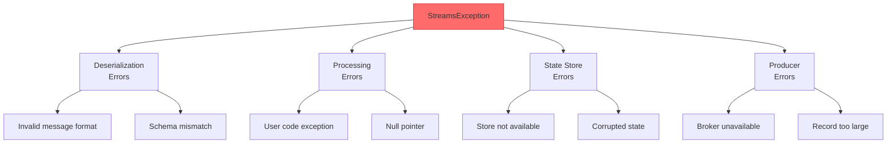
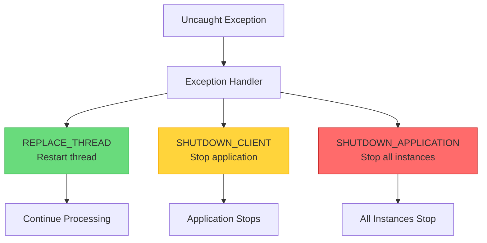

# How to Fix 'StreamsException' in Kafka Streams

Author: [nawazdhandala](https://www.github.com/nawazdhandala)

Tags: Kafka, Kafka Streams, Java, Debugging, Stream Processing, Error Handling, Backend, Reliability

Description: Learn how to diagnose and fix StreamsException errors in Kafka Streams applications, including deserialization failures, processing errors, and state store exceptions.

---

> StreamsException is a wrapper exception in Kafka Streams that indicates a processing failure. It can occur during deserialization, state store operations, or user code execution. Understanding the root cause and implementing proper error handling ensures your streaming application remains resilient.

Stream processing errors can halt your entire pipeline. Proper exception handling keeps data flowing while capturing problems.

---

## StreamsException Categories



---

## 1. Deserialization Exceptions

The most common cause is malformed messages that cannot be deserialized:

```java
// StreamsException wrapping a deserialization error
// org.apache.kafka.streams.errors.StreamsException:
//   Deserialization exception handler is set to fail upon a deserialization error.

// WRONG: Default configuration fails on any deserialization error
Properties props = new Properties();
props.put(StreamsConfig.APPLICATION_ID_CONFIG, "my-app");
props.put(StreamsConfig.BOOTSTRAP_SERVERS_CONFIG, "localhost:9092");
props.put(StreamsConfig.DEFAULT_KEY_SERDE_CLASS_CONFIG, Serdes.String().getClass());
props.put(StreamsConfig.DEFAULT_VALUE_SERDE_CLASS_CONFIG, Serdes.String().getClass());
// No error handler configured - will crash on bad messages
```

**Fix: Configure a deserialization exception handler**

```java
// Configure custom deserialization exception handler
// This allows the application to skip bad messages instead of crashing
import org.apache.kafka.streams.errors.DeserializationExceptionHandler;
import org.apache.kafka.clients.consumer.ConsumerRecord;

public class LogAndContinueExceptionHandler implements DeserializationExceptionHandler {

    private static final Logger logger = LoggerFactory.getLogger(
        LogAndContinueExceptionHandler.class);

    @Override
    public DeserializationHandlerResponse handle(
            ProcessorContext context,
            ConsumerRecord<byte[], byte[]> record,
            Exception exception) {

        // Log the error with context for debugging
        logger.error("Deserialization failed for record in topic {} partition {} offset {}",
            record.topic(),
            record.partition(),
            record.offset(),
            exception);

        // Log the raw bytes for investigation
        logger.debug("Key bytes: {}",
            record.key() != null ? new String(record.key()) : "null");
        logger.debug("Value bytes: {}",
            record.value() != null ? new String(record.value()) : "null");

        // Send to dead letter queue for manual processing
        sendToDeadLetterQueue(record, exception);

        // Continue processing - skip the bad record
        return DeserializationHandlerResponse.CONTINUE;
    }

    private void sendToDeadLetterQueue(
            ConsumerRecord<byte[], byte[]> record,
            Exception exception) {
        // Implementation to send failed record to DLQ
        // See dead letter queue pattern below
    }

    @Override
    public void configure(Map<String, ?> configs) {
        // Configuration if needed
    }
}

// Register the handler in Streams configuration
Properties props = new Properties();
props.put(StreamsConfig.APPLICATION_ID_CONFIG, "my-app");
props.put(StreamsConfig.BOOTSTRAP_SERVERS_CONFIG, "localhost:9092");

// Use custom deserialization exception handler
props.put(StreamsConfig.DEFAULT_DESERIALIZATION_EXCEPTION_HANDLER_CLASS_CONFIG,
    LogAndContinueExceptionHandler.class);
```

---

## 2. Processing Exceptions

Exceptions thrown by your processing logic are wrapped in StreamsException:

```java
// WRONG: Unhandled exceptions in processing code crash the stream
StreamsBuilder builder = new StreamsBuilder();
KStream<String, String> stream = builder.stream("input-topic");

stream.mapValues(value -> {
    // This will throw NullPointerException for null values
    return value.toUpperCase();  // Crashes if value is null!
}).to("output-topic");
```

**Fix: Add defensive processing and exception handling**

```java
// Correct approach with defensive processing
StreamsBuilder builder = new StreamsBuilder();
KStream<String, String> stream = builder.stream("input-topic");

stream
    // Filter out null values first
    .filter((key, value) -> value != null)

    // Use flatMapValues for error handling
    .flatMapValues(value -> {
        try {
            // Process the value
            String result = processValue(value);
            return Collections.singletonList(result);
        } catch (Exception e) {
            // Log error and return empty list to skip the record
            logger.error("Processing failed for value: {}", value, e);
            return Collections.emptyList();
        }
    })
    .to("output-topic");

// Alternative: Use branching for error handling
KStream<String, String>[] branches = stream
    .filter((key, value) -> value != null)
    .branch(
        // Branch 0: Valid records that can be processed
        (key, value) -> isValidFormat(value),
        // Branch 1: Invalid records
        (key, value) -> true
    );

// Process valid records
branches[0]
    .mapValues(this::processValue)
    .to("output-topic");

// Send invalid records to error topic
branches[1]
    .to("error-topic");
```

---

## 3. Production Exception Handler

Handle exceptions that occur when writing to output topics:

```java
// Configure production exception handler for output errors
// This handles cases like broker unavailability or record too large
import org.apache.kafka.streams.errors.ProductionExceptionHandler;
import org.apache.kafka.clients.producer.ProducerRecord;

public class LogAndContinueProductionExceptionHandler
        implements ProductionExceptionHandler {

    private static final Logger logger = LoggerFactory.getLogger(
        LogAndContinueProductionExceptionHandler.class);

    @Override
    public ProductionExceptionHandlerResponse handle(
            ProducerRecord<byte[], byte[]> record,
            Exception exception) {

        // Log the error with record details
        logger.error("Production failed for record to topic {} partition {}",
            record.topic(),
            record.partition(),
            exception);

        // Check if the error is recoverable
        if (isRecoverable(exception)) {
            // For transient errors, you might want to fail and retry
            logger.warn("Recoverable error - will retry");
            return ProductionExceptionHandlerResponse.FAIL;
        }

        // For non-recoverable errors, skip the record
        // Send to dead letter queue for investigation
        sendToDeadLetterQueue(record, exception);

        return ProductionExceptionHandlerResponse.CONTINUE;
    }

    private boolean isRecoverable(Exception exception) {
        // Network errors and timeouts are typically recoverable
        return exception instanceof org.apache.kafka.common.errors.TimeoutException
            || exception instanceof org.apache.kafka.common.errors.NetworkException;
    }

    @Override
    public void configure(Map<String, ?> configs) {
        // Configuration if needed
    }
}

// Register the handler
Properties props = new Properties();
props.put(StreamsConfig.DEFAULT_PRODUCTION_EXCEPTION_HANDLER_CLASS_CONFIG,
    LogAndContinueProductionExceptionHandler.class);
```

---

## 4. Uncaught Exception Handler

Handle any uncaught exceptions at the stream thread level:



```java
// Configure uncaught exception handler for stream threads
// This catches any exception not handled by other handlers
KafkaStreams streams = new KafkaStreams(topology, props);

streams.setUncaughtExceptionHandler((exception) -> {
    // Log the exception with full details
    logger.error("Uncaught exception in Kafka Streams", exception);

    // Determine response based on exception type
    if (exception instanceof StreamsException) {
        Throwable cause = exception.getCause();

        // Deserialization errors - replace thread and continue
        if (cause instanceof SerializationException) {
            logger.warn("Serialization error - replacing thread");
            return StreamThreadExceptionResponse.REPLACE_THREAD;
        }

        // State store errors might need application restart
        if (cause instanceof InvalidStateStoreException) {
            logger.error("State store error - shutting down client");
            return StreamThreadExceptionResponse.SHUTDOWN_CLIENT;
        }
    }

    // For unknown errors, try to replace the thread first
    // If it keeps failing, Kafka Streams will shut down
    return StreamThreadExceptionResponse.REPLACE_THREAD;
});

streams.start();
```

---

## 5. State Store Exceptions

State store access can fail during rebalancing or when corrupted:

```java
// WRONG: Not handling state store unavailability
public class MyProcessor implements Processor<String, String, String, String> {
    private KeyValueStore<String, Long> store;

    @Override
    public void init(ProcessorContext<String, String> context) {
        store = context.getStateStore("counts-store");
    }

    @Override
    public void process(Record<String, String> record) {
        // This can throw StateStoreNotAvailableException during rebalancing
        Long count = store.get(record.key());
        store.put(record.key(), count + 1);
    }
}
```

**Fix: Handle state store exceptions gracefully**

```java
// Correct processor with state store error handling
public class ResilientProcessor implements Processor<String, String, String, String> {

    private static final Logger logger = LoggerFactory.getLogger(ResilientProcessor.class);
    private KeyValueStore<String, Long> store;
    private ProcessorContext<String, String> context;

    @Override
    public void init(ProcessorContext<String, String> context) {
        this.context = context;
        this.store = context.getStateStore("counts-store");
    }

    @Override
    public void process(Record<String, String> record) {
        try {
            // Attempt to read from store
            Long count = store.get(record.key());
            if (count == null) {
                count = 0L;
            }

            // Update the store
            store.put(record.key(), count + 1);

            // Forward the result
            context.forward(new Record<>(
                record.key(),
                String.valueOf(count + 1),
                record.timestamp()
            ));

        } catch (InvalidStateStoreException e) {
            // State store not available - likely rebalancing
            logger.warn("State store temporarily unavailable for key: {}",
                record.key(), e);

            // Option 1: Skip the record (data loss)
            // return;

            // Option 2: Throw to trigger thread replacement
            throw new StreamsException("State store unavailable", e);

        } catch (StateStoreMigratedException e) {
            // Partition was migrated to another instance
            logger.info("Partition migrated, skipping record: {}", record.key());
            // The record will be processed by the new owner
        }
    }

    @Override
    public void close() {
        // Cleanup if needed
    }
}
```

---

## 6. Dead Letter Queue Implementation

Send failed records to a dead letter topic for manual investigation:

```java
// Complete dead letter queue implementation for Kafka Streams
public class DeadLetterQueueHandler {

    private final KafkaProducer<byte[], byte[]> dlqProducer;
    private final String dlqTopicSuffix;

    public DeadLetterQueueHandler(Properties producerProps, String dlqTopicSuffix) {
        this.dlqProducer = new KafkaProducer<>(producerProps);
        this.dlqTopicSuffix = dlqTopicSuffix;
    }

    public void sendToDeadLetterQueue(
            String sourceTopic,
            byte[] key,
            byte[] value,
            Exception exception,
            Map<String, String> additionalHeaders) {

        // Create DLQ topic name
        String dlqTopic = sourceTopic + dlqTopicSuffix;

        ProducerRecord<byte[], byte[]> dlqRecord = new ProducerRecord<>(
            dlqTopic, key, value);

        // Add error information as headers
        dlqRecord.headers().add("error.message",
            exception.getMessage().getBytes(StandardCharsets.UTF_8));
        dlqRecord.headers().add("error.class",
            exception.getClass().getName().getBytes(StandardCharsets.UTF_8));
        dlqRecord.headers().add("error.stacktrace",
            getStackTrace(exception).getBytes(StandardCharsets.UTF_8));
        dlqRecord.headers().add("source.topic",
            sourceTopic.getBytes(StandardCharsets.UTF_8));
        dlqRecord.headers().add("failed.timestamp",
            String.valueOf(System.currentTimeMillis()).getBytes(StandardCharsets.UTF_8));

        // Add any additional context headers
        additionalHeaders.forEach((k, v) ->
            dlqRecord.headers().add(k, v.getBytes(StandardCharsets.UTF_8)));

        // Send asynchronously to DLQ
        dlqProducer.send(dlqRecord, (metadata, ex) -> {
            if (ex != null) {
                logger.error("Failed to send to DLQ topic {}: {}",
                    dlqTopic, ex.getMessage());
            } else {
                logger.info("Sent failed record to DLQ {} partition {} offset {}",
                    dlqTopic, metadata.partition(), metadata.offset());
            }
        });
    }

    private String getStackTrace(Exception exception) {
        StringWriter sw = new StringWriter();
        exception.printStackTrace(new PrintWriter(sw));
        return sw.toString();
    }

    public void close() {
        dlqProducer.close();
    }
}

// Usage in a custom transformer
public class SafeTransformer implements ValueTransformer<String, String> {

    private ProcessorContext context;
    private DeadLetterQueueHandler dlqHandler;

    @Override
    public void init(ProcessorContext context) {
        this.context = context;
        this.dlqHandler = new DeadLetterQueueHandler(
            createDlqProducerProps(),
            ".DLQ"
        );
    }

    @Override
    public String transform(String value) {
        try {
            return processValue(value);
        } catch (Exception e) {
            // Send to DLQ
            dlqHandler.sendToDeadLetterQueue(
                context.topic(),
                null,  // No key in ValueTransformer
                value.getBytes(StandardCharsets.UTF_8),
                e,
                Map.of(
                    "partition", String.valueOf(context.partition()),
                    "offset", String.valueOf(context.offset())
                )
            );

            // Return null to filter out the record
            return null;
        }
    }

    @Override
    public void close() {
        dlqHandler.close();
    }
}
```

---

## 7. Retry with Exponential Backoff

Implement retry logic for transient failures:

```java
// Retry transformer with exponential backoff
// Useful for external service calls that may fail temporarily
public class RetryTransformer implements ValueTransformer<String, String> {

    private static final Logger logger = LoggerFactory.getLogger(RetryTransformer.class);

    private final int maxRetries;
    private final long initialBackoffMs;
    private final double backoffMultiplier;

    public RetryTransformer(int maxRetries, long initialBackoffMs, double backoffMultiplier) {
        this.maxRetries = maxRetries;
        this.initialBackoffMs = initialBackoffMs;
        this.backoffMultiplier = backoffMultiplier;
    }

    @Override
    public void init(ProcessorContext context) {
        // Initialization if needed
    }

    @Override
    public String transform(String value) {
        Exception lastException = null;
        long backoffMs = initialBackoffMs;

        for (int attempt = 0; attempt <= maxRetries; attempt++) {
            try {
                // Attempt the operation
                return callExternalService(value);

            } catch (RetryableException e) {
                lastException = e;

                if (attempt < maxRetries) {
                    logger.warn("Attempt {} failed, retrying in {} ms: {}",
                        attempt + 1, backoffMs, e.getMessage());

                    try {
                        Thread.sleep(backoffMs);
                    } catch (InterruptedException ie) {
                        Thread.currentThread().interrupt();
                        throw new StreamsException("Interrupted during retry", ie);
                    }

                    // Exponential backoff with cap
                    backoffMs = Math.min(
                        (long) (backoffMs * backoffMultiplier),
                        30000  // Max 30 seconds
                    );
                }
            } catch (NonRetryableException e) {
                // Do not retry for non-retryable errors
                logger.error("Non-retryable error: {}", e.getMessage());
                throw new StreamsException("Non-retryable error", e);
            }
        }

        // All retries exhausted
        logger.error("All {} retries exhausted", maxRetries);
        throw new StreamsException("Retries exhausted", lastException);
    }

    private String callExternalService(String value) throws RetryableException {
        // Simulated external service call
        // In reality, this would call an HTTP API, database, etc.
        return value.toUpperCase();
    }

    @Override
    public void close() {
        // Cleanup
    }
}

// Custom exception types
class RetryableException extends Exception {
    public RetryableException(String message, Throwable cause) {
        super(message, cause);
    }
}

class NonRetryableException extends Exception {
    public NonRetryableException(String message) {
        super(message);
    }
}
```

---

## 8. Complete Error Handling Configuration

Put it all together in a production configuration:

```java
// Production-ready Kafka Streams configuration with comprehensive error handling
public class ResilientKafkaStreamsApp {

    public static void main(String[] args) {
        Properties props = new Properties();

        // Basic configuration
        props.put(StreamsConfig.APPLICATION_ID_CONFIG, "resilient-streams-app");
        props.put(StreamsConfig.BOOTSTRAP_SERVERS_CONFIG, "localhost:9092");
        props.put(StreamsConfig.DEFAULT_KEY_SERDE_CLASS_CONFIG, Serdes.String().getClass());
        props.put(StreamsConfig.DEFAULT_VALUE_SERDE_CLASS_CONFIG, Serdes.String().getClass());

        // Error handlers
        props.put(StreamsConfig.DEFAULT_DESERIALIZATION_EXCEPTION_HANDLER_CLASS_CONFIG,
            LogAndContinueExceptionHandler.class);
        props.put(StreamsConfig.DEFAULT_PRODUCTION_EXCEPTION_HANDLER_CLASS_CONFIG,
            LogAndContinueProductionExceptionHandler.class);

        // Processing guarantees
        props.put(StreamsConfig.PROCESSING_GUARANTEE_CONFIG,
            StreamsConfig.EXACTLY_ONCE_V2);

        // State store configuration
        props.put(StreamsConfig.STATE_DIR_CONFIG, "/var/lib/kafka-streams");
        props.put(StreamsConfig.REPLICATION_FACTOR_CONFIG, 3);

        // Build topology
        StreamsBuilder builder = new StreamsBuilder();
        buildTopology(builder);
        Topology topology = builder.build();

        // Create streams application
        KafkaStreams streams = new KafkaStreams(topology, props);

        // Set uncaught exception handler
        streams.setUncaughtExceptionHandler(exception -> {
            logger.error("Uncaught exception", exception);

            // Send alert
            sendAlert("Kafka Streams uncaught exception", exception);

            // Try to recover by replacing the thread
            return StreamThreadExceptionResponse.REPLACE_THREAD;
        });

        // Set state listener for monitoring
        streams.setStateListener((newState, oldState) -> {
            logger.info("State changed from {} to {}", oldState, newState);

            if (newState == KafkaStreams.State.ERROR) {
                sendAlert("Kafka Streams entered ERROR state", null);
            }
        });

        // Add shutdown hook
        Runtime.getRuntime().addShutdownHook(new Thread(() -> {
            logger.info("Shutting down Kafka Streams");
            streams.close(Duration.ofSeconds(30));
        }));

        // Start the application
        streams.start();

        logger.info("Kafka Streams application started");
    }

    private static void buildTopology(StreamsBuilder builder) {
        KStream<String, String> input = builder.stream("input-topic");

        // Safe processing with null checks and error handling
        input
            .filter((key, value) -> key != null && value != null)
            .transformValues(() -> new SafeTransformer())
            .filter((key, value) -> value != null)  // Filter out DLQ records
            .to("output-topic");
    }

    private static void sendAlert(String message, Exception exception) {
        // Send to alerting system (PagerDuty, Slack, etc.)
        logger.error("ALERT: {} - {}", message,
            exception != null ? exception.getMessage() : "no exception");
    }
}
```

---

## Monitoring and Alerting

Monitor these metrics to detect issues early:

```java
// Expose metrics for monitoring StreamsException occurrences
public class StreamsMetrics {

    private final Counter deserializationErrors;
    private final Counter processingErrors;
    private final Counter productionErrors;
    private final Counter threadReplacements;

    public StreamsMetrics(MeterRegistry registry) {
        deserializationErrors = Counter.builder("kafka.streams.errors")
            .tag("type", "deserialization")
            .description("Number of deserialization errors")
            .register(registry);

        processingErrors = Counter.builder("kafka.streams.errors")
            .tag("type", "processing")
            .description("Number of processing errors")
            .register(registry);

        productionErrors = Counter.builder("kafka.streams.errors")
            .tag("type", "production")
            .description("Number of production errors")
            .register(registry);

        threadReplacements = Counter.builder("kafka.streams.thread.replacements")
            .description("Number of stream thread replacements")
            .register(registry);
    }

    public void recordDeserializationError() {
        deserializationErrors.increment();
    }

    public void recordProcessingError() {
        processingErrors.increment();
    }

    public void recordProductionError() {
        productionErrors.increment();
    }

    public void recordThreadReplacement() {
        threadReplacements.increment();
    }
}
```

---

## Best Practices

1. **Always configure exception handlers** - do not rely on defaults
2. **Implement dead letter queues** - preserve failed messages
3. **Use retry with backoff** - for transient failures
4. **Monitor error rates** - detect issues early
5. **Log with context** - topic, partition, offset
6. **Test error scenarios** - inject failures in development
7. **Set up alerts** - for ERROR state and high error rates

---

## Conclusion

StreamsException in Kafka Streams requires comprehensive error handling at multiple levels. Key takeaways:

- **Configure all exception handlers** - deserialization, production, uncaught
- **Implement dead letter queues** - preserve failed records
- **Handle state store errors** - during rebalancing
- **Monitor and alert** - detect issues before they escalate

---

*Need to monitor your Kafka Streams applications? [OneUptime](https://oneuptime.com) provides comprehensive monitoring with error rate tracking, state store health checks, and real-time alerting.*
