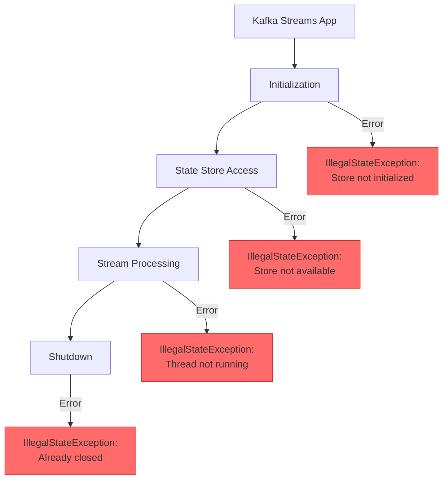
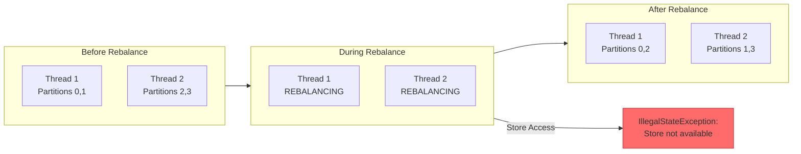

# How to Fix "IllegalStateException" in Kafka Streams

Author: [nawazdhandala](https://www.github.com/nawazdhandala)

Tags: Kafka, Kafka Streams, Java, Debugging, Stream Processing, State Store, Backend

Description: Learn how to diagnose and fix IllegalStateException errors in Kafka Streams applications, including state store issues, topology errors, and thread management problems.

---

> IllegalStateException in Kafka Streams indicates that the application is in an unexpected state. This error can occur during startup, processing, or shutdown. Understanding the specific causes helps you fix these issues and build more resilient streaming applications.

State management is critical in stream processing. Proper error handling prevents data loss and application crashes.

---

## Common IllegalStateException Scenarios



---

## 1. State Store Not Initialized

The most common cause is accessing a state store before the application is fully started:

```java
// WRONG: Accessing store immediately after start()
// The application needs time to complete initialization
KafkaStreams streams = new KafkaStreams(topology, props);
streams.start();

// This will throw IllegalStateException because the store is not ready
KeyValueStore<String, Long> store = streams.store(
    StoreQueryParameters.fromNameAndType("my-store", QueryableStoreTypes.keyValueStore())
);
```

**Fix: Wait for the application to be in RUNNING state**

```java
// Create Kafka Streams application
KafkaStreams streams = new KafkaStreams(topology, props);

// Add state listener to track application state changes
CountDownLatch startupLatch = new CountDownLatch(1);

streams.setStateListener((newState, oldState) -> {
    // Log state transitions for debugging
    System.out.println("State changed from " + oldState + " to " + newState);

    // Signal when the application is fully running
    if (newState == KafkaStreams.State.RUNNING) {
        startupLatch.countDown();
    }
});

// Start the application
streams.start();

// Wait for the application to be fully running before accessing stores
// Timeout after 60 seconds to prevent infinite waiting
boolean started = startupLatch.await(60, TimeUnit.SECONDS);
if (!started) {
    throw new RuntimeException("Kafka Streams failed to start within timeout");
}

// Now it is safe to access the state store
KeyValueStore<String, Long> store = streams.store(
    StoreQueryParameters.fromNameAndType("my-store", QueryableStoreTypes.keyValueStore())
);
```

---

## 2. Accessing Store from Wrong Thread

State stores can only be accessed from stream threads or during interactive queries:

```java
// WRONG: Accessing store from processor init() before it is ready
public class MyProcessor implements Processor<String, String, String, String> {
    private KeyValueStore<String, Long> store;

    @Override
    public void init(ProcessorContext<String, String> context) {
        // This might fail if called too early in the lifecycle
        store = context.getStateStore("my-store");

        // WRONG: Do not query the store in init()
        // The store may not be fully initialized yet
        Long value = store.get("key");  // Can throw IllegalStateException
    }
}
```

**Fix: Access store only during process() or punctuate()**

```java
// Correct processor implementation that accesses stores safely
public class MyProcessor implements Processor<String, String, String, String> {
    private KeyValueStore<String, Long> store;
    private ProcessorContext<String, String> context;

    @Override
    public void init(ProcessorContext<String, String> context) {
        this.context = context;
        // Only get the store reference in init(), do not query it
        this.store = context.getStateStore("my-store");

        // Schedule periodic processing using punctuator
        // STREAM_TIME triggers based on record timestamps
        context.schedule(
            Duration.ofMinutes(1),
            PunctuationType.STREAM_TIME,
            this::punctuate
        );
    }

    @Override
    public void process(Record<String, String> record) {
        // Safe to access the store during process()
        // The store is guaranteed to be initialized at this point
        Long currentCount = store.get(record.key());
        if (currentCount == null) {
            currentCount = 0L;
        }

        // Update the store
        store.put(record.key(), currentCount + 1);

        // Forward processed record downstream
        context.forward(new Record<>(
            record.key(),
            String.valueOf(currentCount + 1),
            record.timestamp()
        ));
    }

    private void punctuate(long timestamp) {
        // Safe to access store in punctuator
        // Iterate through all entries for periodic processing
        try (KeyValueIterator<String, Long> iterator = store.all()) {
            while (iterator.hasNext()) {
                KeyValue<String, Long> entry = iterator.next();
                // Perform periodic aggregation or cleanup
                System.out.println("Key: " + entry.key + ", Count: " + entry.value);
            }
        }
    }

    @Override
    public void close() {
        // Clean up resources if needed
        // Do not close the store - Kafka Streams manages store lifecycle
    }
}
```

---

## 3. Topology Already Started

Adding operations to a topology after streams.start() throws IllegalStateException:

```java
// WRONG: Modifying topology after starting the application
StreamsBuilder builder = new StreamsBuilder();
KStream<String, String> stream = builder.stream("input-topic");

Topology topology = builder.build();
KafkaStreams streams = new KafkaStreams(topology, props);
streams.start();

// This will throw IllegalStateException
// Topology cannot be modified after the application starts
stream.to("output-topic");  // IllegalStateException!
```

**Fix: Build complete topology before starting**

```java
// Correct approach: Build the entire topology before starting
StreamsBuilder builder = new StreamsBuilder();

// Define the complete processing topology
KStream<String, String> stream = builder.stream("input-topic");

// Add all transformations before building
KStream<String, String> processed = stream
    .filter((key, value) -> value != null)
    .mapValues(value -> value.toUpperCase());

// Add state stores
builder.addStateStore(
    Stores.keyValueStoreBuilder(
        Stores.persistentKeyValueStore("my-store"),
        Serdes.String(),
        Serdes.Long()
    )
);

// Write to output topic
processed.to("output-topic");

// Build the topology - this finalizes the processing graph
Topology topology = builder.build();

// Print topology for debugging
System.out.println(topology.describe());

// Create and start the application
// No modifications allowed after this point
KafkaStreams streams = new KafkaStreams(topology, props);
streams.start();
```

---

## 4. Rebalancing State Issues

During rebalancing, state stores become temporarily unavailable:



**Fix: Handle rebalancing with state listener**

```java
// Create Kafka Streams with rebalance handling
KafkaStreams streams = new KafkaStreams(topology, props);

// Track current state for safe store access
AtomicReference<KafkaStreams.State> currentState =
    new AtomicReference<>(KafkaStreams.State.CREATED);

streams.setStateListener((newState, oldState) -> {
    currentState.set(newState);

    switch (newState) {
        case REBALANCING:
            // Pause any external store queries during rebalance
            // Stores are being migrated between instances
            System.out.println("Rebalancing - stores temporarily unavailable");
            break;
        case RUNNING:
            // Safe to query stores again
            System.out.println("Running - stores available");
            break;
        case ERROR:
            // Log error for investigation
            System.err.println("Stream entered ERROR state");
            break;
    }
});

streams.start();

// Safe store access method that checks state first
public Optional<Long> safeStoreGet(String key) {
    // Only access store when in RUNNING state
    if (currentState.get() != KafkaStreams.State.RUNNING) {
        return Optional.empty();
    }

    try {
        KeyValueStore<String, Long> store = streams.store(
            StoreQueryParameters.fromNameAndType(
                "my-store",
                QueryableStoreTypes.keyValueStore()
            )
        );
        return Optional.ofNullable(store.get(key));
    } catch (InvalidStateStoreException e) {
        // Store not available - likely rebalancing
        return Optional.empty();
    }
}
```

---

## 5. State Directory Lock Issues

Multiple instances trying to use the same state directory causes lock conflicts:

```java
// WRONG: Multiple instances with same state directory
// Each Kafka Streams instance needs its own state directory
Properties props1 = new Properties();
props1.put(StreamsConfig.STATE_DIR_CONFIG, "/tmp/kafka-streams");
props1.put(StreamsConfig.APPLICATION_ID_CONFIG, "my-app");

Properties props2 = new Properties();
props2.put(StreamsConfig.STATE_DIR_CONFIG, "/tmp/kafka-streams");  // Same directory!
props2.put(StreamsConfig.APPLICATION_ID_CONFIG, "my-app");

// Second instance will fail with IllegalStateException due to lock conflict
KafkaStreams streams1 = new KafkaStreams(topology, props1);
KafkaStreams streams2 = new KafkaStreams(topology, props2);  // Fails!
```

**Fix: Use unique state directories for each instance**

```java
// Generate unique state directory for each instance
// Include hostname and process ID to ensure uniqueness
String hostname = InetAddress.getLocalHost().getHostName();
String uniqueId = UUID.randomUUID().toString().substring(0, 8);

Properties props = new Properties();
props.put(StreamsConfig.APPLICATION_ID_CONFIG, "my-app");
props.put(StreamsConfig.BOOTSTRAP_SERVERS_CONFIG, "localhost:9092");

// Create unique state directory path
// Format: /var/lib/kafka-streams/my-app/hostname-uuid
String stateDir = String.format("/var/lib/kafka-streams/%s/%s-%s",
    "my-app", hostname, uniqueId);
props.put(StreamsConfig.STATE_DIR_CONFIG, stateDir);

// Ensure the directory exists and is writable
File stateDirFile = new File(stateDir);
if (!stateDirFile.exists()) {
    stateDirFile.mkdirs();
}

KafkaStreams streams = new KafkaStreams(topology, props);
```

---

## 6. Shutdown and Restart Issues

Improper shutdown can leave state in an inconsistent condition:

```java
// WRONG: Force stopping without proper shutdown
// This can corrupt state stores and cause issues on restart
KafkaStreams streams = new KafkaStreams(topology, props);
streams.start();

// Bad: Calling close without waiting
streams.close();  // Does not wait for graceful shutdown

// Bad: Starting again immediately
streams.start();  // IllegalStateException - already closed
```

**Fix: Implement proper shutdown with cleanup**

```java
public class KafkaStreamsManager {
    private KafkaStreams streams;
    private final Topology topology;
    private final Properties props;

    public KafkaStreamsManager(Topology topology, Properties props) {
        this.topology = topology;
        this.props = props;
    }

    public void start() {
        // Create new instance for each start
        streams = new KafkaStreams(topology, props);

        // Set up uncaught exception handler for stream threads
        streams.setUncaughtExceptionHandler((thread, exception) -> {
            System.err.println("Uncaught exception in thread " + thread.getName());
            exception.printStackTrace();

            // Return REPLACE_THREAD to restart the failed thread
            // Other options: SHUTDOWN_CLIENT, SHUTDOWN_APPLICATION
            return StreamsUncaughtExceptionHandler.StreamThreadExceptionResponse.REPLACE_THREAD;
        });

        // Add shutdown hook for graceful termination
        Runtime.getRuntime().addShutdownHook(new Thread(this::shutdown));

        streams.start();
    }

    public void shutdown() {
        if (streams != null) {
            // Close with timeout to allow graceful shutdown
            // This gives time for in-flight records to be processed
            boolean closed = streams.close(Duration.ofSeconds(30));

            if (!closed) {
                System.err.println("Streams did not close within timeout");
            }

            // Clean up local state if needed
            // Only do this if you want to reset state on next start
            // streams.cleanUp();
        }
    }

    public void restart() {
        // Proper restart sequence
        shutdown();

        // Wait a moment for cleanup to complete
        try {
            Thread.sleep(1000);
        } catch (InterruptedException e) {
            Thread.currentThread().interrupt();
        }

        // Start fresh instance
        start();
    }
}
```

---

## 7. Interactive Query Issues

Querying stores from REST endpoints requires careful state management:

```java
// REST endpoint for querying Kafka Streams state store
@RestController
public class StoreQueryController {

    private final KafkaStreams streams;

    public StoreQueryController(KafkaStreams streams) {
        this.streams = streams;
    }

    @GetMapping("/store/{key}")
    public ResponseEntity<Long> getFromStore(@PathVariable String key) {
        // Check if streams is in a queryable state
        KafkaStreams.State state = streams.state();

        if (state != KafkaStreams.State.RUNNING) {
            // Return 503 Service Unavailable during rebalancing or startup
            return ResponseEntity.status(HttpStatus.SERVICE_UNAVAILABLE)
                .header("Retry-After", "5")
                .build();
        }

        try {
            // Query the state store
            ReadOnlyKeyValueStore<String, Long> store = streams.store(
                StoreQueryParameters.fromNameAndType(
                    "counts-store",
                    QueryableStoreTypes.keyValueStore()
                )
            );

            Long value = store.get(key);
            if (value == null) {
                return ResponseEntity.notFound().build();
            }
            return ResponseEntity.ok(value);

        } catch (InvalidStateStoreException e) {
            // Store is temporarily unavailable
            // This can happen during partition reassignment
            return ResponseEntity.status(HttpStatus.SERVICE_UNAVAILABLE)
                .header("Retry-After", "5")
                .build();
        }
    }

    @GetMapping("/store")
    public ResponseEntity<Map<String, Long>> getAllFromStore() {
        if (streams.state() != KafkaStreams.State.RUNNING) {
            return ResponseEntity.status(HttpStatus.SERVICE_UNAVAILABLE).build();
        }

        try {
            ReadOnlyKeyValueStore<String, Long> store = streams.store(
                StoreQueryParameters.fromNameAndType(
                    "counts-store",
                    QueryableStoreTypes.keyValueStore()
                )
            );

            Map<String, Long> result = new HashMap<>();

            // Iterate through all entries
            // Use try-with-resources to ensure iterator is closed
            try (KeyValueIterator<String, Long> iterator = store.all()) {
                while (iterator.hasNext()) {
                    KeyValue<String, Long> entry = iterator.next();
                    result.put(entry.key, entry.value);
                }
            }

            return ResponseEntity.ok(result);

        } catch (InvalidStateStoreException e) {
            return ResponseEntity.status(HttpStatus.SERVICE_UNAVAILABLE).build();
        }
    }
}
```

---

## Error Handling Configuration

Configure robust error handling for production:

```java
// Production configuration for Kafka Streams
Properties props = new Properties();
props.put(StreamsConfig.APPLICATION_ID_CONFIG, "my-streams-app");
props.put(StreamsConfig.BOOTSTRAP_SERVERS_CONFIG, "localhost:9092");

// Default serde configuration
props.put(StreamsConfig.DEFAULT_KEY_SERDE_CLASS_CONFIG, Serdes.String().getClass());
props.put(StreamsConfig.DEFAULT_VALUE_SERDE_CLASS_CONFIG, Serdes.String().getClass());

// Processing guarantees - exactly_once for critical applications
props.put(StreamsConfig.PROCESSING_GUARANTEE_CONFIG,
    StreamsConfig.EXACTLY_ONCE_V2);

// Number of stream threads - increase for higher throughput
props.put(StreamsConfig.NUM_STREAM_THREADS_CONFIG, 4);

// Commit interval - lower for lower latency, higher for better throughput
props.put(StreamsConfig.COMMIT_INTERVAL_MS_CONFIG, 1000);

// State directory configuration
props.put(StreamsConfig.STATE_DIR_CONFIG, "/var/lib/kafka-streams");

// Replication factor for internal topics
props.put(StreamsConfig.REPLICATION_FACTOR_CONFIG, 3);

// Create Kafka Streams instance
KafkaStreams streams = new KafkaStreams(topology, props);

// Set global exception handler for deserialization errors
streams.setUncaughtExceptionHandler((thread, exception) -> {
    System.err.println("Uncaught exception in " + thread.getName());
    exception.printStackTrace();

    if (exception instanceof IllegalStateException) {
        // For IllegalStateException, try to replace the thread
        return StreamsUncaughtExceptionHandler.StreamThreadExceptionResponse.REPLACE_THREAD;
    }

    // For other exceptions, shut down the client
    return StreamsUncaughtExceptionHandler.StreamThreadExceptionResponse.SHUTDOWN_CLIENT;
});
```

---

## Debugging Tools

### Check Application State

```java
// Utility method to print detailed application state
public void printStreamState(KafkaStreams streams) {
    System.out.println("Current State: " + streams.state());

    // Print thread metadata
    for (ThreadMetadata thread : streams.metadataForLocalThreads()) {
        System.out.println("Thread: " + thread.threadName());
        System.out.println("  State: " + thread.threadState());
        System.out.println("  Active tasks: " + thread.activeTasks());
        System.out.println("  Standby tasks: " + thread.standbyTasks());
    }

    // Print all stores
    Collection<String> storeNames = topology.describe().subtopologies().stream()
        .flatMap(s -> s.nodes().stream())
        .filter(n -> n instanceof org.apache.kafka.streams.TopologyDescription.Processor)
        .flatMap(n -> ((org.apache.kafka.streams.TopologyDescription.Processor) n).stores().stream())
        .collect(Collectors.toSet());

    System.out.println("State stores: " + storeNames);
}
```

---

## Best Practices

1. **Wait for RUNNING state** before accessing stores
2. **Handle rebalancing** with state listeners
3. **Use unique state directories** for each instance
4. **Implement proper shutdown** with timeout
5. **Add exception handlers** for graceful recovery
6. **Return 503** from REST endpoints during rebalancing
7. **Log state transitions** for debugging

---

## Conclusion

IllegalStateException in Kafka Streams usually indicates state access at the wrong time or improper lifecycle management. Key takeaways:

- **Wait for RUNNING state** before querying stores
- **Handle rebalancing** gracefully with state listeners
- **Use proper shutdown** to prevent state corruption
- **Configure exception handlers** for automatic recovery

---

*Need to monitor your Kafka Streams applications? [OneUptime](https://oneuptime.com) provides comprehensive monitoring with state store health checks, lag tracking, and rebalancing alerts.*
