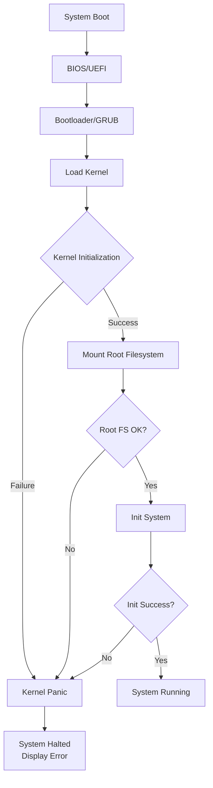
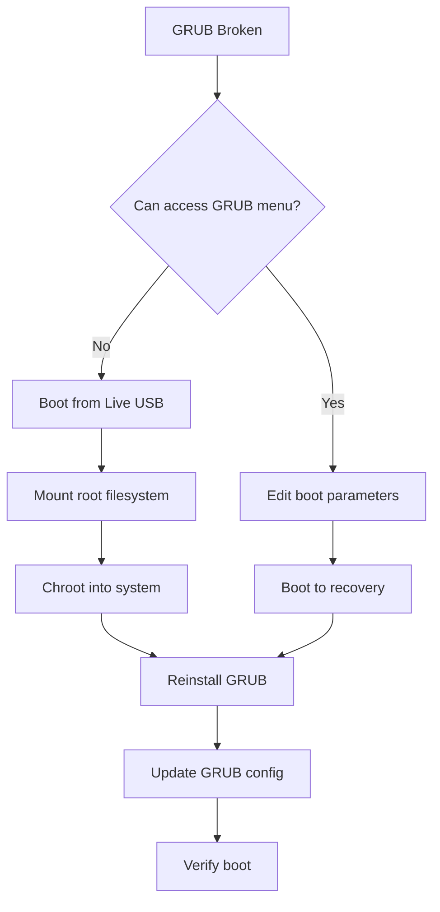
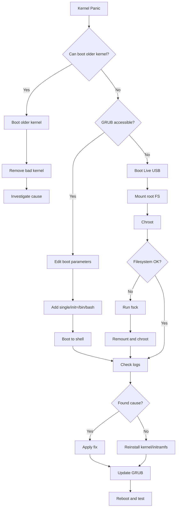

# How to Fix "Kernel Panic" Boot Errors

Author: [nawazdhandala](https://www.github.com/nawazdhandala)

Tags: Linux, Kernel, Troubleshooting, Boot, System Administration, Recovery

Description: Learn how to diagnose and recover from kernel panic boot errors using rescue mode, GRUB, and system repair techniques.

---

A kernel panic is Linux's equivalent of a critical system crash. When the kernel encounters an unrecoverable error, it halts to prevent data corruption. This guide covers how to diagnose the cause, boot into recovery mode, and restore your system to a working state.

## Understanding Kernel Panics

Before diving into fixes, understand what causes kernel panics and how to read the error messages.



## Common Kernel Panic Messages

| Panic Message | Likely Cause |
|---------------|--------------|
| `VFS: Unable to mount root fs` | Wrong root= parameter or missing drivers |
| `Kernel panic - not syncing: No init found` | Corrupted /sbin/init or missing systemd |
| `Unable to handle kernel paging request` | Memory corruption or bad RAM |
| `BUG: soft lockup` | Driver or kernel module hanging |
| `Kernel panic - not syncing: Out of memory` | OOM condition during boot |

## 1. Boot Into Recovery Mode

The first step is gaining access to a working environment to diagnose and fix the issue.

### Using GRUB Recovery Menu

```bash
# During boot, hold SHIFT (BIOS) or ESC (UEFI) to access GRUB menu

# Select "Advanced options for Ubuntu" (or similar)
# Choose a kernel version with "(recovery mode)"

# From recovery menu, select:
# - "root" for root shell
# - "fsck" to check filesystems
# - "network" to enable networking first if needed
```

### Using GRUB Command Line

```bash
# Press 'c' at GRUB menu for command line

# List available partitions
grub> ls

# Find your root partition (look for Linux filesystem)
grub> ls (hd0,gpt2)/

# Set root and boot manually
grub> set root=(hd0,gpt2)
grub> linux /vmlinuz root=/dev/sda2 ro single
grub> initrd /initrd.img
grub> boot
```

### Editing Kernel Boot Parameters

```bash
# At GRUB menu, press 'e' to edit boot entry

# Find the line starting with 'linux' and add parameters:

# Boot to single user mode
linux ... ro single

# Boot with verbose output
linux ... ro debug

# Skip init and drop to shell
linux ... init=/bin/bash

# Disable problematic modules
linux ... modprobe.blacklist=nouveau

# After editing, press Ctrl+X or F10 to boot
```

## 2. Boot From Live USB

When GRUB recovery fails, use a live USB to access your system.

```bash
# Boot from Ubuntu/Debian live USB

# Identify your root partition
lsblk
sudo fdisk -l

# Mount the root filesystem
sudo mount /dev/sda2 /mnt

# Mount additional required filesystems
sudo mount /dev/sda1 /mnt/boot        # If separate boot partition
sudo mount /dev/sda3 /mnt/boot/efi    # If UEFI system
sudo mount --bind /dev /mnt/dev
sudo mount --bind /proc /mnt/proc
sudo mount --bind /sys /mnt/sys
sudo mount --bind /run /mnt/run       # Needed for some operations

# Chroot into your system
sudo chroot /mnt

# Now you can run commands as if booted into your system
```

## 3. Diagnosing the Panic Cause

Once in recovery or chroot, investigate what caused the panic.

```bash
# Check recent kernel logs (may reveal the cause)
journalctl -k -b -1    # Kernel messages from last boot
journalctl -b -1       # All messages from last boot

# If journalctl doesn't work, check log files
cat /var/log/kern.log
cat /var/log/syslog
dmesg | tail -100

# Check for filesystem errors
sudo fsck -n /dev/sda2    # Check without fixing (safe)

# List installed kernels
ls /boot/vmlinuz*
dpkg -l | grep linux-image    # Debian/Ubuntu
rpm -qa | grep kernel         # RHEL/CentOS

# Check disk health
sudo smartctl -a /dev/sda
```

## 4. Common Fixes

### Fix: VFS Unable to Mount Root Filesystem

```bash
# This usually means the root= parameter is wrong or initramfs is broken

# From chroot or recovery mode:

# Regenerate initramfs for all kernels
sudo update-initramfs -u -k all    # Debian/Ubuntu
sudo dracut --regenerate-all -f    # RHEL/CentOS

# Verify root UUID matches GRUB config
blkid | grep -i root
cat /boot/grub/grub.cfg | grep root=

# Update GRUB with correct UUIDs
sudo update-grub    # Debian/Ubuntu
sudo grub2-mkconfig -o /boot/grub2/grub.cfg    # RHEL/CentOS
```

### Fix: No Init Found

```bash
# The init system binary is missing or corrupted

# From chroot, reinstall systemd
sudo apt install --reinstall systemd    # Debian/Ubuntu
sudo dnf reinstall systemd              # Fedora/RHEL

# Verify init exists
ls -la /sbin/init
ls -la /lib/systemd/systemd

# If /sbin/init is a symlink, ensure target exists
readlink -f /sbin/init
```

### Fix: Kernel Module Issues

```bash
# Problematic modules can cause panics during boot

# List loaded modules from previous boot (if accessible)
cat /var/log/dmesg | grep -i "module"

# Blacklist a problematic module
echo "blacklist nouveau" | sudo tee /etc/modprobe.d/blacklist-nouveau.conf
sudo update-initramfs -u

# Remove a broken module
sudo modprobe -r module_name
sudo rm /lib/modules/$(uname -r)/kernel/drivers/path/to/module.ko
sudo depmod -a
```

### Fix: Filesystem Corruption

```bash
# Run filesystem check (unmount first or use recovery mode)

# Check ext4 filesystem
sudo fsck.ext4 -f /dev/sda2

# Check XFS filesystem
sudo xfs_repair /dev/sda2

# Check and repair with automatic yes
sudo fsck -y /dev/sda2

# If root filesystem, boot with:
# linux ... ro fsck.mode=force fsck.repair=yes
```

## 5. GRUB Recovery and Reinstallation



### Reinstall GRUB from Chroot

```bash
# After mounting and chrooting (see section 2)

# For BIOS systems
sudo grub-install /dev/sda
sudo update-grub

# For UEFI systems
sudo grub-install --target=x86_64-efi --efi-directory=/boot/efi --bootloader-id=ubuntu
sudo update-grub

# Verify GRUB installation
sudo grub-install --recheck /dev/sda

# Check GRUB configuration
cat /boot/grub/grub.cfg | head -50
```

## 6. Kernel Rollback

If a new kernel causes panics, boot an older working kernel.

```bash
# From GRUB menu, select "Advanced options" and choose older kernel

# Once booted with working kernel, remove the problematic kernel

# List installed kernels
dpkg -l | grep linux-image

# Remove specific kernel version
sudo apt remove linux-image-5.15.0-bad-version

# Hold a working kernel to prevent removal
sudo apt-mark hold linux-image-5.15.0-good-version

# Later, unhold when ready to update
sudo apt-mark unhold linux-image-5.15.0-good-version
```

### Set Default Kernel in GRUB

```bash
# Edit GRUB defaults
sudo nano /etc/default/grub

# Set default to specific menu entry (0-indexed)
GRUB_DEFAULT="1>2"  # Second submenu, third entry

# Or use saved mode
GRUB_DEFAULT=saved
GRUB_SAVEDEFAULT=true

# Update GRUB
sudo update-grub

# Set default once using grub-set-default
sudo grub-set-default "Advanced options for Ubuntu>Ubuntu, with Linux 5.15.0-working"
```

## 7. Memory and Hardware Issues

Kernel panics can indicate hardware problems.

```bash
# Test memory for errors (run from GRUB menu or live USB)
# Select "Memory test" option from GRUB

# Or boot with memtest86+
# Download from https://www.memtest86.com/

# Check for memory errors in logs
dmesg | grep -i "memory\|error\|fail"
journalctl -k | grep -i "mce\|hardware error"

# Check CPU for errors
dmesg | grep -i "mce\|machine check"

# Monitor system temperatures
sensors    # Install lm-sensors first

# Test disk for bad blocks
sudo badblocks -v /dev/sda
```

## 8. Recovery Procedure Flowchart



## 9. Prevention and Monitoring

Set up systems to prevent kernel panics and recover faster.

```bash
# Enable kernel crash dumps for analysis
sudo apt install kdump-tools    # Debian/Ubuntu
sudo dnf install kexec-tools    # RHEL/CentOS

# Configure kdump
sudo nano /etc/default/kdump-tools
# Set USE_KDUMP=1

# Enable automatic reboot on panic
echo "kernel.panic = 10" | sudo tee -a /etc/sysctl.conf
# System will reboot 10 seconds after panic

# Keep multiple kernel versions installed
sudo nano /etc/apt/apt.conf.d/50unattended-upgrades
# Set Unattended-Upgrade::Remove-Unused-Kernel-Packages "false";

# Monitor kernel logs for warnings
sudo journalctl -k -p warning -f
```

### Create Recovery Checklist Script

```bash
#!/bin/bash
# /usr/local/sbin/pre-kernel-update-check.sh
# Run before kernel updates to ensure recovery is possible

echo "=== Pre-Kernel Update Safety Check ==="

# Verify GRUB is installed
if ! command -v update-grub &> /dev/null; then
    echo "ERROR: GRUB tools not found"
    exit 1
fi

# Check current kernel boots fine
echo "Current kernel: $(uname -r)"

# List available kernels
echo "Available kernels:"
ls /boot/vmlinuz-* 2>/dev/null || echo "No kernels found in /boot"

# Verify initramfs exists for current kernel
if [ -f "/boot/initrd.img-$(uname -r)" ]; then
    echo "Initramfs OK for current kernel"
else
    echo "WARNING: No initramfs for current kernel"
fi

# Check root filesystem UUID matches GRUB
ROOT_UUID=$(findmnt -n -o UUID /)
GRUB_UUID=$(grep -o 'root=UUID=[^ ]*' /boot/grub/grub.cfg | head -1 | cut -d= -f3)
if [ "$ROOT_UUID" = "$GRUB_UUID" ]; then
    echo "Root UUID matches GRUB config"
else
    echo "WARNING: Root UUID mismatch!"
    echo "  System: $ROOT_UUID"
    echo "  GRUB:   $GRUB_UUID"
fi

# Check disk space for new kernel
BOOT_FREE=$(df /boot | tail -1 | awk '{print $4}')
if [ "$BOOT_FREE" -lt 100000 ]; then
    echo "WARNING: /boot has less than 100MB free"
fi

echo "=== Safety check complete ==="
```

## 10. Emergency Recovery Commands Reference

Keep these commands handy for emergency situations.

```bash
# Quick reference for common recovery scenarios

# ===== Boot to shell without init =====
# At GRUB, add to linux line:
init=/bin/bash

# Remount root as read-write
mount -o remount,rw /

# ===== Regenerate all boot files =====
update-initramfs -u -k all
update-grub

# ===== Fix fstab mount issues =====
# Comment out problematic entries
nano /etc/fstab
# Boot with: linux ... ro init=/bin/bash

# ===== Reset root password =====
# Boot with init=/bin/bash
mount -o remount,rw /
passwd root

# ===== Reinstall all packages =====
# Nuclear option if system is badly broken
apt install --reinstall $(dpkg --get-selections | grep -v deinstall | cut -f1)

# ===== Check for kernel taints =====
cat /proc/sys/kernel/tainted
# 0 = clean, non-zero = see kernel documentation for meaning
```

---

Kernel panics are serious but usually recoverable. The key is having multiple recovery options available: older kernels, GRUB command line access, and a live USB ready. Regularly test your recovery procedures before you need them in an emergency.
