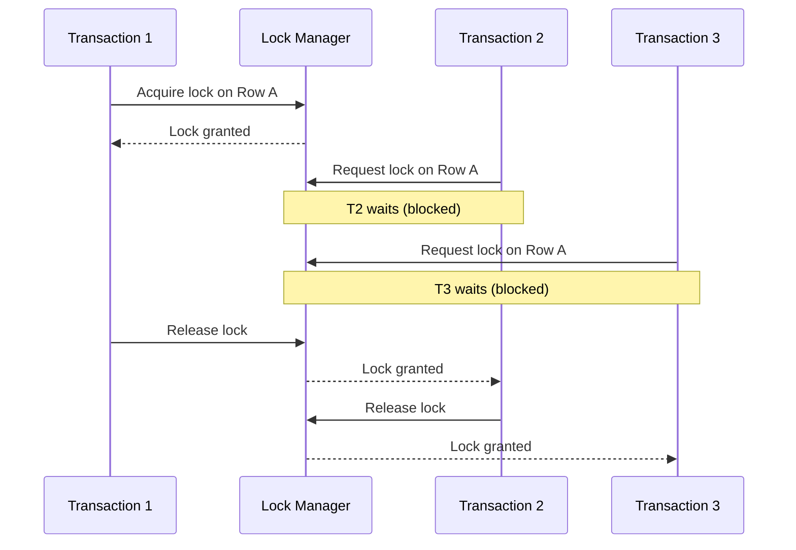
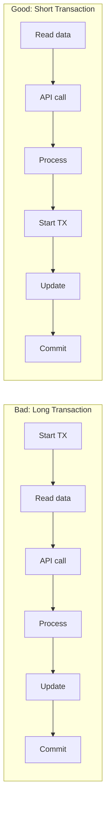
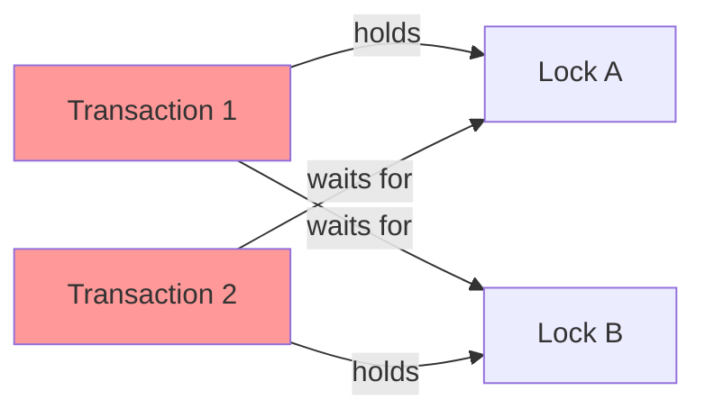

# How to Fix 'Lock Contention' Issues

Author: [nawazdhandala](https://www.github.com/nawazdhandala)

Tags: Performance, Database, Concurrency, Locks, PostgreSQL, MySQL, Troubleshooting

Description: A practical guide to identifying, diagnosing, and fixing lock contention issues in databases and applications, with code examples and monitoring strategies.

---

Lock contention occurs when multiple processes or threads compete for the same lock, causing performance degradation and increased latency. This guide covers how to identify, diagnose, and fix lock contention issues in your applications and databases.

## Understanding Lock Contention



When multiple transactions need the same resource, they must wait in line. The longer each transaction holds the lock, the longer others wait. This creates a bottleneck that slows down your entire system.

## Identifying Lock Contention

### PostgreSQL Lock Monitoring

Use this query to find active lock waits in PostgreSQL. It shows which queries are blocked and what they are waiting for.

```sql
-- Find blocked queries and what they're waiting for
SELECT
    blocked.pid AS blocked_pid,
    blocked.usename AS blocked_user,
    blocked_activity.query AS blocked_query,
    blocked_activity.wait_event_type,
    blocking.pid AS blocking_pid,
    blocking.usename AS blocking_user,
    blocking_activity.query AS blocking_query,
    now() - blocked_activity.query_start AS blocked_duration
FROM pg_catalog.pg_locks blocked
JOIN pg_catalog.pg_stat_activity blocked_activity
    ON blocked.pid = blocked_activity.pid
JOIN pg_catalog.pg_locks blocking
    ON blocked.locktype = blocking.locktype
    AND blocked.database IS NOT DISTINCT FROM blocking.database
    AND blocked.relation IS NOT DISTINCT FROM blocking.relation
    AND blocked.page IS NOT DISTINCT FROM blocking.page
    AND blocked.tuple IS NOT DISTINCT FROM blocking.tuple
    AND blocked.virtualxid IS NOT DISTINCT FROM blocking.virtualxid
    AND blocked.transactionid IS NOT DISTINCT FROM blocking.transactionid
    AND blocked.classid IS NOT DISTINCT FROM blocking.classid
    AND blocked.objid IS NOT DISTINCT FROM blocking.objid
    AND blocked.objsubid IS NOT DISTINCT FROM blocking.objsubid
    AND blocked.pid != blocking.pid
JOIN pg_catalog.pg_stat_activity blocking_activity
    ON blocking.pid = blocking_activity.pid
WHERE NOT blocked.granted;
```

### MySQL Lock Monitoring

MySQL provides the `performance_schema` for monitoring locks. This query shows current lock waits.

```sql
-- Find lock waits in MySQL
SELECT
    r.trx_id AS waiting_trx_id,
    r.trx_mysql_thread_id AS waiting_thread,
    r.trx_query AS waiting_query,
    b.trx_id AS blocking_trx_id,
    b.trx_mysql_thread_id AS blocking_thread,
    b.trx_query AS blocking_query,
    TIMESTAMPDIFF(SECOND, r.trx_wait_started, NOW()) AS wait_seconds
FROM information_schema.innodb_lock_waits w
JOIN information_schema.innodb_trx b
    ON b.trx_id = w.blocking_trx_id
JOIN information_schema.innodb_trx r
    ON r.trx_id = w.requesting_trx_id;
```

### Application-Level Lock Monitoring

Track lock acquisition time in your application code. This Node.js example measures how long operations wait for locks.

```javascript
// Lock monitoring wrapper for Node.js
class LockMonitor {
    constructor(metrics) {
        this.metrics = metrics;
        this.lockWaitHistogram = metrics.histogram({
            name: 'lock_wait_duration_seconds',
            help: 'Time spent waiting to acquire locks',
            labelNames: ['lock_name', 'operation']
        });
    }

    async withLock(lockName, operation, fn) {
        const startWait = Date.now();

        try {
            // Attempt to acquire the lock
            await this.acquireLock(lockName);

            // Record wait time
            const waitTime = (Date.now() - startWait) / 1000;
            this.lockWaitHistogram.observe(
                { lock_name: lockName, operation },
                waitTime
            );

            // Log if wait time exceeds threshold
            if (waitTime > 1.0) {
                console.warn(`Lock contention: ${lockName} waited ${waitTime}s`);
            }

            // Execute the protected operation
            return await fn();
        } finally {
            await this.releaseLock(lockName);
        }
    }
}
```

## Common Causes and Solutions

### 1. Long-Running Transactions

Long transactions hold locks for extended periods, blocking other operations. The solution is to keep transactions as short as possible.



**Before (locks held during external call):**

```python
# Bad: External API call inside transaction holds locks
def process_order(order_id):
    with database.transaction():
        order = Order.get(order_id)
        order.status = 'processing'
        order.save()

        # This API call takes 2-3 seconds
        # Lock is held the entire time!
        payment_result = payment_api.charge(order.amount)

        order.payment_id = payment_result.id
        order.status = 'paid'
        order.save()
```

**After (minimize lock duration):**

```python
# Good: Move external calls outside the transaction
def process_order(order_id):
    # Read without transaction
    order = Order.get(order_id)

    # External call outside transaction
    payment_result = payment_api.charge(order.amount)

    # Short transaction for updates only
    with database.transaction():
        order = Order.get_for_update(order_id)
        order.payment_id = payment_result.id
        order.status = 'paid'
        order.save()
```

### 2. Hot Rows and Tables

When many transactions update the same row, it becomes a contention hotspot. Use techniques like row splitting or optimistic locking.

**Problem: Counter table with single row**

```sql
-- Every request updates this single row
-- Creates massive contention
UPDATE counters SET value = value + 1 WHERE name = 'page_views';
```

**Solution: Distribute across multiple rows**

```sql
-- Create a sharded counter table
CREATE TABLE counter_shards (
    name VARCHAR(50),
    shard_id INT,
    value BIGINT DEFAULT 0,
    PRIMARY KEY (name, shard_id)
);

-- Insert 16 shards per counter
INSERT INTO counter_shards (name, shard_id, value)
SELECT 'page_views', generate_series(0, 15), 0;
```

```python
import random

def increment_counter(name: str) -> None:
    # Randomly select a shard to distribute load
    shard = random.randint(0, 15)
    db.execute(
        "UPDATE counter_shards SET value = value + 1 "
        "WHERE name = %s AND shard_id = %s",
        (name, shard)
    )

def get_counter(name: str) -> int:
    # Sum all shards to get total
    result = db.execute(
        "SELECT SUM(value) FROM counter_shards WHERE name = %s",
        (name,)
    )
    return result[0][0] or 0
```

### 3. Index Contention

Missing or poorly designed indexes cause table scans that hold locks on many rows.

```sql
-- Bad: Full table scan locks many rows
UPDATE orders SET status = 'shipped'
WHERE customer_email = 'user@example.com' AND status = 'pending';

-- Fix: Add an index to reduce locked rows
CREATE INDEX idx_orders_email_status ON orders(customer_email, status);
```

### 4. Deadlocks

Deadlocks occur when transactions wait for each other in a cycle. Consistent lock ordering prevents this.



**Solution: Always acquire locks in consistent order**

```python
def transfer_funds(from_account: int, to_account: int, amount: float):
    # Always lock accounts in ID order to prevent deadlocks
    first_id = min(from_account, to_account)
    second_id = max(from_account, to_account)

    with database.transaction():
        # Lock in consistent order
        first = Account.select_for_update(first_id)
        second = Account.select_for_update(second_id)

        # Determine which is source and destination
        source = first if from_account == first_id else second
        target = second if to_account == second_id else first

        source.balance -= amount
        target.balance += amount

        source.save()
        target.save()
```

## Optimistic Locking

Instead of holding locks, use version numbers to detect conflicts. This works well when conflicts are rare.

```python
from sqlalchemy import Column, Integer, String
from sqlalchemy.orm import declarative_base
from sqlalchemy.exc import StaleDataError

Base = declarative_base()

class Product(Base):
    __tablename__ = 'products'

    id = Column(Integer, primary_key=True)
    name = Column(String)
    quantity = Column(Integer)
    version = Column(Integer, default=1)

    # Enable optimistic locking
    __mapper_args__ = {
        'version_id_col': version
    }

def update_inventory(product_id: int, quantity_change: int) -> bool:
    max_retries = 3

    for attempt in range(max_retries):
        try:
            product = session.query(Product).get(product_id)
            product.quantity += quantity_change
            session.commit()
            return True
        except StaleDataError:
            # Another transaction modified the row
            session.rollback()
            if attempt == max_retries - 1:
                raise
            # Brief delay before retry
            time.sleep(0.01 * (attempt + 1))

    return False
```

## Database Configuration Tuning

### PostgreSQL Settings

```sql
-- Set lock timeout to prevent indefinite waits
SET lock_timeout = '5s';

-- Set statement timeout as a safety net
SET statement_timeout = '30s';

-- Check deadlock detection interval
SHOW deadlock_timeout;  -- Default is 1s
```

### MySQL Settings

```sql
-- Configure InnoDB lock wait timeout
SET innodb_lock_wait_timeout = 10;  -- Wait max 10 seconds

-- Enable deadlock detection (default is ON)
SET innodb_deadlock_detect = ON;

-- For high-concurrency systems, consider disabling
-- deadlock detection and using lock wait timeout instead
-- SET innodb_deadlock_detect = OFF;
```

## Monitoring Dashboard Metrics

Track these key metrics to catch lock contention early:

```yaml
# Prometheus alerts for lock contention
groups:
  - name: lock_contention
    rules:
      # Alert on high lock wait time
      - alert: HighLockWaitTime
        expr: |
          rate(pg_stat_activity_wait_seconds_total{wait_event_type="Lock"}[5m]) > 0.1
        for: 5m
        labels:
          severity: warning
        annotations:
          summary: "High lock wait time detected"

      # Alert on deadlocks
      - alert: DeadlocksDetected
        expr: |
          increase(pg_stat_database_deadlocks[5m]) > 0
        labels:
          severity: critical
        annotations:
          summary: "Deadlocks detected in {{ $labels.datname }}"

      # Alert on long-running transactions
      - alert: LongRunningTransaction
        expr: |
          pg_stat_activity_max_tx_duration_seconds > 300
        for: 1m
        labels:
          severity: warning
        annotations:
          summary: "Transaction running for over 5 minutes"
```

## Best Practices Summary

1. **Keep transactions short** - Move non-database operations outside transactions
2. **Avoid hot spots** - Distribute load across multiple rows or tables
3. **Use proper indexes** - Reduce the number of rows that need to be locked
4. **Lock in consistent order** - Prevent deadlocks by always acquiring locks in the same sequence
5. **Consider optimistic locking** - Use version columns when conflicts are rare
6. **Set timeouts** - Prevent indefinite lock waits with appropriate timeouts
7. **Monitor continuously** - Track lock wait times, deadlocks, and long transactions

---

Lock contention is a common scalability bottleneck, but it is manageable with the right approach. Start by identifying where contention occurs using the monitoring queries above, then apply the appropriate fix based on the root cause. Regular monitoring helps catch contention issues before they impact users.
