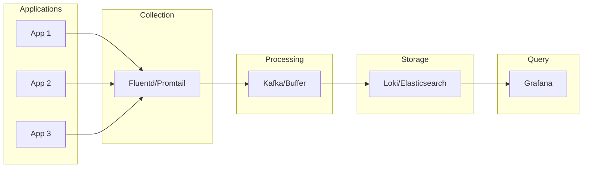

# How to Fix "Log Aggregation" Issues

Author: [nawazdhandala](https://www.github.com/nawazdhandala)

Tags: Logging, Observability, Loki, Elasticsearch, Fluentd, DevOps, Troubleshooting

Description: Learn how to diagnose and fix common log aggregation issues including missing logs, high cardinality, ingestion failures, and query performance problems.

---

Log aggregation is critical for debugging production issues, but the systems that collect and store logs can themselves become problematic. When logs go missing, queries time out, or storage fills up unexpectedly, you need to know how to diagnose and fix these issues quickly.

## Common Log Aggregation Architecture

Most log aggregation setups follow this pattern:



## Missing Logs

The most common complaint is logs that never appear in the aggregation system. Here is how to trace where they are getting lost.

### Check Application Log Output

First, verify logs are actually being written. SSH into the pod or container and check the log file or stdout:

```bash
# For Kubernetes pods
kubectl logs my-app-pod-abc123 --tail=100

# Check if logs are being written to the expected location
kubectl exec -it my-app-pod-abc123 -- ls -la /var/log/app/

# Watch logs in real-time
kubectl logs -f my-app-pod-abc123
```

### Check Log Collector Status

If logs are being produced, check if the collector is running and healthy:

```bash
# For Promtail
kubectl logs -n monitoring promtail-xxxxx --tail=100

# Check Promtail targets
curl http://promtail:9080/targets

# For Fluentd
kubectl logs -n monitoring fluentd-xxxxx --tail=100

# Check Fluentd buffer status
curl http://fluentd:24220/api/plugins.json
```

### Common Collection Failures

Promtail or Fluentd might fail to collect logs for several reasons. Check the configuration:

```yaml
# Promtail: Ensure the scrape config matches your pod labels
scrape_configs:
  - job_name: kubernetes-pods
    kubernetes_sd_configs:
      - role: pod
    relabel_configs:
      # This filter might be too restrictive
      - source_labels: [__meta_kubernetes_pod_label_app]
        action: keep
        regex: my-app  # Only collects from pods with app=my-app label
```

Fix by broadening the filter or ensuring your pods have the correct labels:

```yaml
# Fix: Accept all pods with a specific annotation instead
relabel_configs:
  - source_labels: [__meta_kubernetes_pod_annotation_logging_enabled]
    action: keep
    regex: "true"
```

### Permission Issues

Log collectors need read access to log files:

```yaml
# Fluentd DaemonSet - ensure proper volume mounts
apiVersion: apps/v1
kind: DaemonSet
spec:
  template:
    spec:
      containers:
        - name: fluentd
          volumeMounts:
            - name: varlog
              mountPath: /var/log
              readOnly: true
            - name: containers
              mountPath: /var/lib/docker/containers
              readOnly: true
      volumes:
        - name: varlog
          hostPath:
            path: /var/log
        - name: containers
          hostPath:
            path: /var/lib/docker/containers
```

## High Cardinality Issues

High cardinality happens when you have too many unique label combinations. This causes performance problems and can crash your logging backend.

### Identifying High Cardinality

In Loki, check the number of active streams:

```bash
# Query Loki metrics
curl http://loki:3100/metrics | grep loki_ingester_streams_created_total
```

In Elasticsearch, check field cardinality:

```bash
# Check cardinality of a field
curl -X POST "elasticsearch:9200/logs-*/_search?size=0" -H 'Content-Type: application/json' -d'
{
  "aggs": {
    "unique_values": {
      "cardinality": {
        "field": "kubernetes.pod_name.keyword"
      }
    }
  }
}'
```

### Common High Cardinality Sources

These label patterns cause problems:

```yaml
# BAD: Including unique identifiers as labels
labels:
  request_id: ${REQUEST_ID}      # Unique per request
  user_id: ${USER_ID}            # High cardinality
  pod_name: ${POD_NAME}          # Changes frequently
  timestamp: ${TIMESTAMP}         # Always unique
```

Fix by moving high-cardinality data to the log message itself:

```yaml
# GOOD: Use static labels, put dynamic data in the log line
labels:
  app: my-app
  environment: production
  namespace: default

# Include dynamic data in structured log message instead
pipeline_stages:
  - json:
      expressions:
        request_id: request_id
        user_id: user_id
  # These become searchable but don't create new streams
  - output:
      source: message
```

### Dropping High Cardinality Labels

Configure your collector to drop problematic labels:

```yaml
# Promtail: Drop specific labels before sending to Loki
pipeline_stages:
  - labeldrop:
      - request_id
      - trace_id
      - span_id
      - pod_name
```

For Fluentd:

```xml
<filter kubernetes.**>
  @type record_transformer
  remove_keys request_id, trace_id, user_session
</filter>
```

## Ingestion Rate Limiting

When you send logs faster than the backend can accept them, you hit rate limits.

### Diagnosing Rate Limiting

Loki returns specific errors for rate limiting:

```
429 Too Many Requests: ingestion rate limit exceeded
```

Check the current limits and usage:

```bash
# Loki metrics showing rate limit hits
curl http://loki:3100/metrics | grep -E "loki_distributor_lines_received_total|loki_discarded"
```

### Increasing Limits

Adjust Loki limits based on your capacity:

```yaml
# loki-config.yaml
limits_config:
  ingestion_rate_mb: 20           # MB per second per tenant
  ingestion_burst_size_mb: 30     # Burst allowance
  max_streams_per_user: 50000     # Maximum concurrent streams
  max_line_size: 256kb            # Maximum single log line
  max_entries_limit_per_query: 10000  # Query result limit
```

For Elasticsearch, adjust bulk queue sizes:

```yaml
# elasticsearch.yml
thread_pool.write.queue_size: 1000
indices.memory.index_buffer_size: 20%
```

### Adding Buffering

Add a buffer layer to handle spikes:

```xml
<!-- Fluentd with buffer configuration -->
<match **>
  @type loki
  url "http://loki:3100"

  <buffer>
    @type file
    path /var/log/fluentd-buffers/loki
    flush_mode interval
    flush_interval 5s
    chunk_limit_size 5MB
    total_limit_size 1GB
    overflow_action drop_oldest_chunk
    retry_max_times 10
    retry_wait 1s
    retry_exponential_backoff_base 2
  </buffer>
</match>
```

## Query Performance Issues

Slow queries make log analysis painful. Here is how to optimize.

### Narrow Time Ranges

Always use time constraints in queries:

```logql
# BAD: Scans all data
{app="my-app"} |= "error"

# GOOD: Limit time range
{app="my-app"} |= "error" | __timestamp__ >= now() - 1h
```

### Use Label Filters First

Put label matchers before line filters:

```logql
# BAD: Line filter applied to all logs, then label filter
{namespace="production"} |= "error" | app="my-app"

# GOOD: Label filter reduces data first
{namespace="production", app="my-app"} |= "error"
```

### Avoid Regex When Possible

Regular expressions are slower than substring matches:

```logql
# SLOW: Regex match
{app="my-app"} |~ "user.*failed.*login"

# FASTER: Multiple substring matches
{app="my-app"} |= "user" |= "failed" |= "login"

# If you need regex, be specific
{app="my-app"} |~ "user_id=[0-9]+ failed login"
```

### Add Bloom Filters (Loki)

Bloom filters accelerate line content searches:

```yaml
# loki-config.yaml
storage_config:
  bloom_shipper:
    working_directory: /loki/bloom
  bloom_compactor:
    enabled: true
    working_directory: /loki/bloom-compactor

schema_config:
  configs:
    - from: 2024-01-01
      store: tsdb
      object_store: filesystem
      schema: v13
      index:
        prefix: index_
        period: 24h
      bloom_build:
        enabled: true
```

## Storage Problems

Log storage can fill up quickly, causing ingestion failures.

### Check Storage Usage

```bash
# Loki storage
du -sh /var/loki/*

# Elasticsearch indices
curl "elasticsearch:9200/_cat/indices?v&s=store.size:desc"
```

### Configure Retention

Set up automatic deletion of old logs:

```yaml
# Loki retention
limits_config:
  retention_period: 720h  # 30 days

compactor:
  working_directory: /loki/compactor
  shared_store: filesystem
  retention_enabled: true
  retention_delete_delay: 2h
  retention_delete_worker_count: 150
```

For Elasticsearch, use Index Lifecycle Management:

```bash
# Create ILM policy
curl -X PUT "elasticsearch:9200/_ilm/policy/logs-policy" -H 'Content-Type: application/json' -d'
{
  "policy": {
    "phases": {
      "hot": {
        "min_age": "0ms",
        "actions": {
          "rollover": {
            "max_size": "50GB",
            "max_age": "1d"
          }
        }
      },
      "warm": {
        "min_age": "7d",
        "actions": {
          "shrink": {
            "number_of_shards": 1
          },
          "forcemerge": {
            "max_num_segments": 1
          }
        }
      },
      "delete": {
        "min_age": "30d",
        "actions": {
          "delete": {}
        }
      }
    }
  }
}'
```

### Compression Settings

Enable compression to reduce storage:

```yaml
# Loki chunk compression
storage_config:
  boltdb_shipper:
    active_index_directory: /loki/boltdb-shipper-active
    cache_location: /loki/boltdb-shipper-cache

chunk_store_config:
  chunk_cache_config:
    enable_fifocache: true
    fifocache:
      max_size_items: 1024

ingester:
  chunk_encoding: snappy  # or gzip for better compression
```

## Structured Logging Best Practices

Proper log formatting prevents many aggregation issues:

```javascript
// Node.js structured logging example
const logger = require('pino')({
  level: process.env.LOG_LEVEL || 'info',
  formatters: {
    level: (label) => ({ level: label }),
  },
  base: {
    service: process.env.SERVICE_NAME,
    version: process.env.SERVICE_VERSION,
    environment: process.env.NODE_ENV,
  },
});

// Use structured fields instead of string interpolation
logger.info({ userId: user.id, action: 'login' }, 'User logged in');

// NOT this
logger.info(`User ${user.id} logged in`);  // Harder to query
```

The structured format makes querying efficient:

```logql
# Query structured logs efficiently
{app="my-app"} | json | userId="12345" | action="login"
```

## Summary

Log aggregation issues usually fall into a few categories: collection failures where logs never reach the backend, high cardinality problems that overwhelm storage, rate limiting when ingestion exceeds capacity, slow queries from inefficient patterns, and storage exhaustion. Systematic debugging from application through collector to storage will identify where the problem lies. Proper configuration of limits, retention, and buffering prevents most issues before they occur.
