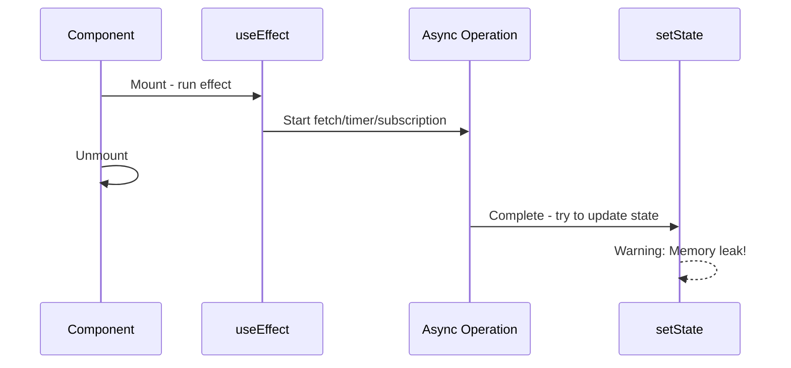
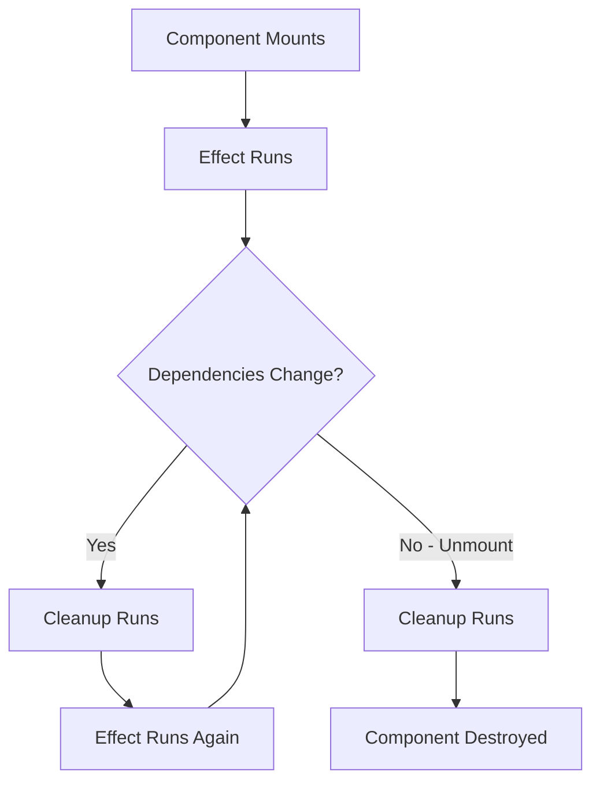

# How to Fix "Memory Leak" Warnings in useEffect

Author: [nawazdhandala](https://github.com/nawazdhandala)

Tags: React, JavaScript, Debugging, Frontend, Hooks, Performance

Description: Learn how to fix memory leak warnings in React useEffect by properly cleaning up subscriptions, timers, and async operations.

---

"Warning: Can't perform a React state update on an unmounted component. This is a no-op, but it indicates a memory leak in your application." This warning appears when your component tries to update state after it has unmounted. Understanding cleanup functions in useEffect is essential to preventing these leaks.

## Understanding the Problem

The memory leak warning occurs when:

1. Component mounts and starts an async operation
2. Component unmounts before the operation completes
3. Operation completes and tries to update state on unmounted component



## Common Causes and Fixes

### 1. Fetch Requests Without Cleanup

The most common cause is fetch requests that complete after unmount:

```javascript
// BAD: No cleanup, will warn if component unmounts during fetch
function UserProfile({ userId }) {
  const [user, setUser] = useState(null);

  useEffect(() => {
    fetch(`/api/users/${userId}`)
      .then(res => res.json())
      .then(data => setUser(data)); // May run after unmount
  }, [userId]);

  return user ? <div>{user.name}</div> : <div>Loading...</div>;
}

// GOOD: Use AbortController to cancel fetch
function UserProfile({ userId }) {
  const [user, setUser] = useState(null);

  useEffect(() => {
    const controller = new AbortController();

    fetch(`/api/users/${userId}`, { signal: controller.signal })
      .then(res => res.json())
      .then(data => setUser(data))
      .catch(err => {
        // Ignore abort errors
        if (err.name !== 'AbortError') {
          console.error('Fetch failed:', err);
        }
      });

    // Cleanup: abort fetch on unmount
    return () => controller.abort();
  }, [userId]);

  return user ? <div>{user.name}</div> : <div>Loading...</div>;
}
```

### 2. Using a Mounted Flag

For operations that cannot be cancelled:

```javascript
// GOOD: Track mounted state
function SearchResults({ query }) {
  const [results, setResults] = useState([]);

  useEffect(() => {
    let isMounted = true;

    searchApi(query).then(data => {
      // Only update state if still mounted
      if (isMounted) {
        setResults(data);
      }
    });

    return () => {
      isMounted = false;
    };
  }, [query]);

  return (
    <ul>
      {results.map(item => <li key={item.id}>{item.name}</li>)}
    </ul>
  );
}
```

### 3. Timers and Intervals

Timers must be cleared on unmount:

```javascript
// BAD: Timer continues after unmount
function Countdown({ seconds }) {
  const [remaining, setRemaining] = useState(seconds);

  useEffect(() => {
    const interval = setInterval(() => {
      setRemaining(r => r - 1); // Runs after unmount
    }, 1000);
    // Missing cleanup!
  }, []);

  return <div>{remaining}</div>;
}

// GOOD: Clear timer on unmount
function Countdown({ seconds }) {
  const [remaining, setRemaining] = useState(seconds);

  useEffect(() => {
    const interval = setInterval(() => {
      setRemaining(r => {
        if (r <= 1) {
          clearInterval(interval);
          return 0;
        }
        return r - 1;
      });
    }, 1000);

    // Cleanup: clear interval on unmount
    return () => clearInterval(interval);
  }, []);

  return <div>{remaining}</div>;
}

// setTimeout also needs cleanup
function DelayedMessage({ message, delay }) {
  const [show, setShow] = useState(false);

  useEffect(() => {
    const timeout = setTimeout(() => {
      setShow(true);
    }, delay);

    return () => clearTimeout(timeout);
  }, [delay]);

  return show ? <div>{message}</div> : null;
}
```

### 4. Event Subscriptions

Event listeners must be removed:

```javascript
// BAD: Event listener not removed
function WindowSize() {
  const [size, setSize] = useState({ width: 0, height: 0 });

  useEffect(() => {
    const handleResize = () => {
      setSize({
        width: window.innerWidth,
        height: window.innerHeight,
      });
    };

    window.addEventListener('resize', handleResize);
    // Missing cleanup - listener stays attached!
  }, []);

  return <div>{size.width} x {size.height}</div>;
}

// GOOD: Remove event listener on unmount
function WindowSize() {
  const [size, setSize] = useState({
    width: window.innerWidth,
    height: window.innerHeight,
  });

  useEffect(() => {
    const handleResize = () => {
      setSize({
        width: window.innerWidth,
        height: window.innerHeight,
      });
    };

    window.addEventListener('resize', handleResize);

    // Cleanup: remove listener on unmount
    return () => window.removeEventListener('resize', handleResize);
  }, []);

  return <div>{size.width} x {size.height}</div>;
}
```

### 5. WebSocket Connections

WebSocket connections must be closed:

```javascript
// BAD: WebSocket not closed
function LiveFeed({ roomId }) {
  const [messages, setMessages] = useState([]);

  useEffect(() => {
    const ws = new WebSocket(`wss://api.example.com/rooms/${roomId}`);

    ws.onmessage = (event) => {
      const message = JSON.parse(event.data);
      setMessages(prev => [...prev, message]);
    };
    // Missing cleanup - connection stays open!
  }, [roomId]);

  return <MessageList messages={messages} />;
}

// GOOD: Close WebSocket on unmount
function LiveFeed({ roomId }) {
  const [messages, setMessages] = useState([]);

  useEffect(() => {
    const ws = new WebSocket(`wss://api.example.com/rooms/${roomId}`);

    ws.onopen = () => {
      console.log('Connected to room:', roomId);
    };

    ws.onmessage = (event) => {
      const message = JSON.parse(event.data);
      setMessages(prev => [...prev, message]);
    };

    ws.onerror = (error) => {
      console.error('WebSocket error:', error);
    };

    // Cleanup: close connection on unmount or roomId change
    return () => {
      console.log('Closing connection to room:', roomId);
      ws.close();
    };
  }, [roomId]);

  return <MessageList messages={messages} />;
}
```

### 6. Third-Party Library Subscriptions

Libraries often have their own subscription mechanisms:

```javascript
// Example with a hypothetical analytics library
function PageTracker({ pageId }) {
  useEffect(() => {
    // Subscribe to analytics events
    const unsubscribe = analytics.trackPage(pageId, {
      onView: (data) => console.log('View:', data),
      onInteraction: (data) => console.log('Interaction:', data),
    });

    // Cleanup: unsubscribe when pageId changes or unmount
    return () => unsubscribe();
  }, [pageId]);

  return null;
}

// Example with RxJS Observable
import { fromEvent } from 'rxjs';
import { debounceTime, map } from 'rxjs/operators';

function DebouncedSearch() {
  const [query, setQuery] = useState('');
  const inputRef = useRef(null);

  useEffect(() => {
    if (!inputRef.current) return;

    const subscription = fromEvent(inputRef.current, 'input')
      .pipe(
        debounceTime(300),
        map(e => e.target.value)
      )
      .subscribe(value => setQuery(value));

    // Cleanup: unsubscribe from observable
    return () => subscription.unsubscribe();
  }, []);

  return (
    <div>
      <input ref={inputRef} type="text" />
      <SearchResults query={query} />
    </div>
  );
}
```

## Custom Hook for Async Operations

Create a reusable hook that handles cleanup:

```javascript
// hooks/useAsync.js
function useAsync(asyncFunction, dependencies) {
  const [state, setState] = useState({
    data: null,
    loading: true,
    error: null,
  });

  useEffect(() => {
    let isMounted = true;
    const controller = new AbortController();

    setState(prev => ({ ...prev, loading: true, error: null }));

    asyncFunction(controller.signal)
      .then(data => {
        if (isMounted) {
          setState({ data, loading: false, error: null });
        }
      })
      .catch(error => {
        if (isMounted && error.name !== 'AbortError') {
          setState({ data: null, loading: false, error });
        }
      });

    return () => {
      isMounted = false;
      controller.abort();
    };
  }, dependencies);

  return state;
}

// Usage
function UserProfile({ userId }) {
  const { data: user, loading, error } = useAsync(
    (signal) => fetch(`/api/users/${userId}`, { signal }).then(r => r.json()),
    [userId]
  );

  if (loading) return <Spinner />;
  if (error) return <Error message={error.message} />;
  return <div>{user.name}</div>;
}
```

## Cleanup Flow Diagram

Understanding when cleanup runs:



## Multiple Async Operations

When managing multiple async operations:

```javascript
function Dashboard({ userId }) {
  const [user, setUser] = useState(null);
  const [posts, setPosts] = useState([]);
  const [notifications, setNotifications] = useState([]);

  useEffect(() => {
    const controller = new AbortController();
    const { signal } = controller;

    // Run all fetches in parallel
    Promise.all([
      fetch(`/api/users/${userId}`, { signal }).then(r => r.json()),
      fetch(`/api/users/${userId}/posts`, { signal }).then(r => r.json()),
      fetch(`/api/users/${userId}/notifications`, { signal }).then(r => r.json()),
    ])
      .then(([userData, postsData, notifData]) => {
        setUser(userData);
        setPosts(postsData);
        setNotifications(notifData);
      })
      .catch(err => {
        if (err.name !== 'AbortError') {
          console.error('Fetch failed:', err);
        }
      });

    // Single abort cancels all fetches
    return () => controller.abort();
  }, [userId]);

  // Render...
}
```

## Using React Query for Automatic Cleanup

Libraries like React Query handle cleanup automatically:

```javascript
import { useQuery } from '@tanstack/react-query';

function UserProfile({ userId }) {
  // React Query handles cancellation and cleanup automatically
  const { data: user, isLoading, error } = useQuery({
    queryKey: ['user', userId],
    queryFn: async ({ signal }) => {
      const response = await fetch(`/api/users/${userId}`, { signal });
      return response.json();
    },
  });

  if (isLoading) return <Spinner />;
  if (error) return <Error message={error.message} />;
  return <div>{user.name}</div>;
}
```

## Summary

| Async Operation | Cleanup Method |
|----------------|----------------|
| fetch | AbortController |
| setTimeout | clearTimeout |
| setInterval | clearInterval |
| addEventListener | removeEventListener |
| WebSocket | ws.close() |
| Observable | subscription.unsubscribe() |
| Third-party libs | Library-specific cleanup function |

## Checklist for useEffect Cleanup

1. Does your effect start an async operation? Add cleanup.
2. Does your effect create a timer? Clear it in cleanup.
3. Does your effect add an event listener? Remove it in cleanup.
4. Does your effect open a connection? Close it in cleanup.
5. Does your effect subscribe to something? Unsubscribe in cleanup.

Every useEffect that initiates an async operation or subscription should return a cleanup function. This ensures your React applications stay performant and warning-free.
