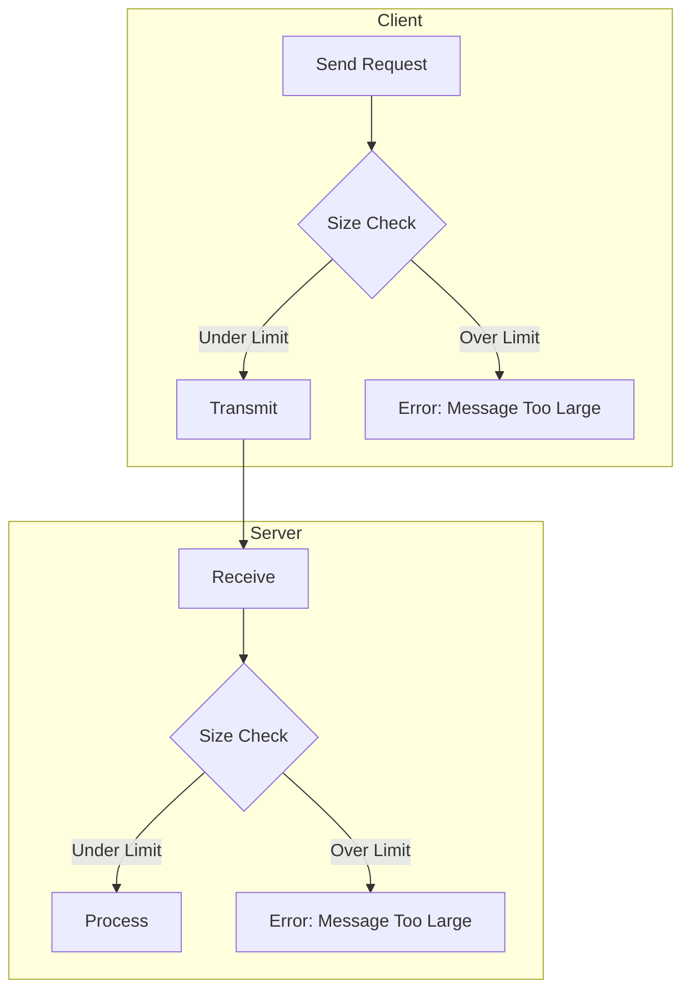
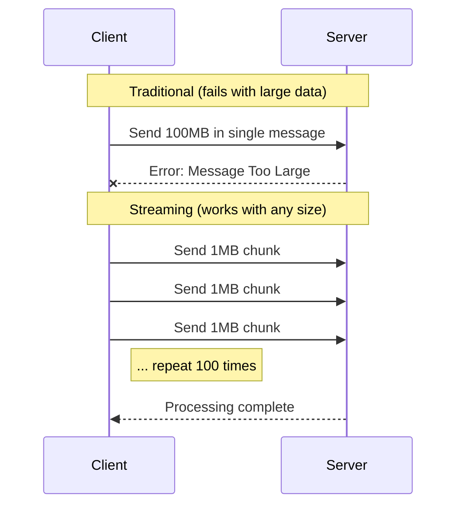

# How to Fix 'Message Too Large' Errors in gRPC

Author: [nawazdhandala](https://www.github.com/nawazdhandala)

Tags: gRPC, Troubleshooting, Go, Python, Performance, Microservices

Description: Learn how to diagnose and resolve gRPC message size limit errors by adjusting server and client configurations, implementing streaming, and optimizing message payloads.

---

The "Message Too Large" error in gRPC occurs when a request or response exceeds the default 4MB message size limit. This guide covers how to diagnose, fix, and prevent these errors across different languages and deployment scenarios.

## Understanding the Error



The error typically appears as:

```
rpc error: code = ResourceExhausted desc = grpc: received message larger than max (4194308 vs. 4194304)
```

## Default Limits

gRPC has these default size limits:

| Setting | Default Value | Description |
|---------|---------------|-------------|
| MaxRecvMsgSize | 4MB (4194304 bytes) | Maximum message size server can receive |
| MaxSendMsgSize | 4MB (4194304 bytes) | Maximum message size server can send |
| MaxCallRecvMsgSize | 4MB | Maximum message size client can receive |
| MaxCallSendMsgSize | 4MB | Maximum message size client can send |

## Solution 1: Increase Message Size Limits

### Go Server Configuration

```go
// server/main.go
package main

import (
    "log"
    "net"

    "google.golang.org/grpc"
    pb "github.com/example/myapp/proto"
)

const (
    // 50MB limit for large payloads
    maxMsgSize = 50 * 1024 * 1024
)

func main() {
    listener, err := net.Listen("tcp", ":50051")
    if err != nil {
        log.Fatalf("Failed to listen: %v", err)
    }

    // Configure server with increased message limits
    server := grpc.NewServer(
        grpc.MaxRecvMsgSize(maxMsgSize), // Max size of received messages
        grpc.MaxSendMsgSize(maxMsgSize), // Max size of sent messages
    )

    pb.RegisterMyServiceServer(server, &myService{})

    log.Printf("Server listening with max message size: %d bytes", maxMsgSize)
    if err := server.Serve(listener); err != nil {
        log.Fatalf("Failed to serve: %v", err)
    }
}
```

### Go Client Configuration

```go
// client/main.go
package main

import (
    "context"
    "log"

    "google.golang.org/grpc"
    "google.golang.org/grpc/credentials/insecure"
    pb "github.com/example/myapp/proto"
)

const maxMsgSize = 50 * 1024 * 1024

func main() {
    // Configure client with increased message limits
    conn, err := grpc.Dial(
        "localhost:50051",
        grpc.WithTransportCredentials(insecure.NewCredentials()),
        grpc.WithDefaultCallOptions(
            grpc.MaxCallRecvMsgSize(maxMsgSize),
            grpc.MaxCallSendMsgSize(maxMsgSize),
        ),
    )
    if err != nil {
        log.Fatalf("Failed to connect: %v", err)
    }
    defer conn.Close()

    client := pb.NewMyServiceClient(conn)

    // Make request
    resp, err := client.ProcessLargeData(context.Background(), &pb.LargeRequest{
        Data: make([]byte, 10*1024*1024), // 10MB payload
    })
    if err != nil {
        log.Fatalf("Request failed: %v", err)
    }

    log.Printf("Response size: %d bytes", len(resp.Data))
}
```

### Python Server Configuration

```python
# server.py
import grpc
from concurrent import futures
import my_service_pb2
import my_service_pb2_grpc

# 50MB limit
MAX_MESSAGE_SIZE = 50 * 1024 * 1024

class MyServiceServicer(my_service_pb2_grpc.MyServiceServicer):
    def ProcessLargeData(self, request, context):
        # Process the large request
        print(f"Received data size: {len(request.data)} bytes")
        return my_service_pb2.LargeResponse(data=request.data)

def serve():
    # Configure server with message size options
    server = grpc.server(
        futures.ThreadPoolExecutor(max_workers=10),
        options=[
            ('grpc.max_send_message_length', MAX_MESSAGE_SIZE),
            ('grpc.max_receive_message_length', MAX_MESSAGE_SIZE),
        ]
    )

    my_service_pb2_grpc.add_MyServiceServicer_to_server(
        MyServiceServicer(), server
    )

    server.add_insecure_port('[::]:50051')
    print(f"Server starting with max message size: {MAX_MESSAGE_SIZE} bytes")
    server.start()
    server.wait_for_termination()

if __name__ == '__main__':
    serve()
```

### Python Client Configuration

```python
# client.py
import grpc
import my_service_pb2
import my_service_pb2_grpc

MAX_MESSAGE_SIZE = 50 * 1024 * 1024

def main():
    # Configure channel with message size options
    options = [
        ('grpc.max_send_message_length', MAX_MESSAGE_SIZE),
        ('grpc.max_receive_message_length', MAX_MESSAGE_SIZE),
    ]

    channel = grpc.insecure_channel('localhost:50051', options=options)
    stub = my_service_pb2_grpc.MyServiceStub(channel)

    # Send large request
    large_data = b'x' * (10 * 1024 * 1024)  # 10MB
    request = my_service_pb2.LargeRequest(data=large_data)

    response = stub.ProcessLargeData(request)
    print(f"Response size: {len(response.data)} bytes")

if __name__ == '__main__':
    main()
```

### Node.js Configuration

```javascript
// server.js
const grpc = require('@grpc/grpc-js');
const protoLoader = require('@grpc/proto-loader');

const MAX_MESSAGE_SIZE = 50 * 1024 * 1024; // 50MB

const packageDefinition = protoLoader.loadSync('service.proto', {
    keepCase: true,
    longs: String,
    enums: String,
    defaults: true,
    oneofs: true
});

const protoDescriptor = grpc.loadPackageDefinition(packageDefinition);

function processLargeData(call, callback) {
    console.log(`Received data size: ${call.request.data.length} bytes`);
    callback(null, { data: call.request.data });
}

function main() {
    const server = new grpc.Server({
        'grpc.max_receive_message_length': MAX_MESSAGE_SIZE,
        'grpc.max_send_message_length': MAX_MESSAGE_SIZE,
    });

    server.addService(protoDescriptor.MyService.service, {
        processLargeData: processLargeData
    });

    server.bindAsync(
        '0.0.0.0:50051',
        grpc.ServerCredentials.createInsecure(),
        (err, port) => {
            if (err) throw err;
            console.log(`Server running with max message size: ${MAX_MESSAGE_SIZE}`);
            server.start();
        }
    );
}

main();
```

```javascript
// client.js
const grpc = require('@grpc/grpc-js');
const protoLoader = require('@grpc/proto-loader');

const MAX_MESSAGE_SIZE = 50 * 1024 * 1024;

const packageDefinition = protoLoader.loadSync('service.proto');
const protoDescriptor = grpc.loadPackageDefinition(packageDefinition);

const client = new protoDescriptor.MyService(
    'localhost:50051',
    grpc.credentials.createInsecure(),
    {
        'grpc.max_receive_message_length': MAX_MESSAGE_SIZE,
        'grpc.max_send_message_length': MAX_MESSAGE_SIZE,
    }
);

// Send large request
const largeData = Buffer.alloc(10 * 1024 * 1024);
client.processLargeData({ data: largeData }, (err, response) => {
    if (err) {
        console.error('Error:', err);
        return;
    }
    console.log(`Response size: ${response.data.length} bytes`);
});
```

## Solution 2: Use Streaming for Large Data

Instead of increasing message limits, use streaming to transfer large data in chunks.



### Proto Definition for Streaming

```protobuf
// file_service.proto
syntax = "proto3";

package fileservice;

service FileService {
  // Client streaming for uploads
  rpc UploadFile(stream FileChunk) returns (UploadResponse);

  // Server streaming for downloads
  rpc DownloadFile(DownloadRequest) returns (stream FileChunk);

  // Bidirectional streaming for processing
  rpc ProcessFile(stream FileChunk) returns (stream FileChunk);
}

message FileChunk {
  bytes data = 1;
  string filename = 2;
  int64 offset = 3;
  int64 total_size = 4;
  bool is_last = 5;
}

message UploadResponse {
  string file_id = 1;
  int64 total_bytes = 2;
  string checksum = 3;
}

message DownloadRequest {
  string file_id = 1;
  int32 chunk_size = 2;
}
```

### Go Streaming Implementation

```go
// file_service.go
package service

import (
    "crypto/sha256"
    "encoding/hex"
    "fmt"
    "io"

    pb "github.com/example/myapp/proto"
)

const chunkSize = 1024 * 1024 // 1MB chunks

type FileService struct {
    pb.UnimplementedFileServiceServer
    storage map[string][]byte
}

// UploadFile handles client streaming uploads
func (s *FileService) UploadFile(stream pb.FileService_UploadFileServer) error {
    var fileData []byte
    var filename string

    for {
        chunk, err := stream.Recv()
        if err == io.EOF {
            // All chunks received
            break
        }
        if err != nil {
            return fmt.Errorf("failed to receive chunk: %w", err)
        }

        filename = chunk.Filename
        fileData = append(fileData, chunk.Data...)

        // Log progress
        if chunk.TotalSize > 0 {
            progress := float64(len(fileData)) / float64(chunk.TotalSize) * 100
            fmt.Printf("Upload progress: %.2f%%\n", progress)
        }
    }

    // Calculate checksum
    hash := sha256.Sum256(fileData)
    checksum := hex.EncodeToString(hash[:])

    // Store file
    fileID := fmt.Sprintf("file_%s", checksum[:8])
    s.storage[fileID] = fileData

    return stream.SendAndClose(&pb.UploadResponse{
        FileId:     fileID,
        TotalBytes: int64(len(fileData)),
        Checksum:   checksum,
    })
}

// DownloadFile handles server streaming downloads
func (s *FileService) DownloadFile(req *pb.DownloadRequest, stream pb.FileService_DownloadFileServer) error {
    data, ok := s.storage[req.FileId]
    if !ok {
        return fmt.Errorf("file not found: %s", req.FileId)
    }

    chunkSz := int(req.ChunkSize)
    if chunkSz <= 0 {
        chunkSz = chunkSize
    }

    totalSize := int64(len(data))

    for offset := 0; offset < len(data); offset += chunkSz {
        end := offset + chunkSz
        if end > len(data) {
            end = len(data)
        }

        chunk := &pb.FileChunk{
            Data:      data[offset:end],
            Filename:  req.FileId,
            Offset:    int64(offset),
            TotalSize: totalSize,
            IsLast:    end >= len(data),
        }

        if err := stream.Send(chunk); err != nil {
            return fmt.Errorf("failed to send chunk: %w", err)
        }
    }

    return nil
}
```

### Go Streaming Client

```go
// client/upload.go
package main

import (
    "context"
    "fmt"
    "io"
    "os"

    "google.golang.org/grpc"
    pb "github.com/example/myapp/proto"
)

const uploadChunkSize = 1024 * 1024 // 1MB

func uploadFile(client pb.FileServiceClient, filepath string) (*pb.UploadResponse, error) {
    // Open file
    file, err := os.Open(filepath)
    if err != nil {
        return nil, fmt.Errorf("failed to open file: %w", err)
    }
    defer file.Close()

    // Get file info
    stat, err := file.Stat()
    if err != nil {
        return nil, fmt.Errorf("failed to stat file: %w", err)
    }
    totalSize := stat.Size()

    // Create upload stream
    stream, err := client.UploadFile(context.Background())
    if err != nil {
        return nil, fmt.Errorf("failed to create stream: %w", err)
    }

    // Send file in chunks
    buffer := make([]byte, uploadChunkSize)
    var offset int64 = 0

    for {
        n, err := file.Read(buffer)
        if err == io.EOF {
            break
        }
        if err != nil {
            return nil, fmt.Errorf("failed to read file: %w", err)
        }

        chunk := &pb.FileChunk{
            Data:      buffer[:n],
            Filename:  filepath,
            Offset:    offset,
            TotalSize: totalSize,
            IsLast:    offset+int64(n) >= totalSize,
        }

        if err := stream.Send(chunk); err != nil {
            return nil, fmt.Errorf("failed to send chunk: %w", err)
        }

        offset += int64(n)
        fmt.Printf("Uploaded: %d/%d bytes (%.2f%%)\n",
            offset, totalSize, float64(offset)/float64(totalSize)*100)
    }

    // Close stream and get response
    return stream.CloseAndRecv()
}

func downloadFile(client pb.FileServiceClient, fileID, outputPath string) error {
    // Create download stream
    stream, err := client.DownloadFile(context.Background(), &pb.DownloadRequest{
        FileId:    fileID,
        ChunkSize: 1024 * 1024, // 1MB chunks
    })
    if err != nil {
        return fmt.Errorf("failed to create stream: %w", err)
    }

    // Create output file
    file, err := os.Create(outputPath)
    if err != nil {
        return fmt.Errorf("failed to create file: %w", err)
    }
    defer file.Close()

    // Receive chunks
    for {
        chunk, err := stream.Recv()
        if err == io.EOF {
            break
        }
        if err != nil {
            return fmt.Errorf("failed to receive chunk: %w", err)
        }

        if _, err := file.Write(chunk.Data); err != nil {
            return fmt.Errorf("failed to write chunk: %w", err)
        }

        if chunk.TotalSize > 0 {
            progress := float64(chunk.Offset+int64(len(chunk.Data))) / float64(chunk.TotalSize) * 100
            fmt.Printf("Downloaded: %.2f%%\n", progress)
        }
    }

    return nil
}
```

## Solution 3: Compress Large Messages

Use compression to reduce message size before transmission.

```go
// server with compression
package main

import (
    "google.golang.org/grpc"
    "google.golang.org/grpc/encoding/gzip"
)

func main() {
    // Server with compression
    server := grpc.NewServer(
        grpc.MaxRecvMsgSize(50*1024*1024),
        grpc.MaxSendMsgSize(50*1024*1024),
    )

    // ... register services and serve
}
```

```go
// client with compression
package main

import (
    "context"

    "google.golang.org/grpc"
    "google.golang.org/grpc/encoding/gzip"
)

func main() {
    conn, _ := grpc.Dial(
        "localhost:50051",
        grpc.WithDefaultCallOptions(
            grpc.UseCompressor(gzip.Name), // Enable gzip compression
            grpc.MaxCallRecvMsgSize(50*1024*1024),
            grpc.MaxCallSendMsgSize(50*1024*1024),
        ),
    )

    // Make compressed requests
    client := pb.NewMyServiceClient(conn)
    resp, err := client.ProcessLargeData(
        context.Background(),
        &pb.LargeRequest{Data: largeData},
        grpc.UseCompressor(gzip.Name), // Per-call compression
    )
}
```

## Solution 4: Paginate Large Responses

Instead of returning large datasets in one response, implement pagination.

```protobuf
// paginated_service.proto
syntax = "proto3";

service DataService {
  rpc ListRecords(ListRecordsRequest) returns (ListRecordsResponse);
}

message ListRecordsRequest {
  int32 page_size = 1;    // Maximum records per page
  string page_token = 2;   // Token for next page
  string filter = 3;       // Optional filter
}

message ListRecordsResponse {
  repeated Record records = 1;
  string next_page_token = 2;  // Empty if no more pages
  int32 total_count = 3;       // Total matching records
}

message Record {
  string id = 1;
  bytes data = 2;
}
```

```go
// Paginated service implementation
func (s *DataService) ListRecords(ctx context.Context, req *pb.ListRecordsRequest) (*pb.ListRecordsResponse, error) {
    pageSize := int(req.PageSize)
    if pageSize <= 0 || pageSize > 100 {
        pageSize = 50 // Default page size
    }

    // Decode page token to get offset
    offset := 0
    if req.PageToken != "" {
        offset, _ = decodePageToken(req.PageToken)
    }

    // Fetch records with pagination
    records, total, err := s.repo.ListRecords(ctx, offset, pageSize, req.Filter)
    if err != nil {
        return nil, status.Error(codes.Internal, "failed to list records")
    }

    // Generate next page token
    var nextToken string
    if offset+len(records) < total {
        nextToken = encodePageToken(offset + len(records))
    }

    return &pb.ListRecordsResponse{
        Records:       records,
        NextPageToken: nextToken,
        TotalCount:    int32(total),
    }, nil
}
```

## Debugging Message Size Issues

### Check Message Size Before Sending

```go
// Measure protobuf message size
import "google.golang.org/protobuf/proto"

func checkMessageSize(msg proto.Message) {
    size := proto.Size(msg)
    fmt.Printf("Message size: %d bytes (%.2f MB)\n", size, float64(size)/1024/1024)

    if size > 4*1024*1024 {
        fmt.Println("Warning: Message exceeds default 4MB limit")
    }
}
```

### Interceptor for Size Logging

```go
// Unary interceptor to log message sizes
func sizeLoggingInterceptor(
    ctx context.Context,
    req interface{},
    info *grpc.UnaryServerInfo,
    handler grpc.UnaryHandler,
) (interface{}, error) {
    if msg, ok := req.(proto.Message); ok {
        reqSize := proto.Size(msg)
        log.Printf("Request size for %s: %d bytes", info.FullMethod, reqSize)
    }

    resp, err := handler(ctx, req)

    if msg, ok := resp.(proto.Message); ok && err == nil {
        respSize := proto.Size(msg)
        log.Printf("Response size for %s: %d bytes", info.FullMethod, respSize)
    }

    return resp, err
}
```

## Load Balancer Configuration

When using load balancers, ensure they also support large messages.

### Envoy Configuration

```yaml
# envoy.yaml
static_resources:
  listeners:
    - name: grpc_listener
      address:
        socket_address:
          address: 0.0.0.0
          port_value: 8080
      filter_chains:
        - filters:
            - name: envoy.filters.network.http_connection_manager
              typed_config:
                "@type": type.googleapis.com/envoy.extensions.filters.network.http_connection_manager.v3.HttpConnectionManager
                codec_type: AUTO
                stat_prefix: grpc
                route_config:
                  name: grpc_route
                  virtual_hosts:
                    - name: grpc_service
                      domains: ["*"]
                      routes:
                        - match:
                            prefix: "/"
                            grpc: {}
                          route:
                            cluster: grpc_backend
                            max_stream_duration:
                              grpc_timeout_header_max: 60s
                http_filters:
                  - name: envoy.filters.http.router

  clusters:
    - name: grpc_backend
      type: STRICT_DNS
      lb_policy: ROUND_ROBIN
      typed_extension_protocol_options:
        envoy.extensions.upstreams.http.v3.HttpProtocolOptions:
          "@type": type.googleapis.com/envoy.extensions.upstreams.http.v3.HttpProtocolOptions
          explicit_http_config:
            http2_protocol_options:
              max_concurrent_streams: 100
              initial_stream_window_size: 65536
              initial_connection_window_size: 1048576
      per_connection_buffer_limit_bytes: 52428800  # 50MB
      load_assignment:
        cluster_name: grpc_backend
        endpoints:
          - lb_endpoints:
              - endpoint:
                  address:
                    socket_address:
                      address: grpc-server
                      port_value: 50051
```

---

When dealing with large messages in gRPC, start by understanding if you truly need large messages or if streaming, pagination, or compression would be better solutions. If you must increase limits, ensure both client and server configurations match, and do not forget about any intermediate load balancers or proxies.
