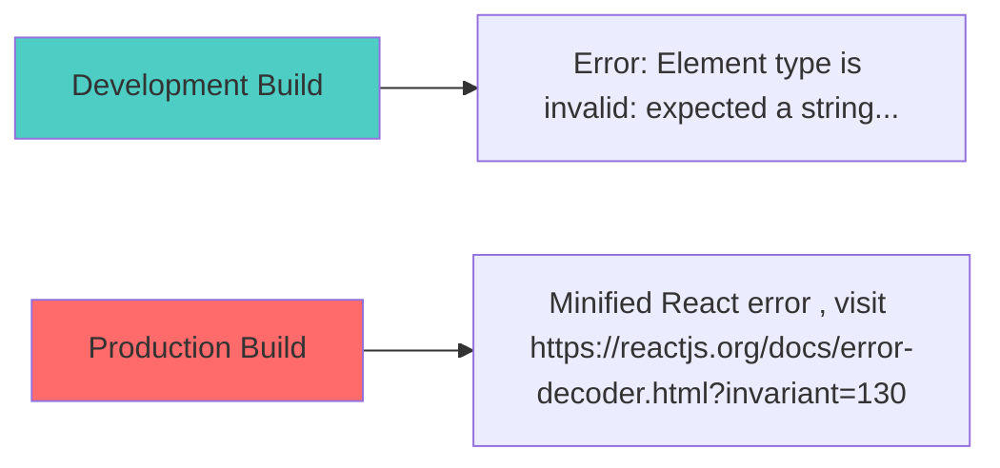
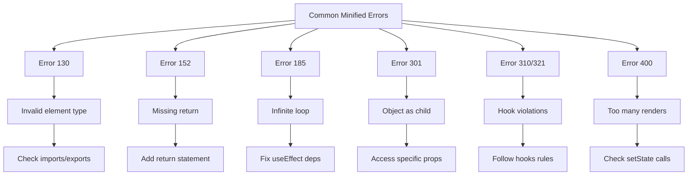

# How to Fix "Minified React Error" in Production

Author: [nawazdhandala](https://github.com/nawazdhandala)

Tags: React, JavaScript, Debugging, Production, Troubleshooting, Error Handling

Description: A practical guide to debugging and fixing minified React errors in production builds, including techniques for error decoding and prevention.

---

When React errors occur in production, you see cryptic messages like "Minified React error #130" instead of helpful error descriptions. This guide shows you how to decode these errors, find their root causes, and prevent them from happening.

## Understanding Minified Errors

In production builds, React error messages are stripped to reduce bundle size. Instead of descriptive messages, you get error codes:



## Decoding Minified Errors

### Method 1: React Error Decoder

Visit the React error decoder with your error code:

```
https://reactjs.org/docs/error-decoder.html?invariant=130
```

Or for newer React versions:

```
https://react.dev/errors/130
```

### Method 2: Local Error Lookup

Create a utility to decode errors locally:

```javascript
// errorDecoder.js
const REACT_ERRORS = {
  130: 'Element type is invalid: expected a string (for built-in components) or a class/function (for composite components) but got: %s.',
  152: 'Nothing was returned from render. This usually means a return statement is missing. Or, to render nothing, return null.',
  185: 'Maximum update depth exceeded. This can happen when a component calls setState inside useEffect, but useEffect either does not have a dependency array, or one of the dependencies changes on every render.',
  200: 'Target container is not a DOM element.',
  301: 'Objects are not valid as a React child (found: %s). If you meant to render a collection of children, use an array instead.',
  310: 'Rendered more hooks than during the previous render.',
  321: 'Invalid hook call. Hooks can only be called inside of the body of a function component.',
  400: 'Too many re-renders. React limits the number of renders to prevent an infinite loop.',
  // Add more as needed from React source
};

export function decodeReactError(errorCode, ...args) {
  const template = REACT_ERRORS[errorCode] || `Unknown error code: ${errorCode}`;

  let message = template;
  args.forEach((arg, index) => {
    message = message.replace('%s', String(arg));
  });

  return {
    code: errorCode,
    message,
    docsUrl: `https://react.dev/errors/${errorCode}`
  };
}

// Usage
console.log(decodeReactError(130, 'undefined'));
// Output: { code: 130, message: 'Element type is invalid...', docsUrl: '...' }
```

## Common Minified Errors and Solutions

### Error 130: Element Type Invalid

```javascript
// The error
// Minified React error #130

// Common causes:
// 1. Import/export mismatch
import { MyComponent } from './MyComponent'; // Component uses default export

// Fix: Use correct import
import MyComponent from './MyComponent';

// 2. Component is undefined
const Component = undefined;
<Component /> // Error!

// Fix: Check imports and exports
console.log('Component:', Component); // Debug first

// 3. Circular dependencies causing undefined imports
// Fix: Restructure to avoid circular imports
```

### Error 152: Nothing Returned from Render

```javascript
// The error
// Minified React error #152

// Cause: Missing return statement
function MyComponent() {
  const data = fetchData();
  // Forgot to return!
  <div>{data}</div>
}

// Fix: Add return statement
function MyComponent() {
  const data = fetchData();
  return <div>{data}</div>;
}

// Also happens with arrow functions
const MyComponent = () => {
  // Using {} without return
  <div>Hello</div>
}

// Fix: Use implicit return or add return
const MyComponent = () => (
  <div>Hello</div>
);
// OR
const MyComponent = () => {
  return <div>Hello</div>;
};
```

### Error 185: Maximum Update Depth Exceeded

```javascript
// The error
// Minified React error #185

// Cause: Infinite loop in useEffect
function BadComponent() {
  const [count, setCount] = useState(0);

  useEffect(() => {
    setCount(count + 1); // This triggers re-render
  }); // No dependency array = runs every render!
}

// Fix: Add proper dependencies
function GoodComponent() {
  const [count, setCount] = useState(0);

  useEffect(() => {
    // Only run once on mount
  }, []);
}

// Another common cause: Creating objects in render
function BadComponent() {
  const [state, setState] = useState({});

  useEffect(() => {
    setState({ value: 1 }); // New object every time!
  }, [state]); // state changes every render
}

// Fix: Check values, not object reference
function GoodComponent() {
  const [state, setState] = useState({ value: 0 });

  useEffect(() => {
    setState({ value: 1 });
  }, [state.value]); // Only re-run if value changes
}
```

### Error 301: Objects Not Valid as React Child

```javascript
// The error
// Minified React error #301

// Cause: Rendering an object directly
function UserProfile({ user }) {
  return <div>{user}</div>; // user is an object!
}

// Fix: Access specific properties
function UserProfile({ user }) {
  return (
    <div>
      <span>{user.name}</span>
      <span>{user.email}</span>
    </div>
  );
}

// For debugging, show object structure
function UserProfile({ user }) {
  return <pre>{JSON.stringify(user, null, 2)}</pre>;
}
```

### Error 310: Rendered More Hooks Than Previous Render

```javascript
// The error
// Minified React error #310

// Cause: Conditional hook calls
function BadComponent({ isLoggedIn }) {
  if (isLoggedIn) {
    const [user, setUser] = useState(null); // Conditional hook!
  }
  const [data, setData] = useState([]);
}

// Fix: Always call hooks unconditionally
function GoodComponent({ isLoggedIn }) {
  const [user, setUser] = useState(null);
  const [data, setData] = useState([]);

  // Use conditional logic in the effect or render
  useEffect(() => {
    if (isLoggedIn) {
      // Fetch user data
    }
  }, [isLoggedIn]);
}
```

### Error 321: Invalid Hook Call

```javascript
// The error
// Minified React error #321

// Common causes:
// 1. Calling hooks outside a component
const value = useState(0); // Error! Not in a component

// 2. Calling hooks in a class component
class MyComponent extends React.Component {
  render() {
    const [state, setState] = useState(0); // Error!
  }
}

// 3. Calling hooks in a regular function
function notAComponent() {
  const [state, setState] = useState(0); // Error!
  return state;
}

// Fix: Only call hooks in function components or custom hooks
function MyComponent() {
  const [state, setState] = useState(0); // Correct!
  return <div>{state}</div>;
}

// Or in custom hooks (must start with 'use')
function useMyHook() {
  const [state, setState] = useState(0); // Correct!
  return [state, setState];
}
```

### Error 400: Too Many Re-renders

```javascript
// The error
// Minified React error #400

// Cause: setState called directly in render
function BadComponent() {
  const [count, setCount] = useState(0);
  setCount(count + 1); // Called every render!
  return <div>{count}</div>;
}

// Fix: Use event handlers or useEffect
function GoodComponent() {
  const [count, setCount] = useState(0);

  return (
    <div>
      <span>{count}</span>
      <button onClick={() => setCount(count + 1)}>
        Increment
      </button>
    </div>
  );
}

// Another cause: Event handler calling setState immediately
function BadButton() {
  const [clicked, setClicked] = useState(false);

  return (
    <button onClick={setClicked(true)}> {/* Calls immediately! */}
      Click me
    </button>
  );
}

// Fix: Wrap in arrow function
function GoodButton() {
  const [clicked, setClicked] = useState(false);

  return (
    <button onClick={() => setClicked(true)}>
      Click me
    </button>
  );
}
```

## Production Debugging Setup

### Source Maps for Production Debugging

Enable source maps for error tracking (but not public access):

```javascript
// webpack.config.js
module.exports = {
  devtool: process.env.NODE_ENV === 'production'
    ? 'hidden-source-map' // Generate but do not expose
    : 'eval-source-map',

  // Upload source maps to error tracking service
  plugins: [
    new SentryWebpackPlugin({
      include: './build',
      ignore: ['node_modules'],
      release: process.env.REACT_APP_VERSION,
    })
  ]
};
```

### Error Tracking Integration

```javascript
// errorTracking.js
import * as Sentry from '@sentry/react';

// Initialize error tracking
Sentry.init({
  dsn: process.env.REACT_APP_SENTRY_DSN,
  environment: process.env.NODE_ENV,
  release: process.env.REACT_APP_VERSION,

  // Capture React component stack traces
  integrations: [new Sentry.BrowserTracing()],

  beforeSend(event, hint) {
    // Decode minified errors before sending
    const error = hint.originalException;
    if (error && error.message) {
      const match = error.message.match(/Minified React error #(\d+)/);
      if (match) {
        event.extra = event.extra || {};
        event.extra.reactErrorCode = match[1];
        event.extra.reactErrorDocs = `https://react.dev/errors/${match[1]}`;
      }
    }
    return event;
  }
});

// Error boundary with tracking
class TrackedErrorBoundary extends React.Component {
  constructor(props) {
    super(props);
    this.state = { hasError: false, eventId: null };
  }

  static getDerivedStateFromError() {
    return { hasError: true };
  }

  componentDidCatch(error, errorInfo) {
    const eventId = Sentry.captureException(error, {
      contexts: {
        react: {
          componentStack: errorInfo.componentStack
        }
      }
    });
    this.setState({ eventId });
  }

  render() {
    if (this.state.hasError) {
      return (
        <div className="error-fallback">
          <h1>Something went wrong</h1>
          <p>Error ID: {this.state.eventId}</p>
          <button onClick={() => Sentry.showReportDialog({ eventId: this.state.eventId })}>
            Report feedback
          </button>
        </div>
      );
    }
    return this.props.children;
  }
}
```

## Debugging Without Source Maps

When you cannot access source maps:

```javascript
// Add debugging info to production builds
// babel.config.js
module.exports = {
  plugins: [
    // Add component display names
    ['@babel/plugin-transform-react-display-name'],

    // Custom plugin to add component names to errors
    ['babel-plugin-transform-react-remove-prop-types', {
      mode: 'wrap', // Keep displayName
    }]
  ]
};

// Custom error boundary with more context
class DebugErrorBoundary extends React.Component {
  componentDidCatch(error, errorInfo) {
    // Extract component names from stack
    const componentStack = errorInfo.componentStack
      .split('\n')
      .filter(line => line.trim())
      .map(line => {
        const match = line.match(/in (\w+)/);
        return match ? match[1] : 'Unknown';
      });

    console.error('Error in components:', componentStack);
    console.error('Error details:', {
      message: error.message,
      stack: error.stack,
      components: componentStack
    });
  }

  render() {
    return this.props.children;
  }
}
```

## Prevention Strategies

### 1. Strict Mode in Development

```javascript
// index.js
import React from 'react';
import ReactDOM from 'react-dom/client';
import App from './App';

const root = ReactDOM.createRoot(document.getElementById('root'));
root.render(
  <React.StrictMode>
    <App />
  </React.StrictMode>
);
```

### 2. TypeScript for Type Safety

```typescript
// Catch errors at compile time
interface User {
  id: number;
  name: string;
  email: string;
}

interface UserProfileProps {
  user: User;
}

function UserProfile({ user }: UserProfileProps) {
  // TypeScript ensures user has required properties
  return (
    <div>
      <h1>{user.name}</h1>
      <p>{user.email}</p>
    </div>
  );
}

// Error at compile time, not runtime:
// <UserProfile user={{ id: 1 }} /> // Missing name and email
```

### 3. ESLint Rules

```javascript
// .eslintrc.js
module.exports = {
  plugins: ['react-hooks'],
  rules: {
    // Catch hook violations
    'react-hooks/rules-of-hooks': 'error',
    'react-hooks/exhaustive-deps': 'warn',

    // Catch missing returns
    'consistent-return': 'error',

    // Catch accidental object rendering
    'react/jsx-no-useless-fragment': 'error'
  }
};
```

### 4. Testing Error Scenarios

```javascript
// ErrorScenarios.test.js
import { render } from '@testing-library/react';

// Test that components handle undefined props
describe('Component Robustness', () => {
  it('handles undefined user prop', () => {
    const consoleError = jest.spyOn(console, 'error').mockImplementation();

    expect(() => {
      render(<UserProfile user={undefined} />);
    }).not.toThrow();

    consoleError.mockRestore();
  });

  it('handles empty array data', () => {
    render(<DataList items={[]} />);
    expect(screen.getByText('No items')).toBeInTheDocument();
  });
});
```

## Error Code Quick Reference



## Summary

Minified React errors can be frustrating, but they are solvable:

1. Use the React error decoder to understand the error
2. Common errors (130, 152, 185, 301, 321, 400) have well-known solutions
3. Set up proper error tracking with source maps for production
4. Use TypeScript, ESLint, and Strict Mode to catch errors early
5. Test edge cases and error scenarios
6. Create custom error boundaries with helpful fallback UIs

Remember: Most minified errors come from a small set of common mistakes. Learning to recognize the error codes helps you fix issues quickly.
