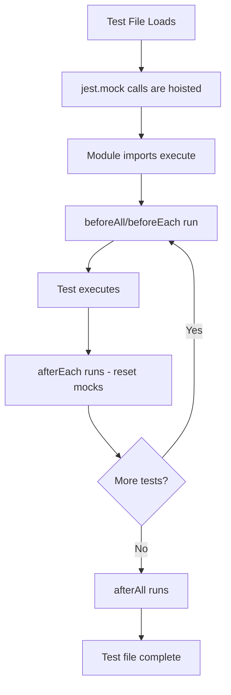

# How to Fix "Mock" Setup Issues in Tests

Author: [nawazdhandala](https://github.com/nawazdhandala)

Tags: Testing, Mocking, Jest, Unit Tests, Debugging

Description: Learn how to diagnose and fix common mock setup issues in unit tests including timing problems, scope errors, and reset failures.

---

Mocks are essential for isolating units of code during testing, but they can also be a source of frustrating bugs. When mocks do not behave as expected, tests fail in confusing ways or pass when they should not. This guide covers the most common mock setup issues and how to fix them.

## Understanding How Mocks Work

Before diving into fixes, let us understand the mocking lifecycle:



## Issue 1: Mock Not Being Applied

The most common issue is mocks not taking effect because of hoisting or import order problems.

**Problem: Mock defined after import**

```javascript
// BROKEN: Import happens before mock is set up
import { fetchUser } from './api';
import { UserService } from './user-service';

// This mock is too late - the module already imported the real function
jest.mock('./api', () => ({
  fetchUser: jest.fn()
}));
```

**Solution: Jest hoists jest.mock, but imports must come after**

```javascript
// FIXED: jest.mock is automatically hoisted above imports
jest.mock('./api', () => ({
  fetchUser: jest.fn()
}));

// These imports now receive the mocked version
import { fetchUser } from './api';
import { UserService } from './user-service';

describe('UserService', () => {
  it('should use mocked fetchUser', async () => {
    fetchUser.mockResolvedValue({ id: '1', name: 'Test' });

    const service = new UserService();
    const user = await service.getUser('1');

    expect(user.name).toBe('Test');
  });
});
```

**For ES modules with named exports, mock the entire module:**

```javascript
// Mock entire module for ES modules
jest.mock('./api');

import * as api from './api';

beforeEach(() => {
  // Set up mock implementations in beforeEach
  api.fetchUser.mockResolvedValue({ id: '1', name: 'Test' });
});
```

## Issue 2: Mock State Leaking Between Tests

When mock state is not reset, tests become order-dependent and produce flaky results.

**Problem: Mock retains state from previous test**

```javascript
import { logger } from './logger';
jest.mock('./logger');

describe('Order processing', () => {
  it('should log order creation', async () => {
    await createOrder({ item: 'book' });
    expect(logger.info).toHaveBeenCalledWith('Order created');
  });

  it('should log order shipment', async () => {
    await shipOrder('order-123');
    // FAILS: logger.info was called 2 times (includes previous test call)
    expect(logger.info).toHaveBeenCalledTimes(1);
  });
});
```

**Solution: Reset mocks between tests**

```javascript
import { logger } from './logger';
jest.mock('./logger');

describe('Order processing', () => {
  // Reset all mock state after each test
  afterEach(() => {
    jest.clearAllMocks();  // Clears call history
    // jest.resetAllMocks();  // Also resets implementations
    // jest.restoreAllMocks(); // Restores original implementations (for spies)
  });

  it('should log order creation', async () => {
    await createOrder({ item: 'book' });
    expect(logger.info).toHaveBeenCalledWith('Order created');
  });

  it('should log order shipment', async () => {
    await shipOrder('order-123');
    // PASSES: Mock was cleared, only 1 call in this test
    expect(logger.info).toHaveBeenCalledTimes(1);
  });
});
```

**Configure automatic clearing in Jest config:**

```javascript
// jest.config.js
module.exports = {
  clearMocks: true,      // Clear mock calls between tests
  resetMocks: false,     // Do not reset implementations
  restoreMocks: false    // Do not restore original implementations
};
```

## Issue 3: Wrong Mock Implementation Scope

Mock implementations defined in the wrong scope cause unexpected behavior.

**Problem: Mock implementation in describe block**

```javascript
jest.mock('./database');
import { database } from './database';

describe('UserRepository', () => {
  // PROBLEM: This runs once when describe block is evaluated
  // before any beforeEach or test runs
  database.query.mockResolvedValue([{ id: '1' }]);

  it('should find user', async () => {
    // Mock might have been cleared by previous test file
    const users = await userRepo.findAll();
    expect(users).toHaveLength(1);  // Might fail unexpectedly
  });
});
```

**Solution: Set implementations in beforeEach**

```javascript
jest.mock('./database');
import { database } from './database';

describe('UserRepository', () => {
  // Set fresh implementations before each test
  beforeEach(() => {
    database.query.mockResolvedValue([{ id: '1' }]);
  });

  it('should find user', async () => {
    const users = await userRepo.findAll();
    expect(users).toHaveLength(1);  // Reliable
  });

  it('should handle empty results', async () => {
    // Override for this specific test
    database.query.mockResolvedValue([]);

    const users = await userRepo.findAll();
    expect(users).toHaveLength(0);
  });
});
```

## Issue 4: Mocking Default Exports

Default exports require special handling that differs from named exports.

**Problem: Incorrect default export mock**

```javascript
// api.js
export default function fetchData() {
  return fetch('/api/data');
}

// test.js - BROKEN
jest.mock('./api', () => jest.fn());  // Wrong structure

import fetchData from './api';

it('should fetch data', () => {
  fetchData.mockResolvedValue({ data: 'test' });  // Error: mockResolvedValue is not a function
});
```

**Solution: Use __esModule flag for default exports**

```javascript
// FIXED: Proper default export mock structure
jest.mock('./api', () => ({
  __esModule: true,  // Required for ES modules
  default: jest.fn()  // The default export is a property named 'default'
}));

import fetchData from './api';

it('should fetch data', async () => {
  fetchData.mockResolvedValue({ data: 'test' });

  const result = await fetchData();
  expect(result.data).toBe('test');
});
```

**For modules with both default and named exports:**

```javascript
jest.mock('./api', () => ({
  __esModule: true,
  default: jest.fn(),           // Default export
  fetchUser: jest.fn(),         // Named export
  fetchOrders: jest.fn()        // Named export
}));

import fetchData, { fetchUser, fetchOrders } from './api';
```

## Issue 5: Partial Module Mocking

Sometimes you need to mock only part of a module while keeping the rest real.

**Problem: Mocking entire module when you only need to mock one function**

```javascript
// utils.js has many functions, but we only want to mock one
export function formatDate(date) { /* real implementation */ }
export function generateId() { /* want to mock this */ }
export function validateEmail(email) { /* real implementation */ }

// test.js - PROBLEM: All functions are now undefined
jest.mock('./utils');
```

**Solution: Use jest.requireActual for partial mocks**

```javascript
// FIXED: Keep real implementations, only mock generateId
jest.mock('./utils', () => ({
  // Spread the real module
  ...jest.requireActual('./utils'),
  // Override only what we need
  generateId: jest.fn()
}));

import { formatDate, generateId, validateEmail } from './utils';

it('should use mocked generateId with real formatDate', () => {
  generateId.mockReturnValue('mock-id-123');

  // formatDate uses real implementation
  expect(formatDate(new Date('2026-01-24'))).toBe('Jan 24, 2026');

  // generateId uses mock
  expect(generateId()).toBe('mock-id-123');
});
```

## Issue 6: Async Mock Setup Timing

Async setup can cause race conditions with mocks.

**Problem: Mock not ready when test runs**

```javascript
describe('DataService', () => {
  beforeEach(async () => {
    // Async setup
    await database.connect();
    // Mock setup happens after async operation
    api.fetch.mockResolvedValue({ data: 'test' });
  });

  it('should fetch data', async () => {
    // Test might run before mock is configured
    const result = await dataService.getData();
  });
});
```

**Solution: Separate sync mock setup from async setup**

```javascript
describe('DataService', () => {
  // Sync mock setup runs first
  beforeEach(() => {
    api.fetch.mockResolvedValue({ data: 'test' });
  });

  // Async setup runs after mocks are configured
  beforeEach(async () => {
    await database.connect();
  });

  it('should fetch data', async () => {
    const result = await dataService.getData();
    expect(result.data).toBe('test');
  });
});
```

## Issue 7: Mocking Chained Methods

APIs with method chaining require special mock setup.

**Problem: Chained methods return undefined**

```javascript
// Trying to mock: db.collection('users').find({ active: true }).toArray()
jest.mock('./database');

it('should query database', async () => {
  // BROKEN: collection() returns undefined, chain breaks
  db.collection.mockReturnValue({ find: jest.fn() });
});
```

**Solution: Return mock objects that support chaining**

```javascript
// FIXED: Each method returns the next mock in chain
beforeEach(() => {
  const mockCursor = {
    toArray: jest.fn().mockResolvedValue([{ id: '1', name: 'Test' }]),
    limit: jest.fn().mockReturnThis(),   // Returns self for chaining
    skip: jest.fn().mockReturnThis(),
    sort: jest.fn().mockReturnThis()
  };

  const mockCollection = {
    find: jest.fn().mockReturnValue(mockCursor),
    findOne: jest.fn(),
    insertOne: jest.fn()
  };

  db.collection.mockReturnValue(mockCollection);
});

it('should query users with pagination', async () => {
  const users = await db
    .collection('users')
    .find({ active: true })
    .skip(10)
    .limit(20)
    .toArray();

  expect(users).toHaveLength(1);
  expect(db.collection).toHaveBeenCalledWith('users');
});
```

## Issue 8: Mock Implementation vs Return Value

Using the wrong mock method causes type errors or unexpected behavior.

```javascript
// Different mock methods for different use cases

const mockFn = jest.fn();

// For simple return values (sync functions)
mockFn.mockReturnValue('sync result');

// For return values that vary by call
mockFn
  .mockReturnValueOnce('first call')
  .mockReturnValueOnce('second call')
  .mockReturnValue('subsequent calls');

// For Promises (async functions)
mockFn.mockResolvedValue({ data: 'async result' });
mockFn.mockRejectedValue(new Error('async error'));

// For complex logic
mockFn.mockImplementation((arg) => {
  if (arg === 'special') return 'special result';
  return 'default result';
});

// For async complex logic
mockFn.mockImplementation(async (arg) => {
  await delay(100);
  return { processed: arg };
});
```

## Debugging Mock Issues

When mocks behave unexpectedly, use these debugging techniques:

```javascript
it('should debug mock behavior', async () => {
  // Check if mock was called
  console.log('Was called:', mockFn.mock.calls.length > 0);

  // See all call arguments
  console.log('All calls:', mockFn.mock.calls);

  // See return values
  console.log('Return values:', mockFn.mock.results);

  // Check mock implementation
  console.log('Implementation:', mockFn.getMockImplementation());

  // Verify mock is actually a mock
  console.log('Is mock:', jest.isMockFunction(mockFn));
});
```

## Summary

| Issue | Solution |
|-------|----------|
| Mock not applied | jest.mock is hoisted, check import order |
| State leaking | Use clearAllMocks in afterEach |
| Wrong scope | Set implementations in beforeEach |
| Default exports | Use __esModule: true with default property |
| Partial mocking | Spread jest.requireActual() |
| Async timing | Separate sync mock setup from async setup |
| Chained methods | Return mock objects at each chain step |
| Wrong mock method | Match method to sync/async/complex needs |

Mock issues can be frustrating to debug, but they usually fall into these common patterns. Understanding Jest's hoisting behavior, mock lifecycle, and scoping rules will help you write reliable tests with properly configured mocks.
