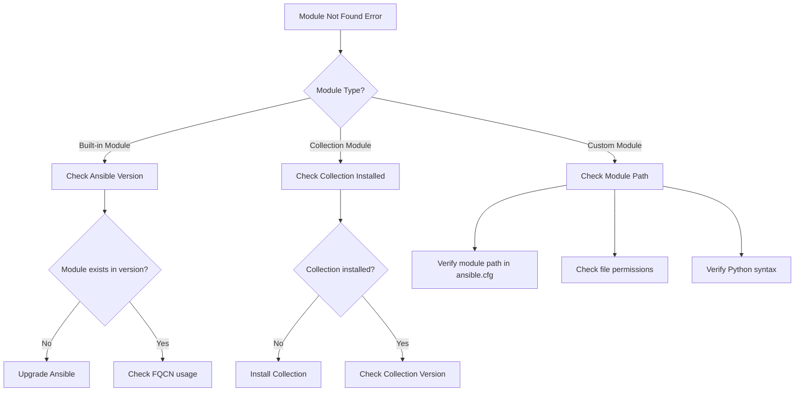
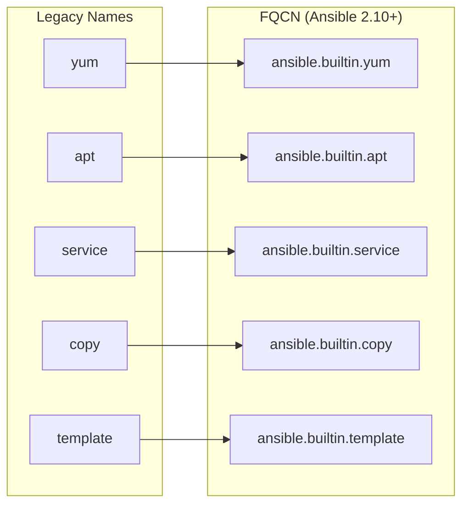
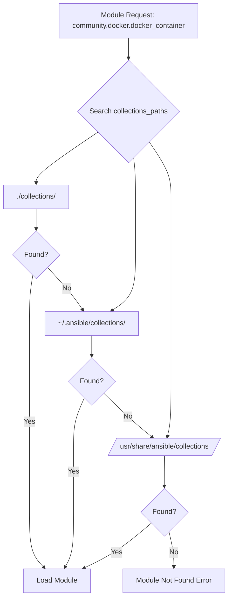
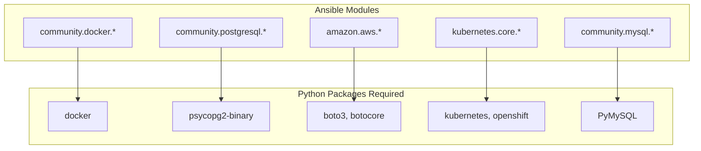
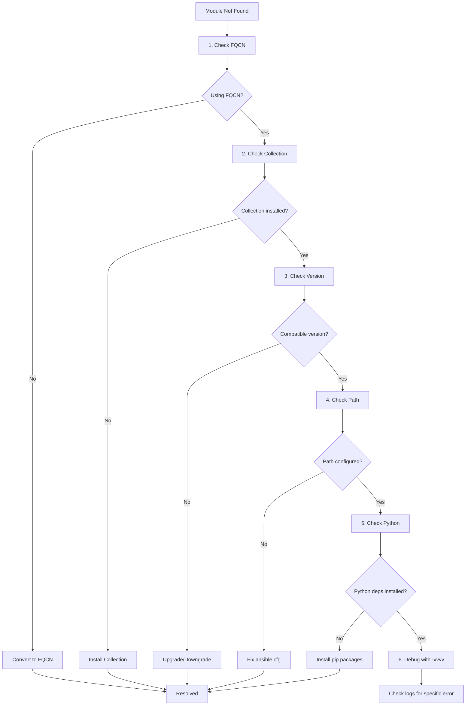

# How to Fix 'Module Not Found' Errors in Ansible

Author: [nawazdhandala](https://www.github.com/nawazdhandala)

Tags: Ansible, DevOps, Automation, Troubleshooting, Python, Modules, Collections

Description: Learn how to diagnose and resolve module not found errors in Ansible by installing missing collections, configuring module paths, and fixing Python dependencies.

---

Module not found errors in Ansible can halt your automation workflows unexpectedly. These errors occur when Ansible cannot locate a module you are trying to use, whether it is a built-in module, a collection module, or a custom module. This guide walks through the common causes and solutions for resolving these errors.

## Understanding the Error

Module not found errors typically appear in several forms:

```
ERROR! couldn't resolve module/action 'community.general.ufw'. This often indicates a misspelling, missing collection, or incorrect module path.

fatal: [webserver01]: FAILED! => {
    "msg": "The module community.docker.docker_container was not found in configured module paths"
}

ERROR! the role 'geerlingguy.docker' was not found in /path/to/roles
```

## Diagnostic Flow



## Step 1: Identify the Module Type

First, determine what type of module you are trying to use:

```bash
# Check if module exists in your Ansible installation
# This shows documentation if module is available
ansible-doc module_name

# Example: Check if docker_container module exists
ansible-doc community.docker.docker_container

# List all available modules matching a pattern
ansible-doc -l | grep docker

# Show module path where Ansible looks for modules
ansible-config dump | grep MODULE
```

## Step 2: Fix Built-in Module Issues

Some modules were moved to collections in Ansible 2.10+. Use Fully Qualified Collection Names (FQCN).

### Before Ansible 2.10 (Legacy Names)

```yaml
# Old syntax - may not work in newer Ansible versions
---
- name: Manage packages (legacy)
  hosts: all
  tasks:
    - name: Install nginx
      # Legacy short name
      yum:
        name: nginx
        state: present
```

### After Ansible 2.10 (FQCN Required)

```yaml
# Modern syntax with Fully Qualified Collection Names
---
- name: Manage packages (FQCN)
  hosts: all
  tasks:
    - name: Install nginx
      # FQCN format: namespace.collection.module
      ansible.builtin.yum:
        name: nginx
        state: present

    - name: Start nginx service
      ansible.builtin.service:
        name: nginx
        state: started
        enabled: true
```

### Module Migration Map



## Step 3: Install Missing Collections

Most module not found errors are resolved by installing the required collection.

```bash
# Install a single collection from Ansible Galaxy
ansible-galaxy collection install community.docker

# Install a specific version
ansible-galaxy collection install community.docker:3.4.0

# Install from a requirements file
ansible-galaxy collection install -r requirements.yml

# Force reinstall to update
ansible-galaxy collection install community.docker --force

# Install to a specific path
ansible-galaxy collection install community.docker -p ./collections
```

### Requirements File Format

```yaml
# requirements.yml
# Define all collections your project needs
---
collections:
  # Docker modules for container management
  - name: community.docker
    version: ">=3.0.0"

  # General purpose modules
  - name: community.general
    version: ">=7.0.0"

  # PostgreSQL modules
  - name: community.postgresql
    version: ">=3.0.0"

  # AWS modules
  - name: amazon.aws
    version: ">=6.0.0"

  # Kubernetes modules
  - name: kubernetes.core
    version: ">=2.4.0"

# You can also include roles
roles:
  - name: geerlingguy.docker
    version: "6.1.0"
  - name: geerlingguy.postgresql
```

```bash
# Install all requirements
ansible-galaxy install -r requirements.yml

# Install only collections
ansible-galaxy collection install -r requirements.yml

# Install only roles
ansible-galaxy role install -r requirements.yml
```

## Step 4: Configure Collection Paths

Ensure Ansible can find your installed collections.

```ini
# ansible.cfg
[defaults]
# Default paths where Ansible looks for collections
collections_paths = ./collections:~/.ansible/collections:/usr/share/ansible/collections

# Default paths for roles
roles_path = ./roles:~/.ansible/roles:/usr/share/ansible/roles

# Default paths for custom modules
library = ./library

# Path for custom module utilities
module_utils = ./module_utils

# Path for custom plugins
# Action plugins
action_plugins = ./plugins/action
# Filter plugins
filter_plugins = ./plugins/filter
# Lookup plugins
lookup_plugins = ./plugins/lookup
```

```bash
# Check where collections are installed
ansible-galaxy collection list

# Check effective collection paths
ansible-config dump | grep COLLECTIONS_PATH

# Verify a specific collection is installed
ansible-galaxy collection list community.docker
```

## Collection Search Path Flow



## Step 5: Fix Custom Module Issues

If you are using custom modules, ensure they are in the correct location.

### Project Structure for Custom Modules

```
project/
├── ansible.cfg
├── playbooks/
│   └── main.yml
├── library/                    # Custom modules go here
│   ├── my_custom_module.py
│   └── another_module.py
├── module_utils/              # Shared Python code for modules
│   └── common.py
├── plugins/
│   ├── action/               # Action plugins
│   ├── filter/               # Filter plugins
│   │   └── my_filters.py
│   └── lookup/               # Lookup plugins
└── collections/              # Installed collections
    └── ansible_collections/
        └── community/
            └── docker/
```

### Custom Module Example

```python
#!/usr/bin/python
# library/my_custom_module.py
# Custom Ansible module example

from ansible.module_utils.basic import AnsibleModule

DOCUMENTATION = '''
---
module: my_custom_module
short_description: Example custom module
description:
    - This is an example custom Ansible module
options:
    name:
        description:
            - Name parameter for the module
        required: true
        type: str
    state:
        description:
            - Desired state
        choices: ['present', 'absent']
        default: present
        type: str
'''

EXAMPLES = '''
- name: Use custom module
  my_custom_module:
    name: example
    state: present
'''

def main():
    # Define module arguments
    module_args = dict(
        name=dict(type='str', required=True),
        state=dict(type='str', default='present', choices=['present', 'absent'])
    )

    # Initialize the module
    module = AnsibleModule(
        argument_spec=module_args,
        supports_check_mode=True
    )

    # Get parameters
    name = module.params['name']
    state = module.params['state']

    # Module logic here
    result = dict(
        changed=False,
        message=f'Processed {name} with state {state}'
    )

    # Return results
    module.exit_json(**result)

if __name__ == '__main__':
    main()
```

```yaml
# playbooks/main.yml
# Using the custom module
---
- name: Test custom module
  hosts: localhost
  connection: local

  tasks:
    - name: Run custom module
      my_custom_module:
        name: test_item
        state: present
      register: result

    - name: Show result
      ansible.builtin.debug:
        var: result
```

## Step 6: Fix Python Dependency Issues

Some modules require additional Python packages on the target host.

```yaml
# playbook.yml
# Install Python dependencies before using modules
---
- name: Setup Python dependencies
  hosts: all
  become: true

  tasks:
    - name: Ensure pip is installed
      ansible.builtin.package:
        name: python3-pip
        state: present

    # Docker module requires docker Python package
    - name: Install docker Python package
      ansible.builtin.pip:
        name: docker
        state: present
      when: "'docker' in group_names"

    # PostgreSQL module requires psycopg2
    - name: Install psycopg2 for PostgreSQL modules
      ansible.builtin.pip:
        name: psycopg2-binary
        state: present
      when: "'databases' in group_names"

    # AWS modules require boto3
    - name: Install boto3 for AWS modules
      ansible.builtin.pip:
        name:
          - boto3
          - botocore
        state: present
      when: "'aws' in group_names"
```

### Common Module Dependencies



## Step 7: Troubleshoot Version Conflicts

Sometimes module errors occur due to version incompatibilities.

```bash
# Check Ansible version
ansible --version

# Check installed collections and their versions
ansible-galaxy collection list

# Check for module in specific collection version
ansible-doc community.docker.docker_container

# Upgrade Ansible to latest version
pip install --upgrade ansible

# Upgrade specific collection
ansible-galaxy collection install community.docker --force
```

```yaml
# requirements.yml
# Pin versions to avoid compatibility issues
---
collections:
  # Pin to exact version for reproducibility
  - name: community.docker
    version: "3.4.0"

  # Or use version constraints
  - name: community.general
    version: ">=7.0.0,<8.0.0"

  # Install from specific source
  - name: my_namespace.my_collection
    source: https://galaxy.ansible.com
```

## Step 8: Debug Module Loading

Use Ansible's debugging options to understand module loading.

```bash
# Run with maximum verbosity to see module search paths
ansible-playbook playbook.yml -vvvv

# Check if module is being found
ansible localhost -m community.docker.docker_container -a "name=test image=nginx" -vvvv

# Display the module path being used
ansible-config dump | grep -i module

# List all modules in a collection
ansible-doc -l -t module community.docker
```

```yaml
# debug_playbook.yml
# Debug module availability
---
- name: Debug module loading
  hosts: localhost
  connection: local
  gather_facts: no

  tasks:
    - name: Display Ansible version
      ansible.builtin.debug:
        msg: "Ansible version: {{ ansible_version.full }}"

    - name: List installed collections
      ansible.builtin.command: ansible-galaxy collection list
      register: collections_list
      changed_when: false
      delegate_to: localhost

    - name: Show installed collections
      ansible.builtin.debug:
        var: collections_list.stdout_lines

    - name: Check Python path
      ansible.builtin.debug:
        msg: "Python interpreter: {{ ansible_playbook_python }}"
```

## Common Solutions Quick Reference

```bash
# Solution 1: Install missing collection
ansible-galaxy collection install community.docker

# Solution 2: Update Ansible
pip install --upgrade ansible

# Solution 3: Use FQCN
# Change: docker_container -> community.docker.docker_container

# Solution 4: Fix collection path in ansible.cfg
# collections_paths = ./collections:~/.ansible/collections

# Solution 5: Install Python dependencies
pip install docker boto3 kubernetes

# Solution 6: Reinstall collection
ansible-galaxy collection install community.docker --force

# Solution 7: Clear collection cache
rm -rf ~/.ansible/collections/ansible_collections/community/docker
ansible-galaxy collection install community.docker
```

## Complete Troubleshooting Checklist



## Example: Complete Setup for Docker Modules

```bash
# Step 1: Install the collection
ansible-galaxy collection install community.docker

# Step 2: Install Python dependency
pip install docker

# Step 3: Verify installation
ansible-doc community.docker.docker_container
```

```yaml
# Step 4: Use in playbook with FQCN
# docker_playbook.yml
---
- name: Deploy Docker containers
  hosts: docker_hosts
  become: true

  tasks:
    - name: Ensure Docker Python package is installed
      ansible.builtin.pip:
        name: docker
        state: present

    - name: Create and start container
      community.docker.docker_container:
        name: nginx_web
        image: nginx:latest
        state: started
        ports:
          - "80:80"
        restart_policy: unless-stopped

    - name: List running containers
      community.docker.docker_container_info:
        name: nginx_web
      register: container_info

    - name: Display container status
      ansible.builtin.debug:
        var: container_info.container.State.Status
```

## Summary

Module not found errors in Ansible typically result from:

1. **Missing FQCN** - Use fully qualified collection names (namespace.collection.module)
2. **Missing Collections** - Install required collections with ansible-galaxy
3. **Incorrect Paths** - Configure collections_paths in ansible.cfg
4. **Version Mismatches** - Ensure compatible Ansible and collection versions
5. **Python Dependencies** - Install required Python packages on target hosts

By following the diagnostic flow and solutions in this guide, you can quickly identify and resolve module not found errors in your Ansible automation.
