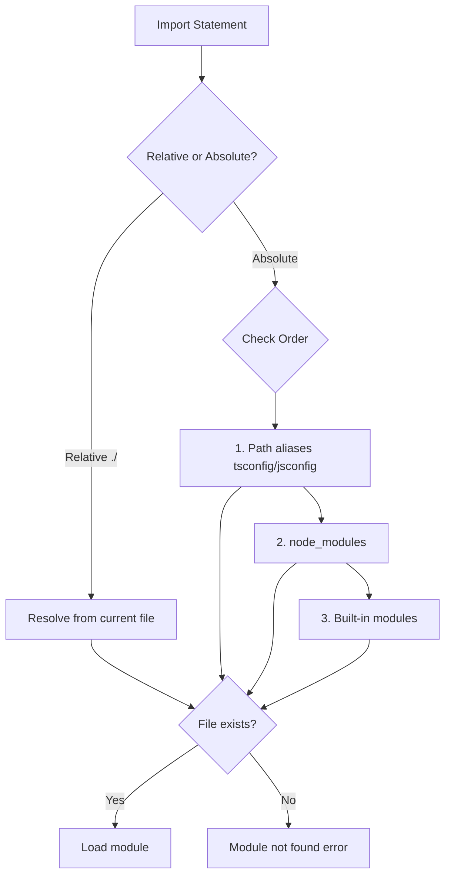
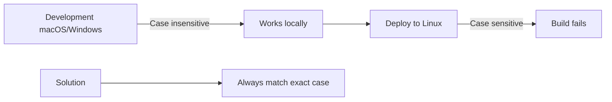
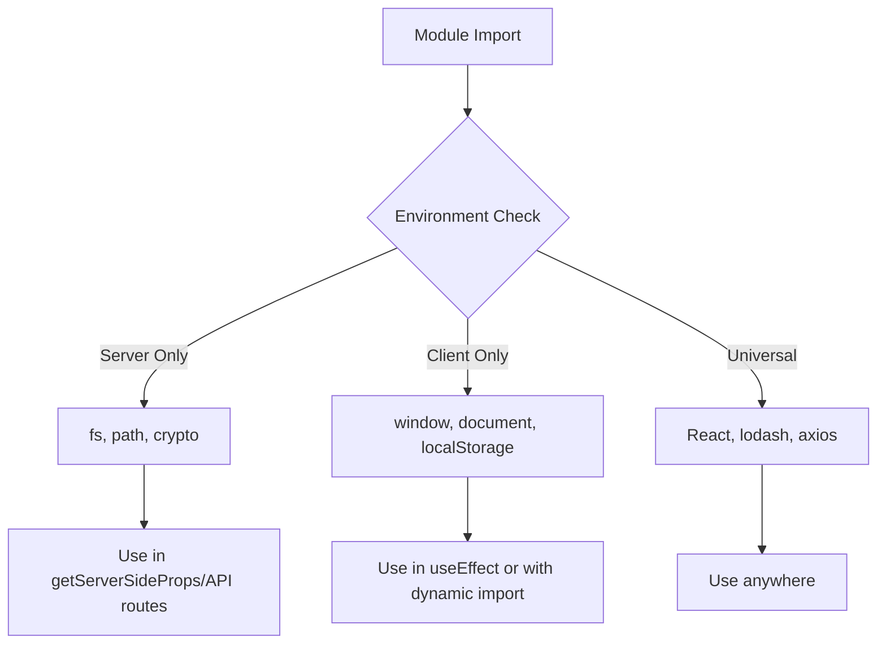
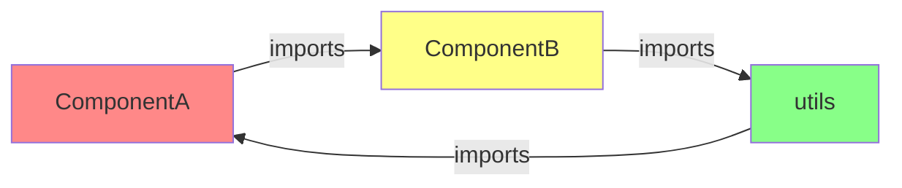

# How to Fix 'Module Not Found' Import Errors in Next.js

Author: [nawazdhandala](https://www.github.com/nawazdhandala)

Tags: Next.js, JavaScript, TypeScript, Debugging, Imports, Modules, Web Development

Description: A comprehensive troubleshooting guide for resolving module not found and import errors in Next.js applications.

---

## Introduction

"Module not found" errors are among the most common issues developers face when working with Next.js. These errors can stem from various causes including incorrect paths, missing dependencies, misconfigured aliases, or TypeScript issues. This guide provides systematic approaches to diagnose and fix these errors.

## Understanding Module Resolution

Before fixing errors, it helps to understand how Next.js resolves modules.



## Common Errors and Solutions

### Error 1: Incorrect Relative Paths

The most common cause is simply using the wrong path.

```javascript
// Project structure:
// src/
//   components/
//     Button.js
//   pages/
//     products/
//       [id].js

// Wrong: Incorrect number of parent directories
// In pages/products/[id].js
import Button from '../components/Button';  // Error!

// Correct: Navigate up two levels from pages/products/
import Button from '../../components/Button';
```

```javascript
// Wrong: Missing file extension for non-JS files
import styles from './styles.css';  // May fail

// Correct: Use proper module syntax
import styles from './styles.module.css';
```

### Error 2: Missing Dependencies

Ensure all required packages are installed.

```bash
# Check if the package exists in package.json
cat package.json | grep "package-name"

# Install missing dependencies
npm install package-name

# For development dependencies
npm install --save-dev package-name

# If you see peer dependency warnings
npm install package-name --legacy-peer-deps
```

```javascript
// Wrong: Using uninstalled package
import { motion } from 'framer-motion';  // Error if not installed

// Fix: Install the package first
// npm install framer-motion

// Then the import works
import { motion } from 'framer-motion';
```

### Error 3: Case Sensitivity Issues

File systems on Linux servers are case-sensitive, while macOS and Windows may not be.

```javascript
// File: components/Button.js

// This works on macOS but fails on Linux servers
import Button from './components/button';  // Wrong case!

// Correct: Match exact case
import Button from './components/Button';
```



### Error 4: Path Alias Configuration

Path aliases simplify imports but require proper configuration.

```json
// tsconfig.json or jsconfig.json
{
  "compilerOptions": {
    "baseUrl": ".",
    "paths": {
      "@/*": ["src/*"],
      "@components/*": ["src/components/*"],
      "@lib/*": ["src/lib/*"],
      "@styles/*": ["src/styles/*"],
      "@hooks/*": ["src/hooks/*"],
      "@utils/*": ["src/utils/*"]
    }
  }
}
```

```javascript
// Before: Long relative imports
import Button from '../../../components/Button';
import { formatDate } from '../../../lib/utils';

// After: Clean alias imports
import Button from '@components/Button';
import { formatDate } from '@lib/utils';
```

```javascript
// Common mistake: Alias not matching configuration
// If your tsconfig has "@components/*": ["src/components/*"]

// Wrong: Missing the wildcard pattern
import Button from '@components';  // Error!

// Correct: Include the path after alias
import Button from '@components/Button';
```

### Error 5: Index File Resolution

Next.js can resolve index files automatically, but explicit paths are safer.

```javascript
// Directory structure:
// components/
//   Button/
//     index.js
//     Button.module.css

// Both work, but explicit is clearer
import Button from '@components/Button';        // Resolves to index.js
import Button from '@components/Button/index';  // Explicit

// For named exports from index
// components/index.js
export { Button } from './Button';
export { Input } from './Input';

// Import multiple components
import { Button, Input } from '@components';
```

### Error 6: Default vs Named Exports

Mixing up export types causes import errors.

```javascript
// Component with default export
// components/Button.js
export default function Button({ children }) {
  return <button>{children}</button>;
}

// Correct import for default export
import Button from '@components/Button';

// Wrong: Using braces for default export
import { Button } from '@components/Button';  // Error!
```

```javascript
// Component with named export
// components/Button.js
export function Button({ children }) {
  return <button>{children}</button>;
}

// Correct import for named export
import { Button } from '@components/Button';

// Wrong: No braces for named export
import Button from '@components/Button';  // Error or undefined!
```

```javascript
// Mixed exports
// lib/utils.js
export default function mainFunction() {}
export function helperOne() {}
export function helperTwo() {}

// Import default and named together
import mainFunction, { helperOne, helperTwo } from '@lib/utils';
```

### Error 7: TypeScript Module Resolution

TypeScript has specific requirements for module resolution.

```json
// tsconfig.json
{
  "compilerOptions": {
    "target": "es5",
    "lib": ["dom", "dom.iterable", "esnext"],
    "allowJs": true,
    "skipLibCheck": true,
    "strict": true,
    "forceConsistentCasingInFileNames": true,
    "noEmit": true,
    "esModuleInterop": true,
    "module": "esnext",
    "moduleResolution": "bundler",
    "resolveJsonModule": true,
    "isolatedModules": true,
    "jsx": "preserve",
    "incremental": true,
    "baseUrl": ".",
    "paths": {
      "@/*": ["./src/*"]
    }
  },
  "include": ["next-env.d.ts", "**/*.ts", "**/*.tsx"],
  "exclude": ["node_modules"]
}
```

```typescript
// Importing JSON files
// Requires "resolveJsonModule": true in tsconfig.json
import config from './config.json';

// Importing with type assertions
import data from './data.json' assert { type: 'json' };
```

### Error 8: Server vs Client Module Imports

Some modules only work in specific environments.



```javascript
// Wrong: Importing server-only module in client component
import fs from 'fs';  // Error in browser!

// Correct: Use only in server-side functions
// pages/api/files.js
import fs from 'fs';
import path from 'path';

export default function handler(req, res) {
  const filePath = path.join(process.cwd(), 'data', 'file.json');
  const content = fs.readFileSync(filePath, 'utf8');
  res.json(JSON.parse(content));
}
```

```javascript
// For client-only modules, use dynamic imports
import dynamic from 'next/dynamic';

// Component that uses browser APIs
const MapComponent = dynamic(
  () => import('@components/Map'),
  {
    ssr: false,
    loading: () => <p>Loading map...</p>
  }
);
```

### Error 9: CSS and Style Imports

CSS modules and global styles have specific import rules.

```javascript
// Global CSS - only import in _app.js
// pages/_app.js
import '../styles/globals.css';

// Wrong: Importing global CSS in a component
// components/Button.js
import '../styles/globals.css';  // Error!
```

```javascript
// CSS Modules - can import in any component
// components/Button.js
import styles from './Button.module.css';

export default function Button({ children }) {
  return (
    <button className={styles.button}>
      {children}
    </button>
  );
}
```

```javascript
// SCSS/SASS requires additional package
// npm install sass

// Then import works
import styles from './Component.module.scss';
```

### Error 10: Circular Dependencies

Circular imports cause confusing "module not found" errors.



```javascript
// Problematic circular dependency
// components/ComponentA.js
import { helperFromB } from './ComponentB';
export const helperFromA = () => {};

// components/ComponentB.js
import { helperFromA } from './ComponentA';  // Circular!
export const helperFromB = () => {};

// Solution: Extract shared code to a separate module
// lib/shared.js
export const helperFromA = () => {};
export const helperFromB = () => {};

// components/ComponentA.js
import { helperFromB } from '@lib/shared';

// components/ComponentB.js
import { helperFromA } from '@lib/shared';
```

## Debugging Strategies

### Strategy 1: Verify File Existence

```bash
# Check if the file exists at the expected path
ls -la src/components/Button.js

# Find files by name
find . -name "Button*" -type f

# Check the actual project structure
tree src/components -L 2
```

### Strategy 2: Clear Cache and Reinstall

```bash
# Remove node_modules and lock file
rm -rf node_modules
rm -rf .next
rm package-lock.json  # or yarn.lock

# Clear npm cache
npm cache clean --force

# Reinstall dependencies
npm install

# Rebuild the project
npm run build
```

### Strategy 3: Check TypeScript Configuration

```bash
# Validate tsconfig.json
npx tsc --showConfig

# Check for TypeScript errors
npx tsc --noEmit
```

### Strategy 4: Trace Module Resolution

```javascript
// Add to next.config.js for debugging
module.exports = {
  webpack: (config, { isServer }) => {
    // Log resolved aliases
    console.log('Webpack aliases:', config.resolve.alias);
    return config;
  },
};
```

## Next.js 13+ App Router Considerations

The App Router has specific module resolution behaviors.

```javascript
// app/ directory structure
// app/
//   components/
//     Button.tsx
//   (dashboard)/
//     page.tsx
//   api/
//     route.ts

// Importing in App Router
// app/(dashboard)/page.tsx
import Button from '../components/Button';  // Relative works
import Button from '@/app/components/Button';  // Alias works
```

```javascript
// Server Components (default in App Router)
// Can import server-only modules directly
import { headers } from 'next/headers';
import { cookies } from 'next/headers';

// For client components, add directive
'use client';

import { useState } from 'react';
// Now can use hooks and browser APIs
```

## Package.json Configuration

Ensure your package.json has correct module settings.

```json
{
  "name": "my-nextjs-app",
  "version": "1.0.0",
  "private": true,
  "scripts": {
    "dev": "next dev",
    "build": "next build",
    "start": "next start",
    "lint": "next lint"
  },
  "dependencies": {
    "next": "14.0.0",
    "react": "18.2.0",
    "react-dom": "18.2.0"
  },
  "devDependencies": {
    "@types/node": "20.0.0",
    "@types/react": "18.2.0",
    "typescript": "5.0.0"
  }
}
```

## IDE Configuration

Ensure your IDE recognizes path aliases.

```json
// .vscode/settings.json
{
  "typescript.preferences.importModuleSpecifier": "non-relative",
  "javascript.preferences.importModuleSpecifier": "non-relative",
  "editor.codeActionsOnSave": {
    "source.organizeImports": true
  }
}
```

## Summary

Fixing "Module not found" errors in Next.js requires systematic debugging:

1. Verify the file exists at the expected path
2. Check for case sensitivity issues
3. Ensure dependencies are installed
4. Configure path aliases correctly in tsconfig.json
5. Distinguish between default and named exports
6. Handle server-only and client-only modules appropriately
7. Follow CSS import rules
8. Watch for circular dependencies
9. Clear cache and reinstall when needed
10. Keep TypeScript configuration in sync with Next.js requirements

By understanding the module resolution process and following these troubleshooting steps, you can quickly resolve import errors and maintain a clean, organized codebase.
