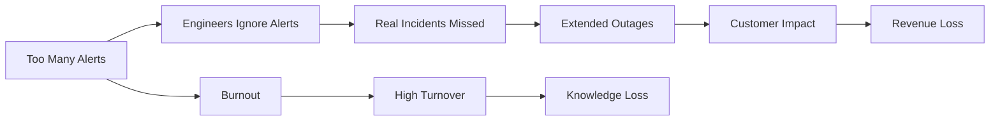
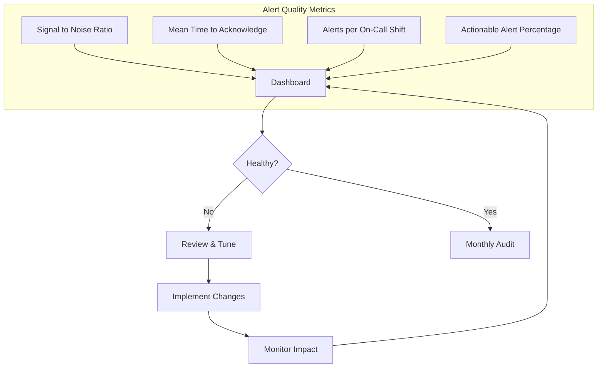

# How to Fix "Monitoring Alert Fatigue" Issues

Author: [nawazdhandala](https://www.github.com/nawazdhandala)

Tags: Monitoring, Alerting, DevOps, SRE, Alert Fatigue, Observability, On-Call

Description: Learn how to diagnose and fix alert fatigue by tuning thresholds, consolidating alerts, and implementing smart alerting strategies.

---

Your phone buzzes at 3 AM. Another alert. You check it, realize it is the same non-critical warning you have seen 47 times this week, and go back to sleep. This is alert fatigue, and it is dangerous. When real incidents happen, tired engineers miss them because they have learned to ignore alerts. Here is how to fix it.

## The Alert Fatigue Problem

Alert fatigue happens when teams receive so many notifications that they start ignoring them. The consequences are serious:



## Step 1: Audit Your Current Alerts

Before fixing anything, understand what you are dealing with. Run an alert audit:

```python
# alert_audit.py
# Analyze your alert patterns to identify problems

import pandas as pd
from datetime import datetime, timedelta
from collections import defaultdict

class AlertAuditor:
    def __init__(self, alerts_data):
        """
        alerts_data should be a list of dicts with:
        - timestamp: when the alert fired
        - name: alert name
        - severity: critical/high/medium/low
        - acknowledged: bool
        - time_to_ack: seconds until acknowledged (if applicable)
        - resolved: bool
        - was_actionable: bool (did it require human action)
        """
        self.df = pd.DataFrame(alerts_data)
        self.df['timestamp'] = pd.to_datetime(self.df['timestamp'])

    def get_alert_frequency(self, days=30):
        """Find alerts that fire too frequently"""

        cutoff = datetime.now() - timedelta(days=days)
        recent = self.df[self.df['timestamp'] > cutoff]

        frequency = recent.groupby('name').agg({
            'timestamp': 'count',
            'was_actionable': 'mean',  # Percentage that needed action
            'time_to_ack': 'mean'
        }).rename(columns={
            'timestamp': 'count',
            'was_actionable': 'actionable_rate',
            'time_to_ack': 'avg_ack_time'
        })

        # Flag problematic alerts
        frequency['is_noisy'] = (
            (frequency['count'] > 10) &  # Fires often
            (frequency['actionable_rate'] < 0.1)  # Rarely needs action
        )

        return frequency.sort_values('count', ascending=False)

    def find_duplicate_alerts(self):
        """Find alerts that fire together (potential duplicates)"""

        # Group alerts by 5-minute windows
        self.df['time_window'] = self.df['timestamp'].dt.floor('5min')

        # Find alerts that commonly fire together
        co_occurrences = defaultdict(int)

        for window, group in self.df.groupby('time_window'):
            alerts = list(group['name'].unique())
            for i, a1 in enumerate(alerts):
                for a2 in alerts[i+1:]:
                    pair = tuple(sorted([a1, a2]))
                    co_occurrences[pair] += 1

        # Return pairs that fire together more than 50% of the time
        return {k: v for k, v in co_occurrences.items() if v > 10}

    def calculate_noise_score(self):
        """Calculate overall noise score for the alerting system"""

        total_alerts = len(self.df)
        actionable_alerts = self.df['was_actionable'].sum()

        if total_alerts == 0:
            return 0

        # Noise score: 0 = perfect, 100 = all noise
        noise_score = (1 - (actionable_alerts / total_alerts)) * 100

        return {
            'total_alerts': total_alerts,
            'actionable_alerts': int(actionable_alerts),
            'noise_alerts': int(total_alerts - actionable_alerts),
            'noise_score': round(noise_score, 2),
            'recommendation': self._get_recommendation(noise_score)
        }

    def _get_recommendation(self, score):
        if score < 20:
            return "Healthy - alerts are mostly actionable"
        elif score < 50:
            return "Moderate - review top noisy alerts"
        elif score < 80:
            return "High - significant tuning needed"
        else:
            return "Critical - alerting system needs overhaul"


# Example usage
auditor = AlertAuditor(your_alerts_data)
print(auditor.calculate_noise_score())
print(auditor.get_alert_frequency())
```

## Step 2: Implement Alert Severity Properly

Most alert fatigue comes from improper severity assignment. Here is a framework:

```yaml
# alert-severity-guidelines.yaml
# Clear criteria for each severity level

severities:
  critical:
    criteria:
      - "Complete service unavailable"
      - "Data loss occurring or imminent"
      - "Security breach in progress"
      - "Revenue impact > $1000/minute"
    response: "Immediate - page on-call"
    examples:
      - "Database cluster down"
      - "Payment processing 100% failed"
      - "Primary data center offline"
    anti_patterns:
      - "Single pod restart"
      - "One node unhealthy in cluster"
      - "High CPU on non-critical service"

  high:
    criteria:
      - "Major feature degraded"
      - "Significant user impact (>25%)"
      - "SLA at risk"
    response: "Within 15 minutes during business hours"
    examples:
      - "API latency > 5s for 10 minutes"
      - "Error rate > 5%"
      - "Search completely broken"
    anti_patterns:
      - "Staging environment issues"
      - "Single user reports"
      - "Metrics approaching threshold"

  medium:
    criteria:
      - "Minor feature issues"
      - "Performance degradation"
      - "Limited user impact (<10%)"
    response: "Within 4 hours during business hours"
    examples:
      - "Export feature slow"
      - "Dashboard taking 10s to load"
      - "Background job backlog growing"
    anti_patterns:
      - "Cosmetic issues"
      - "Documentation gaps"

  low:
    criteria:
      - "Informational"
      - "Requires review but not action"
      - "Future capacity concerns"
    response: "Next business day"
    examples:
      - "Disk usage approaching 70%"
      - "Certificate expiring in 30 days"
      - "Deprecated API usage detected"
```

## Step 3: Tune Alert Thresholds

Static thresholds cause many false positives. Use dynamic thresholds instead:

```python
# dynamic_thresholds.py
# Implement smarter alerting thresholds

import numpy as np
from scipy import stats

class DynamicThreshold:
    def __init__(self, historical_data, sensitivity=2.5):
        """
        historical_data: list of metric values over time
        sensitivity: number of standard deviations for threshold
        """
        self.data = np.array(historical_data)
        self.sensitivity = sensitivity

    def get_threshold(self, method='zscore'):
        """Calculate dynamic threshold based on historical data"""

        if method == 'zscore':
            # Standard deviation based
            mean = np.mean(self.data)
            std = np.std(self.data)
            upper = mean + (self.sensitivity * std)
            lower = mean - (self.sensitivity * std)

        elif method == 'percentile':
            # Percentile based - more robust to outliers
            upper = np.percentile(self.data, 99)
            lower = np.percentile(self.data, 1)

        elif method == 'mad':
            # Median Absolute Deviation - best for skewed data
            median = np.median(self.data)
            mad = np.median(np.abs(self.data - median))
            upper = median + (self.sensitivity * 1.4826 * mad)
            lower = median - (self.sensitivity * 1.4826 * mad)

        return {'upper': upper, 'lower': lower}

    def is_anomaly(self, value, method='zscore'):
        """Check if a value is anomalous"""
        thresholds = self.get_threshold(method)
        return value > thresholds['upper'] or value < thresholds['lower']


# Example: Configure in Prometheus
prometheus_alert_rule = """
# Use recording rules for dynamic thresholds
groups:
  - name: dynamic_thresholds
    rules:
      # Calculate rolling average and stddev
      - record: http_request_duration_avg
        expr: avg_over_time(http_request_duration_seconds[7d])

      - record: http_request_duration_stddev
        expr: stddev_over_time(http_request_duration_seconds[7d])

      # Alert only when significantly above baseline
      - alert: HighLatencyAnomaly
        expr: |
          http_request_duration_seconds
          > (http_request_duration_avg + 2.5 * http_request_duration_stddev)
        for: 5m
        labels:
          severity: high
        annotations:
          summary: "Latency significantly above historical baseline"
"""
```

## Step 4: Consolidate Related Alerts

Multiple alerts for the same root cause create noise. Implement alert correlation:

```javascript
// alert-correlation.js
// Group related alerts to reduce noise

class AlertCorrelator {
  constructor() {
    // Define which alerts are related
    this.correlationRules = {
      'database': [
        'DatabaseConnectionsFull',
        'DatabaseSlowQueries',
        'DatabaseCPUHigh',
        'DatabaseReplicationLag',
        'APITimeouts'  // Often caused by database issues
      ],
      'kubernetes_node': [
        'NodeNotReady',
        'NodeDiskPressure',
        'NodeMemoryPressure',
        'PodEvictions',
        'NodeCPUHigh'
      ],
      'network': [
        'HighPacketLoss',
        'DNSResolutionSlow',
        'ServiceUnreachable',
        'HighLatency'
      ]
    };

    this.activeGroups = new Map();
    this.alertBuffer = [];
    this.bufferWindow = 60000; // 1 minute buffer
  }

  processAlert(alert) {
    // Add alert to buffer
    this.alertBuffer.push({
      ...alert,
      receivedAt: Date.now()
    });

    // Process buffer after window
    setTimeout(() => this.correlateAlerts(), this.bufferWindow);
  }

  correlateAlerts() {
    // Group alerts by correlation rules
    const groups = {};

    for (const alert of this.alertBuffer) {
      let grouped = false;

      for (const [groupName, alertTypes] of Object.entries(this.correlationRules)) {
        if (alertTypes.includes(alert.name)) {
          if (!groups[groupName]) {
            groups[groupName] = [];
          }
          groups[groupName].push(alert);
          grouped = true;
          break;
        }
      }

      // Uncorrelated alerts get their own notification
      if (!grouped) {
        this.sendNotification(alert);
      }
    }

    // Send consolidated notifications for groups
    for (const [groupName, alerts] of Object.entries(groups)) {
      if (alerts.length > 1) {
        this.sendConsolidatedNotification(groupName, alerts);
      } else {
        this.sendNotification(alerts[0]);
      }
    }

    // Clear buffer
    this.alertBuffer = [];
  }

  sendConsolidatedNotification(groupName, alerts) {
    const notification = {
      title: `[${groupName.toUpperCase()}] Multiple related alerts (${alerts.length})`,
      severity: this.getHighestSeverity(alerts),
      alerts: alerts.map(a => a.name),
      message: `Possible ${groupName} issue detected. Related alerts: ${alerts.map(a => a.name).join(', ')}`,
      suggestedRunbook: this.getRunbookForGroup(groupName)
    };

    console.log('Consolidated alert:', notification);
    // Send to notification system
  }

  getHighestSeverity(alerts) {
    const severityOrder = ['critical', 'high', 'medium', 'low'];
    return alerts.reduce((highest, alert) => {
      const currentIndex = severityOrder.indexOf(alert.severity);
      const highestIndex = severityOrder.indexOf(highest);
      return currentIndex < highestIndex ? alert.severity : highest;
    }, 'low');
  }

  getRunbookForGroup(groupName) {
    const runbooks = {
      'database': 'https://runbooks.company.com/database-issues',
      'kubernetes_node': 'https://runbooks.company.com/k8s-node-issues',
      'network': 'https://runbooks.company.com/network-issues'
    };
    return runbooks[groupName];
  }
}
```

## Step 5: Implement Alert Suppression

Prevent alert storms during known issues:

```yaml
# alertmanager.yaml
# Configure alert suppression and inhibition

global:
  resolve_timeout: 5m

inhibit_rules:
  # If cluster is down, suppress individual node alerts
  - source_match:
      alertname: 'ClusterDown'
    target_match_re:
      alertname: 'Node.*'
    equal: ['cluster']

  # If database is down, suppress dependent service alerts
  - source_match:
      alertname: 'DatabaseDown'
    target_match_re:
      alertname: '(APIErrors|SlowQueries|ServiceUnhealthy)'
    equal: ['environment']

  # High severity suppresses lower severity for same issue
  - source_match:
      severity: 'critical'
    target_match:
      severity: 'warning'
    equal: ['alertname', 'service']

route:
  # Group alerts by service and alertname
  group_by: ['alertname', 'service', 'environment']

  # Wait to group related alerts
  group_wait: 30s

  # Wait before sending updates
  group_interval: 5m

  # Wait before resending
  repeat_interval: 4h

  routes:
    # Critical goes immediately
    - match:
        severity: critical
      group_wait: 10s
      receiver: 'pagerduty-critical'

    # Maintenance windows - send to null receiver
    - match:
        maintenance: 'true'
      receiver: 'null'
```

## Step 6: Create Alert Quality Metrics

Track your alerting health over time:



```sql
-- alert_metrics.sql
-- Query to track alert quality over time

WITH alert_stats AS (
  SELECT
    DATE_TRUNC('week', created_at) as week,
    COUNT(*) as total_alerts,
    SUM(CASE WHEN was_actionable THEN 1 ELSE 0 END) as actionable_alerts,
    AVG(time_to_ack_seconds) as avg_ack_time,
    COUNT(DISTINCT on_call_user) as engineers_paged
  FROM alerts
  WHERE created_at > NOW() - INTERVAL '12 weeks'
  GROUP BY 1
)
SELECT
  week,
  total_alerts,
  actionable_alerts,
  ROUND(100.0 * actionable_alerts / NULLIF(total_alerts, 0), 1) as actionable_pct,
  ROUND(avg_ack_time / 60, 1) as avg_ack_minutes,
  engineers_paged,
  ROUND(total_alerts::numeric / NULLIF(engineers_paged, 0), 1) as alerts_per_engineer
FROM alert_stats
ORDER BY week DESC;
```

## Best Practices Summary

1. **Every alert must be actionable** - If you cannot do anything about it, it should not page anyone
2. **Set appropriate severity** - Not everything is critical
3. **Use time windows** - Alert only if the condition persists
4. **Group related alerts** - One notification for related issues
5. **Review alerts monthly** - Delete or tune alerts that are not useful
6. **Track metrics** - Measure your signal-to-noise ratio
7. **Get feedback** - Ask on-call engineers which alerts are useless

---

Alert fatigue is solvable. It takes discipline to regularly audit and tune your alerts, but the payoff is enormous: engineers who trust their alerts, faster incident response, and better sleep for everyone on call.
