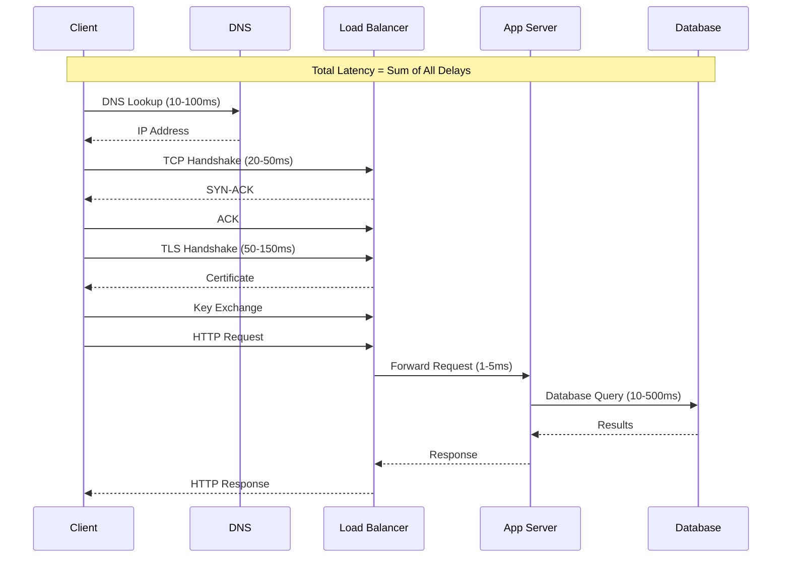
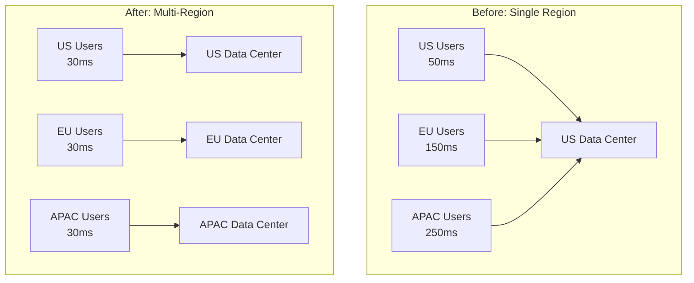

# How to Fix "Network Latency" Issues

Author: [nawazdhandala](https://www.github.com/nawazdhandala)

Tags: Networking, Performance, Troubleshooting, DevOps, Latency, TCP, DNS, Optimization

Description: A comprehensive guide to diagnosing and fixing network latency issues in distributed systems, covering DNS resolution, TCP optimization, connection pooling, and infrastructure improvements.

---

Network latency problems can bring your application to its knees. A few hundred milliseconds of delay might seem small, but when multiplied across thousands of requests, it becomes catastrophic. Let's walk through systematic approaches to identify and fix these issues.

## Understanding Network Latency Components

Network latency is not a single metric. It's the sum of multiple delays in your request path.



## Diagnosing Latency Issues

### Step 1: Measure Current Latency

Start by establishing baseline measurements:

```bash
# Measure DNS resolution time
dig +stats example.com | grep "Query time"

# Measure TCP connection time
curl -w "DNS: %{time_namelookup}s\nConnect: %{time_connect}s\nTLS: %{time_appconnect}s\nTotal: %{time_total}s\n" \
     -o /dev/null -s https://api.example.com/health

# Detailed timing breakdown
curl -w "@curl-format.txt" -o /dev/null -s https://api.example.com/health
```

Create a timing format file:

```txt
# curl-format.txt
     time_namelookup:  %{time_namelookup}s\n
        time_connect:  %{time_connect}s\n
     time_appconnect:  %{time_appconnect}s\n
    time_pretransfer:  %{time_pretransfer}s\n
       time_redirect:  %{time_redirect}s\n
  time_starttransfer:  %{time_starttransfer}s\n
                     ----------\n
          time_total:  %{time_total}s\n
```

### Step 2: Identify the Bottleneck

Use traceroute to find where delays occur:

```bash
# Standard traceroute
traceroute api.example.com

# MTR for continuous monitoring (more detailed)
mtr --report --report-cycles 100 api.example.com

# TCP traceroute (bypasses ICMP blocking)
tcptraceroute api.example.com 443
```

### Step 3: Check for Packet Loss

Packet loss forces retransmissions, dramatically increasing latency:

```bash
# Extended ping test
ping -c 100 api.example.com | tail -1

# Check for TCP retransmissions
netstat -s | grep -i retransmit

# On Linux, detailed TCP stats
ss -ti dst api.example.com
```

## Fixing DNS Latency

DNS resolution can add 50-200ms per request without caching.

### Implement Local DNS Caching

```yaml
# CoreDNS configuration for Kubernetes
# coredns-configmap.yaml
apiVersion: v1
kind: ConfigMap
metadata:
  name: coredns
  namespace: kube-system
data:
  Corefile: |
    .:53 {
        errors
        health
        ready
        kubernetes cluster.local in-addr.arpa ip6.arpa {
            pods insecure
            fallthrough in-addr.arpa ip6.arpa
        }
        # Cache DNS responses for 30 seconds
        cache 30
        # Forward external queries with caching
        forward . 8.8.8.8 8.8.4.4 {
            max_concurrent 1000
        }
        loop
        reload
        loadbalance
    }
```

### Use DNS Connection Reuse in Applications

```python
# Python: Use a session with connection pooling
import requests
from requests.adapters import HTTPAdapter
from urllib3.util.retry import Retry

# Create a session that reuses connections
session = requests.Session()

# Configure connection pooling
adapter = HTTPAdapter(
    pool_connections=10,    # Number of connection pools
    pool_maxsize=100,       # Connections per pool
    max_retries=Retry(
        total=3,
        backoff_factor=0.1,
        status_forcelist=[500, 502, 503, 504]
    )
)

session.mount('http://', adapter)
session.mount('https://', adapter)

# All requests through this session reuse connections
# DNS is resolved once per connection pool
response = session.get('https://api.example.com/data')
```

```go
// Go: Configure HTTP client with connection reuse
package main

import (
    "net"
    "net/http"
    "time"
)

func createOptimizedClient() *http.Client {
    // Custom transport with connection pooling
    transport := &http.Transport{
        // Connection pool settings
        MaxIdleConns:        100,
        MaxIdleConnsPerHost: 100,
        MaxConnsPerHost:     100,
        IdleConnTimeout:     90 * time.Second,

        // DNS caching through custom dialer
        DialContext: (&net.Dialer{
            Timeout:   30 * time.Second,
            KeepAlive: 30 * time.Second,
        }).DialContext,

        // TLS handshake timeout
        TLSHandshakeTimeout: 10 * time.Second,

        // Enable HTTP/2 for multiplexing
        ForceAttemptHTTP2: true,
    }

    return &http.Client{
        Transport: transport,
        Timeout:   30 * time.Second,
    }
}
```

## Fixing TCP Connection Latency

Every new TCP connection requires a three-way handshake. Reducing new connections is key.

### Enable TCP Keep-Alive

```bash
# Linux kernel tuning for TCP
# /etc/sysctl.conf

# Enable TCP keepalive
net.ipv4.tcp_keepalive_time = 60
net.ipv4.tcp_keepalive_intvl = 10
net.ipv4.tcp_keepalive_probes = 6

# Reduce TIME_WAIT connections
net.ipv4.tcp_fin_timeout = 30
net.ipv4.tcp_tw_reuse = 1

# Increase connection queue
net.core.somaxconn = 65535
net.ipv4.tcp_max_syn_backlog = 65535

# Apply changes
sudo sysctl -p
```

### Configure Connection Pooling in NGINX

```nginx
# nginx.conf
upstream backend {
    server app1.internal:8080;
    server app2.internal:8080;
    server app3.internal:8080;

    # Keep connections alive to upstream servers
    keepalive 100;
    keepalive_requests 1000;
    keepalive_timeout 60s;
}

server {
    listen 443 ssl http2;

    location /api/ {
        proxy_pass http://backend;

        # Enable keepalive to upstream
        proxy_http_version 1.1;
        proxy_set_header Connection "";

        # Timeouts
        proxy_connect_timeout 5s;
        proxy_send_timeout 60s;
        proxy_read_timeout 60s;
    }
}
```

## Fixing Application-Level Latency

Sometimes the network is fine, but your application makes inefficient network calls.

### Batch Multiple Requests

```javascript
// Node.js: Before - Multiple sequential requests
async function getUserData(userId) {
    const user = await fetch(`/api/users/${userId}`);
    const orders = await fetch(`/api/users/${userId}/orders`);
    const preferences = await fetch(`/api/users/${userId}/preferences`);
    // Total time: 3x network round trips
    return { user, orders, preferences };
}

// After - Parallel requests
async function getUserDataOptimized(userId) {
    const [user, orders, preferences] = await Promise.all([
        fetch(`/api/users/${userId}`),
        fetch(`/api/users/${userId}/orders`),
        fetch(`/api/users/${userId}/preferences`)
    ]);
    // Total time: 1x network round trip (parallel)
    return { user, orders, preferences };
}

// Even better - Single batched endpoint
async function getUserDataBatched(userId) {
    // Server returns all data in one response
    return fetch(`/api/users/${userId}/full-profile`);
    // Total time: 1x network round trip, less overhead
}
```

### Implement Request Coalescing

```go
// Go: Coalesce multiple requests for the same resource
package main

import (
    "sync"
    "time"
)

type RequestCoalescer struct {
    mu       sync.Mutex
    inflight map[string]*inflightRequest
}

type inflightRequest struct {
    done   chan struct{}
    result interface{}
    err    error
}

func (c *RequestCoalescer) Do(key string, fn func() (interface{}, error)) (interface{}, error) {
    c.mu.Lock()

    // Check if request is already in flight
    if req, ok := c.inflight[key]; ok {
        c.mu.Unlock()
        <-req.done  // Wait for the existing request
        return req.result, req.err
    }

    // Create new inflight request
    req := &inflightRequest{done: make(chan struct{})}
    c.inflight[key] = req
    c.mu.Unlock()

    // Execute the actual request
    req.result, req.err = fn()
    close(req.done)

    // Clean up after a short delay
    go func() {
        time.Sleep(100 * time.Millisecond)
        c.mu.Lock()
        delete(c.inflight, key)
        c.mu.Unlock()
    }()

    return req.result, req.err
}
```

## Infrastructure-Level Fixes

### Deploy Services Closer to Users



### Use CDN for Static Content and Edge Caching

```yaml
# Cloudflare Workers for edge caching
# wrangler.toml
name = "api-cache"
type = "javascript"

[triggers]
routes = ["api.example.com/cached/*"]

# worker.js
addEventListener('fetch', event => {
    event.respondWith(handleRequest(event.request))
})

async function handleRequest(request) {
    const cache = caches.default

    // Try cache first
    let response = await cache.match(request)

    if (!response) {
        // Fetch from origin
        response = await fetch(request)

        // Cache successful responses
        if (response.ok) {
            const headers = new Headers(response.headers)
            headers.set('Cache-Control', 'public, max-age=60')

            response = new Response(response.body, {
                status: response.status,
                headers: headers
            })

            event.waitUntil(cache.put(request, response.clone()))
        }
    }

    return response
}
```

## Monitoring and Alerting

Set up continuous monitoring to catch latency regressions:

```yaml
# prometheus-alerts.yaml
groups:
- name: latency-alerts
  rules:
  - alert: HighP99Latency
    expr: |
      histogram_quantile(0.99,
        sum(rate(http_request_duration_seconds_bucket[5m])) by (le, service)
      ) > 0.5
    for: 5m
    labels:
      severity: warning
    annotations:
      summary: "High P99 latency on {{ $labels.service }}"
      description: "99th percentile latency is {{ $value }}s (threshold: 0.5s)"

  - alert: HighDNSLatency
    expr: dns_lookup_duration_seconds > 0.1
    for: 2m
    labels:
      severity: warning
    annotations:
      summary: "DNS resolution taking too long"

  - alert: HighTCPRetransmits
    expr: rate(node_netstat_Tcp_RetransSegs[5m]) > 100
    for: 5m
    labels:
      severity: warning
    annotations:
      summary: "High TCP retransmission rate"
```

Network latency issues are rarely caused by a single factor. Use systematic measurement and elimination to find the root cause. Start with the easiest wins like connection pooling and DNS caching, then move to infrastructure changes if needed. Always measure before and after each change to verify improvement.
