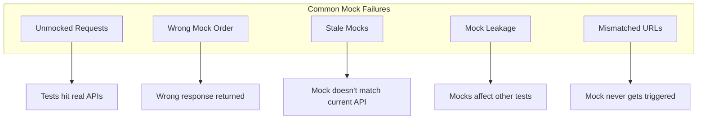

# How to Fix "Network Mock" Issues in Tests

Author: [nawazdhandala](https://www.github.com/nawazdhandala)

Tags: Testing, Mocking, Network, Jest, Python, HTTP, Unit Tests, Integration Tests

Description: Learn how to properly mock network requests in your tests to avoid flaky behavior, unmocked requests, and common pitfalls that cause test failures.

---

Tests that depend on real network requests are slow, flaky, and unreliable. Network mocking lets you simulate API responses without actually calling external services. But getting mocking right is surprisingly tricky, and broken mocks cause some of the most frustrating test failures.

## Why Network Mocking Goes Wrong

Network mock issues typically fall into these categories:



Let us walk through each problem and its solution.

## JavaScript/TypeScript: Mocking with Nock

Nock is the standard library for HTTP mocking in Node.js. Here is how to use it correctly.

### Basic Setup

```typescript
// tests/api.test.ts
import nock from 'nock';
import { fetchUserData } from '../src/api';

describe('API Client', () => {
  // Clean up mocks after each test to prevent leakage
  afterEach(() => {
    nock.cleanAll();
  });

  // Ensure no unmocked requests slip through
  beforeAll(() => {
    nock.disableNetConnect();
    // Allow localhost for test servers if needed
    nock.enableNetConnect('127.0.0.1');
  });

  afterAll(() => {
    nock.enableNetConnect();
  });

  it('should fetch user data successfully', async () => {
    // Set up the mock before making the request
    const scope = nock('https://api.example.com')
      .get('/users/123')
      .reply(200, {
        id: 123,
        name: 'John Doe',
        email: 'john@example.com'
      });

    const user = await fetchUserData(123);

    expect(user.name).toBe('John Doe');
    // Verify the mock was actually called
    expect(scope.isDone()).toBe(true);
  });
});
```

### Handling Query Parameters

One of the most common issues is mocks not matching because of query parameter differences.

```typescript
// Problem: Query parameter order matters
nock('https://api.example.com')
  .get('/search?q=test&page=1')  // This exact string must match
  .reply(200, []);

// Solution: Use query object instead
nock('https://api.example.com')
  .get('/search')
  .query({ q: 'test', page: 1 })  // Order doesn't matter
  .reply(200, []);

// For partial matching
nock('https://api.example.com')
  .get('/search')
  .query(true)  // Match any query string
  .reply(200, []);

// For regex matching on specific params
nock('https://api.example.com')
  .get('/search')
  .query(params => {
    return params.q !== undefined && params.page !== undefined;
  })
  .reply(200, []);
```

### Handling Request Bodies

```typescript
// Match exact body
nock('https://api.example.com')
  .post('/users', {
    name: 'John',
    email: 'john@example.com'
  })
  .reply(201, { id: 1 });

// Match partial body
nock('https://api.example.com')
  .post('/users', body => {
    return body.name === 'John';  // Only check name field
  })
  .reply(201, { id: 1 });

// Match with regex
nock('https://api.example.com')
  .post('/users', /John/)  // Body contains "John"
  .reply(201, { id: 1 });
```

### Dynamic Responses

```typescript
// Respond based on request
nock('https://api.example.com')
  .post('/users')
  .reply((uri, requestBody) => {
    const body = typeof requestBody === 'string'
      ? JSON.parse(requestBody)
      : requestBody;

    return [
      201,
      { id: Date.now(), ...body },
      { 'Content-Type': 'application/json' }
    ];
  });

// Return different responses on subsequent calls
nock('https://api.example.com')
  .get('/status')
  .reply(200, { status: 'processing' })
  .get('/status')
  .reply(200, { status: 'complete' });
```

### Debugging Unmocked Requests

```typescript
// Log all unmocked requests to find what is not being mocked
nock.emitter.on('no match', (req) => {
  console.log('Unmocked request:', {
    method: req.method,
    host: req.options.host,
    path: req.path,
    body: req.requestBodyBuffers
  });
});

// Record real requests to create mocks
nock.recorder.rec({
  output_objects: true,
  dont_print: true
});

// After running test with real requests
const recorded = nock.recorder.play();
console.log(JSON.stringify(recorded, null, 2));
```

## Python: Mocking with Responses and HTTPretty

### Using the Responses Library

```python
# tests/test_api.py
import responses
import requests
from myapp.api import fetch_user, create_order

class TestAPIClient:

    @responses.activate
    def test_fetch_user_success(self):
        # Set up mock
        responses.add(
            responses.GET,
            'https://api.example.com/users/123',
            json={'id': 123, 'name': 'John Doe'},
            status=200
        )

        user = fetch_user(123)

        assert user['name'] == 'John Doe'
        # Verify request was made
        assert len(responses.calls) == 1
        assert responses.calls[0].request.url == 'https://api.example.com/users/123'

    @responses.activate
    def test_handles_network_error(self):
        # Simulate connection error
        responses.add(
            responses.GET,
            'https://api.example.com/users/123',
            body=requests.exceptions.ConnectionError()
        )

        with pytest.raises(requests.exceptions.ConnectionError):
            fetch_user(123)

    @responses.activate
    def test_retry_on_failure(self):
        # First call fails, second succeeds
        responses.add(
            responses.GET,
            'https://api.example.com/users/123',
            status=500
        )
        responses.add(
            responses.GET,
            'https://api.example.com/users/123',
            json={'id': 123, 'name': 'John Doe'},
            status=200
        )

        # Assuming fetch_user has retry logic
        user = fetch_user(123)

        assert len(responses.calls) == 2
        assert user['name'] == 'John Doe'
```

### Matching Complex Requests

```python
import responses
import re
from urllib.parse import parse_qs, urlparse

@responses.activate
def test_search_endpoint():
    # Callback for dynamic matching
    def request_callback(request):
        parsed = urlparse(request.url)
        query = parse_qs(parsed.query)

        # Validate query parameters
        assert 'q' in query

        return (200, {}, json.dumps({
            'results': [{'id': 1, 'title': query['q'][0]}]
        }))

    responses.add_callback(
        responses.GET,
        re.compile(r'https://api\.example\.com/search.*'),
        callback=request_callback,
        content_type='application/json'
    )

    results = search('test query')
    assert len(results) == 1

@responses.activate
def test_post_with_body_validation():
    def validate_and_respond(request):
        body = json.loads(request.body)

        # Validate required fields
        assert 'name' in body
        assert 'email' in body
        assert '@' in body['email']

        return (201, {}, json.dumps({'id': 1, **body}))

    responses.add_callback(
        responses.POST,
        'https://api.example.com/users',
        callback=validate_and_respond,
        content_type='application/json'
    )

    user = create_user(name='John', email='john@example.com')
    assert user['id'] == 1
```

### Using pytest Fixtures for Reusable Mocks

```python
# conftest.py
import pytest
import responses

@pytest.fixture
def mock_user_api():
    """Reusable mock for user API"""
    with responses.RequestsMock() as rsps:
        rsps.add(
            responses.GET,
            re.compile(r'https://api\.example\.com/users/\d+'),
            json={'id': 123, 'name': 'Test User'},
            status=200
        )
        yield rsps

@pytest.fixture
def mock_auth_api():
    """Mock authentication endpoints"""
    with responses.RequestsMock() as rsps:
        rsps.add(
            responses.POST,
            'https://auth.example.com/token',
            json={'access_token': 'mock-token', 'expires_in': 3600},
            status=200
        )
        yield rsps

# tests/test_integration.py
def test_authenticated_request(mock_auth_api, mock_user_api):
    # Both mocks are active
    client = AuthenticatedClient()
    user = client.get_user(123)

    assert user['name'] == 'Test User'
```

## Common Pitfalls and Solutions

### Mock Leakage Between Tests

```typescript
// Bad: Mock persists between tests
describe('API tests', () => {
  nock('https://api.example.com')
    .get('/data')
    .reply(200, { value: 1 });  // This affects ALL tests

  it('test 1', async () => { /* ... */ });
  it('test 2', async () => { /* ... */ });  // Mock might be consumed
});

// Good: Set up mocks in each test or beforeEach
describe('API tests', () => {
  afterEach(() => {
    nock.cleanAll();
  });

  it('test 1', async () => {
    nock('https://api.example.com')
      .get('/data')
      .reply(200, { value: 1 });
    // ...
  });

  it('test 2', async () => {
    nock('https://api.example.com')
      .get('/data')
      .reply(200, { value: 2 });  // Fresh mock
    // ...
  });
});
```

### Mocking with Different HTTP Clients

```typescript
// Nock works with http/https modules
// For fetch or axios, ensure they use http under the hood

// For node-fetch v3 (ESM), use this setup
import nock from 'nock';

// Some clients need baseUrl configuration
nock('https://api.example.com')
  .get('/endpoint')
  .reply(200, {});

// Axios - works out of the box with nock
// Fetch in Node 18+ - works out of the box with nock
// Got - works out of the box with nock
```

### Handling HTTPS and Certificates

```typescript
// If you get certificate errors in tests
nock('https://api.example.com')
  .get('/secure')
  .reply(200, {});

// Add this to ignore SSL in tests
process.env.NODE_TLS_REJECT_UNAUTHORIZED = '0';

// Or configure your HTTP client to skip verification in test mode
```

### Time-Sensitive Requests

```typescript
// Mock requests with timeouts
nock('https://api.example.com')
  .get('/slow')
  .delay(5000)  // Simulate slow response
  .reply(200, {});

// Test timeout behavior
it('should timeout after 3 seconds', async () => {
  nock('https://api.example.com')
    .get('/slow')
    .delay(5000)
    .reply(200, {});

  await expect(fetchWithTimeout('/slow', 3000))
    .rejects.toThrow('timeout');
});
```

## Testing Error Scenarios

```python
# test_error_handling.py
import responses
import requests

@responses.activate
def test_handles_rate_limiting():
    responses.add(
        responses.GET,
        'https://api.example.com/data',
        json={'error': 'rate_limited'},
        status=429,
        headers={'Retry-After': '60'}
    )

    with pytest.raises(RateLimitError) as exc:
        fetch_data()

    assert exc.value.retry_after == 60

@responses.activate
def test_handles_malformed_json():
    responses.add(
        responses.GET,
        'https://api.example.com/data',
        body='not valid json',
        status=200,
        content_type='application/json'
    )

    with pytest.raises(JSONDecodeError):
        fetch_data()

@responses.activate
def test_handles_partial_response():
    # Simulate connection dropping mid-response
    responses.add(
        responses.GET,
        'https://api.example.com/large-file',
        body=requests.exceptions.ChunkedEncodingError()
    )

    with pytest.raises(requests.exceptions.ChunkedEncodingError):
        download_file()
```

## Best Practices Summary

1. **Always clean up mocks** after each test to prevent leakage
2. **Disable real network connections** in test mode to catch unmocked requests
3. **Verify mocks were called** to ensure your code actually made the expected requests
4. **Use query objects** instead of query strings for more flexible matching
5. **Test error scenarios** including timeouts, rate limits, and malformed responses
6. **Keep mocks close to tests** for readability, but extract common mocks to fixtures
7. **Record real responses** to bootstrap your mock data

---

Network mocking is essential for reliable tests, but it requires discipline. Always verify your mocks are being triggered, clean up between tests, and test both success and failure scenarios. Your tests will be faster, more reliable, and actually test your code rather than the network.
