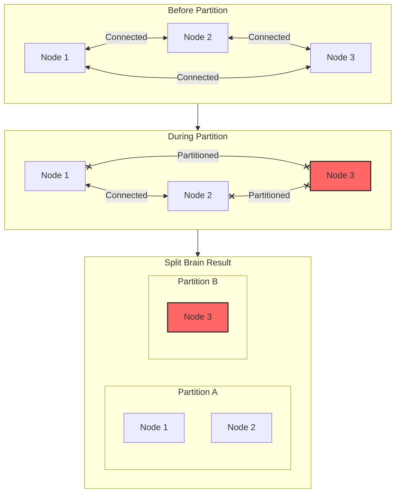
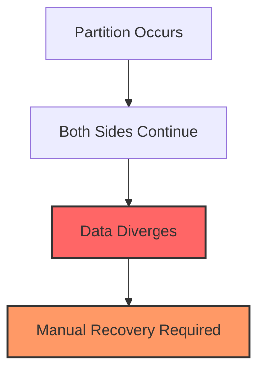
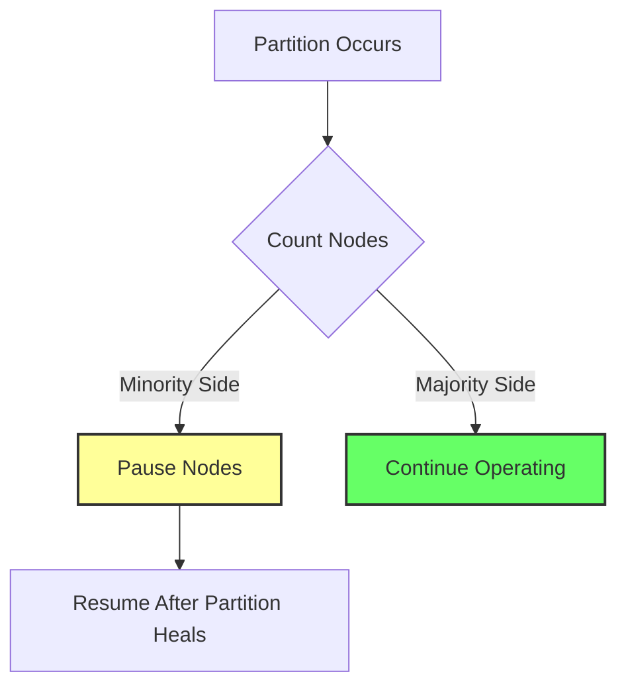
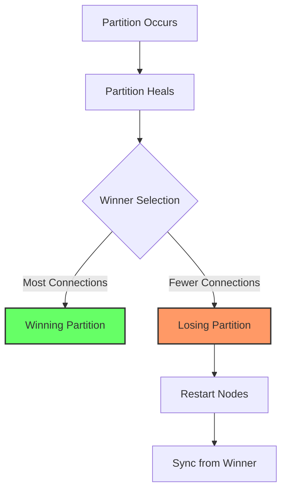
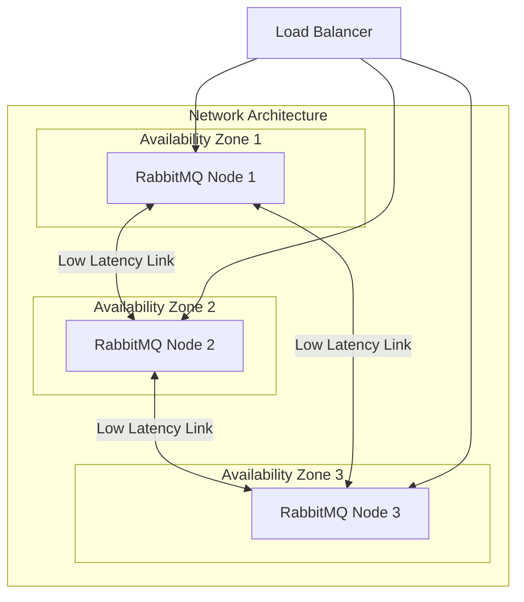

# How to Fix 'Network Partition' in RabbitMQ Cluster

Author: [nawazdhandala](https://www.github.com/nawazdhandala)

Tags: RabbitMQ, Clustering, Network Partition, High Availability, DevOps, Distributed Systems, Split Brain

Description: Learn how to detect, recover from, and prevent network partition issues in RabbitMQ clusters to maintain message queue reliability.

---

> Network partitions in RabbitMQ clusters can lead to split-brain scenarios where nodes diverge and data integrity is compromised. This guide covers detection, recovery, and prevention strategies.

A network partition occurs when cluster nodes lose connectivity with each other but continue to operate independently. RabbitMQ provides several strategies to handle this situation, but understanding them is critical to maintaining a healthy cluster.

---

## Understanding Network Partitions

### What Happens During a Partition



### Detecting Network Partitions

Check cluster status using rabbitmqctl:

```bash
# Check cluster status - look for 'partitions' field
rabbitmqctl cluster_status

# Example output with partition:
# Cluster status of node rabbit@node1 ...
# Basics
# Cluster name: rabbit@node1
#
# Network Partitions
# Node rabbit@node3 cannot communicate with node rabbit@node1
# Node rabbit@node3 cannot communicate with node rabbit@node2
```

Using the Management API:

```bash
# Check for partitions via HTTP API
curl -u guest:guest http://localhost:15672/api/nodes | jq '.[].partitions'

# Check cluster health
curl -u guest:guest http://localhost:15672/api/health/checks/alarms
```

### Monitoring Script

```python
import requests
import logging

logging.basicConfig(level=logging.INFO)
logger = logging.getLogger(__name__)

def check_cluster_partitions(nodes, username='guest', password='guest'):
    """
    Check all nodes in the cluster for network partitions.
    Returns list of detected partitions.
    """
    partitions_detected = []

    for node in nodes:
        try:
            url = f'http://{node}:15672/api/nodes'
            response = requests.get(url, auth=(username, password), timeout=5)
            response.raise_for_status()

            for node_info in response.json():
                node_name = node_info.get('name')
                partitions = node_info.get('partitions', [])

                if partitions:
                    logger.error(f"Partition detected on {node_name}: {partitions}")
                    partitions_detected.append({
                        'node': node_name,
                        'partitions': partitions
                    })
                else:
                    logger.info(f"Node {node_name}: No partitions")

        except requests.RequestException as e:
            logger.error(f"Cannot reach node {node}: {e}")
            partitions_detected.append({
                'node': node,
                'error': str(e)
            })

    return partitions_detected

# Check cluster
nodes = ['rabbitmq-1.example.com', 'rabbitmq-2.example.com', 'rabbitmq-3.example.com']
partitions = check_cluster_partitions(nodes)

if partitions:
    print("ALERT: Network partitions detected!")
    for p in partitions:
        print(f"  - {p}")
else:
    print("Cluster is healthy - no partitions")
```

---

## Partition Handling Strategies

RabbitMQ provides three strategies for handling network partitions:

### 1. Ignore Mode (Default - Not Recommended for Production)

```ini
# rabbitmq.conf
cluster_partition_handling = ignore
```



**Behavior**: Nodes continue to operate independently. Data may diverge.

**When to use**: Never in production. Only for development or testing.

### 2. Pause Minority Mode (Recommended)

```ini
# rabbitmq.conf
cluster_partition_handling = pause_minority
```



**Behavior**: Nodes on the minority side pause until partition heals.

**Best for**: Clusters with 3+ nodes where you want automatic recovery.

```python
# Example: 3-node cluster behavior
# Node 1 and Node 2 can reach each other (majority - 2 nodes)
# Node 3 is isolated (minority - 1 node)
# Result: Node 3 pauses, Nodes 1 and 2 continue
```

### 3. Autoheal Mode

```ini
# rabbitmq.conf
cluster_partition_handling = autoheal
```



**Behavior**: After partition heals, winning partition is chosen and losing nodes restart.

**Best for**: Two-node clusters or when automatic recovery is critical.

---

## Recovery Procedures

### Automatic Recovery (Pause Minority)

When using pause_minority, recovery is automatic:

```bash
# Check which nodes are paused
rabbitmqctl cluster_status

# Paused nodes will show state as 'paused'
# Once network heals, they automatically resume
```

### Manual Recovery

When automatic recovery is not possible:

```bash
# Step 1: Identify the partition state on all nodes
ssh rabbitmq-1 'rabbitmqctl cluster_status'
ssh rabbitmq-2 'rabbitmqctl cluster_status'
ssh rabbitmq-3 'rabbitmqctl cluster_status'

# Step 2: Choose the node with the most recent/complete data
# This is typically the node with the most messages or connections

# Step 3: Stop RabbitMQ on the nodes to rejoin
ssh rabbitmq-3 'rabbitmqctl stop_app'

# Step 4: Reset the node (WARNING: This clears local data)
ssh rabbitmq-3 'rabbitmqctl reset'

# Step 5: Rejoin the cluster
ssh rabbitmq-3 'rabbitmqctl join_cluster rabbit@rabbitmq-1'

# Step 6: Start the application
ssh rabbitmq-3 'rabbitmqctl start_app'

# Step 7: Verify cluster status
ssh rabbitmq-1 'rabbitmqctl cluster_status'
```

### Recovery Script

```bash
#!/bin/bash
# recover_partition.sh - Recover a node from network partition

set -e

MAIN_NODE="rabbitmq-1"
RECOVERY_NODE="$1"

if [ -z "$RECOVERY_NODE" ]; then
    echo "Usage: $0 <node-to-recover>"
    exit 1
fi

echo "Recovering $RECOVERY_NODE to cluster via $MAIN_NODE"

# Check current status
echo "Current cluster status on $MAIN_NODE:"
ssh "$MAIN_NODE" 'rabbitmqctl cluster_status'

# Stop the app on recovery node
echo "Stopping app on $RECOVERY_NODE..."
ssh "$RECOVERY_NODE" 'rabbitmqctl stop_app'

# Force reset (use with caution - loses local state)
echo "Resetting $RECOVERY_NODE..."
ssh "$RECOVERY_NODE" 'rabbitmqctl force_reset'

# Rejoin cluster
echo "Rejoining cluster..."
ssh "$RECOVERY_NODE" "rabbitmqctl join_cluster rabbit@$MAIN_NODE"

# Start the app
echo "Starting app on $RECOVERY_NODE..."
ssh "$RECOVERY_NODE" 'rabbitmqctl start_app'

# Verify recovery
echo "Verifying cluster status..."
ssh "$MAIN_NODE" 'rabbitmqctl cluster_status'

echo "Recovery complete!"
```

---

## Preventing Network Partitions

### Network Configuration Best Practices



### 1. Network Configuration

```ini
# rabbitmq.conf

# Increase net_ticktime for unreliable networks
# Default is 60 seconds, increase for high-latency links
net_ticktime = 120

# Configure heartbeat interval for connections
heartbeat = 60
```

```bash
# /etc/sysctl.conf - Kernel network settings
# Increase TCP keepalive settings

net.ipv4.tcp_keepalive_time = 60
net.ipv4.tcp_keepalive_intvl = 10
net.ipv4.tcp_keepalive_probes = 6

# Apply settings
sysctl -p
```

### 2. Erlang Distribution Settings

```ini
# rabbitmq.conf

# Erlang distribution buffer size
distribution_buffer_size = 128000

# Configure clustering settings
cluster_formation.peer_discovery_backend = rabbit_peer_discovery_classic_config
cluster_formation.classic_config.nodes.1 = rabbit@rabbitmq-1
cluster_formation.classic_config.nodes.2 = rabbit@rabbitmq-2
cluster_formation.classic_config.nodes.3 = rabbit@rabbitmq-3
```

### 3. Use Quorum Queues

Quorum queues handle partitions more gracefully than classic mirrored queues:

```python
import pika

connection = pika.BlockingConnection(pika.ConnectionParameters('localhost'))
channel = connection.channel()

# Declare quorum queue - more resilient to partitions
channel.queue_declare(
    queue='orders',
    durable=True,
    arguments={
        'x-queue-type': 'quorum',
        'x-quorum-initial-group-size': 3,  # Number of replicas
    }
)
```

---

## Monitoring and Alerting

### Prometheus Alerts

```yaml
# prometheus/alerts/rabbitmq.yml
groups:
  - name: rabbitmq_cluster
    rules:
      - alert: RabbitMQNetworkPartition
        expr: rabbitmq_partitions > 0
        for: 1m
        labels:
          severity: critical
        annotations:
          summary: "RabbitMQ network partition detected"
          description: "Node {{ $labels.node }} has detected a network partition"

      - alert: RabbitMQNodeDown
        expr: up{job="rabbitmq"} == 0
        for: 1m
        labels:
          severity: critical
        annotations:
          summary: "RabbitMQ node is down"
          description: "Node {{ $labels.instance }} is not responding"

      - alert: RabbitMQClusterSizeMismatch
        expr: count(rabbitmq_identity_info) != 3
        for: 5m
        labels:
          severity: warning
        annotations:
          summary: "RabbitMQ cluster size is unexpected"
          description: "Expected 3 nodes, found {{ $value }}"
```

### Health Check Script

```python
#!/usr/bin/env python3
"""
RabbitMQ cluster health checker with partition detection.
"""

import requests
import sys
import json

class ClusterHealthChecker:
    def __init__(self, nodes, username='guest', password='guest'):
        self.nodes = nodes
        self.auth = (username, password)

    def check_node(self, node):
        """Check health of a single node."""
        try:
            # Get node info
            url = f'http://{node}:15672/api/nodes'
            response = requests.get(url, auth=self.auth, timeout=5)
            response.raise_for_status()

            nodes_info = response.json()

            for info in nodes_info:
                if info.get('partitions'):
                    return {
                        'node': node,
                        'status': 'partition',
                        'partitions': info['partitions'],
                        'running': info.get('running', False)
                    }

            return {
                'node': node,
                'status': 'healthy',
                'running': True
            }

        except requests.Timeout:
            return {'node': node, 'status': 'timeout'}
        except requests.ConnectionError:
            return {'node': node, 'status': 'unreachable'}
        except Exception as e:
            return {'node': node, 'status': 'error', 'error': str(e)}

    def check_cluster(self):
        """Check health of entire cluster."""
        results = []
        healthy_count = 0
        partition_count = 0

        for node in self.nodes:
            result = self.check_node(node)
            results.append(result)

            if result['status'] == 'healthy':
                healthy_count += 1
            elif result['status'] == 'partition':
                partition_count += 1

        return {
            'total_nodes': len(self.nodes),
            'healthy_nodes': healthy_count,
            'partition_nodes': partition_count,
            'cluster_healthy': partition_count == 0 and healthy_count == len(self.nodes),
            'details': results
        }

def main():
    nodes = [
        'rabbitmq-1.example.com',
        'rabbitmq-2.example.com',
        'rabbitmq-3.example.com'
    ]

    checker = ClusterHealthChecker(nodes)
    health = checker.check_cluster()

    print(json.dumps(health, indent=2))

    # Exit with appropriate code for monitoring
    if health['cluster_healthy']:
        sys.exit(0)
    else:
        sys.exit(1)

if __name__ == '__main__':
    main()
```

---

## Cluster Architecture Recommendations

### Recommended: 3+ Nodes Across Availability Zones

```mermaid
flowchart TD
    subgraph Client["Client Applications"]
        C1[App Server 1]
        C2[App Server 2]
    end

    subgraph LB["Load Balancer Layer"]
        HAP[HAProxy / AWS ELB]
    end

    subgraph Cluster["RabbitMQ Cluster"]
        subgraph AZ1["AZ-1"]
            R1[rabbit@node1]
        end
        subgraph AZ2["AZ-2"]
            R2[rabbit@node2]
        end
        subgraph AZ3["AZ-3"]
            R3[rabbit@node3]
        end
    end

    C1 --> HAP
    C2 --> HAP
    HAP --> R1
    HAP --> R2
    HAP --> R3

    R1 <--> R2
    R2 <--> R3
    R1 <--> R3
```

### HAProxy Configuration

```ini
# /etc/haproxy/haproxy.cfg

frontend rabbitmq_front
    bind *:5672
    mode tcp
    default_backend rabbitmq_back

backend rabbitmq_back
    mode tcp
    balance roundrobin
    option tcp-check

    # Health check on AMQP port
    server rabbitmq1 rabbitmq-1:5672 check inter 5s fall 3 rise 2
    server rabbitmq2 rabbitmq-2:5672 check inter 5s fall 3 rise 2
    server rabbitmq3 rabbitmq-3:5672 check inter 5s fall 3 rise 2

frontend rabbitmq_management
    bind *:15672
    mode http
    default_backend rabbitmq_management_back

backend rabbitmq_management_back
    mode http
    balance roundrobin
    option httpchk GET /api/health/checks/alarms
    http-check expect status 200

    server rabbitmq1 rabbitmq-1:15672 check inter 10s
    server rabbitmq2 rabbitmq-2:15672 check inter 10s
    server rabbitmq3 rabbitmq-3:15672 check inter 10s
```

---

## Quick Reference

### Common Commands

```bash
# Check cluster status
rabbitmqctl cluster_status

# Check for partitions
rabbitmqctl cluster_status | grep -A5 "Network Partitions"

# Force sync a queue
rabbitmqctl sync_queue <queue_name>

# List nodes in cluster
rabbitmqctl cluster_status | grep -A10 "Running Nodes"

# Check if node is paused (pause_minority)
rabbitmqctl eval 'rabbit_node_monitor:partitions().'
```

### Emergency Recovery Checklist

1. **Identify the partition** - Check cluster_status on all nodes
2. **Determine data state** - Which side has the most recent data
3. **Stop minority nodes** - rabbitmqctl stop_app
4. **Reset if necessary** - rabbitmqctl force_reset (loses local data)
5. **Rejoin cluster** - rabbitmqctl join_cluster rabbit@<main-node>
6. **Start application** - rabbitmqctl start_app
7. **Verify cluster** - rabbitmqctl cluster_status
8. **Monitor queues** - Ensure messages are syncing

---

## Conclusion

Network partitions are a reality in distributed systems. Proper handling requires:

- **Use pause_minority** for 3+ node clusters
- **Monitor continuously** for early detection
- **Have recovery procedures** documented and tested
- **Use quorum queues** for better partition tolerance
- **Design network properly** with low latency between nodes

---

*Need real-time monitoring for your RabbitMQ cluster? [OneUptime](https://oneuptime.com) provides comprehensive cluster monitoring with instant alerts on network partitions and node failures.*
