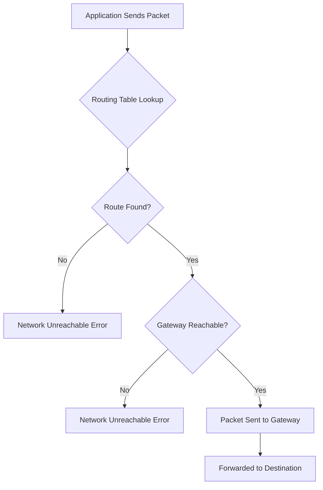
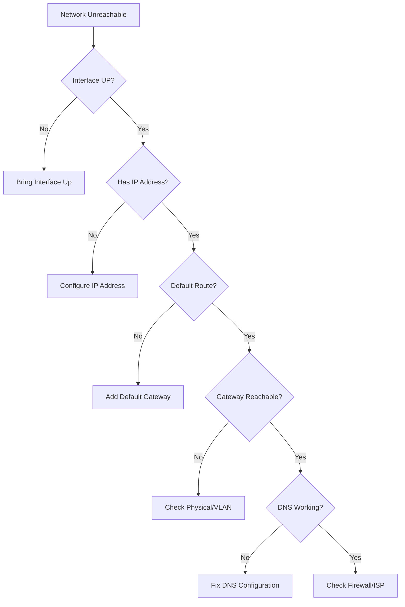
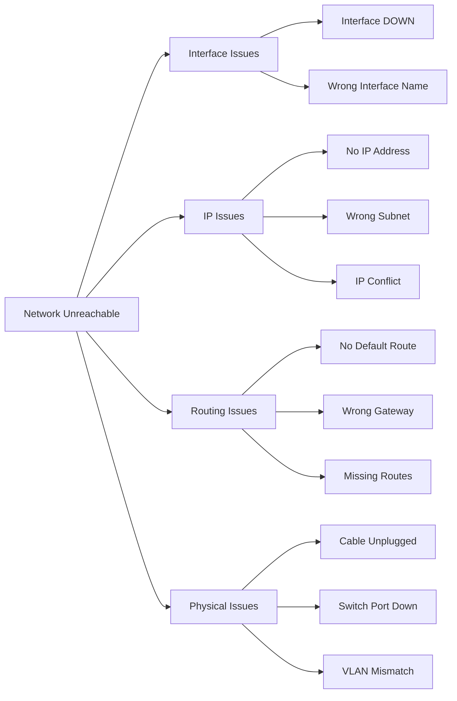

# How to Fix 'Network Unreachable' Routing Errors

Author: [nawazdhandala](https://www.github.com/nawazdhandala)

Tags: Linux, Networking, Troubleshooting, Routing, System Administration, Network Configuration

Description: Learn how to diagnose and fix 'Network is unreachable' errors in Linux, including routing table issues, gateway configuration, interface problems, and DNS resolution.

---

The "Network is unreachable" error indicates that your system cannot find a route to the destination network. This guide walks you through systematic diagnosis and resolution of routing problems.

## Understanding the Error



### Common Error Messages

```bash
# Ping failure
ping 8.8.8.8
# connect: Network is unreachable

# Wget/curl failure
wget https://example.com
# Connecting to example.com failed: Network is unreachable

# SSH failure
ssh user@remote
# ssh: connect to host remote port 22: Network is unreachable
```

## Quick Diagnosis Steps

### Step 1: Check Network Interface Status

```bash
# List all interfaces and their status
ip link show

# Or using older command
ifconfig -a

# Check if interface is UP
ip link show eth0
# Look for: state UP

# Check if interface has IP address
ip addr show eth0
```

### Step 2: Check IP Configuration

```bash
# View all IP addresses
ip addr show

# Expected output for working interface:
# eth0: <BROADCAST,MULTICAST,UP,LOWER_UP>
#     inet 192.168.1.100/24 brd 192.168.1.255 scope global eth0

# Check for missing IP
# If no "inet" line, interface has no IP address
```

### Step 3: Check Routing Table

```bash
# View routing table
ip route show

# Or using older command
route -n

# Expected output showing default route:
# default via 192.168.1.1 dev eth0
# 192.168.1.0/24 dev eth0 proto kernel scope link src 192.168.1.100
```

### Step 4: Check Default Gateway

```bash
# Show default gateway
ip route show default

# If empty, no default gateway is configured
# This is the most common cause of "Network unreachable"
```

### Step 5: Test Connectivity

```bash
# Test gateway reachability
ping -c 3 192.168.1.1

# Test local network
ping -c 3 192.168.1.100  # Your own IP

# Test external (if gateway works)
ping -c 3 8.8.8.8
```

## Diagnostic Flowchart



## Fixing Interface Issues

### Interface is DOWN

```bash
# Check interface state
ip link show eth0
# Look for: state DOWN

# Bring interface up
sudo ip link set eth0 up

# Verify
ip link show eth0
# Should show: state UP
```

### Interface Has No IP Address

```bash
# Check current IP
ip addr show eth0
# No "inet" line means no IP

# Option 1: Use DHCP
sudo dhclient eth0

# Option 2: Set static IP
sudo ip addr add 192.168.1.100/24 dev eth0

# Verify
ip addr show eth0
```

### Interface Not Listed

```bash
# Check if driver is loaded
lspci | grep -i ethernet
dmesg | grep -i eth

# Load driver if needed
sudo modprobe e1000e  # Example for Intel NIC

# Check for interface naming
ls /sys/class/net/
# Modern systems may use ens33, enp0s3, etc.
```

## Fixing Routing Issues

### No Default Gateway

This is the most common cause of "Network is unreachable" for external addresses.

```bash
# Check current routes
ip route show

# Add default gateway
sudo ip route add default via 192.168.1.1

# Or specify interface
sudo ip route add default via 192.168.1.1 dev eth0

# Verify
ip route show default
ping -c 3 8.8.8.8
```

### Wrong Default Gateway

```bash
# Delete wrong gateway
sudo ip route del default

# Add correct gateway
sudo ip route add default via 192.168.1.1 dev eth0
```

### Multiple Default Gateways

Multiple default routes can cause confusion. Clean up:

```bash
# View all default routes
ip route show | grep default

# Remove unwanted routes
sudo ip route del default via 192.168.1.2

# Keep only the correct one
ip route show default
# Should show single: default via 192.168.1.1 dev eth0
```

### Missing Network Route

For specific network unreachable:

```bash
# Add route to specific network
sudo ip route add 10.0.0.0/8 via 192.168.1.254

# Add route for host
sudo ip route add 10.10.10.10/32 via 192.168.1.254

# Verify
ip route show | grep 10.0.0.0
```

## Making Changes Permanent

### Debian/Ubuntu (Netplan)

```yaml
# /etc/netplan/01-netcfg.yaml
network:
  version: 2
  renderer: networkd
  ethernets:
    eth0:
      addresses:
        - 192.168.1.100/24
      routes:
        - to: default
          via: 192.168.1.1
      nameservers:
        addresses:
          - 8.8.8.8
          - 8.8.4.4
```

```bash
# Apply configuration
sudo netplan apply
```

### Debian/Ubuntu (Traditional)

```bash
# /etc/network/interfaces
auto eth0
iface eth0 inet static
    address 192.168.1.100
    netmask 255.255.255.0
    gateway 192.168.1.1
    dns-nameservers 8.8.8.8 8.8.4.4
```

```bash
# Apply changes
sudo systemctl restart networking
# Or
sudo ifdown eth0 && sudo ifup eth0
```

### RHEL/CentOS/Fedora (NetworkManager)

```bash
# Using nmcli
sudo nmcli con mod "Wired connection 1" ipv4.addresses 192.168.1.100/24
sudo nmcli con mod "Wired connection 1" ipv4.gateway 192.168.1.1
sudo nmcli con mod "Wired connection 1" ipv4.dns "8.8.8.8 8.8.4.4"
sudo nmcli con mod "Wired connection 1" ipv4.method manual
sudo nmcli con up "Wired connection 1"
```

### RHEL/CentOS (Traditional)

```bash
# /etc/sysconfig/network-scripts/ifcfg-eth0
TYPE=Ethernet
BOOTPROTO=none
IPADDR=192.168.1.100
NETMASK=255.255.255.0
GATEWAY=192.168.1.1
DNS1=8.8.8.8
DNS2=8.8.4.4
ONBOOT=yes
DEVICE=eth0
```

```bash
# Apply changes
sudo systemctl restart NetworkManager
# Or
sudo nmcli con reload
```

### Adding Persistent Static Routes

```bash
# Debian/Ubuntu with Netplan
# /etc/netplan/01-netcfg.yaml
network:
  ethernets:
    eth0:
      routes:
        - to: 10.0.0.0/8
          via: 192.168.1.254
        - to: 172.16.0.0/12
          via: 192.168.1.253

# RHEL/CentOS
# /etc/sysconfig/network-scripts/route-eth0
10.0.0.0/8 via 192.168.1.254
172.16.0.0/12 via 192.168.1.253
```

## Troubleshooting Specific Scenarios

### Scenario 1: DHCP Not Working

```bash
# Release current lease
sudo dhclient -r eth0

# Request new lease with verbose output
sudo dhclient -v eth0

# Check DHCP client logs
journalctl -u dhclient
# Or
cat /var/log/syslog | grep dhc

# If DHCP server unreachable, use static IP temporarily
sudo ip addr add 192.168.1.100/24 dev eth0
sudo ip route add default via 192.168.1.1
```

### Scenario 2: Gateway Not Responding

```bash
# Ping gateway
ping -c 3 192.168.1.1

# If no response, check ARP
arp -n | grep 192.168.1.1

# Try ARP request
arping -c 3 192.168.1.1

# Check cable/switch port
ethtool eth0
# Look for: Link detected: yes

# Check for IP conflict
arping -D 192.168.1.100
```

### Scenario 3: Can Ping IP But Not Hostname

This is DNS, not routing:

```bash
# Test DNS resolution
nslookup google.com

# Check DNS configuration
cat /etc/resolv.conf

# Fix DNS
echo "nameserver 8.8.8.8" | sudo tee /etc/resolv.conf

# For systems using systemd-resolved
sudo systemctl restart systemd-resolved
```

### Scenario 4: VPN/Tunnel Issues

```bash
# Check if VPN added routes
ip route show | grep -E "tun|tap|vpn"

# VPN may have added wrong routes or no route
# Restart VPN connection
sudo systemctl restart openvpn@client

# Or manually add route
sudo ip route add 10.8.0.0/24 via 10.8.0.1 dev tun0
```

### Scenario 5: Docker/Container Network Issues

```bash
# Check Docker networks
docker network ls

# Inspect bridge network
docker network inspect bridge

# Check if Docker modified routes
ip route show | grep docker

# Restart Docker if routes are corrupt
sudo systemctl restart docker

# Reset Docker networking
docker network prune
```

## Network Diagnostic Commands

### Complete Network Status

```bash
#!/bin/bash
# network-diagnosis.sh

echo "=== Interface Status ==="
ip link show

echo -e "\n=== IP Addresses ==="
ip addr show

echo -e "\n=== Routing Table ==="
ip route show

echo -e "\n=== Default Gateway ==="
ip route show default

echo -e "\n=== DNS Configuration ==="
cat /etc/resolv.conf

echo -e "\n=== ARP Cache ==="
arp -n

echo -e "\n=== Connectivity Tests ==="
echo "Gateway: $(ip route show default | awk '{print $3}')"
ping -c 1 -W 2 $(ip route show default | awk '{print $3}') && echo "Gateway: OK" || echo "Gateway: FAIL"
ping -c 1 -W 2 8.8.8.8 && echo "Internet: OK" || echo "Internet: FAIL"
ping -c 1 -W 2 google.com && echo "DNS: OK" || echo "DNS: FAIL"
```

### Using traceroute for Diagnosis

```bash
# Install if needed
sudo apt install traceroute  # Debian/Ubuntu
sudo dnf install traceroute  # Fedora/RHEL

# Trace route to destination
traceroute 8.8.8.8

# If first hop fails, gateway issue
# If later hops fail, upstream issue

# Use mtr for continuous monitoring
mtr 8.8.8.8
```

### Checking Network Namespace (Containers)

```bash
# List network namespaces
ip netns list

# Execute in namespace
sudo ip netns exec <namespace> ip route show

# Check container routing
docker exec <container> ip route show
```

## Common Causes Summary



## Quick Reference

| Problem | Diagnosis | Solution |
|---------|-----------|----------|
| Interface DOWN | `ip link show` | `sudo ip link set eth0 up` |
| No IP | `ip addr show` | `sudo dhclient eth0` |
| No gateway | `ip route show default` | `sudo ip route add default via GATEWAY` |
| Wrong gateway | `ping GATEWAY` | Delete and add correct route |
| DNS issue | `ping 8.8.8.8` works | Fix `/etc/resolv.conf` |
| Physical | `ethtool eth0` | Check cable/switch |

### Essential Commands

```bash
# View network status
ip link show              # Interface status
ip addr show              # IP addresses
ip route show             # Routing table

# Configure network
ip link set eth0 up       # Enable interface
ip addr add IP/MASK dev eth0  # Add IP
ip route add default via GW   # Add gateway

# Test connectivity
ping -c 3 GATEWAY         # Test gateway
ping -c 3 8.8.8.8         # Test internet
ping -c 3 google.com      # Test DNS

# Troubleshoot
traceroute 8.8.8.8        # Trace path
arp -n                    # Check ARP cache
ethtool eth0              # Check physical link
```

---

The "Network is unreachable" error almost always comes down to one of three things: the interface is down, there is no IP address, or there is no route to the destination. Start with `ip link`, `ip addr`, and `ip route` to quickly identify which component is missing, then apply the appropriate fix.
