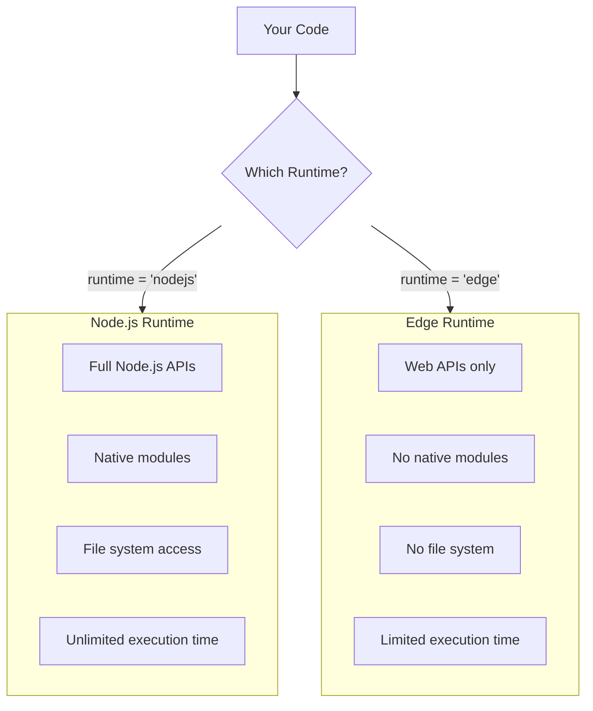
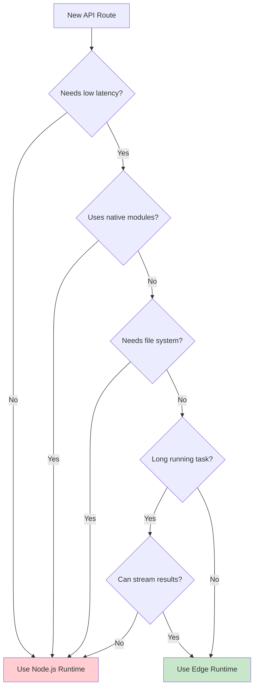

# How to Fix "Edge Runtime" Limitations in Next.js

Author: [nawazdhandala](https://www.github.com/nawazdhandala)

Tags: Next.js, Edge Runtime, Serverless, Performance, Middleware, Vercel, Node.js, API Routes

Description: Learn how to identify and work around Edge Runtime limitations in Next.js, including unsupported Node.js APIs, module compatibility issues, and alternative patterns.

---

> The Edge Runtime in Next.js enables lightning-fast response times by running code closer to users, but it comes with significant limitations. This guide helps you identify Edge Runtime errors and implement effective workarounds.

The Edge Runtime is a lightweight JavaScript runtime designed for low-latency responses. Unlike the Node.js runtime, it does not support all Node.js APIs, which can lead to runtime errors and build failures.

---

## Understanding Edge Runtime Limitations

The Edge Runtime is fundamentally different from Node.js.



### Key Differences

| Feature | Node.js Runtime | Edge Runtime |
|---------|-----------------|--------------|
| Cold start | ~250ms | ~1ms |
| Max duration | 5-300 seconds | 30 seconds |
| Node.js APIs | Full support | Limited |
| File system | Yes | No |
| Native modules | Yes | No |
| Global location | Single region | Edge network |

---

## Common Error: "Dynamic Code Evaluation Not Allowed"

The Edge Runtime does not allow `eval()` or `new Function()`.

### The Problem

```typescript
// app/api/config/route.ts
// ERROR: Dynamic code evaluation is not allowed in Edge Runtime

export const runtime = "edge";

export async function GET() {
  // This will fail - eval is not allowed
  const config = eval('({ setting: "value" })');

  // This will also fail
  const dynamicFunc = new Function("return 42");

  return Response.json(config);
}
```

### The Solution

Avoid dynamic code evaluation or switch to Node.js runtime.

```typescript
// app/api/config/route.ts
// Solution 1: Use JSON.parse instead of eval

export const runtime = "edge";

export async function GET() {
  // Use JSON.parse for parsing JSON strings
  const configString = '{"setting": "value"}';
  const config = JSON.parse(configString);

  // Use regular functions instead of dynamic creation
  const getValue = () => 42;

  return Response.json({
    config,
    value: getValue(),
  });
}

// Alternative: Use Node.js runtime if eval is required
// app/api/dynamic/route.ts
export const runtime = "nodejs"; // Switch to Node.js

export async function GET() {
  // Now eval works (though still not recommended)
  const result = eval("1 + 1");
  return Response.json({ result });
}
```

---

## Common Error: "Module Not Found" or "Cannot Resolve Module"

Many npm packages use Node.js-specific APIs unavailable in Edge Runtime.

### The Problem

```typescript
// app/api/process/route.ts
// ERROR: Module uses unsupported Node.js APIs

export const runtime = "edge";

import crypto from "crypto"; // Uses Node.js crypto
import fs from "fs"; // File system not available
import { PrismaClient } from "@prisma/client"; // Uses native modules

export async function POST(request: Request) {
  const hash = crypto.createHash("sha256"); // Error!
  const file = fs.readFileSync("config.json"); // Error!
  const prisma = new PrismaClient(); // Error!
}
```

### The Solution

Use Edge-compatible alternatives or switch runtimes.

```typescript
// app/api/process/route.ts
// Solution: Use Web Crypto API and edge-compatible packages

export const runtime = "edge";

export async function POST(request: Request) {
  const body = await request.json();

  // Use Web Crypto API instead of Node.js crypto
  const encoder = new TextEncoder();
  const data = encoder.encode(body.text);
  const hashBuffer = await crypto.subtle.digest("SHA-256", data);
  const hashArray = Array.from(new Uint8Array(hashBuffer));
  const hashHex = hashArray.map((b) => b.toString(16).padStart(2, "0")).join("");

  return Response.json({ hash: hashHex });
}

// For database access, use edge-compatible client
// app/api/users/route.ts
import { PrismaClient } from "@prisma/client/edge"; // Edge-compatible
import { withAccelerate } from "@prisma/extension-accelerate";

export const runtime = "edge";

const prisma = new PrismaClient().$extends(withAccelerate());

export async function GET() {
  const users = await prisma.user.findMany({
    cacheStrategy: { ttl: 60 },
  });
  return Response.json(users);
}
```

### Edge-Compatible Package Alternatives

```typescript
// Common Node.js packages and their Edge alternatives

// Node.js: crypto
// Edge: Web Crypto API
const hash = await crypto.subtle.digest("SHA-256", data);

// Node.js: Buffer
// Edge: Uint8Array and TextEncoder/TextDecoder
const encoder = new TextEncoder();
const decoder = new TextDecoder();
const bytes = encoder.encode("hello");
const text = decoder.decode(bytes);

// Node.js: axios/node-fetch
// Edge: Native fetch (already available)
const response = await fetch("https://api.example.com/data");

// Node.js: uuid
// Edge: crypto.randomUUID()
const id = crypto.randomUUID();

// Node.js: bcrypt
// Edge: bcryptjs (pure JS implementation)
import bcrypt from "bcryptjs";

// Node.js: jsonwebtoken
// Edge: jose
import { SignJWT, jwtVerify } from "jose";
```

---

## Common Error: "Cannot Access File System"

The Edge Runtime has no file system access.

### The Problem

```typescript
// app/api/templates/route.ts
// ERROR: File system APIs not available in Edge Runtime

export const runtime = "edge";

import fs from "fs";
import path from "path";

export async function GET() {
  // These will all fail
  const template = fs.readFileSync("templates/email.html", "utf-8");
  const files = fs.readdirSync("uploads");
  const exists = fs.existsSync("config.json");

  return Response.json({ template });
}
```

### The Solution

Use fetch for remote resources or embed content at build time.

```typescript
// app/api/templates/route.ts
// Solution 1: Fetch from remote storage

export const runtime = "edge";

export async function GET(request: Request) {
  const { searchParams } = new URL(request.url);
  const templateName = searchParams.get("name") || "default";

  // Fetch template from cloud storage
  const templateUrl = `${process.env.STORAGE_URL}/templates/${templateName}.html`;
  const response = await fetch(templateUrl);

  if (!response.ok) {
    return Response.json({ error: "Template not found" }, { status: 404 });
  }

  const template = await response.text();
  return new Response(template, {
    headers: { "Content-Type": "text/html" },
  });
}

// Solution 2: Embed at build time
// lib/templates.ts
// Import as string at build time

export const emailTemplates = {
  welcome: `
    <html>
      <body>
        <h1>Welcome, {{name}}!</h1>
        <p>Thanks for joining us.</p>
      </body>
    </html>
  `,
  reset: `
    <html>
      <body>
        <h1>Reset Password</h1>
        <a href="{{resetUrl}}">Click here to reset</a>
      </body>
    </html>
  `,
};

// app/api/email/route.ts
export const runtime = "edge";

import { emailTemplates } from "@/lib/templates";

export async function POST(request: Request) {
  const { template, variables } = await request.json();

  let html = emailTemplates[template as keyof typeof emailTemplates];
  if (!html) {
    return Response.json({ error: "Template not found" }, { status: 404 });
  }

  // Replace variables
  Object.entries(variables).forEach(([key, value]) => {
    html = html.replace(new RegExp(`{{${key}}}`, "g"), value as string);
  });

  return Response.json({ html });
}
```

---

## Common Error: "Native Module Not Supported"

Native Node.js modules cannot run in Edge Runtime.

### The Problem

```typescript
// app/api/image/route.ts
// ERROR: Native modules not supported

export const runtime = "edge";

import sharp from "sharp"; // Native C++ module
import bcrypt from "bcrypt"; // Native module

export async function POST(request: Request) {
  const formData = await request.formData();
  const image = formData.get("image") as File;

  // Sharp uses native bindings - will fail
  const optimized = await sharp(await image.arrayBuffer())
    .resize(800)
    .jpeg({ quality: 80 })
    .toBuffer();
}
```

### The Solution

Use WebAssembly-based alternatives or process elsewhere.

```typescript
// app/api/image/route.ts
// Solution 1: Use external service

export const runtime = "edge";

export async function POST(request: Request) {
  const formData = await request.formData();
  const image = formData.get("image") as File;

  // Upload to image processing service
  const cloudinaryUrl = `https://api.cloudinary.com/v1_1/${process.env.CLOUDINARY_CLOUD}/image/upload`;

  const uploadForm = new FormData();
  uploadForm.append("file", image);
  uploadForm.append("upload_preset", process.env.CLOUDINARY_PRESET!);
  uploadForm.append(
    "transformation",
    "w_800,q_80,f_auto"
  );

  const response = await fetch(cloudinaryUrl, {
    method: "POST",
    body: uploadForm,
  });

  const result = await response.json();
  return Response.json({ url: result.secure_url });
}

// Solution 2: Use pure JavaScript implementation
// For bcrypt, use bcryptjs
import bcryptjs from "bcryptjs";

export const runtime = "edge";

export async function POST(request: Request) {
  const { password } = await request.json();

  // bcryptjs is pure JS and works in Edge
  const salt = await bcryptjs.genSalt(10);
  const hash = await bcryptjs.hash(password, salt);

  return Response.json({ hash });
}

// Solution 3: Route to Node.js runtime for heavy processing
// app/api/process-image/route.ts
export const runtime = "nodejs"; // Use Node.js for native modules

import sharp from "sharp";

export async function POST(request: Request) {
  const formData = await request.formData();
  const image = formData.get("image") as File;
  const buffer = Buffer.from(await image.arrayBuffer());

  const optimized = await sharp(buffer)
    .resize(800)
    .jpeg({ quality: 80 })
    .toBuffer();

  return new Response(optimized, {
    headers: { "Content-Type": "image/jpeg" },
  });
}
```

---

## Common Error: "Execution Timeout"

Edge Functions have a 30-second maximum execution time.

### The Problem

```typescript
// app/api/batch/route.ts
// ERROR: May timeout on Edge Runtime

export const runtime = "edge";

export async function POST(request: Request) {
  const { items } = await request.json();

  // Processing 1000 items might exceed 30 seconds
  const results = [];
  for (const item of items) {
    const result = await processItem(item); // Slow operation
    results.push(result);
  }

  return Response.json({ results });
}
```

### The Solution

Stream responses, use background jobs, or switch to Node.js runtime.

```typescript
// app/api/batch/route.ts
// Solution 1: Stream results

export const runtime = "edge";

export async function POST(request: Request) {
  const { items } = await request.json();

  // Create a readable stream for streaming response
  const stream = new ReadableStream({
    async start(controller) {
      const encoder = new TextEncoder();

      for (const item of items) {
        const result = await processItem(item);
        // Send each result as it completes
        controller.enqueue(
          encoder.encode(JSON.stringify(result) + "\n")
        );
      }

      controller.close();
    },
  });

  return new Response(stream, {
    headers: {
      "Content-Type": "application/x-ndjson",
      "Transfer-Encoding": "chunked",
    },
  });
}

// Solution 2: Use background processing
// app/api/batch/route.ts
export const runtime = "edge";

export async function POST(request: Request) {
  const { items, webhookUrl } = await request.json();

  // Generate job ID
  const jobId = crypto.randomUUID();

  // Queue for background processing (using external service)
  await fetch(process.env.QUEUE_SERVICE_URL!, {
    method: "POST",
    headers: { "Content-Type": "application/json" },
    body: JSON.stringify({
      jobId,
      items,
      webhookUrl,
    }),
  });

  // Return immediately with job ID
  return Response.json({
    jobId,
    status: "queued",
    message: "Processing started. Results will be sent to webhook.",
  });
}

// Solution 3: Use Node.js runtime for long operations
// app/api/batch-sync/route.ts
export const runtime = "nodejs";
export const maxDuration = 300; // 5 minutes on Pro plan

export async function POST(request: Request) {
  const { items } = await request.json();

  const results = await Promise.all(
    items.map((item: any) => processItem(item))
  );

  return Response.json({ results });
}
```

---

## Common Error: "Request Body Already Read"

The request body can only be read once in Edge Runtime.

### The Problem

```typescript
// middleware.ts
// ERROR: Body already consumed

import { NextResponse } from "next/server";
import type { NextRequest } from "next/server";

export async function middleware(request: NextRequest) {
  // Reading body in middleware
  const body = await request.json();
  console.log("Request body:", body);

  // The route handler will fail because body is consumed
  return NextResponse.next();
}
```

### The Solution

Clone the request or pass data through headers.

```typescript
// middleware.ts
// Solution 1: Clone the request

import { NextResponse } from "next/server";
import type { NextRequest } from "next/server";

export async function middleware(request: NextRequest) {
  // Only process POST/PUT/PATCH with body
  if (["POST", "PUT", "PATCH"].includes(request.method)) {
    // Clone the request to read body without consuming original
    const clonedRequest = request.clone();

    try {
      const body = await clonedRequest.json();

      // Process body (e.g., logging, validation)
      console.log("Request body:", body);

      // Pass validated data via headers
      const response = NextResponse.next();
      response.headers.set("x-validated", "true");
      return response;
    } catch {
      return NextResponse.json(
        { error: "Invalid JSON" },
        { status: 400 }
      );
    }
  }

  return NextResponse.next();
}

// Solution 2: Pass data through search params or headers
// Instead of reading body in middleware, validate in route handler

// middleware.ts
export function middleware(request: NextRequest) {
  // Only check headers and URL, not body
  const authHeader = request.headers.get("authorization");

  if (!authHeader && request.nextUrl.pathname.startsWith("/api/protected")) {
    return NextResponse.json(
      { error: "Unauthorized" },
      { status: 401 }
    );
  }

  return NextResponse.next();
}

// app/api/protected/route.ts
export async function POST(request: Request) {
  // Read and validate body here
  const body = await request.json();

  if (!isValidBody(body)) {
    return Response.json({ error: "Invalid body" }, { status: 400 });
  }

  // Process request
  return Response.json({ success: true });
}
```

---

## Debugging Edge Runtime Errors

Use these techniques to identify Edge Runtime compatibility issues.

### Check Module Compatibility

```typescript
// scripts/check-edge-compat.ts
// Run this to check package compatibility

import { execSync } from "child_process";

const edgeIncompatiblePatterns = [
  "fs",
  "path",
  "crypto",
  "child_process",
  "cluster",
  "dgram",
  "dns",
  "http2",
  "inspector",
  "net",
  "os",
  "readline",
  "repl",
  "tls",
  "v8",
  "vm",
  "worker_threads",
  "zlib",
];

function checkPackage(packageName: string): string[] {
  const issues: string[] = [];

  try {
    const content = execSync(
      `npm show ${packageName} dependencies --json`,
      { encoding: "utf-8" }
    );
    const deps = JSON.parse(content || "{}");

    for (const dep of Object.keys(deps)) {
      if (edgeIncompatiblePatterns.includes(dep)) {
        issues.push(`Uses Node.js built-in: ${dep}`);
      }
    }
  } catch {
    issues.push("Could not analyze package");
  }

  return issues;
}

// Usage
const packages = ["bcrypt", "sharp", "prisma", "jose"];
packages.forEach((pkg) => {
  const issues = checkPackage(pkg);
  console.log(`${pkg}: ${issues.length ? issues.join(", ") : "Edge compatible"}`);
});
```

### Runtime Detection

```typescript
// lib/runtime.ts
// Detect which runtime is being used

export function isEdgeRuntime(): boolean {
  return typeof EdgeRuntime !== "undefined";
}

export function isNodeRuntime(): boolean {
  return typeof process !== "undefined" && process.versions?.node;
}

// Usage in code that needs to adapt
export async function hashPassword(password: string): Promise<string> {
  if (isEdgeRuntime()) {
    // Use bcryptjs for Edge
    const bcryptjs = await import("bcryptjs");
    const salt = await bcryptjs.genSalt(10);
    return bcryptjs.hash(password, salt);
  } else {
    // Use native bcrypt for Node.js
    const bcrypt = await import("bcrypt");
    const salt = await bcrypt.genSalt(10);
    return bcrypt.hash(password, salt);
  }
}
```

---

## Edge Runtime Decision Flowchart

Use this to decide when to use Edge Runtime.



---

## Best Practices

### 1. Explicit Runtime Configuration

```typescript
// Always explicitly set runtime to avoid surprises

// app/api/fast/route.ts
export const runtime = "edge"; // Explicitly edge

// app/api/heavy/route.ts
export const runtime = "nodejs"; // Explicitly Node.js
export const maxDuration = 60; // Set appropriate timeout
```

### 2. Graceful Degradation

```typescript
// lib/hash.ts
// Provide fallbacks for different runtimes

export async function createHash(data: string): Promise<string> {
  // Try Web Crypto first (works everywhere)
  if (typeof crypto?.subtle?.digest === "function") {
    const encoder = new TextEncoder();
    const hashBuffer = await crypto.subtle.digest(
      "SHA-256",
      encoder.encode(data)
    );
    return Array.from(new Uint8Array(hashBuffer))
      .map((b) => b.toString(16).padStart(2, "0"))
      .join("");
  }

  // Fallback to Node.js crypto
  const nodeCrypto = await import("crypto");
  return nodeCrypto.createHash("sha256").update(data).digest("hex");
}
```

### 3. Conditional Imports

```typescript
// app/api/process/route.ts
// Import based on runtime

export const runtime = "edge";

export async function POST(request: Request) {
  const { password } = await request.json();

  // Dynamic import of edge-compatible package
  const { hash } = await import("bcryptjs");
  const hashedPassword = await hash(password, 10);

  return Response.json({ hash: hashedPassword });
}
```

---

## Summary: Edge Runtime Compatibility

Quick reference for what works and what does not.

```typescript
// WORKS in Edge Runtime
crypto.subtle.digest("SHA-256", data);    // Web Crypto
crypto.randomUUID();                        // UUID generation
fetch("https://api.example.com");          // Fetch API
new TextEncoder().encode("text");          // Text encoding
new URL("https://example.com");            // URL parsing
Response.json({ data });                   // Response creation
request.json();                            // Request parsing
setTimeout(fn, 1000);                      // Timers
console.log("message");                    // Console

// DOES NOT WORK in Edge Runtime
fs.readFileSync("file.txt");               // No file system
require("path").join();                    // No path module
Buffer.from("text");                       // No Buffer (use Uint8Array)
process.env.NODE_ENV;                      // Limited process
eval("code");                              // No eval
new Function("code");                      // No dynamic functions
sharp(image);                              // No native modules
bcrypt.hash();                             // No native modules
```

---

## Conclusion

The Edge Runtime provides significant performance benefits but requires careful consideration of its limitations. By understanding what is and is not supported, you can make informed decisions about when to use Edge Runtime and how to work around its constraints.

Key takeaways:

- Edge Runtime uses Web APIs, not Node.js APIs
- Native modules and file system access are not supported
- Use edge-compatible alternatives like bcryptjs and jose
- Stream long-running operations or use Node.js runtime
- Always explicitly set the runtime configuration
- Test edge functions thoroughly before deploying

When used appropriately, Edge Runtime can dramatically improve your application's response times and user experience.

---

*Monitor your Edge Functions with [OneUptime](https://oneuptime.com). Track performance, latency, and errors across your global deployments to ensure optimal user experience.*
