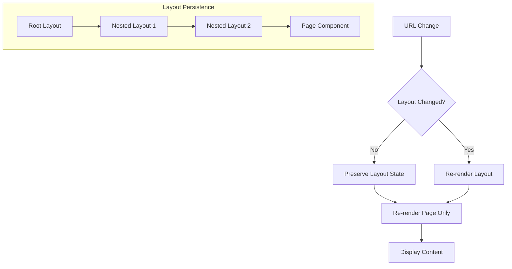
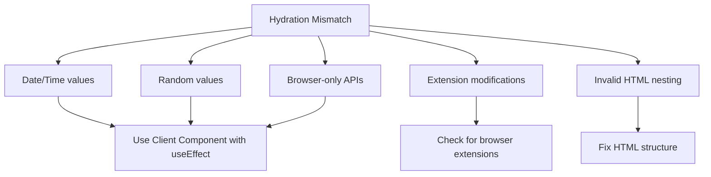
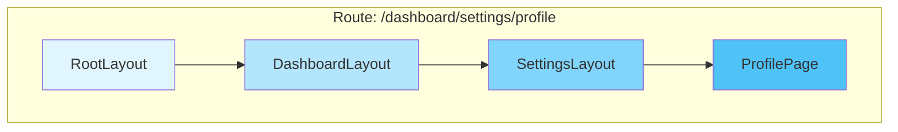
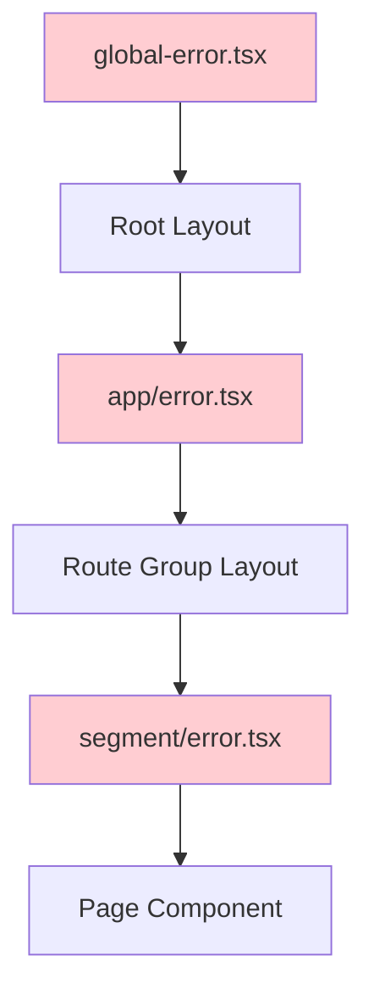

# How to Fix 'Layout' Rendering Issues in Next.js

Author: [nawazdhandala](https://www.github.com/nawazdhandala)

Tags: Next.js, Layout, React Server Components, Rendering, App Router, Nested Layouts, Error Handling

Description: Learn how to diagnose and fix common layout rendering issues in Next.js App Router, including nested layout problems, hydration errors, and state persistence.

---

> Layouts in Next.js App Router provide a powerful way to share UI between pages, but they can also be a source of frustrating bugs. This guide covers the most common layout rendering issues and provides practical solutions for each scenario.

Next.js layouts are Server Components by default that wrap page content and persist across navigation. Understanding how they work is essential for building robust applications.

---

## Understanding Layout Behavior

Layouts in Next.js have specific characteristics that affect rendering.



---

## Issue 1: Layout Not Re-rendering on Navigation

Layouts are designed to persist across navigation, but sometimes you need them to re-render.

### The Problem

```typescript
// app/dashboard/layout.tsx
// This layout does NOT re-render when navigating between dashboard pages

export default async function DashboardLayout({
  children,
}: {
  children: React.ReactNode;
}) {
  // This fetch only runs once, not on every navigation
  const user = await getCurrentUser();

  return (
    <div className="dashboard">
      <Sidebar user={user} />
      <main>{children}</main>
    </div>
  );
}
```

### The Solution

Use React cache or restructure data fetching to handle dynamic content.

```typescript
// app/dashboard/layout.tsx
// Solution 1: Move dynamic data to a Client Component

import { Sidebar } from "@/components/Sidebar";

export default function DashboardLayout({
  children,
}: {
  children: React.ReactNode;
}) {
  return (
    <div className="dashboard">
      {/* Sidebar handles its own data fetching */}
      <Sidebar />
      <main>{children}</main>
    </div>
  );
}

// components/Sidebar.tsx
"use client";

import { useEffect, useState } from "react";
import { usePathname } from "next/navigation";

export function Sidebar() {
  const [user, setUser] = useState(null);
  const pathname = usePathname();

  // Re-fetch user data when pathname changes
  useEffect(() => {
    async function loadUser() {
      const response = await fetch("/api/user");
      const data = await response.json();
      setUser(data);
    }
    loadUser();
  }, [pathname]);

  return (
    <aside className="sidebar">
      <UserInfo user={user} />
      <Navigation currentPath={pathname} />
    </aside>
  );
}
```

### Alternative: Using Server Actions

```typescript
// app/dashboard/layout.tsx
// Solution 2: Use a parallel route for dynamic content

export default function DashboardLayout({
  children,
  sidebar,
}: {
  children: React.ReactNode;
  sidebar: React.ReactNode;
}) {
  return (
    <div className="dashboard">
      {sidebar}
      <main>{children}</main>
    </div>
  );
}

// app/dashboard/@sidebar/page.tsx
// This parallel route re-renders on navigation

export default async function SidebarSlot() {
  const user = await getCurrentUser();
  const notifications = await getNotifications();

  return (
    <aside className="sidebar">
      <UserInfo user={user} />
      <NotificationBadge count={notifications.length} />
    </aside>
  );
}
```

---

## Issue 2: Hydration Mismatch Errors

Hydration errors occur when server-rendered HTML does not match client-rendered content.

### The Problem

```typescript
// app/layout.tsx
// ERROR: Hydration mismatch due to Date

export default function RootLayout({
  children,
}: {
  children: React.ReactNode;
}) {
  return (
    <html lang="en">
      <body>
        <header>
          {/* This causes hydration mismatch - different on server vs client */}
          <span>Current time: {new Date().toLocaleTimeString()}</span>
        </header>
        {children}
      </body>
    </html>
  );
}
```

### The Solution

Use Client Components for dynamic content or suppress hydration warnings appropriately.

```typescript
// app/layout.tsx
// CORRECT: Move dynamic content to Client Component

import { CurrentTime } from "@/components/CurrentTime";

export default function RootLayout({
  children,
}: {
  children: React.ReactNode;
}) {
  return (
    <html lang="en">
      <body>
        <header>
          <CurrentTime />
        </header>
        {children}
      </body>
    </html>
  );
}

// components/CurrentTime.tsx
"use client";

import { useState, useEffect } from "react";

export function CurrentTime() {
  const [time, setTime] = useState<string | null>(null);

  useEffect(() => {
    // Only set time on client to avoid hydration mismatch
    setTime(new Date().toLocaleTimeString());

    const interval = setInterval(() => {
      setTime(new Date().toLocaleTimeString());
    }, 1000);

    return () => clearInterval(interval);
  }, []);

  // Show placeholder until client hydration
  if (!time) {
    return <span className="time-placeholder">--:--:--</span>;
  }

  return <span>Current time: {time}</span>;
}
```

### Common Hydration Mismatch Causes



---

## Issue 3: Layout State Not Persisting

When layouts lose state unexpectedly, it is often due to key changes or component restructuring.

### The Problem

```typescript
// app/products/layout.tsx
// State in this layout resets unexpectedly

"use client";

import { useState } from "react";

export default function ProductsLayout({
  children,
}: {
  children: React.ReactNode;
}) {
  const [filters, setFilters] = useState({
    category: "all",
    sortBy: "name",
  });

  // Filters reset when navigating between product pages
  return (
    <div>
      <FilterPanel filters={filters} onChange={setFilters} />
      {children}
    </div>
  );
}
```

### The Solution

Check for unnecessary key props or use a state management solution.

```typescript
// Solution 1: Ensure no key prop is resetting the layout
// Check parent components for key props on the layout

// app/products/layout.tsx
"use client";

import { useState } from "react";
import { useSearchParams, useRouter, usePathname } from "next/navigation";

export default function ProductsLayout({
  children,
}: {
  children: React.ReactNode;
}) {
  // Persist state in URL for durability
  const searchParams = useSearchParams();
  const router = useRouter();
  const pathname = usePathname();

  const filters = {
    category: searchParams.get("category") || "all",
    sortBy: searchParams.get("sortBy") || "name",
  };

  const updateFilters = (newFilters: typeof filters) => {
    const params = new URLSearchParams(searchParams);
    Object.entries(newFilters).forEach(([key, value]) => {
      if (value) {
        params.set(key, value);
      } else {
        params.delete(key);
      }
    });
    router.push(`${pathname}?${params.toString()}`);
  };

  return (
    <div>
      <FilterPanel filters={filters} onChange={updateFilters} />
      {children}
    </div>
  );
}

// Solution 2: Use a context provider at a higher level
// providers/FiltersProvider.tsx
"use client";

import { createContext, useContext, useState, ReactNode } from "react";

interface FiltersContextType {
  filters: { category: string; sortBy: string };
  setFilters: (filters: { category: string; sortBy: string }) => void;
}

const FiltersContext = createContext<FiltersContextType | undefined>(undefined);

export function FiltersProvider({ children }: { children: ReactNode }) {
  const [filters, setFilters] = useState({
    category: "all",
    sortBy: "name",
  });

  return (
    <FiltersContext.Provider value={{ filters, setFilters }}>
      {children}
    </FiltersContext.Provider>
  );
}

export function useFilters() {
  const context = useContext(FiltersContext);
  if (!context) {
    throw new Error("useFilters must be used within FiltersProvider");
  }
  return context;
}
```

---

## Issue 4: Nested Layouts Not Working

Nested layouts require specific file structure to work correctly.

### The Problem

```
app/
  dashboard/
    layout.tsx      // Dashboard layout
    page.tsx
    settings/
      page.tsx      // Settings page - but where is its layout?
```

### The Solution

Create the nested layout in the correct location.

```typescript
// Correct file structure for nested layouts
// app/
//   dashboard/
//     layout.tsx           // Applies to all /dashboard/* routes
//     page.tsx             // /dashboard
//     settings/
//       layout.tsx         // Additional layout for /dashboard/settings/*
//       page.tsx           // /dashboard/settings

// app/dashboard/layout.tsx
// Root dashboard layout

export default function DashboardLayout({
  children,
}: {
  children: React.ReactNode;
}) {
  return (
    <div className="dashboard-container">
      <DashboardNav />
      <div className="dashboard-content">{children}</div>
    </div>
  );
}

// app/dashboard/settings/layout.tsx
// Nested settings layout - wraps settings pages

export default function SettingsLayout({
  children,
}: {
  children: React.ReactNode;
}) {
  return (
    <div className="settings-layout">
      <SettingsSidebar />
      <div className="settings-content">{children}</div>
    </div>
  );
}
```

### Layout Nesting Visualization



---

## Issue 5: Layout Loading States Not Showing

Loading UI might not appear when layouts have slow data fetching.

### The Problem

```typescript
// app/dashboard/layout.tsx
// Slow data fetch blocks entire layout

export default async function DashboardLayout({
  children,
}: {
  children: React.ReactNode;
}) {
  // This blocks the entire layout from rendering
  const slowData = await fetchSlowData(); // Takes 3 seconds

  return (
    <div>
      <Header data={slowData} />
      {children}
    </div>
  );
}
```

### The Solution

Use Suspense boundaries and streaming.

```typescript
// app/dashboard/layout.tsx
// CORRECT: Use Suspense for slow components

import { Suspense } from "react";
import { HeaderSkeleton } from "@/components/skeletons";

export default function DashboardLayout({
  children,
}: {
  children: React.ReactNode;
}) {
  return (
    <div>
      {/* Wrap slow component in Suspense */}
      <Suspense fallback={<HeaderSkeleton />}>
        <AsyncHeader />
      </Suspense>
      {children}
    </div>
  );
}

// components/AsyncHeader.tsx
// Async Server Component for header

async function fetchSlowData() {
  // Simulated slow fetch
  const response = await fetch("https://api.example.com/header-data", {
    next: { revalidate: 3600 },
  });
  return response.json();
}

export async function AsyncHeader() {
  const data = await fetchSlowData();

  return (
    <header className="dashboard-header">
      <h1>{data.title}</h1>
      <UserMenu user={data.user} />
    </header>
  );
}

// components/skeletons.tsx
// Skeleton components for loading states

export function HeaderSkeleton() {
  return (
    <header className="dashboard-header animate-pulse">
      <div className="h-8 w-48 bg-gray-200 rounded" />
      <div className="h-10 w-10 bg-gray-200 rounded-full" />
    </header>
  );
}
```

### Adding loading.tsx for Page Loading

```typescript
// app/dashboard/loading.tsx
// Shows while page content loads

export default function DashboardLoading() {
  return (
    <div className="dashboard-loading">
      <div className="animate-spin h-8 w-8 border-4 border-blue-500 rounded-full border-t-transparent" />
      <p>Loading dashboard...</p>
    </div>
  );
}
```

---

## Issue 6: Error Boundaries Not Catching Layout Errors

Errors in layouts need special handling.

### The Problem

```typescript
// app/dashboard/layout.tsx
// Errors here crash the entire app

export default async function DashboardLayout({
  children,
}: {
  children: React.ReactNode;
}) {
  const data = await fetchCriticalData(); // Might throw!

  return (
    <div>
      <Header data={data} />
      {children}
    </div>
  );
}

// app/dashboard/error.tsx
// This error boundary does NOT catch layout errors!
"use client";

export default function DashboardError({
  error,
  reset,
}: {
  error: Error;
  reset: () => void;
}) {
  return (
    <div>
      <h2>Something went wrong!</h2>
      <button onClick={reset}>Try again</button>
    </div>
  );
}
```

### The Solution

Layout errors must be caught by error boundaries in parent segments.

```typescript
// File structure for layout error handling
// app/
//   (dashboard)/           // Route group
//     layout.tsx           // Dashboard layout (can error)
//     error.tsx            // Catches page errors only
//     page.tsx
//   error.tsx              // Parent error boundary - catches dashboard layout errors!
//   layout.tsx             // Root layout

// app/(dashboard)/layout.tsx
// Layout that might throw errors

export default async function DashboardLayout({
  children,
}: {
  children: React.ReactNode;
}) {
  try {
    const data = await fetchCriticalData();
    return (
      <div>
        <Header data={data} />
        {children}
      </div>
    );
  } catch (error) {
    // Rethrow to be caught by parent error boundary
    throw new Error("Failed to load dashboard layout");
  }
}

// app/error.tsx
// Root error boundary - catches layout errors from child segments
"use client";

import { useEffect } from "react";

export default function GlobalError({
  error,
  reset,
}: {
  error: Error & { digest?: string };
  reset: () => void;
}) {
  useEffect(() => {
    // Log error to monitoring service
    console.error("Global error:", error);
  }, [error]);

  return (
    <html>
      <body>
        <div className="error-container">
          <h1>Something went wrong!</h1>
          <p>We encountered an error loading this page.</p>
          <button onClick={reset}>Try again</button>
        </div>
      </body>
    </html>
  );
}
```

### Error Boundary Hierarchy



---

## Issue 7: CSS Not Applying to Layout

Styles might not work as expected in layouts due to module scope or import order.

### The Problem

```typescript
// app/layout.tsx
// Global styles not applying

import "./globals.css"; // Might not work as expected

export default function RootLayout({
  children,
}: {
  children: React.ReactNode;
}) {
  return (
    <html lang="en">
      <body className="app-body">{children}</body>
    </html>
  );
}
```

### The Solution

Ensure correct CSS import patterns and class application.

```typescript
// app/layout.tsx
// CORRECT: Proper CSS handling

import "@/styles/globals.css"; // Use path alias
import { Inter } from "next/font/google";
import styles from "./layout.module.css"; // CSS Modules for component-specific styles

// Configure font
const inter = Inter({
  subsets: ["latin"],
  variable: "--font-inter",
});

export default function RootLayout({
  children,
}: {
  children: React.ReactNode;
}) {
  return (
    <html lang="en" className={inter.variable}>
      <body className={`${styles.body} ${inter.className}`}>
        <div className={styles.container}>{children}</div>
      </body>
    </html>
  );
}

// app/layout.module.css
// Component-scoped styles
/*
.body {
  min-height: 100vh;
  display: flex;
  flex-direction: column;
}

.container {
  flex: 1;
  display: flex;
  flex-direction: column;
}
*/
```

### Tailwind CSS Configuration

```typescript
// app/layout.tsx
// With Tailwind CSS

import "@/styles/globals.css"; // Must import Tailwind base styles
import { cn } from "@/lib/utils";

export default function RootLayout({
  children,
}: {
  children: React.ReactNode;
}) {
  return (
    <html lang="en" suppressHydrationWarning>
      <body
        className={cn(
          "min-h-screen bg-background font-sans antialiased",
          "flex flex-col"
        )}
      >
        {children}
      </body>
    </html>
  );
}

// tailwind.config.js
// Ensure content paths include app directory
/*
module.exports = {
  content: [
    "./app/**\/*.{js,ts,jsx,tsx,mdx}",
    "./components/**\/*.{js,ts,jsx,tsx,mdx}",
  ],
  // ... rest of config
};
*/
```

---

## Best Practices for Layouts

Follow these guidelines to avoid common issues.

```typescript
// app/layout.tsx
// Production-ready root layout example

import { Metadata, Viewport } from "next";
import { Inter } from "next/font/google";
import { Providers } from "@/components/Providers";
import "@/styles/globals.css";

const inter = Inter({
  subsets: ["latin"],
  display: "swap",
  variable: "--font-inter",
});

export const metadata: Metadata = {
  title: {
    default: "My App",
    template: "%s | My App",
  },
  description: "My application description",
  metadataBase: new URL("https://myapp.com"),
};

export const viewport: Viewport = {
  themeColor: [
    { media: "(prefers-color-scheme: light)", color: "white" },
    { media: "(prefers-color-scheme: dark)", color: "black" },
  ],
  width: "device-width",
  initialScale: 1,
};

export default function RootLayout({
  children,
}: {
  children: React.ReactNode;
}) {
  return (
    <html lang="en" className={inter.variable} suppressHydrationWarning>
      <body className={inter.className}>
        <Providers>
          {children}
        </Providers>
      </body>
    </html>
  );
}

// components/Providers.tsx
// Centralized providers wrapper
"use client";

import { ThemeProvider } from "next-themes";
import { QueryClient, QueryClientProvider } from "@tanstack/react-query";
import { useState } from "react";

export function Providers({ children }: { children: React.ReactNode }) {
  const [queryClient] = useState(
    () =>
      new QueryClient({
        defaultOptions: {
          queries: {
            staleTime: 60 * 1000,
          },
        },
      })
  );

  return (
    <QueryClientProvider client={queryClient}>
      <ThemeProvider
        attribute="class"
        defaultTheme="system"
        enableSystem
        disableTransitionOnChange
      >
        {children}
      </ThemeProvider>
    </QueryClientProvider>
  );
}
```

---

## Conclusion

Layout rendering issues in Next.js often stem from misunderstanding the layout lifecycle, incorrect file structure, or hydration mismatches. By following the patterns in this guide, you can build robust layouts that work reliably.

Key takeaways:

- Layouts persist across navigation by design
- Use Client Components for dynamic content that should re-render
- Hydration mismatches require careful client-side handling
- Nested layouts need correct file placement
- Use Suspense for slow data fetching in layouts
- Layout errors must be caught by parent error boundaries

Understanding these patterns will help you build better Next.js applications with consistent, predictable layouts.

---

*Monitor your Next.js application layouts and performance with [OneUptime](https://oneuptime.com). Track rendering times, catch errors, and ensure a great user experience across all your pages.*
