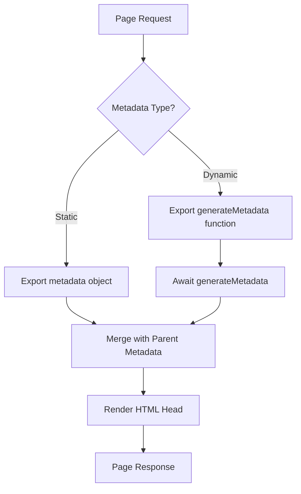
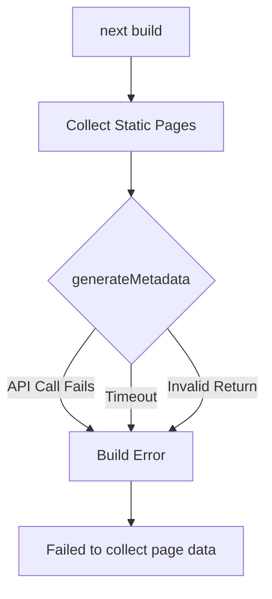
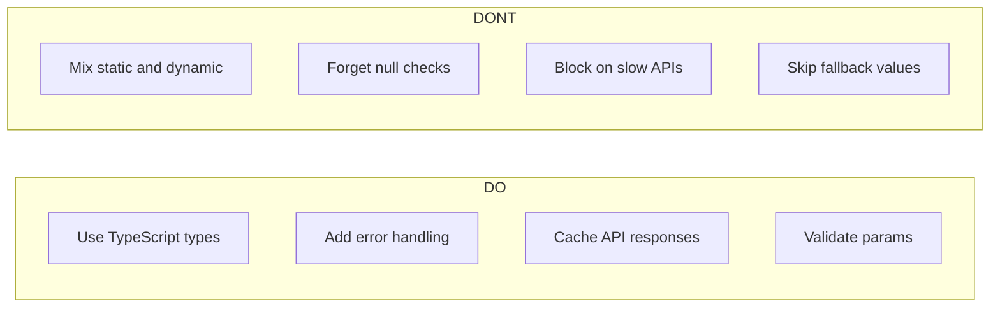

# How to Fix 'Metadata' Generation Errors in Next.js

Author: [nawazdhandala](https://www.github.com/nawazdhandala)

Tags: Next.js, Metadata, SEO, React, App Router, Dynamic Metadata, Error Handling

Description: Learn how to diagnose and fix common metadata generation errors in Next.js, including async metadata issues, dynamic routes, and best practices for SEO optimization.

---

> Metadata generation in Next.js is essential for SEO and social sharing, but errors can be frustrating to debug. This guide covers the most common metadata generation errors and provides practical solutions for each scenario.

Next.js App Router introduced a powerful metadata API that allows you to define page metadata using static objects or dynamic functions. However, improper usage can lead to runtime errors, build failures, or missing metadata. Let us explore how to identify and fix these issues.

---

## Understanding the Metadata API

Before diving into error fixes, let us understand how Next.js metadata works.



---

## Common Error: "Cannot use both metadata and generateMetadata"

This error occurs when you accidentally export both a static `metadata` object and a `generateMetadata` function in the same file.

### The Problem

```typescript
// app/blog/[slug]/page.tsx
// ERROR: Cannot use both metadata and generateMetadata

// Static metadata export
export const metadata = {
  title: "Blog Post",
};

// Dynamic metadata function - CONFLICT!
export async function generateMetadata({ params }) {
  return {
    title: `Post: ${params.slug}`,
  };
}
```

### The Solution

Choose one approach based on your needs. Use static metadata for pages with fixed titles and dynamic metadata for pages that need runtime data.

```typescript
// app/blog/[slug]/page.tsx
// CORRECT: Use only generateMetadata for dynamic routes

import { Metadata } from "next";

// Define the params type for type safety
interface PageProps {
  params: { slug: string };
}

// Use generateMetadata for dynamic content
export async function generateMetadata({ params }: PageProps): Promise<Metadata> {
  // Fetch post data to generate accurate metadata
  const post = await getPost(params.slug);

  // Return null-safe metadata with fallbacks
  return {
    title: post?.title || "Blog Post",
    description: post?.excerpt || "Read our latest blog post",
    openGraph: {
      title: post?.title || "Blog Post",
      description: post?.excerpt || "Read our latest blog post",
      images: post?.coverImage ? [post.coverImage] : [],
    },
  };
}

export default function BlogPost({ params }: PageProps) {
  return <article>{/* Post content */}</article>;
}
```

---

## Common Error: "generateMetadata must be async"

The `generateMetadata` function must be async when fetching data, even if you are not explicitly using await.

### The Problem

```typescript
// app/products/[id]/page.tsx
// ERROR: Function returns Promise but is not marked async

export function generateMetadata({ params }) {
  // Returning a promise without async keyword
  return fetch(`/api/products/${params.id}`)
    .then((res) => res.json())
    .then((product) => ({
      title: product.name,
    }));
}
```

### The Solution

Always mark `generateMetadata` as async when dealing with asynchronous operations.

```typescript
// app/products/[id]/page.tsx
// CORRECT: Properly async generateMetadata

import { Metadata } from "next";

interface ProductPageProps {
  params: { id: string };
}

// Mark function as async and use await for clarity
export async function generateMetadata({ params }: ProductPageProps): Promise<Metadata> {
  try {
    // Use await for cleaner async code
    const response = await fetch(`${process.env.API_URL}/products/${params.id}`, {
      // Cache the response for better performance
      next: { revalidate: 3600 },
    });

    // Handle non-OK responses gracefully
    if (!response.ok) {
      return {
        title: "Product Not Found",
        description: "The requested product could not be found.",
      };
    }

    const product = await response.json();

    return {
      title: `${product.name} | Our Store`,
      description: product.description,
      keywords: product.tags,
    };
  } catch (error) {
    // Return fallback metadata on error
    console.error("Metadata generation failed:", error);
    return {
      title: "Our Store",
      description: "Browse our products",
    };
  }
}
```

---

## Common Error: "Metadata object contains invalid values"

Next.js validates metadata fields and will throw errors for invalid types or structures.

### The Problem

```typescript
// app/page.tsx
// ERROR: Invalid metadata structure

export const metadata = {
  title: 123, // ERROR: Must be string
  description: ["Line 1", "Line 2"], // ERROR: Must be string
  openGraph: {
    images: "https://example.com/image.png", // ERROR: Must be array
  },
};
```

### The Solution

Follow the correct metadata structure with proper types.

```typescript
// app/page.tsx
// CORRECT: Valid metadata structure

import { Metadata } from "next";

export const metadata: Metadata = {
  // Title can be string or template object
  title: {
    default: "My Website",
    template: "%s | My Website",
  },
  // Description must be a string
  description: "Welcome to my website. We offer great products and services.",
  // Keywords can be string or array of strings
  keywords: ["nextjs", "react", "web development"],
  // Authors must be an array of objects
  authors: [
    { name: "John Doe", url: "https://johndoe.com" },
  ],
  // OpenGraph images must be an array
  openGraph: {
    title: "My Website",
    description: "Welcome to my website",
    url: "https://mywebsite.com",
    siteName: "My Website",
    images: [
      {
        url: "https://mywebsite.com/og-image.png",
        width: 1200,
        height: 630,
        alt: "My Website Preview",
      },
    ],
    locale: "en_US",
    type: "website",
  },
  // Twitter card configuration
  twitter: {
    card: "summary_large_image",
    title: "My Website",
    description: "Welcome to my website",
    images: ["https://mywebsite.com/twitter-image.png"],
  },
  // Robots configuration
  robots: {
    index: true,
    follow: true,
    googleBot: {
      index: true,
      follow: true,
      "max-video-preview": -1,
      "max-image-preview": "large",
      "max-snippet": -1,
    },
  },
};
```

---

## Common Error: "Cannot read properties of undefined"

This often happens when accessing params or data that does not exist in generateMetadata.

### The Problem

```typescript
// app/users/[userId]/posts/[postId]/page.tsx
// ERROR: Accessing nested params incorrectly

export async function generateMetadata({ params }) {
  // params might not be awaited in newer Next.js versions
  const post = await getPost(params.postId); // undefined!

  return {
    title: post.title, // ERROR: Cannot read properties of undefined
  };
}
```

### The Solution

In Next.js 15+, params is a Promise that must be awaited. Always add null checks.

```typescript
// app/users/[userId]/posts/[postId]/page.tsx
// CORRECT: Properly handle params and null values

import { Metadata } from "next";
import { notFound } from "next/navigation";

interface PageProps {
  params: Promise<{
    userId: string;
    postId: string;
  }>;
}

export async function generateMetadata({ params }: PageProps): Promise<Metadata> {
  // In Next.js 15+, await the params
  const { userId, postId } = await params;

  // Validate required params exist
  if (!userId || !postId) {
    return {
      title: "Invalid Request",
    };
  }

  try {
    // Fetch the post with error handling
    const post = await getPost(postId);

    // Handle missing post gracefully
    if (!post) {
      return {
        title: "Post Not Found",
        description: "The requested post could not be found.",
      };
    }

    // Fetch author info for richer metadata
    const author = await getUser(userId);

    return {
      title: post.title,
      description: post.excerpt,
      authors: author ? [{ name: author.name }] : [],
      openGraph: {
        title: post.title,
        description: post.excerpt,
        type: "article",
        publishedTime: post.createdAt,
        authors: author ? [author.name] : [],
      },
    };
  } catch (error) {
    console.error("Error generating metadata:", error);
    return {
      title: "Blog Post",
      description: "Read our blog post",
    };
  }
}
```

---

## Common Error: "Failed to collect page data for /path"

This build error indicates metadata generation failed during static generation.

### The Problem



### The Solution

Ensure all data fetching in generateMetadata is resilient to failures.

```typescript
// app/articles/[slug]/page.tsx
// CORRECT: Build-safe metadata generation

import { Metadata } from "next";

// Define static params for build-time generation
export async function generateStaticParams() {
  try {
    const articles = await getAllArticleSlugs();
    return articles.map((slug) => ({ slug }));
  } catch (error) {
    console.error("Failed to generate static params:", error);
    return []; // Return empty array to prevent build failure
  }
}

export async function generateMetadata({
  params,
}: {
  params: Promise<{ slug: string }>;
}): Promise<Metadata> {
  const { slug } = await params;

  try {
    // Add timeout to prevent hanging builds
    const controller = new AbortController();
    const timeoutId = setTimeout(() => controller.abort(), 5000);

    const response = await fetch(`${process.env.API_URL}/articles/${slug}`, {
      signal: controller.signal,
      next: { revalidate: 3600 },
    });

    clearTimeout(timeoutId);

    if (!response.ok) {
      throw new Error(`HTTP ${response.status}`);
    }

    const article = await response.json();

    return {
      title: article.title,
      description: article.summary,
      openGraph: {
        title: article.title,
        description: article.summary,
        type: "article",
        publishedTime: article.publishedAt,
        modifiedTime: article.updatedAt,
      },
    };
  } catch (error) {
    // Log error but return valid metadata to prevent build failure
    console.warn(`Metadata generation failed for ${slug}:`, error);

    return {
      title: "Article",
      description: "Read our latest article",
    };
  }
}
```

---

## Common Error: "Metadata template not applied"

Parent metadata templates may not apply to child pages if not configured correctly.

### The Problem

```typescript
// app/layout.tsx
export const metadata = {
  title: {
    template: "%s | My Site",
    default: "My Site",
  },
};

// app/about/page.tsx
// Template not applied because title is an object, not string
export const metadata = {
  title: {
    default: "About Us", // This overrides the template!
  },
};
```

### The Solution

Use a simple string for child page titles to inherit the parent template.

```typescript
// app/layout.tsx
// CORRECT: Root layout with template

import { Metadata } from "next";

export const metadata: Metadata = {
  title: {
    template: "%s | My Site",
    default: "My Site",
  },
  description: "Welcome to my site",
};

// app/about/page.tsx
// CORRECT: Use string to apply template

export const metadata: Metadata = {
  // String value will use parent template: "About Us | My Site"
  title: "About Us",
  description: "Learn more about our company",
};

// app/dashboard/layout.tsx
// CORRECT: Nested layout with its own template

export const metadata: Metadata = {
  title: {
    // This creates nested template: "Settings | Dashboard | My Site"
    template: "%s | Dashboard",
    default: "Dashboard",
  },
};

// app/dashboard/settings/page.tsx
export const metadata: Metadata = {
  // Result: "Settings | Dashboard | My Site"
  title: "Settings",
};
```

---

## Debugging Metadata Generation

When metadata is not appearing as expected, use these debugging techniques.

### Debug Component

Create a debug component to inspect generated metadata during development.

```typescript
// components/MetadataDebug.tsx
// Only use in development to inspect metadata

"use client";

import { useEffect, useState } from "react";

export function MetadataDebug() {
  const [metadata, setMetadata] = useState<Record<string, string>>({});

  useEffect(() => {
    // Only run in development
    if (process.env.NODE_ENV !== "development") return;

    // Collect all meta tags from the document head
    const metaTags = document.querySelectorAll("meta");
    const collected: Record<string, string> = {};

    metaTags.forEach((tag) => {
      const name = tag.getAttribute("name") || tag.getAttribute("property");
      const content = tag.getAttribute("content");
      if (name && content) {
        collected[name] = content;
      }
    });

    // Also get the title
    collected["title"] = document.title;

    setMetadata(collected);
  }, []);

  // Only render in development
  if (process.env.NODE_ENV !== "development") return null;

  return (
    <details className="fixed bottom-4 right-4 bg-black text-white p-4 rounded max-w-md">
      <summary className="cursor-pointer">Metadata Debug</summary>
      <pre className="mt-2 text-xs overflow-auto max-h-64">
        {JSON.stringify(metadata, null, 2)}
      </pre>
    </details>
  );
}
```

### Server-Side Logging

Add logging to generateMetadata for debugging.

```typescript
// app/[slug]/page.tsx
// Add detailed logging for debugging

export async function generateMetadata({
  params,
}: {
  params: Promise<{ slug: string }>;
}): Promise<Metadata> {
  const { slug } = await params;

  console.log(`[Metadata] Generating for slug: ${slug}`);

  try {
    const data = await fetchPageData(slug);
    console.log(`[Metadata] Data fetched:`, JSON.stringify(data, null, 2));

    const metadata: Metadata = {
      title: data.title,
      description: data.description,
    };

    console.log(`[Metadata] Generated:`, JSON.stringify(metadata, null, 2));

    return metadata;
  } catch (error) {
    console.error(`[Metadata] Error for ${slug}:`, error);
    throw error;
  }
}
```

---

## Best Practices for Metadata Generation

Follow these guidelines to avoid common issues.



### Complete Best Practices Example

```typescript
// app/products/[category]/[id]/page.tsx
// Production-ready metadata generation

import { Metadata, ResolvingMetadata } from "next";
import { notFound } from "next/navigation";

// Type definitions for safety
interface ProductPageProps {
  params: Promise<{
    category: string;
    id: string;
  }>;
}

// Cache product fetches for performance
async function getProduct(id: string) {
  const response = await fetch(`${process.env.API_URL}/products/${id}`, {
    next: { revalidate: 3600, tags: [`product-${id}`] },
  });

  if (!response.ok) return null;
  return response.json();
}

// Generate metadata with all best practices
export async function generateMetadata(
  { params }: ProductPageProps,
  parent: ResolvingMetadata
): Promise<Metadata> {
  // Await params (Next.js 15+)
  const { category, id } = await params;

  // Get parent metadata for merging
  const parentMetadata = await parent;
  const previousImages = parentMetadata.openGraph?.images || [];

  // Fetch product with error handling
  const product = await getProduct(id);

  // Handle missing product
  if (!product) {
    return {
      title: "Product Not Found",
      description: "The requested product could not be found.",
      robots: {
        index: false, // Do not index 404 pages
      },
    };
  }

  // Build comprehensive metadata
  return {
    title: product.name,
    description: product.description.substring(0, 160),
    keywords: [product.category, ...product.tags],
    openGraph: {
      title: product.name,
      description: product.description.substring(0, 160),
      type: "website",
      url: `https://mystore.com/products/${category}/${id}`,
      images: [
        {
          url: product.image,
          width: 800,
          height: 600,
          alt: product.name,
        },
        ...previousImages, // Merge parent images
      ],
    },
    twitter: {
      card: "summary_large_image",
      title: product.name,
      description: product.description.substring(0, 160),
      images: [product.image],
    },
    alternates: {
      canonical: `https://mystore.com/products/${category}/${id}`,
    },
  };
}

export default async function ProductPage({ params }: ProductPageProps) {
  const { id } = await params;
  const product = await getProduct(id);

  if (!product) {
    notFound();
  }

  return (
    <main>
      <h1>{product.name}</h1>
      {/* Product content */}
    </main>
  );
}
```

---

## Conclusion

Metadata generation errors in Next.js often stem from type mismatches, async handling issues, or missing error handling. By following the patterns in this guide, you can create robust metadata generation that works reliably in both development and production.

Key takeaways:

- Use TypeScript and the Metadata type for type safety
- Always handle errors and provide fallback values
- Remember to await params in Next.js 15+
- Use caching to improve build performance
- Do not mix static metadata objects with generateMetadata functions

Proper metadata is essential for SEO and social sharing. Taking the time to implement it correctly will improve your site's visibility and user experience.

---

*Need to monitor your Next.js application's performance? [OneUptime](https://oneuptime.com) provides comprehensive monitoring for modern web applications, helping you identify issues before they impact users.*
