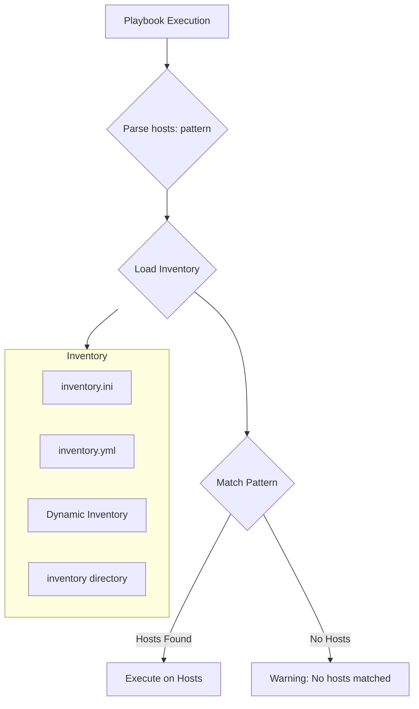
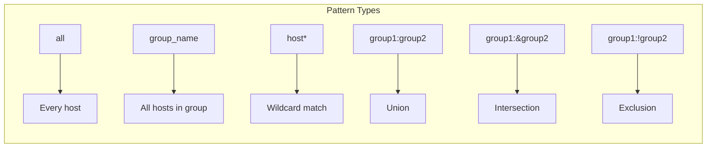
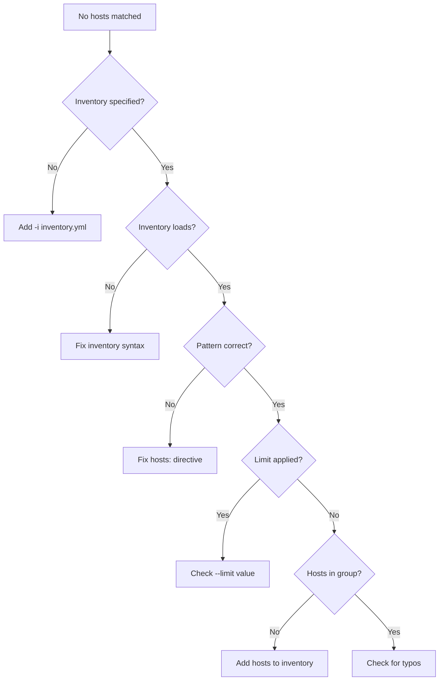

# How to Fix "No Hosts Matched" Errors in Ansible

Author: [nawazdhandala](https://www.github.com/nawazdhandala)

Tags: Ansible, Inventory, Troubleshooting, DevOps, Automation, Configuration Management

Description: Learn how to diagnose and fix the common "no hosts matched" error in Ansible by understanding inventory configuration and host patterns.

---

You write a playbook, run it, and get: `[WARNING]: No hosts matched, nothing to do`. Or worse, your play silently does nothing because it matched zero hosts. This guide helps you understand why Ansible fails to match hosts and how to fix it.

## Understanding the Error

The "no hosts matched" warning occurs when Ansible cannot find any hosts that match the pattern specified in your play's `hosts` directive.



## Common Causes and Solutions

### Cause 1: Typo in Host or Group Name

```yaml
# playbook.yml
---
- name: Configure web servers
  hosts: webservers  # Typo or wrong name?
  tasks:
    - debug:
        msg: "Hello"
```

```ini
# inventory.ini
# The actual group is named "web_servers" with underscore
[web_servers]
server1.example.com
server2.example.com
```

**Solution: Verify the exact group name**

```bash
# List all groups in inventory
ansible-inventory --list --yaml | grep -E "^\s+\w+:$"

# Or list groups with their hosts
ansible-inventory --graph

# Output:
# @all:
#   |--@ungrouped:
#   |--@web_servers:    # Note: underscore, not 'webservers'
#   |  |--server1.example.com
#   |  |--server2.example.com
```

### Cause 2: Wrong Inventory File

```bash
# Default inventory location is /etc/ansible/hosts
# But your inventory might be elsewhere

# Explicitly specify inventory
ansible-playbook playbook.yml -i inventory.ini
ansible-playbook playbook.yml -i /path/to/inventory/
ansible-playbook playbook.yml --inventory inventory.yml
```

```ini
# ansible.cfg - Set default inventory
[defaults]
inventory = ./inventory/hosts.ini
# Or for directory
inventory = ./inventory/
```

### Cause 3: Host Limit Filtering Out All Hosts

```bash
# The --limit flag can result in no matches
ansible-playbook playbook.yml --limit production

# If 'production' does not exist or has no hosts, you get the warning
```

**Solution: Check what the limit matches**

```bash
# See what hosts would match
ansible all -i inventory.ini --limit production --list-hosts

# If no hosts match, you will see the warning
```

### Cause 4: Dynamic Inventory Returns Empty

```bash
# Dynamic inventory script might return no hosts
./dynamic_inventory.py --list

# Check if it returns hosts
./dynamic_inventory.py --list | jq '.all.hosts'

# Common issues:
# - API credentials expired
# - Filter too restrictive
# - Cloud region mismatch
```

**Solution: Debug dynamic inventory**

```bash
# Test dynamic inventory directly
./dynamic_inventory.py --list | python -m json.tool

# For AWS EC2
ansible-inventory -i aws_ec2.yml --graph

# For common plugins, check environment variables
export AWS_REGION=us-west-2
export AWS_PROFILE=production
```

### Cause 5: Conditional Group Membership

```yaml
# inventory.yml
all:
  children:
    production:
      children:
        webservers:
          hosts:
            # Hosts might be conditionally included elsewhere
    staging:
      children:
        webservers:
          hosts:
            staging-web1:
```

```yaml
# If you target 'production:&webservers' but production has no webservers
---
- hosts: production:&webservers  # Intersection might be empty
  tasks:
    - debug:
        msg: "This might not run"
```

## Debugging Host Matching

### List Hosts Before Running

```bash
# Always preview which hosts will be affected
ansible-playbook playbook.yml --list-hosts

# With inventory specified
ansible-playbook playbook.yml -i inventory.ini --list-hosts

# With limit
ansible-playbook playbook.yml -i inventory.ini --limit web* --list-hosts
```

### Verbose Inventory Output

```bash
# Show complete inventory structure
ansible-inventory --list

# As YAML (more readable)
ansible-inventory --list --yaml

# Graph view
ansible-inventory --graph

# Graph with variables
ansible-inventory --graph --vars

# Show specific host details
ansible-inventory --host server1.example.com
```

### Test Host Pattern Matching

```bash
# Test pattern against inventory
ansible webservers -i inventory.ini --list-hosts
ansible 'web*' -i inventory.ini --list-hosts
ansible 'webservers:&production' -i inventory.ini --list-hosts
ansible 'webservers:!excluded' -i inventory.ini --list-hosts
```

## Host Pattern Syntax

Understanding host patterns helps you target the right hosts.



### Pattern Examples

```yaml
# All hosts
- hosts: all

# Single group
- hosts: webservers

# Multiple groups (union - hosts in either group)
- hosts: webservers:dbservers

# Intersection (hosts in BOTH groups)
- hosts: production:&webservers

# Exclusion (hosts in first but NOT in second)
- hosts: all:!maintenance

# Wildcard matching
- hosts: "*.example.com"
- hosts: "web*"
- hosts: "server[1:5]"  # server1 through server5

# Complex patterns
- hosts: "production:&webservers:!maintenance"
# Hosts that are in production AND webservers but NOT in maintenance
```

### Using Regex Patterns

```yaml
# Regex patterns start with ~
- hosts: ~web[0-9]+\.example\.com
# Matches web1.example.com, web23.example.com, etc.

# More regex examples
- hosts: ~(web|app|api)[0-9]+
```

## Inventory File Formats

### INI Format

```ini
# inventory.ini

# Ungrouped hosts
mail.example.com

# Simple group
[webservers]
web1.example.com
web2.example.com

# Group with variables
[dbservers]
db1.example.com ansible_host=10.0.0.10
db2.example.com ansible_host=10.0.0.11

# Child groups
[production:children]
webservers
dbservers

# Group variables
[production:vars]
env=production
datacenter=us-east-1

# Ranges
[web_cluster]
web[01:10].example.com  # web01 through web10
```

### YAML Format

```yaml
# inventory.yml
all:
  children:
    ungrouped:
      hosts:
        mail.example.com:

    webservers:
      hosts:
        web1.example.com:
        web2.example.com:
      vars:
        http_port: 80

    dbservers:
      hosts:
        db1.example.com:
          ansible_host: 10.0.0.10
        db2.example.com:
          ansible_host: 10.0.0.11

    production:
      children:
        webservers:
        dbservers:
      vars:
        env: production
        datacenter: us-east-1

    staging:
      hosts:
        staging.example.com:
      vars:
        env: staging
```

## Special Groups

Ansible has two built-in groups that always exist:

```yaml
# 'all' contains every host
- hosts: all

# 'ungrouped' contains hosts not in any other group
- hosts: ungrouped
```

## Validating Your Inventory

### Check Inventory Syntax

```bash
# Validate inventory file syntax
ansible-inventory -i inventory.yml --list > /dev/null && echo "Valid" || echo "Invalid"

# Show any parsing errors
ansible-inventory -i inventory.yml --list 2>&1 | head -20
```

### Create a Validation Playbook

```yaml
# validate_inventory.yml
---
- name: Validate inventory connectivity
  hosts: all
  gather_facts: no

  tasks:
    - name: Verify host is reachable
      ping:

    - name: Show host information
      debug:
        msg: |
          Hostname: {{ inventory_hostname }}
          Groups: {{ group_names }}
          ansible_host: {{ ansible_host | default(inventory_hostname) }}
```

```bash
# Run validation
ansible-playbook validate_inventory.yml -i inventory.yml
```

## Dynamic Inventory Troubleshooting

### AWS EC2 Dynamic Inventory

```yaml
# aws_ec2.yml
plugin: amazon.aws.aws_ec2
regions:
  - us-east-1
  - us-west-2
filters:
  tag:Environment: production
  instance-state-name: running
keyed_groups:
  - key: tags.Role
    prefix: role
  - key: placement.availability_zone
    prefix: az
compose:
  ansible_host: private_ip_address
```

```bash
# Test AWS inventory
ansible-inventory -i aws_ec2.yml --graph

# If empty, check:
# 1. AWS credentials
aws sts get-caller-identity

# 2. Region and filters
aws ec2 describe-instances --filters "Name=tag:Environment,Values=production" --region us-east-1

# 3. Collection installed
ansible-galaxy collection list | grep amazon.aws
```

### Custom Dynamic Inventory

```python
#!/usr/bin/env python3
# custom_inventory.py
import json
import sys

def get_inventory():
    """Return inventory in Ansible JSON format."""
    return {
        "webservers": {
            "hosts": ["web1.example.com", "web2.example.com"]
        },
        "dbservers": {
            "hosts": ["db1.example.com"]
        },
        "_meta": {
            "hostvars": {
                "web1.example.com": {"http_port": 80},
                "web2.example.com": {"http_port": 8080}
            }
        }
    }

def get_host(hostname):
    """Return host variables."""
    inventory = get_inventory()
    return inventory.get("_meta", {}).get("hostvars", {}).get(hostname, {})

if __name__ == "__main__":
    if len(sys.argv) == 2 and sys.argv[1] == "--list":
        print(json.dumps(get_inventory()))
    elif len(sys.argv) == 3 and sys.argv[1] == "--host":
        print(json.dumps(get_host(sys.argv[2])))
    else:
        print(json.dumps({}))
```

```bash
# Make executable
chmod +x custom_inventory.py

# Test it
./custom_inventory.py --list
./custom_inventory.py --host web1.example.com

# Use with Ansible
ansible-inventory -i custom_inventory.py --graph
```

## Preventing "No Hosts Matched"

### Use assert to Validate Hosts

```yaml
---
- name: Ensure hosts were matched
  hosts: localhost
  gather_facts: no

  tasks:
    - name: Fail if target group is empty
      assert:
        that:
          - groups['webservers'] | length > 0
        fail_msg: "No webservers found in inventory!"
        success_msg: "Found {{ groups['webservers'] | length }} webservers"

- name: Configure webservers
  hosts: webservers
  tasks:
    - name: Do actual work
      debug:
        msg: "Configuring {{ inventory_hostname }}"
```

### Use meta to Stop on Empty

```yaml
---
- name: Configure servers
  hosts: webservers

  tasks:
    - name: End play if no hosts
      meta: end_play
      when: ansible_play_hosts | length == 0

    - name: Continue with configuration
      debug:
        msg: "Working on {{ inventory_hostname }}"
```

### Check in CI/CD Pipeline

```bash
#!/bin/bash
# ci_check.sh

# Verify hosts will match before running playbook
HOST_COUNT=$(ansible webservers -i inventory.yml --list-hosts 2>/dev/null | grep -c "hosts")

if [ "$HOST_COUNT" -eq 0 ]; then
    echo "ERROR: No hosts matched for webservers group"
    exit 1
fi

echo "Found hosts, proceeding with playbook"
ansible-playbook -i inventory.yml playbook.yml
```

## Quick Reference: Common Fixes

| Problem | Solution |
|---------|----------|
| Typo in group name | Use `ansible-inventory --graph` to verify names |
| Wrong inventory file | Use `-i inventory.ini` explicitly |
| Empty dynamic inventory | Check credentials and filters |
| Limit excludes all hosts | Test limit with `--list-hosts` first |
| Pattern syntax error | Quote complex patterns: `"group1:&group2"` |
| Group does not exist | Create group in inventory or use existing one |
| Host in wrong group | Check inventory structure |

## Checklist for Debugging



---

The "no hosts matched" error is almost always a configuration issue rather than a bug. Systematically check your inventory file location, group names, host patterns, and any limits applied. Use `ansible-inventory --graph` and `--list-hosts` to verify what Ansible sees before running playbooks. Taking a few seconds to validate your inventory saves significant debugging time later.
